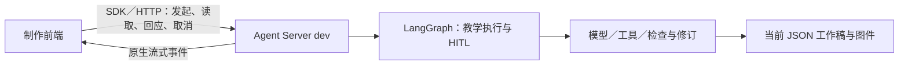

# 当前阶段的文件化内容格式

日期：2026-09-15。状态：**用户要求本轮方案定稿、提交并推送；文件化内容与 Agent Server dev 的方向已定，字段示例随首个真实切片定型，尚未实现。**

用户明确：本项目自行设计，不再以另一个项目尚处草稿阶段的 authoring 为参考；现阶段从简，不上数据库，暂不建设内容版本历史。当前选择 **JSON 作为正式中间格式，正文允许 Markdown／LaTeX，图片和图形另存文件**。本文替换上一轮将完整内容／资产／前后端专项都列为首票前置的候选，不改变独立数学课程与五项教学能力的目标。

## 阶段边界

- 当前工作稿、图件及检查结果保存在本地工作目录，同一内容只维护当前稿。运行状态、真实待答与回应保存在框架管理的 graph state／thread 中；不再另造文件任务状态机。
- 不引入业务数据库，不建设内容历史库、版本列表、回滚、分支合并、协同编辑或外部 authoring 适配。
- 内容标识、格式版本、内容指纹和实际来源仍保留。格式版本说明怎样解析文件；内容指纹说明检查或回应针对什么内容，均不要求保存历次正文。
- 教学质量、必要图件、师生信息边界和真实 HITL 不因文件化而删减。模型仍可检查、修订并覆盖当前工作稿。
- 当前直接使用 LangChain／LangGraph 与 Agent Server 的 `langgraph dev` 开发模式，复用框架状态、流式、等待和恢复；不部署独立数据库服务，不建设业务数据库和内容历史。框架自己的本地 checkpoint 不是内容历史产品，无需为“不做历史”将它禁用。生产拓扑及完整故障验收后置。
- 本地 LC 的已有数据服务继续只读使用，不改造其数据库。既有实验、原 Skills 流程分析和冻结证据继续保留。

现行原型中完整历史浏览／回退属于后续交互参考；首阶段只需当前工作稿、生成进度、修改入口、必要待答和当前检查状态。此次没有修改原型页面，不将其历史按钮当作首阶段实现要求。

## 为什么采用 JSON 加正文文本

| 选择 | 合适用途 | 本项目取舍 |
| --- | --- | --- |
| 纯 Markdown | 人读的研究、长篇草稿、规则和说明 | 课程关系、共享题面、受众、表格与图件引用需要额外约定和解析，不作为正式产物的唯一源 |
| JSON | 显式表达课程对象、文档、内容块、表格和资源引用，直接供检查与渲染使用 | 作为当前工作的唯一权威内容源 |
| JSON 中的 Markdown／LaTeX 文本 | Narrative、题面、解释、列表、行内与独立公式 | 保留自然写作和数学表达能力，不为每段文字另造富文本树 |
| 独立 SVG／PNG 等文件 | 数学图与一般图片的实际载体 | JSON 用相对路径引用；精确数学图保留生成参数或绘制源 |

这里不是同时维护可编辑的 `lesson.json` 和 `lesson.md` 两套正文。需要 Markdown 阅读稿时从 JSON 导出；修改回到 JSON 源。研究与提示规则原本用 Markdown，无需转换为 JSON。

模型可以先自由推理、写草稿、试做任务，再通过保存工具写入或修改结构化产物。不要求所有模型回复都是 JSON，也不要求一次输出整个年级的巨大文件。工具负责合法序列化和引用检查，JSON 格式正确不替代教学质量判断。

[原 Skill 的输出规范](../../k12-teacher-skills/plugin/skills/k12-lesson-plan-creation/references/output.md) 提供 `shared`／`from_shared`、`documents[]`、师生分面、表格和附件的起点。借鉴这些机制的目的，不固定其文件数量或将五项能力都塞入同一教案模板。另一项目 authoring 的上一轮核查不再作为本项目格式的设计依据或前置研究。

## 最小目录

```text
work/<task-id>/
  task.json             # 本次输入、工作目录与 thread_id；可选清单，非运行状态权威
  content/
    curriculum.json     # 本次涉及的课程结构与 Narrative；按需要出现
    lesson.json         # 本次课时的共享内容与师生文档；按需要出现
  assets/
    graph.json          # 需要精确绘图时的数学参数／生成源
    graph.svg           # 实际图件；普通图片可用 PNG 等
  checks.json           # 当前检查依据、内容指纹、发现和结论
  output/
    teacher.html        # 从当前源渲染，不能作为第二个编辑源
    student.html
```

文件名示意职责，并非每项任务必须创建全部文件。全年、单元、课时及其他能力按实际工作范围拆成少量 JSON，使用稳定 ID／相对引用；不把整个课程存成单个不断增大的文件，也不预建所有内容类型。

资源相对路径以本次工作目录根为基准解析，例如 `assets/graph.svg`；不随引用它的 JSON 文件所在子目录改变。

## 中间内容怎样表达

最初只需要 Markdown 正文块、表格、数学表达和图件引用，重复题面采用共享引用。下列是一个格式片段，**不是完整教案、固定生成模板或已验证的 JSON Schema**：

```json
{
  "schema_version": 1,
  "kind": "lesson",
  "id": "lesson-example",
  "shared": {
    "task_1": [
      {"type": "markdown", "text": "研究函数 $y = 2x + 3$，解释表格与图的联系。"},
      {"type": "table", "headers": ["$x$", "$y$"], "rows": [["0", "3"], ["1", "5"]]},
      {"type": "image", "src": "assets/graph.svg", "alt": "函数在给定区间内的坐标图"}
    ]
  },
  "documents": [
    {"id": "student", "audience": "student", "blocks": [{"type": "from_shared", "key": "task_1"}]},
    {"id": "teacher", "audience": "teacher", "blocks": [
      {"type": "from_shared", "key": "task_1"},
      {"type": "markdown", "text": "教师引导与解答在此单独编写。"}
    ]}
  ]
}
```

样本只解释存储结构，不作为原创课程输入或教学质量证据。`kind` 决定该能力所需的内容结构；课程的目标与依赖不必伪装成 lesson 文档。

公式以 LaTeX 保存，可在正文中使用；需要单独定位时可用数学块。渲染支持的语法范围随实际工具明确。JSON 中 LaTeX 反斜杠由序列化工具正确转义。计算工具需要的表达、变量和假设另行传入，不把任意 LaTeX 当成可执行代码。

表格保存行列与单元格内容，允许公式；无需先支持复杂合并单元格。数学图保存当前数学参数／绘制源与实际输出，说明轴、单位、范围、标注及教学用途。一般图片保留来源与说明，有源才声明可编辑。占位说明可存为草稿，但任务所必需的图未生成时不得宣布交付。

JSON 工作源可以包含教师信息，只向获准的制作调用方开放。学生侧只取得经过受众筛选的内容与资源，不能下载整份工作源。图题、替代文本和文件元数据同样需要检查。

## 无历史也需要的少量保证

1. **文件写完整。** 同一工作目录串行写入；单文件先写临时文件，校验后替换当前文件。不承诺跨文件事务；若中途失败，状态保留未完成，读取时核对实际引用与文件，不展示虚假的完成结果。
2. **检查不串稿。** `checks.json` 记录所查源文件、图件与输出文件的内容指纹，以及适用规则。源或图变了，旧结论不再适用于当前稿，重新渲染、检查后再显示通过。最初可整包重查，不建精细依赖缓存。
3. **回应有对象。** 在框架管理的状态中保存实际问题、所针对内容的指纹及真实回应。内容已改变时核对回应是否仍适用；不凭模型补出教师确认。使用 `interrupt`／`Command(resume=...)`，不再建设独立文件回应状态机或事件历史库。
4. **冲突不覆盖。** 保存工具核对读取时的指纹；过时模型结果不得覆盖其后发生的修改。指纹不是版本历史，不提供旧内容读取。当前不同任务的工作目录独立，不共同改写一个课程主文件。

保留已有来源身份、知识数据版本和实际使用规则，支持当前结果的检查与有限归因。**只保留当前稿无法事后重现每次改动**；完整历史追溯和回滚因此明确留待后续。需要正式对照评测时单独导出冻结材料包，不把自动保存每次修改重新带回当前范围。

## 运行时也从简

**当前采用 LangGraph＋Agent Server，本地通过 `langgraph dev` 运行。** 用户指出框架已实现许多运行能力，重新核查官方文档与本仓库实测后，撤回上一轮“自行维护后台协程、文件运行状态及 SSE 服务”的候选。从简应减少自建机制，同时保留可直接使用的框架能力。

| 责任 | 当前交给谁 |
| --- | --- |
| 模型与工具循环 | LangChain，按各教学能力装配实际 Context 和工具 |
| 执行状态、检查点、真实暂停／恢复 | LangGraph；在 Agent Server 中使用服务注入的 checkpointer，不另配一套 |
| thread／run、调用 API、流式、取消和同线程并发策略 | Agent Server 原生能力；前端通过 SDK／HTTP 接入 |
| 课程与材料、图件、数学及教学检查 | 本项目；当前 JSON 工作源、独立图件、带指纹的检查记录 |
| 追踪与消耗观察 | LangSmith，按已有配置接入；不作为教学内容的权威存储 |



`langgraph dev` 是轻量本地开发服务，不要求 Docker 或独立 PostgreSQL／Redis 服务；状态使用内存并保存到本地目录。生产化验证再使用相应部署模式。框架内部状态持久化和本项目的课程内容数据库是不同职责，当前不上业务数据库不要求舍弃框架的本地保存。[本地开发文档](https://docs.langchain.com/langsmith/local-dev-testing)

一个教学任务对应一个 thread，内部按教学流程顺序推进。使用 Server 同线程运行策略，例如 `multitask_strategy="reject"` 拒绝已有活动 run 时的新运行；不自造全局忙队列或分布式锁。同一课时需要的生成和独立检查仍使用各自 Context，串行执行不等于混用答案或生成历史。不同工作目录保持独立，当前不设计跨任务并发改写公共课程。

前端使用原生 run stream 接收步骤、自定义进度和允许展示的草稿；查询 thread／run 取得当前状态，通过原生取消和恢复入口操作。应用只提供教学事件含义、必要内容读取及受众投影，不再复制一套 run／queue／SSE 服务。图源码不自行配置第二套 checkpointer，服务在运行时注入。[Agent Server](https://docs.langchain.com/langsmith/agent-server)、[流式调用](https://docs.langchain.com/langsmith/agent-server-api/thread-runs/create-run-stream-output)

进度包括正在查目标、设计任务、绘图、检查或修订，以及实际工具开始／结束、简短设计依据、待答和结果。不展示伪造的百分比；草稿标为未检查，不把流中的半段 JSON 当成已保存内容。“推理过程”表达为可理解的设计依据和执行进度，不直接透传原始消息、私有思维内容、工具凭据或不属于该受众的答案。API 密钥留在后端。

真实 HITL 使用 `interrupt(payload)`，前端提交真实回应后经同一 thread 的 `Command(resume=...)` 继续。框架负责暂停和恢复，本项目确定何时需要人、展示什么、回应针对哪份内容及是否仍适用。恢复从中断节点入口重跑，因此生成／写文件和人类等待适当分开；当前文件写入用稳定路径及指纹核对，避免重复改变已审阅对象。[中断与恢复](https://docs.langchain.com/oss/python/langgraph/interrupts)

浏览器断连后的运行行为显式采用 Server 的 `on_disconnect="continue"`；刷新先查询现有 thread／run，再接后续流，不自动新建生成任务。当前不承诺永久回放每个 token；结果和待答从当前状态及实际文件取得。本仓库已有 dev 正常退出、重启、读取原 thread 并恢复的 [有限实测](../skills-harness/assets/cfu-durable-prototype-results.md)，无需先重写恢复系统再获得这一能力。

本项目仍须验证少量接合处：实际文件可读、修改后旧检查失效、真实回应未被代填、取消后不错误宣布交付。checkpoint 不会替我们验证数学，也不会把文件写入与教学完成自动变成同一事务。生产故障、并发规模、备份和升级验收后置；不在当前重做框架已有的通用运行测试体系。

依据于 2026-09-15 重新核对。框架能力和既有有限探针支持上述选择；当前真实 Gemini 教学链与前端尚未据此实现，不将 dev 能力外推为生产保证。

## 当前落地顺序

**与原 ticket 的关系：**原规划没有独立的“通用数据库／历史平台／自研 AI 队列”建设票，但包含相关工程要求：原首票要求 Agent Server／LangGraph 持久承载和不可变方案；[真实回应票](issues/02-human-decision-and-resume.md) 要求业务事务；[课程修订票](issues/07-scoped-curriculum-revision.md) 要求新旧差异与版本条件；[部署票](issues/13-production-runtime-package.md) 明确持久数据库及 PostgreSQL／Redis 配置；[故障恢复票](issues/18-crash-reconciliation.md) 要求复用 Server 队列并验证自动恢复，且明确不建设通用调度系统。内容历史机制不等于已经规划了完整历史管理产品。上一轮将全套内容／前后端设计都列为首票前置扩大了范围，现已撤回该前置。

首票前只定首个切片实际需要的 JSON 形状、读写／渲染入口及上述检查规则；不再前置数据库建模、authoring 评估、全功能资产平台或富文本编辑器选型。前端沿现有工作区语义读取当前结果，复杂编辑器与历史 UI 后置。

以一份含公式、表格、函数图的材料验证“保存→读取→修改当前稿→重新渲染→检查旧结论失效”。不验收旧版本查看与回滚，不为这个格式问题再做完整课程生成实验。

[有限真实课程任务](issues/01-live-curriculum-task.md) 直接接入 Agent Server dev／LangGraph，以文件保存当前课程工作及检查；[一课材料](issues/03-continuous-lessons-and-materials.md) 扩展实际数学材料、共享题面和师生渲染。后续票中的生产数据库、不可变内容历史与完整故障恢复条款保留为完整交付目标，按 [规格的阶段约定](spec.md#当前阶段文件化教学内容闭环) 执行，不要求本阶段同时兑现。
