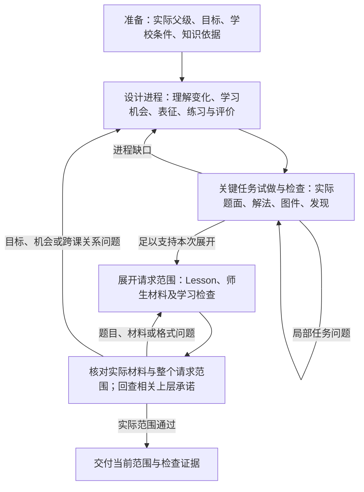

# 把课程进程落实为可检查的教学工作

日期：2026-09-16。状态：依据当前实现、真实失败与 IM 对照提出的重构建议；尚未实现或做模型对照。本报告回答“改善什么、怎样执行、怎样证明”，不把方案写成已有质量结论。

## 判断与责任

**建议把已知的教学工作顺序、产物交接和检查路由交给 Graph；模型负责各阶段的教学设计与判断，必要的探索保留有限 Agent 循环。** 当前“生成整稿—审阅整稿—反馈整稿”尚未把进程、试做及回修落实为必经、可核查的交接，其可靠性也未获证明。采用显式工作流是有依据的下一步，但不能用 IM 内容对照单独证明它一定产生更好的课程。

问题同时存在于实施路线的落实、执行粒度和质量验收：

| 层面 | 已核实的事实 | 应纠正的工作 |
| --- | --- | --- |
| 路线落实 | [早期执行设计](../skills-harness/assets/execution-structure-design.md#课程到课时的具体执行链路)已有“进程提议—关键任务试做—回修—展开—全范围回查”；工程票先贯通有限任务，再交付全年蓝图，各自范围合理 | 我没有把教学中间成果同步落实到执行和验收。不能继续仅凭票已完成，便沿着“全年稿→孤立一课”前进；下一课须有可检查的课程位置与进程依据 |
| 执行图 | [State 和节点](../../src/teaching_harness/graph.py)围绕当前整稿、审阅输入、反馈和指纹；已实现准备、版本核对、检查与修订，但没有分别管理进程方案、试做发现及据此修订的进程 | 将关键设计成果、实际检查对象和回修位置显式化；不能将“有五个图节点”当作已落实教学工作流 |
| 模型工作与 Context | 作者取得请求、知识、当前稿和反馈，内部可多次查工具、创作与保存；[middleware](../../src/teaching_harness/execution.py)装配阶段规则。目前一次作者阶段仍包办整稿组织、探查、材料和修订 | 按当前教学工作提供实际依据、已有产物和适用工具；减少无关历史，不削减必要信息。代码不能证明 Agent 内部从未规划，只能证明规划没有成为必经、可检查的交接成果 |
| 验收 | [全年初稿检查](evidence/15-full-year-blueprint/initial/checks.json)无 findings；[随后人工核读](evidence/15-full-year-blueprint/manual-review-1.md)发现资源冲突、统计任务缺数据及图、因果与模型范围错误、把试做当学习效果等 | 检查必须落实到实际材料、解法和约束，不能只复述 Narrative；模型无异议不构成充分证据 |

[全年作者规则](../../src/teaching_harness/resources/year.md)和[审阅规则](../../src/teaching_harness/resources/year-review.md)已包含进程、练习、探查与条件要求。问题不能归为“没告诉模型”，也不能归为所有教学环节都须重写。标准查询、来源身份、文件保存、渲染、调用计量和原生运行承载已有可用基础。需要优先补的是设计到实际材料之间的工作链，以及能辨认失败的检查。

此前反复强调 Unit 2／3，是我的评审重心错误。现有材料只支持核对其新增学习与回访职责，不能证明单元顺序必错。[修正后的对照报告](comparisons/im-grade8-blueprint-comparison.md)已将重点移回可吸收的设计方法。

## IM 方法怎样变成实际工作

借鉴的是课程设计方法；下表的执行安排是本项目建议，并非对 IM 内部编写流程或技术实现的描述。官方证据见[来源核查](comparisons/im-grade8-scope-and-sequence-source-review.md)。

| 要吸收的内容 | 生成时留下什么 | 检查什么，不能只检查什么 |
| --- | --- | --- |
| 目标与学习进程 | 单元进入条件、几个实质理解变化、各课段职责、退出表现和时间安排 | 后一项工作实际依赖什么、此前哪里提供机会；不能只检查标准标签齐全 |
| 学习经历与表征 | 关键任务原题、预期学生工作、表征为何有用及何时改变、必要解法与图 | 学生必须进行什么数学思考，表征转换怎样发生；不能只检查表格／图象／公式都出现 |
| 练习的发展 | 初次形成理解、逐步熟练、间隔回访和迁移的具体位置及代表任务；展开后引用真实题目 | 同一内容再次出现新增了什么，练习是否只换数字；不能把提到“复习”当作已经安排 |
| 评价与后续教学 | 用哪些实际回应区分何种理解、为什么能区分、发现困难后如何处理 | 题目是否允许靠别的方法掩盖目标困难，后续动作是否可实行；不能只检查有 exit ticket |
| 各层 Narrative 与教师使用 | 上层解释组织理由，下层落实到任务和材料，教师能找到准备、提问及应对依据 | 上层承诺与下层实际工作是否相符；不能靠把 Lesson 细节塞进 Section 增加完整感 |

这些是贯穿设计的共同要求，不意味着一次生成全年每一课，也不要求每个原则设一个节点。全年蓝图说明全年的组织，单元与课段说明学习进程，Lesson 承载具体教学和师生材料；未展开处如实标记为设计意图。

### 一条联系怎样检查：示例，不是新定稿课程

以八年级从两组数量确定线性模型为例：如果目标包含区分变化率与初始量，仅会从表中抄数写式不能证明完成。

1. **进程假设：**已有单位率经验，先比较两次观测的变化，再解释每单位变化；将初始量与变化率分开，并联系图象和表达式。依据与进入条件需要核对，不能因上学期出现过便假定熟练。
2. **关键试做：**给出时间为 2、5 时水量为 10、19 的情境，在明确的恒定变化区间内，求变化率、推断起始量并说明理由。设计者应得到变化率 3、起始量 4，且检查单位、适用时间和情境假设。直接用水量除以时间会得到不同数值，能暴露把一般线性关系当成正比例关系的问题。
3. **调整学习经历：**若前序只练过过原点的图，后一课却直接要求解释非零截距，就需补足过渡任务或调整本课目标。不是在 Narrative 中加一句“自然过渡”便算修好。
4. **评价与教学应对：**换表征、间隔或情境检查是否仍能解释每单位变化与初始量；把算术错误与混淆两种量的回应分开，分别安排验算或对比任务。设计者预测的回应不是学生实测。

Graph 能要求保存并检查以上成果；任务是否真的足以形成和区分理解，仍要接受数学与教学判断。具体题面归探查材料或 Lesson，Section 只保留它在进程中的职责及引用。

## 建议的执行图

这是课程到课时路径的工作图，不替代备课、适配、CFU 各自的流程。每个框表示有实际产物的工作，可以包含多次模型调用；不是一次节点调用就假定工作已完成。

### 阶段之间交接的不是一句总结

| 工作 | 输入与产物 | 继续条件与责任 |
| --- | --- | --- |
| 准备 | 当前全年／单元内容、目标、学校条件、已知学习证据、来源与版本；记录真正缺项 | 程序加载已有确定资料和限制。开放知识缺口按需查询；不得补造学校条件或学习证据 |
| 设计进程 | 目标单元的进程草案、课段职责、本次课时位置、关键设计假设及需探查的跨度 | LLM 作教学设计。已有充分进程时核对并复用；不每次重写全年，也不把过程性草案冒充正式 Section |
| 关键试做与检查 | 影响本次展开的真实任务、必要材料、解法、先备要求、发现，以及保留／修改进程的理由 | LLM 创作与试做，计算／制图工具提供可核对结果。针对关键任务另从学生可见材料读题，之后核对作者意图和解法；发现不足则修订。通过只支持当前设计假设，不证明全单元或真实学习效果 |
| 展开材料 | 采用的进程与探查版本、本课目标、实际题面和解法、讨论、练习、检查、教师和学生视图 | LLM 完成具体教学工作；程序保存、生成材料并检查结构及渲染。当前要求一课就交一课，不能将未生成课时算作完成 |
| 回查与交付 | 当前材料、目标与进程、适用约束；检查指出对象、证据位置、具体问题和影响范围 | 程序核对身份、完整性和版本；LLM 判断数学与教学关系。全范围检查针对本次承诺的范围；上层变更后重新核对受影响的已有下层内容，不必重生无关内容 |

**两个职责仍然存在：设计与检查。** 它们不必固定为两个长期 Agent。明确输入与输出的工作优先使用模型结构化调用；需要自主补查、试算或比较时，在该工作内部使用有限工具循环。检查模块按对象复用，避免为每一条规则另建裁判。保持现有模型适配器，先不混入原生 Gemini SDK 迁移。

**确定工作由程序执行。** 当前版本读取、固定身份、内容保存、渲染、结构校验、检查对象绑定及路由，不必让模型反复选择是否执行。关键调用和结果继续记录给维护者；使用已有 Agent Server 状态与恢复，不另造任务系统。

**过程状态只保存实际需要的成果。** 在现有当前文件与指纹基础上，分别引用进程草案、探查结果、当前材料、检查及影响范围。修改依赖内容后，旧检查不能继续代表新版本；既有证据仍适用的部分可保留。先围绕真实一课实现，不预建通用课程依赖引擎或完整内容历史。

**检查失败要进入对应修订。** 格式和材料问题继续修复并重查，不能因一次失败直接当任务终点，也不自设累计 token 额度。保持真实取消、故障和已配置运行限制的语义；确实无法完成时保留工作并说明未解决项。不同修订路由是否分类正确也需要验证，不能把模型给的路由标签当作可靠事实。

## 接下来怎样推进

推荐在既有 03→17→06 内容主线内落实，不先生成另一份庞大的全年稿，也不建立一个覆盖所有能力的新框架项目。

1. **先固定当前全年稿为可修订基线，整理目标单元进程。** 使用 15 的实际交接，说明单元内的理解变化、表征、练习与检查位置；挑出影响下一课的关键跨度试做。输出可审阅的进程草案和探查发现，修正暴露出的上层缺口。全单元其他未展开部分仍是设计意图。
2. **在 03 交付一课及真实材料。** 用上一步确定本课职责，落实独立 Lesson 与师生材料契约；把设计、试做、检查、局部修复和版本交接跑通。03 的独立课时入口仍有效，不强迫所有用户先有全年课程。本轮实测选择有真实父级的路径；不把正式 Section 或全单元材料偷塞进本票。
3. **在 17 交付正式 Section 与连续三课。** 检查三课各新增什么、如何使用前课成果、练习怎样回访、检查怎样影响下一课，并通过一次下层问题回修上层。Section 引用实际 Lesson，旧混合课段保留作证据后由正式结构替代。
4. **在 06 扩展为完整单元。** 补齐全部课时、练习与评价，检查全单元范围、累计时间和跨课联系，再回查全年单元职责。此时才有条件比较完整单元的教学可用性。

这是下一步实施建议，尚未改变各票状态或将未实现契约标为采用。完整依据仍以 [03](issues/03-continuous-lessons-and-materials.md)、[17](issues/17-curriculum-lesson-handoff.md)、[06](issues/06-complete-linear-functions-unit.md) 及已有执行决定为准。06 原“环境无对应 IM 参考”的旧条款已按 README 的最新比较授权同步：后续明确记录参考影响，不能再声称未接触目标 IM。下一实现切片应把以上输入、产物和检查写进实际运行，而非再补一篇原则文档便继续旧循环。

## 怎样证明比两个 Agent 更好

**现在能确认的是工作控制缺口和审阅漏检；尚不能确认内容差距有多少由编排造成。** IM 内容显示了目标水平，但没有提供“同模型、同资料、不同执行器”的对照。官方也区分工作流的预定路径与 Agent 的动态选择，并允许 `create_agent` 按次改变 Context；改善输入不是 Graph 独有能力。[工作流与 Agent](https://docs.langchain.com/oss/python/langgraph/workflows-agents#evaluator-optimizer)、[Context engineering](https://docs.langchain.com/oss/python/langchain/context-engineering)

本次问题是课程设计，因此主实验应完成“单元进程→关键任务→一课”的真实切片；只改一个公式只能回答局部修复问题。使用同一实现中的阶段能力和资源切换控制方式，避免建设三套完整系统。

| 组别 | 比较内容 |
| --- | --- |
| A：充分输入的现有两 Agent | 修正已知契约缺陷，提供同一资料与工具，明确要求产出进程、试做和材料。不得故意不给信息或禁止记录中间成果 |
| B：改善 Context 与运行内判据 | 保留 A 的控制方式，装配当前工作需要的资料、有效产物和反馈，要求检查绑定实际材料证据。A→B 测的是该组合收益 |
| C：显式教学工作流 | 复用 B 的资源、规则、工具、检查器及允许产物，由图控制必需工作、版本交接和修订。B→C 才接近检验控制方式的增益；实际差异仍要记录 |

先在一个设计任务上做三组试运行，发现契约或信息不公平就修实验；随后对同一任务成对重复，并加入未参与规则调整的另一教学情境。固定模型及参数、资料可得范围、请求与学校条件、停止政策；三组使用同一套事先冻结的外部评价标准。记录全部失败和实际调用，不只挑最好结果，也不用各自运行内通过率判输赢。此为待执行实验，不预报胜率或节省比例。

评价优先看：数学正确性；目标—机会—任务—证据能否逐项核对；表征与练习是否推进理解；真实材料可用性；修订后保真；审阅的漏报和误报。另计必需工作遗漏、版本错误、重复读取、人工补救、调用／用量和耗时。历史失败可用作检查器回归集，但必须加新样本，不能只证明会识别已写进提示的错误。

判断规则：C 更稳定地完成必要工作且内容保持或改善，才支持扩大；B 已同样可靠，则保留较简单的控制；三组共同在同类教学问题上失败，就优先改善教学资源、模型判断或评价，不能靠再加节点解释。单个任务可否定明显失败方案，不能证明普遍优越。

## 有希望达到 IM 哪个层面的水平

先把目标限定为：在明确条件下，一段连续课程和一个完整单元达到有证据支持的内容质量与教师可用性。证据逐层积累：

- **内容层：**实际课程进程、题目、解法、图件、练习与评价能经独立复核，关键目标没有靠提及或标签充数。按可比目标、时间、资源与阅读层级对照 IM；不强求同一目录和课堂模板。
- **使用层：**请数学教师实际用材料备课，记录哪里需要补题、补图、解释或重排，修订后复查。模型“扮演教师”可先发现问题，不能代替这项证据。
- **更广范围：**在其他代表主题上复测，观察方法是否可迁移；完整课程的稳定水平不能从线性函数一个单元推断。学生学习效果另外取证，不由内容审阅推出。

图负责把必要工作确实做完；高质量的教学依据、具体创作、有效的独立检查和教师反馈决定做得是否足够好。这些工作的完成与改善，才是接近 IM 的路径。
