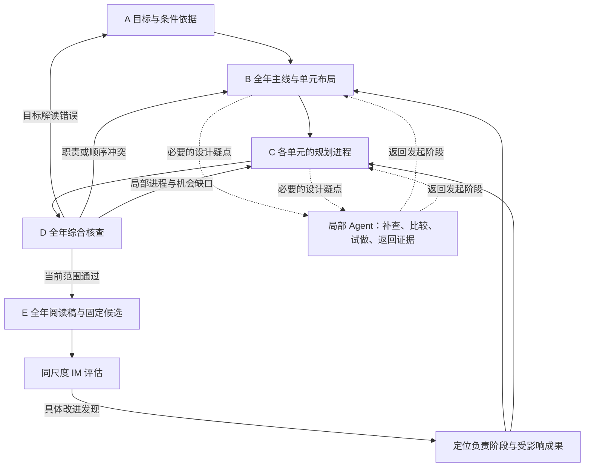

# 全年课程规划：阶段成果、Context、执行与检查

更新：2026-09-16。用户已明确当前目标是让全年规划达到 IM 可观察的规划质量，并要求结构化解决方法。本版替换上一版偏向单元与课时展开的建议；当前暂停向 03／17／06 推进。下述机制为具体实施设计，尚未运行，不宣称已找到最优 AI 用法或已达到 IM 水平。

## 1. 本轮要解决的问题

交付对象是可供课程负责人审查的全年方案：完整目标、年度数学主线、单元职责与关系、规划深度的学习进程、表征和语言发展、练习回访、评价与响应、时间资源和调整依据。各单元需要足够细致的规划来支持这些判断，完整 Lesson、逐题练习册及全套试卷不属于本轮范围。

当前有全年稿和运行证据，但标准标签齐全、课时相加正确、两名模型角色给出一致结论，均不足以证明这项能力完成。上一版以推进课时来回答全年问题，范围判断错误；历史工程成果保留，全年规划质量和执行方法继续在本层闭合。

**用户确认的推进目的：先用全年规划蹚路，后续生成任务复用有效机制。** 本轮既要改善全年结果，也要取得阶段交接、Context、图与动态 Agent、工具和检查反馈的真实效果证据。将验证有效的做法逐步用于其他能力；阶段名称、教学产物、真实人类参与和判据按各能力重新落实，迁移效果分别验证。当前围绕全年任务提炼实际需要的共享实现，不提前扩建通用框架。

### 从 IM 吸收什么

IM 的全年页把数学主线、单元叙述、进程、节奏和依赖联系起来；评价指导解释不同检查怎样影响后续教学。应吸收这种组织方法，形成自己的课程决定，不能从公开产物推断 IM 内部使用何种编写流程。[全年范围与顺序](https://accessim.org/6-8/grade-8/course-guide/scope-and-sequence?a=teacher)、[评价指导](https://accessim.org/6-8/grade-8/course-guide/assessment-guidance?a=teacher)

| 吸收的能力 | 全年方案必须让人查到的内容 |
| --- | --- |
| 数学主线与目标组织 | 本年的重要理解变化、各领域联系、前后年级衔接；标准为什么这样组合、哪些内容在哪个范围完成 |
| 单元职责与依赖 | 各单元新增的数学工作、需要前面提供什么、为后面提供什么；固定依赖与可调整顺序分别说明 |
| 学习经历、表征和语言的发展 | 每单元规划中的几个关键理解变化、学生需要做什么、表征与表达怎样支撑变化；不必列全年的逐课活动 |
| 巩固、回访与迁移 | 初次建立、后续巩固和跨单元再利用的实际位置及新增用途；反复出现同一术语不自动构成重复教学 |
| 评价与教学响应 | 进入诊断、形成性检查及阶段评价各服务什么判断，前面已有何种机会，发现困难后在哪里调整 |
| 节奏与教师规划 | 时间包括教学、练习、评价与机动，资源要求可行；教师能判断哪里可移动、压缩或补充，以及代价 |

这些要求成为阶段产物和检查对象，不仅出现在总 Prompt 中。原始对照与来源见[全年比较](comparisons/im-grade8-blueprint-comparison.md)和[官方材料核查](comparisons/im-grade8-scope-and-sequence-source-review.md)。

## 2. 先夯实哪些阶段成果

阶段“通过”表示当前成果足以支撑下一步，包含适用版本和已知假设；后续证据可以要求回修。通过不会把设计猜测变成学生已掌握的事实，也不等于每一阶段都向用户请求批准。

| 阶段 | 本次集中解决的问题 | 保存的成果 | 前进条件 |
| --- | --- | --- | --- |
| A．核实目标与条件 | 完整年级要求是什么？哪些是往年基础、本年责任与后续发展？时间、资源、学生证据哪些已知？ | 完整标准原文与层级；目标含义和年末表现；数学实践要求；条件、未知项和来源清单 | 范围完整、原文可定位、父子要求不混算；没有影响全局却被偷偷假定的条件；关键解读疑点已解决 |
| B．确定全年主线与布局 | 单元怎样组合和排序？跨领域联系是什么？有哪些真实取舍？ | 全年数学主线、单元职责草案、依赖理由、初步时间分配、需要验证的设计假设 | 每项目标有责任范围；各单元有新增职责；依赖与时间无明显冲突；重大取舍有依据。只对会改变设计的重要取舍比较方案 |
| C．补足各单元的规划进程 | 在全年职责内，学生通过哪些连续学习经历形成理解？表征、语言、练习与评价怎样安排？ | 每单元的进出表现、几个关键理解变化、代表学习经历、表征／语言安排、练习与评价位置、时间估计和未决风险 | 所有单元达到可审查的规划深度；目标—学习机会—表现证据能追查；不能只有标准标签或空泛叙述。高风险跨度已用必要探查核对 |
| D．全年综合核查与修订 | 单元拼在一起后是否连贯？是否存在先用后教、空重复、长时间无回访、评价早于学习机会、总容量冲突？ | 跨单元联系和回访表、目标与评价对应、全年节奏、检查及具体修订记录 | 程序必检通过，语义检查覆盖完整范围；阻断问题已处理，剩余假设有位置和处理办法；修订后相关检查适用于当前版本 |
| E．形成全年交付并比较 | 课程负责人能否据此规划和调整？相对 IM 哪些方面强、弱或证据不足？ | 清楚的全年阅读稿、规划数据、证据引用；固定版本的对照报告 | 先固定候选，再依统一机制比较；阅读稿与源一致。若比较暴露问题，回到负责阶段修订并另存实验版本，不改写原评分 |

B 不需要先写完全年所有细节。C 可以逐单元工作，但必须共享同一版全年职责及相关邻接内容；相互依赖的决定先后处理，不独立生成八份材料后机械拼接。无共享修改的任务可并行，合并时按输入指纹排除过期结果。

### 关键探查服务全年决定

遇到会改变单元组织、时间或教学可行性的疑点才做探查。例如：几何主线承诺用现有资源形成某种直观理解是否可行；指数规律怎样支持零指数和负指数；统计评价需要怎样的数据才能区分描述与推断。探查保存真实题面、必要数据／图、解法及对全年决定的影响。其余低风险内容不为凑流程机械造题，探查通过也不证明课堂效果。

## 3. LangGraph 与动态 Agent 的分工

LangGraph 管理已知的工作依赖、版本、检查和条件路由。动态 Agent 在一个明确问题内决定查什么、试什么、如何修订。官方区分预定代码路径与动态工具行动；两者可以嵌套，`create_agent` 本身也基于 LangGraph。[工作流与 Agent](https://docs.langchain.com/oss/python/langgraph/workflows-agents)、[子图与状态](https://docs.langchain.com/oss/python/langgraph/use-subgraphs)

每个阶段内部都遵循“准备本次 Context→设计／修订→程序核验与针对性审查→保存可交接成果”。图中前向边只在相应检查通过时触发；失败回到负责工作，不能等整份全年稿写完才第一次发现基础矛盾。最终对照发现目标依据错误时也可回到 A。

- **普通程序：**完整范围获取、确定资料读取、内容身份、保存与渲染、覆盖与时间计算、有效版本核对、检查覆盖记录和执行路由。
- **直接模型调用：**已有充分输入的目标分析、布局设计、单元进程组织、定向审查和修订。返回有明确结构的成果，不固定为一次调用解决。
- **动态 Agent：**尚不知道需要哪些证据的设计疑点、开放的方案比较、关键探查和复杂局部修订。输入有明确问题、已有事实、可改范围和完成条件；工具按此工作开放。
- **检查调用：**由图安排执行；是否需要工具循环取决于检查任务。不会因为角色叫“审阅者”就必须配置一个长期 Agent，也不因另起角色便假定判断独立可靠。

不为每个标准、单元编号或 rubric 条款建立专门节点；可复用一个“完成指定单元规划”的工作实现。暂不同时更换 Gemini 传输层，避免把模型、Context、资料和控制变化混在一起。

## 4. Context 怎么集中，又不丢全局

**跨阶段依靠当前有效成果衔接；原始对话保留供诊断，不直接累加进下一阶段的模型输入。** LangChain 支持按次替换消息、工具及响应格式，而不必改变持久状态。阶段隔离可用按调用隔离的子图，仍保留调用内恢复；安装版本的实际行为需要测试。[Context engineering](https://docs.langchain.com/oss/python/langchain/context-engineering)、[子图持久化](https://docs.langchain.com/oss/python/langgraph/use-subgraphs#per-invocation)

已有实例说明消息条数不是 Context 质量指标：首次审阅只有一条用户消息，但该消息含 255,384 个 Python 字符，集中了完整稿件、知识包及其他材料；字符数不是 token 数。它未继承作者对话，却仍要求模型同时处理多类判断。新方案应测实际装配内容和检查覆盖，不能只以“新会话”证明输入集中。

每次调用由程序装配并记录：本次问题、必须保持的条件、适用规则、实际内容和来源版本、当前有效发现、允许工具、要求返回的成果。

| 工作 | 始终保留的全局信息 | 本次完整加载 | 按需读取，避免每轮全文追加 |
| --- | --- | --- | --- |
| A 目标核实 | 年级、学校条件、完整范围 | 全年标准原文及数学实践、适用前后年级依据 | 拆解存在疑点的 LC 和进阶 |
| B 布局 | 完整目标视图、数学主线、条件 | 目标解读、关键依赖与当前布局 | 具体来源、有关探查或取舍 |
| C 单元进程 | 全年主线、各单元职责、共享时间与资源 | 当前单元完整目标、相关前驱／后继承诺、当前稿和有效问题 | 其他单元正文、详细图关系、探查资产 |
| D 综合核查 | 全部单元职责、完整覆盖与时间视图 | 被检查的跨单元链或评价路径的精确内容 | 对应全文和来源；分块检查必须覆盖所有目标、单元与所声明依赖 |
| 局部修订 | 必须保持的全局约束和实际影响范围 | 出错对象、依据、相关内容和旧版差异 | 无关单元正文及已解决历史 |

实施要点：

1. 阶段成果存为可定位的当前内容及指纹，保留简明设计依据、未决项和采用来源。摘要只用于导航；涉及判断时取回原文，不能靠摘要证明原文正确。
2. 不自动继承作者工具历史、旧审阅赞许或已被替换的方案。当前问题所需的原始错误与有效反馈仍要保留，不能盲目清空工作记忆。
3. 先做范围可控的装配，再考虑长阶段内部的摘要。分页、过滤和工具返回量都标明覆盖范围及可继续读取的位置，禁止静默截断后声称完整。
4. 全年布局改变时，核对受影响单元和检查的依赖指纹；旧结果不会自动成为新结果，也不无差别重做整年。只维护当前工作所需状态，不扩建完整内容历史平台。
5. 阶段内的有效进展、工具结果和耗时昂贵的成果持续保存。遵守真实取消、故障和已配置运行限制；不新增累计 token 预算，不因格式修复未完成而宣称交付。
6. 固定资料可以做查询去重和版本缓存；供应商缓存命中按真实用量记录。缓存不能代替本次信息选择，也不能证明上下文已经被合理控制。

## 5. 哪些检查真正反馈给模型

初次全年审阅已被要求检查六类内容，仍漏掉了资源、数据和数学解释问题，说明“写了检查要求”不足以保证执行。会话和实际输入另见[审阅证据核查](comparisons/year-review-session-audit.md)。下表将漏检转成可验证的工作，不为每个历史名词再加一条永久禁令。

| 机制 | 检查怎样做 | 反馈与回修 |
| --- | --- | --- |
| 确定性核验 | 对完整来源范围核覆盖、身份、引用、声明的强依赖顺序、课时与机动合计、资源文件和渲染 | 字段位置、实际值、期望关系与计算结果；程序能判断的问题先处理。标签通过不代替目标语义审查 |
| 从证据重建，而非复述作者结论 | 从单元规划提取实际承诺：用了什么资源、何时提供什么学习机会、何时要求表现；再与条件和目标对照 | 指出支持／矛盾原文、范围和影响；“全部可行”之类无位置总结不计为完成检查 |
| 目标—机会—评价逐项核对 | 对每项目标及重要整合要求追查责任单元、学习经历、练习和证据；反查每项评价需要的基础是否已提供 | 缺失联系及受影响目标；回布局或单元进程。全年层检查安排与代表表现，不要求全套试卷 |
| 独立试做与反例 | 对关键探查先给题面和必要图／数据，不给作者解答与“设计已成立”结论；之后再比对解法、假设与设计主张 | 真实缺项、反例或计算；区分算对数值与解释正确，设计者求解不能证明学生学会 |
| 针对性挑战 | 对高风险安排问“若前置未掌握／时间减少／单位改变，哪项承诺失效？”；不要求每个普通决定都做多方案 | 暴露的依赖和取舍，不凭“找问题”指令强造缺陷；可用证据反驳误报 |
| 修订保真 | 比较实际修改，重查受影响目标、时间、依赖和表征；确认原问题解决且未删掉必需内容 | 对象、修改、仍失败或新增问题；局部修复通过后仍做必要的全年一致性回查 |

每条问题至少包含：检查对象与指纹、判据、原文／来源位置、反例或冲突、严重程度、影响范围、复查方式。允许“通过／有问题／证据不足／不适用”，后两者必须解释；不能把未查到写成通过。检查程序核验引用存在，语义判断另接受复核。

检验检查器的方法见[评估机制](year-planning-evaluation.md)：旧失败、新的同类变体和合法改法一起测试，分别统计漏报与误报。仅在提示中写入旧错误后识别旧错误，不证明泛化能力。

## 6. 工具怎样提高效率和准确度

| 工具／程序能力 | 在全年规划中解决什么 | 当前状态与边界 |
| --- | --- | --- |
| 完整标准范围、LC 与进阶查询 | 查目标含义、支持联系和有争议的跨度，保留分页、版本与来源 | 已有 `browse` 和全年范围准备；需要围绕阶段装配结果。图关系不自动决定教学顺序 |
| 按对象读取当前规划与来源 | 取一个单元、目标或有关跨单元链，避免反复读整稿 | 当前主要是 `read_curriculum` 整稿读取；按稳定身份筛选及精确回取待补 |
| 覆盖／依赖／日历检查 | 计算遗漏、显式强依赖顺序、时间合计、重复计时、失效引用 | `check_year` 已有部分；检查跨单元声明和时间分项待补。结构正确不等于教学正确 |
| 数学计算与图／表核验 | 核对探查、单位、数据和反例，确认图实际表达的关系 | 已有 `calculate_math`、`plot_linear`；适用范围外按实际需要扩展受限能力，不开放任意 shell。数值正确不证明因果或教学解释正确 |
| 内容提交、局部差异与检查反馈 | 固定值由程序处理，定位失败字段，保留有效内容，重查当前稿 | 已有文件、指纹和渲染；阶段成果、局部更新及受影响范围待补 |
| 评价记录与比较报告 | 保存双方证据、独立评分、分歧和优劣，避免只剩一句模型结论 | 新机制见下文，尚未完成正式评测；计算得分不代替证据判断 |

工具应返回足够作决定的结果与证据引用；固定操作直接由 Graph 调用，需要选择的操作才交给 Agent。先复用现有 Module，再按上表具体缺口扩展，不新建通用课程平台。

## 7. 最后纳入同尺度的 IM 评估

评价规则必须在下一份候选生成前固定，阶段检查也据此设计。全文见[全年规划与 IM 的评估机制](year-planning-evaluation.md)，可读取判据见[评分规则数据](year-planning-rubric.json)。

运行内检查服务修订；固定版本后的独立评估服务比较。双方使用相同范围、证据深度、尺度和报告方式；不比较完整 IM 材料与本项目蓝图，不以是否像 IM 的目录打分。先记录逐维强弱与重大问题，再给满足条件的综合结论；无法观察或不具有可比性的内容明确留空，不能给 IM 自动满分，也不能给本项目自动零分。

## 8. 实施顺序与本轮完成范围

当前先在 15 的全年能力内完成：阶段产物和输入装配→必需检查与反馈→全年真实设计／修订→固定候选→同尺度 IM 比较→依据发现修订并复评。先用当前稿验证定向检查和修复，随后需要真实全年生成检验阶段方法；修复旧稿不能单独证明从头规划能力。

机制比较保持相同模型、资料可得范围和外部判据：充分输入的现有循环、改善 Context／判据的循环、同资源的显式阶段工作流分别记录。至少将输入改善与控制改善区分；以全年规划为任务，不用单课效果替代。先完成小规模试运行并排除不公平条件，再作成对重复与未调提示的新情境检查；不先建设多套完整系统。

全年质量没有闭合前，03／17／06 保留后续交付范围但不作为当前推进任务。达到本轮全年规划的完成条件，需要完整阶段成果、有效检查与修订、可审查阅读稿、完整对照结果，以及对仍弱于参考之处的明确处置。本轮仅完成机制设计与路线更正，运行代码、新全年稿和正式对比分数尚未产生。
