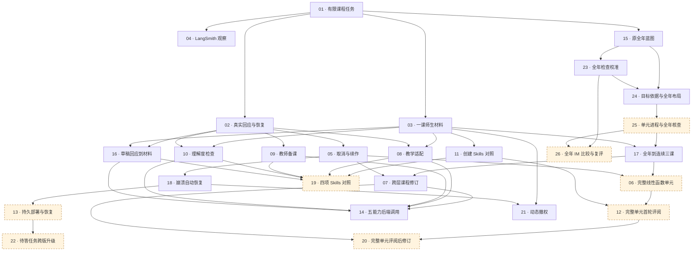

# 实现票依赖关系图

更新：2026-09-16。由 26 张票的 `Blocked by` 核对。箭头只表示工程前置；票号不是执行顺序，`Status` 是 triage 角色，不是完成状态。橙色虚线是根据实际输入尚待收口的工作包。

## 为什么要分开依赖、顺序与质量门槛

工程上可启动的单课不一定是当前最有价值的工作；全年方法未验证时推进下层会扩散质量问题。因此当前先执行 **23→24→25→26**，按 [规格门槛](spec.md#验收与质量声明)处理年度关键差距，再恢复后续能力。质量不通过会回修对应成果，不能仅因所有工程入边满足就前进。

03 的独立课时、09 的外部原课入口保留原工程条件。17 则确实需要 25 的重构后年度规划契约，因此其工程上层提供方由 15 更新为 25；15 仍通过 24 成为历史基础。依赖变化的理由见 [重整记录](year-planning-replan.md)。

## 工程硬依赖

## 节点索引

| 票 | 完整标题 | 硬依赖 | Triage 角色 |
| --- | --- | --- | --- |
| 01 | [从任务接口完成有明确范围的真实课程设计](issues/01-live-curriculum-task.md) | 无 | `ready-for-agent` |
| 02 | [让真实教学决定跨进程等待并恢复执行](issues/02-human-decision-and-resume.md) | 01 | `ready-for-agent` |
| 03 | [直接生成一课的真实师生材料并检查修订](issues/03-continuous-lessons-and-materials.md) | 01 | `ready-for-agent` |
| 04 | [将真实任务关联到 LangSmith 并隔离观察故障](issues/04-tracing-and-quality-regressions.md) | 01 | `ready-for-agent` |
| 05 | [取消教学任务并续作明确停止的工作](issues/05-stop-cancel-and-recovery.md) | 02 | `ready-for-agent` |
| 06 | [完成线性函数整个单元的教学内容与检查](issues/06-complete-linear-functions-unit.md) | 17, 05 | `needs-triage` |
| 07 | [按自然语言修改课程并重查受影响内容](issues/07-scoped-curriculum-revision.md) | 17, 05 | `ready-for-agent` |
| 08 | [根据学习证据适配真实数学课时](issues/08-lesson-adaptation.md) | 03, 02 | `ready-for-agent` |
| 09 | [围绕真实任务完成教师参与的备课](issues/09-teacher-preparation.md) | 02 | `ready-for-agent` |
| 10 | [生成并双重验证数学理解度检查](issues/10-check-for-understanding.md) | 03, 02 | `ready-for-agent` |
| 11 | [从课时创建开始建立可离线复现的 Skills 对照](issues/11-skills-comparison.md) | 03 | `ready-for-agent` |
| 12 | [固定完整单元并完成同尺度的首轮评阅](issues/12-frozen-unit-comparison.md) | 06, 11 | `needs-triage` |
| 13 | [在持久部署中重启和恢复实际教学任务](issues/13-production-runtime-package.md) | 18 | `needs-triage` |
| 14 | [从外部后端调用五项能力并核对交付边界](issues/14-backend-integration.md) | 07, 08, 09, 10, 16 | `ready-for-agent` |
| 15 | [生成覆盖完整八年级 CCSS 的全年蓝图](issues/15-full-year-blueprint.md) | 01 | `ready-for-agent` |
| 16 | [按真实草稿回应生成课时材料](issues/16-lesson-draft-review.md) | 02, 03 | `ready-for-agent` |
| 17 | [从全年蓝图交接到连续三课](issues/17-curriculum-lesson-handoff.md) | 25, 03 | `ready-for-agent` |
| 18 | [在崩溃和调度结果不明后自动恢复任务](issues/18-crash-reconciliation.md) | 05 | `ready-for-agent` |
| 19 | [扩展并汇总四项 Skills 的实际对照证据](issues/19-four-capability-comparison.md) | 11, 08, 09, 10, 16 | `needs-triage` |
| 20 | [根据匿名评阅意见修订并复核完整课程](issues/20-comparison-driven-revision.md) | 12, 07 | `needs-triage` |
| 21 | [在权限撤销后隔离任务、材料和后台续作](issues/21-access-revocation.md) | 03, 18 | `ready-for-agent` |
| 22 | [在部署升级后正确恢复旧版本待答任务](issues/22-waiting-task-upgrade.md) | 13 | `needs-triage` |
| 23 | [建立全年规划的证据评价与检查校准闭环](issues/23-year-evaluation-and-check-calibration.md) | 15 | `ready-for-agent` |
| 24 | [核实全年目标依据并形成可检查的单元布局](issues/24-year-foundation-and-layout.md) | 15, 23 | `ready-for-agent` |
| 25 | [补足所有单元的规划进程并核查全年连贯性](issues/25-year-progressions-and-global-checks.md) | 24 | `needs-triage` |
| 26 | [比较全年方案与 IM 并依据证据修订复评](issues/26-year-im-comparison-and-revision.md) | 23, 25 | `needs-triage` |

## 怎样安排后续

1. 23 先校准检查和证据记录，24 形成目标／布局最小闭环；25／26 根据实际输入收口，覆盖完整年度并比较修订。已有 01／15 工程结果不能直接代表新的质量门槛。
2. 年度质量具备相应证据后，03 形成 Lesson，17 从 25 交接正式课段和连续三课；06／07 再覆盖完整单元和跨层修订。
3. 02／16 提供真实参与和草稿路径，04 随实际需要验证观察，05 提供后续长任务取消续作；18 和生产故障矩阵不是当前全年规划的前置。
4. 08／09／10 按自身流程、输入及质量要求推进；11／19 比较 Skills，12／20 比较完整单元。它们与当前 26 全年比较的范围分别维护，已接触 IM 的影响如实记录。
5. 13／21／22 分别验收持久部署、动态撤权、跨部署升级；14 汇总消费者契约。产品发布仍需相应内容、运行和真实使用证据。

当前 [文件化范围](spec.md#当前阶段文件化教学内容闭环)和已授权的 [交互基准](prototype-baseline.md)继续有效；不新增统一审批或用完成状态掩盖未取得的教学证据。
