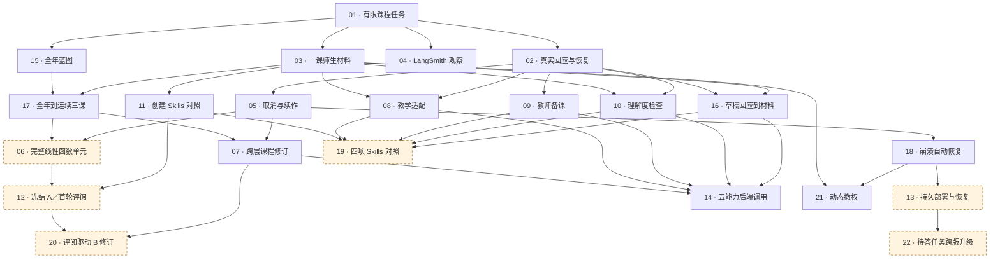

# 实现票依赖关系图

当前先执行 [文件化阶段](spec.md#当前阶段文件化教学内容闭环)：JSON 当前稿、无新增数据库、无内容历史。下图保留完整交付的依赖关系；首票已经按当前阶段调整，后续生产持久化及历史相关条款不自动成为该切片的前置。

日期：2026-09-15。由 22 张票的 `Blocked by` 核对生成；完整标题、规模和承接范围见 [交付路线](README.md) 与 [逐票复核](ticket-sizing-review.md)。

箭头表示前置成果必须先可用；同一节点的所有入边都要满足。票号是稳定身份，不是执行顺序。橙色虚线框表示 `needs-triage`，须根据实际输入再限定范围。图只表达工程硬依赖，不代替质量、生产与学校使用的发布门槛。

## 怎样安排执行

1. 01 的有限工程范围已完成。当前内容主线先推进全年蓝图（15），再推进单课材料（03），在 17 汇合为来自真实上层的连续三课。02、16 提供真实回应与草稿路径；04 随切片接入观察，05 为长单元和跨层修订提供取消／续作。首条教学链须有必要交互、检查和受控恢复证据；18 的完整故障恢复验收后置，不作该内容链前置。详见 [整体推进路径复核](delivery-path-audit.md)。
2. 连续三课出现后，扩大为完整单元（06），并用跨层修订（07）检验修改影响。不能把三课的完成当成完整单元已完成。
3. 适配（08）、备课（09）、理解度检查（10）按所需基础接入；09 可使用外部真实原课，所以不依赖材料生成器。图上可启动不等于优先于课程主线。
4. 03 产出后即可开始创建对照（11）；19 汇合各能力实际对照。完整原创 A 在 12 冻结后才读取对应 IM，再用 20 形成 B。
5. 18 支撑持久部署（13）和动态撤权（21），22 再检验一次真实跨版升级。14 是消费者契约汇总，不是生产上线；质量和运行门槛仍须合并通过。

## 节点索引

| 票 | 完整标题 | 硬依赖 | 当前状态 |
| --- | --- | --- | --- |
| 01 | [从任务接口完成有明确范围的真实课程设计](issues/01-live-curriculum-task.md) | 无 | `ready-for-agent` |
| 02 | [让真实教学决定跨进程等待并恢复执行](issues/02-human-decision-and-resume.md) | 01 | `ready-for-agent` |
| 03 | [直接生成一课的真实师生材料并检查修订](issues/03-continuous-lessons-and-materials.md) | 01 | `ready-for-agent` |
| 04 | [将真实任务关联到 LangSmith 并隔离观察故障](issues/04-tracing-and-quality-regressions.md) | 01 | `ready-for-agent` |
| 05 | [取消教学任务并续作明确停止的工作](issues/05-stop-cancel-and-recovery.md) | 02 | `ready-for-agent` |
| 06 | [完成线性函数整个单元的教学内容与检查](issues/06-complete-linear-functions-unit.md) | 17, 05 | `needs-triage` |
| 07 | [按自然语言修改课程并重查受影响内容](issues/07-scoped-curriculum-revision.md) | 17, 05 | `ready-for-agent` |
| 08 | [根据学习证据适配真实数学课时](issues/08-lesson-adaptation.md) | 03, 02 | `ready-for-agent` |
| 09 | [围绕真实任务完成教师参与的备课](issues/09-teacher-preparation.md) | 02 | `ready-for-agent` |
| 10 | [生成并双重验证数学理解度检查](issues/10-check-for-understanding.md) | 03, 02 | `ready-for-agent` |
| 11 | [从课时创建开始建立可离线复现的 Skills 对照](issues/11-skills-comparison.md) | 03 | `ready-for-agent` |
| 12 | [冻结原创单元并完成匿名对照的第一轮评阅](issues/12-frozen-unit-comparison.md) | 06, 11 | `needs-triage` |
| 13 | [在持久部署中重启和恢复实际教学任务](issues/13-production-runtime-package.md) | 18 | `needs-triage` |
| 14 | [从外部后端调用五项能力并核对交付边界](issues/14-backend-integration.md) | 07, 08, 09, 10, 16 | `ready-for-agent` |
| 15 | [生成覆盖完整八年级 CCSS 的全年蓝图](issues/15-full-year-blueprint.md) | 01 | `ready-for-agent` |
| 16 | [按真实草稿回应生成课时材料](issues/16-lesson-draft-review.md) | 02, 03 | `ready-for-agent` |
| 17 | [从全年蓝图交接到连续三课](issues/17-curriculum-lesson-handoff.md) | 15, 03 | `ready-for-agent` |
| 18 | [在崩溃和调度结果不明后自动恢复任务](issues/18-crash-reconciliation.md) | 05 | `ready-for-agent` |
| 19 | [扩展并汇总四项 Skills 的实际对照证据](issues/19-four-capability-comparison.md) | 11, 08, 09, 10, 16 | `needs-triage` |
| 20 | [根据匿名评阅意见修订并复核完整课程](issues/20-comparison-driven-revision.md) | 12, 07 | `needs-triage` |
| 21 | [在权限撤销后隔离任务、材料和后台续作](issues/21-access-revocation.md) | 03, 18 | `ready-for-agent` |
| 22 | [在部署升级后正确恢复旧版本待答任务](issues/22-waiting-task-upgrade.md) | 13 | `needs-triage` |

## 实现前的共同检查

规划基线及 [用户交互原型基准](prototype-baseline.md) 已按用户要求定稿保存，01 已实施；此前“等待基准确认、实现未开始”的条件不再适用。后续每票按其影响核对同一基准，不重复索取同一确认，不新增通用审批模块。上述 `Blocked by` 表示工程交接，具体执行优先级按教学主线安排。
