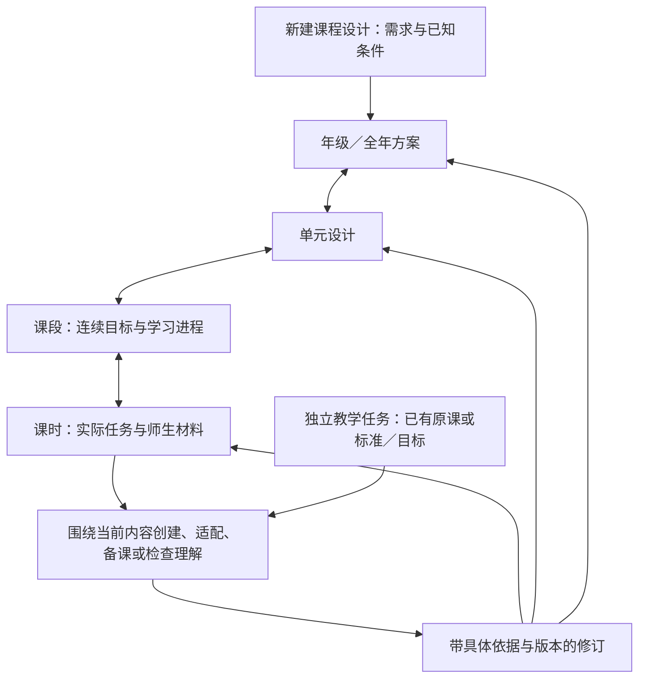

# 教学工作区：全年课程到实际教学的交互方案

日期：2026-09-15。状态：**已按授权落实到现行 HTML；用户要求本轮方案定稿、提交并推送，保存为现行交互参考。**

依据：[项目目标与原则](../../README.md)、[交付规格](spec.md)、[原型基准及用户指出的缺口](prototype-baseline.md)。本文件补充原型的结构与行为，不改变五项能力或各自完成条件。本轮已定稿；实施按文件化阶段取用，完整内容历史等保留后续，不能据此声称生产或教学质量通过。

## 要解决的工作

课程负责人需要从全年目标和学校条件出发，设计独立数学课程，逐步落实到可用的课时与材料；教师需要直接进入自己的教学内容，准备、调整和检查教学。两者可能是同一个人，不为原型新增角色切换或权限管理系统。

本次采用 Impeccable 的 **Operate** 模式：阅读实际内容、判断和完成教学工作优先。补齐现有工作区的层级、内容和交互，沿用其安静、清晰的视觉表达；不借此另做品牌或视觉风格选型。现有样式不成为生产视觉权威。

成功的直观证据是：首次打开能看见全年设计；能沿单元、课段进入一节课的实际任务；能解释它为何在这里、依据什么、完成到哪里；能从下层问题返回上层修订，继续原工作而不丢失待答事项。

## 核心结构：课程内容组织导航，教学任务依附于内容

图中的箭头是可浏览和交接的关系，不是必须依次等待批准的执行阶段。用户可在已知条件充分时直接要求完成约定范围的设计；模型按需要往返设计、试做、检查与修订。

- **现有课程默认打开全年方案**。无课程时显示新建设计入口：用自然语言说明目标，已提供的学年、课时、资源等条件可查看；只补问真正缺少且会改变结果的信息。CCSS 已固定，不设框架选择器。
- **导航按 Grade → Unit → Section → Lesson 展开**，当前路径始终可见。设计制作工作区在宽窗口常驻可折叠课程树；先展开当前分支，避免一次铺开全年所有课时。活动属于课时内容，不另增一个必经导航层级。
- **教师可直接打开某课或外部原课**。从标准发起理解度检查也有独立入口；无课程归属时如实显示，不伪造全年或单元上下文。
- **五项能力不再作为五个互相重置的顶层示例页**。课程设计发生在各级课程视图；创建、适配、备课和理解度检查放在相关内容旁。“独立教学任务”保留无需课程树的入口。能力不是五个必经步骤。

## 三类视图各负责什么

| 视图 | 主要内容及阅读顺序 | 关键操作与交接 |
| --- | --- | --- |
| **全年方案** | 年级目标和教学条件；全年设计理由与主线；按顺序排列的单元职责、时间、目标和承接关系；可展开的 CCSS 内容／实践分配及未决问题 | 新建设计、提出修改、查看依据、进入单元。从标准定位承担它的单元与已存在的任务 |
| **单元与课段** | 单元目标、先备与后续、设计理由、关键任务与评测；课段的连续进程；课时各自承担什么及材料准备情况 | 展开课段、选定范围继续设计或生成材料、查看实际课时、修改进程。Section 有自己的目标与 Narrative，并有稳定路径；可在单元内展开，不要求多开独立页面 |
| **课时与教学工作** | 本课目标与上下文；实际任务和解法；按受众查看学生材料、教师指南及相关结果；当前内容的检查与修订 | 创建或修改材料、教学适配、教师备课、理解度检查；带着当前内容向上追查或提出修订 |

Narrative 在界面中可称“设计理由与衔接”，回答为什么这样组织、学生的思考怎样发展、前后任务如何接续。它随对应课程内容一起展示和修订，不能只留在隐藏文件中。

全年默认采用易于比较的单元列表：名称、教学职责、建议课时及准备情况。标准长表和依据按需展开。当前不采用拖拽排课板；拖动本身不能表达课程调整的教学理由和后果，自然语言修订已足够支撑首轮验证。

**清楚区分三种事实**：目标已分配到计划中；实际任务与材料已生成；对应版本已经过何种检查。比如“已规划 18 课，已有 3 课材料”可以成立，“单元已完成”则需要完整范围的证据。模型写了标准编号，不等于学习机会成立，更不等于学生已掌握。

## 在内容旁完成任务与回应

设计制作工作区在宽窗口使用可折叠的常驻课程树，并保留顶部课程路径；窄窗口通过同一层级的抽屉目录导航。主要内容区随所选课程对象变化；“围绕当前内容工作”的面板按需打开，空间不足时转为纵向。主要阅读面积留给课程或材料，对话与待答事项靠近它们，不用聊天记录代替课程正文。内容标题附近显示对象、范围、版本和主要下一步；长记录与技术细节收起。这项修正回应用户对设计制作工作区的要求，已有有限浏览器走查。

**用户明确的参考定位：IM 页面仅供交互与布局参考，可视为本项目生成完成后的内容呈现参考。** 本工作区还要覆盖生成前、执行中和修订中的工作，功能依据来自本项目规格。以下将已有要求落到页面位置，不从参考页面的具体教学内容推导新要求。

| 本项目已有功能 | 在同一工作区中的位置与行为 |
| --- | --- |
| 输入条件与发起设计 | 尚无内容时，主区域呈现需求输入与已知条件；已有内容时，可从当前对象查看和调整本次条件。沿用外部已提供的信息，区分实际条件与待核实假设，不让用户重填整张表 |
| 局部修改 | 在当前单元、课段、任务或材料区块发起“修改这一部分”，携带实际对象、范围和版本，用自然语言描述改动。修改结果回到原位置，说明影响及相关内容，不要求复制整篇材料到聊天框 |
| 执行进度与待答 | 当前内容附近显示本次任务在做什么、已有何种结果、是否需要回应。详细记录按需展开；进度来自实际状态，不编造百分比。HITL 关联正在讨论的内容，取消与续作沿用各自语义 |
| 版本与修订结果 | 内容标题附近显示当前版本；按需查看历史、改动摘要和受影响内容。查看旧版不改变当前采用版本；新版生成与公共基线采用分别处理 |
| 检查、依据与材料 | 当前内容可查看对应版本的检查结论、使用依据及师生材料。生成、检查、人类审阅分别表达；局部检查结果可回到具体内容，不只汇总为一个总状态 |

同一课程对象在输入、生成、阅读和修订之间保持身份与位置；这些是工作状态和按需展开的区域，不是新增五个固定页面或五步向导。

选中内容决定默认工作对象，但**不会自动向模型发送需求，也不等于把整个课程树都塞进 Context**。输入框显示本次指向的对象与范围；用户可用自然语言扩大、缩小或改变需求，实际执行继续遵循权限与课程上下文。

| 用户动作 | 应看见什么 | 实际执行含义，沿用既定调用设计 |
| --- | --- | --- |
| 打开全年、单元或课时 | 现有内容、版本、准备情况与相关任务 | 读取内容／任务快照，不触发 LLM |
| 提交“为这个课段生成材料”等需求 | 本次范围与已提供条件、简明进度、逐步可读的结果 | 创建任务；Harness 装配实际 Context，让模型使用工具、生成并检查 |
| 对具体内容提出修改 | 所指原版本、修改依据、受影响内容和新版本 | 进入修订；分析影响并重查，不能覆盖尚未采用的公共课程基线 |
| 回答一个问题或提交自己的解法 | 问题针对的内容、原文已收到、随后是否采纳及如何继续 | 回应绑定实际请求和展示版本；回执与模型采纳分别表达 |
| 离开后返回 | 当前内容和同一未完成任务，已保存回应不丢失 | 从权威任务状态恢复展示；切换视图不取消任务或重新提问 |
| 取消或续作 | 保存了什么、未完成什么，以及当前可采取的动作 | 使用各自运行语义；取消不能被普通“继续”静默重开 |

界面允许在等待时浏览其他课程内容。返回时仍能找到待答对象；材料已变更导致旧问题不再适用时，要解释对应变化，不能把旧回应算在新版本上。无法取得状态时不显示“已完成”，也不盲目重发用户需求。

### 各能力的人类参与保留原有意义

这里调整入口与信息位置，不统一各能力的教学流程。详细依据仍是 [HITL 设计](../skills-harness/assets/hitl-design.md) 及其中逐项链接的详细流程和原 Skill。

| 能力 | 本原型必须保留的参与方式 |
| --- | --- |
| 课程体系设计 | 已授权范围内自主推进。确有缺少事实或授权外取舍时，展示具体影响再问；全年、单元、课段和课时不逐层强制批准 |
| 课时与材料 | 可以直接生成，也可以先看草稿。“只改草稿”保持等待；“修改后生成”沿已有决定继续。材料交付不等于等待教师满意 |
| 教学适配 | 基于实际原课及相关需要；正常协作区分局部接受与当前整套接受。明确只生成、外部审阅或结束时，按对应范围报告 |
| 教师备课 | 正常路径先展示实际原题，让教师尝试和分析近似正确回应，再展开模型分析；真实贡献影响便签。先示范、短时、拒答及结束仍有自身规则 |
| 理解度检查 | 没有适用的明确焦点时先等待选择；已有有效焦点则直接继续。学生页和教师指南经过本能力两道实际验证后交付，不让教师手动点击“执行验证” |

待答事项放在其对应内容旁：说明要决定或贡献什么、为什么此刻需要、回应针对哪一版。一次突出当前要解决的问题；不以统一“批准并继续”按钮替代不同的教学动作。

## 一个贯穿主线的走查故事

1. 课程负责人打开八年级全年候选，读懂其设计理由、全部单元安排和 CCSS 分配；进入线性函数单元，看到课段与课时的连续安排。
2. 打开其中连续三课的一节，实际阅读学生页与教师指南。其余课时若只有规划，就明确显示只有规划。
3. 针对某个实际任务提出：“这里使用的表征在此前安排中缺少学习机会，请核查前后内容，并在现有课时范围内调整。”这是一条交互样例，缺口必须由实际样本支持；不能凭空声称真实学生不会。
4. 模型核对问题属于本课说明、课段进程还是上层安排，给出修改及依据；在已有授权内执行，确需新的课程取舍时才等待。界面展示具体受影响内容，不让用户选择内部“跨层修订场景”。
5. 返回课段、单元和全年，能看见相关设计理由或安排如何变化；未改动内容保留，受影响但尚未重查的材料如实标明。生成新方案不等于外部课程负责人已经采用为公共基线。

另用两条短路径核对入口和差异：教师从原课直接开始备课／适配；从 CCSS 焦点独立发起理解度检查。旧样本中“只改稿／改后生成”“局部／整套接受”等行为继续覆盖，但放在走查说明中，不铺成用户的场景菜单。

## 样本、状态与交互深度

补齐的目标文件仍为 [现行教学工作区 HTML](prototypes/teaching-workspace.prototype.html)。使用可点击、可输入的静态数据原型；此轮不连接真实 LLM、LC 或持久任务服务。预置走查行为明确标为模拟；任意自由输入不得伪装成已被模型理解。切换视图保存本次内存状态；刷新重置的限制继续明示。

全年样本可以引用 [已有原创实验蓝图](../skills-harness/experiments/grade8-linear-functions/runs/20260915T021738Z-overall/artifacts/grade8_curriculum_blueprint.md)：9 个单元、160 个常规课时加 20 个弹性课时；目标线性函数单元在该候选中编号为 5。这些是模型实验样本，不是学校事实、质量结论或固定产品结构。材料引用、摘录和交互补写须分别标识，不改写原始实验记录。原始候选中的效果声明不能直接提升为界面上的事实。

全年应呈现全部单元概览；目标单元展示整体课段／课时计划并深入连续三课。其他单元没有详细内容时诚实展示边界，而非点击无响应或伪造完整材料。原型中的同一条路径必须使用一致的版本和学校条件；现有有限课段的 `3 × 45 分钟` 不能未经说明直接接到实验蓝图的 `50 分钟／课` 上。必要的交互补写属于单独标明的合成样本。

布局需容纳一个空课程、上述全年样本、较长单元标题、多项标准、较长 Narrative、一个单元展开后的多课时列表，以及材料有／无、检查未完成／需修订的混合情况。没有依据不显示覆盖百分比或“全部达标”。

展示范围包括初次创建、已有课程浏览、执行中、等待回应、修订完成、部分结果、停止／失败、旧版本变化和只读状态。它们是用户需要理解的情况，不据此新增一套后端状态枚举；复用规格中的权威状态与结果范围。

桌面以设计制作、阅读和编辑为主，左侧常驻可折叠课程树，中间呈现当前内容，任务面板按需打开；不足以容纳三栏时任务面板转为纵向。窄窗口将课程导航折叠为可打开的目录，工作区改为纵向布局，仍能看清当前课程路径与待答事项。长表允许局部滚动，数学图与标签保持可读，不能靠整页缩小适配。键盘可进入目录、材料、输入和回应；状态变化提供文本反馈，不能只靠颜色。

## 实现时的边界与交接

- 当前先验证八年级全年到材料的完整关系，不同时生成所有 K–12 年级或建设学校管理产品。学校、学生、家长端及最终发布工作流继续由外部系统负责。
- 保留上游 Skills 的教学流程与质量参考；不以统一页面替换流程，不读取对应 IM 内容来补原创设计，也不固定 IM 课程次序、课堂阶段或文件数量。
- 个体／班级适配与课程公共基线保持不同范围；没有真实学习证据时不展示“基于某学生掌握度”的事实。
- 来源与检查按需可查：区分 CCSS／图依据、模型设计推断与真实人类决定。普通工作区不展示 Prompt、图节点、锁、trace 控制或故障注入。
- 此次只补交互参考，生产实现仍按 [交付路线](README.md) 与 [依赖图](dependencies.md) 推进。全年主线不能缩回首票的有限课段，也不能要求工程一次交付整套全年材料。
- 本文件已按用户“shape 完成了就开始构建”落实到同一 HTML；桌面／窄窗口及代表性行为的实际结果见 [本轮走查](prototype-build-walkthrough.md)，并由 [交互基准](prototype-baseline.md) 引用。静态模拟与真实运行证据继续分开记录。

本轮已获授权的内容导航和工作关系已有浏览器观察，尚无学校教师使用证据。正式品牌、前端框架与完整设备支持矩阵仍未确定。

## 用户提供的 IM 页面：界面参考及取舍

2026-09-15，按用户请求，在浏览器查看 [单元页](https://accessim.org/6-8/grade-8/unit-4?a=teacher)，并从其课时链接进入 [课时准备页](https://accessim.org/6-8/grade-8/unit-4/section-a/lesson-1/preparation?a=teacher)。用户随后明确：**不看教学内容，只参考页面的交互布局；它们代表生成后的呈现，本项目按既有文档增加输入条件、局部修改、进度、版本等功能。** 后续参考工作遵守这一边界，不扩展为课程内容研究或对照。两页的公开界面已走查，未登录或打开受限材料；观察不是学校用户测试。

| 实际观察 | 对本原型的启发与取舍 |
| --- | --- |
| 顶部按课程层级切换位置，正文按课段分组并提供课时入口 | 采用顶部路径、宽窗口常驻课程树、窄窗口抽屉目录和单元内课段列表；保持浏览位置清楚 |
| 课程位置导航与课时内部的阅读入口分成两层 | 将“正在看哪个对象”与“正在看它的哪部分”分开；阅读切换不成为模型执行阶段 |
| 主内容与相关资源分区呈现 | 保留主要阅读面积与便捷的材料入口；任务操作和记录按需展开，避免多栏同时占满页面 |

本项目还需增加这两页未展示的生成、修订、待答、版本及检查语义。阅读准备概览不等于完成本项目的教师备课能力；后者仍须按原 Skill 目的承载真实教师尝试、讨论与便签。不照搬品牌、装饰、常驻资源栏及账号入口，也不因此增加家庭端或学校管理模块。

本轮界面取舍：保留“当前课程位置 → 当前阅读内容”的两层组织。用户随后指出本界面服务设计制作，而非仅呈现完成后的材料；据此修正为宽窗口常驻可折叠课程树，当前内容居中，任务面板按需打开。窄窗口保留抽屉目录。三类视图及各能力 HITL 保持原方案；不把生产步骤或 LLM 阶段列成导航菜单。

本次界面参考不判断单元内容与实验主题是否匹配；该问题不影响导航、分区和操作布局的借鉴，课程对照仍留在原定工作中。

参考暴露记录：页面标题、导航和可见 Narrative 已进入当前开发会话；不能再笼统声称该会话没有看过 IM Unit 4。未将这些内容写入原创任务输入、教学规则、知识返回或评分标准，也未启动新的原创／对照运行。隔离约束继续针对实际 Harness 输入和可访问资源落实，参见 [实验记录](../skills-harness/experiments/grade8-linear-functions/README.md#开发侧界面参考记录)。
