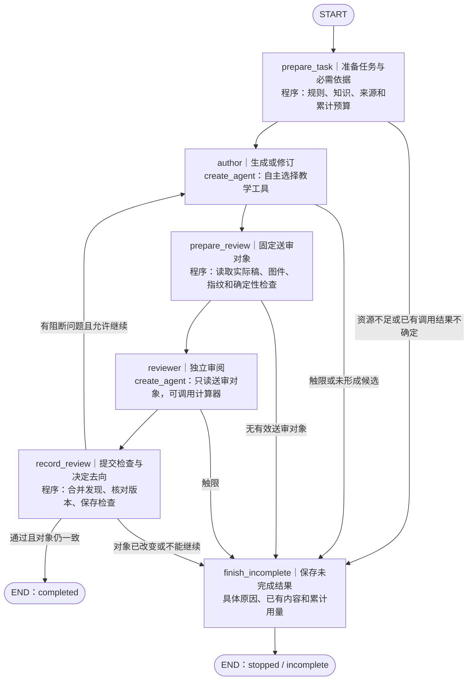

# 有限课段任务的目标执行图

日期：2026-09-16。状态：用户已要求“落到文档，开始重构”，方案采用，代码重构及有限验证完成；真实样本因资源边界停止，教学质量未通过。

对应 [首个有限课程任务](issues/01-live-curriculum-task.md)。依据 [当前交付规格](spec.md)、[执行结构决定](../skills-harness/issues/03-execution-structure.md)、[ReAct 与工作流职责复核](../skills-harness/assets/react-and-workflow-boundaries.md) 及当前 `graph.py`。本方案把已经存在的阶段落实为图，保留有限课段的教学规则、工具和检查要求。

## 1. 设计选择

**采用五个主阶段、两个静态可发现的 Agent 子图和一条显式修订回路。** LangGraph 决定什么时候生成、送审、修订和结束；Agent 决定阶段内需要补查什么、怎么算、如何写题和修改内容。

**节点分工已经确定：`author` 与 `reviewer` 使用 LangChain `create_agent`；`prepare_task`、`prepare_review`、`record_review` 和 `finish_incomplete` 使用普通 Python。后四者处理确定的数据读取、校验、提交和路由，不增加 LLM API 调用。**

重构前的 `START → curriculum_work → END` 中，一个 Python `while` 承担了所有阶段。目标是让知识准备完成、候选稿交接、独立审阅完成及检查提交成为分别可观察、可保存的执行位置。

保持 Agent Server、原生 thread／run、服务注入的 checkpointer、同线程并发拒绝及文件化当前稿。此次不新增业务数据库、内容历史、另一套调度器或教师审批。真实 HITL、取消／续作及系统性崩溃恢复仍分别由 [人类决定票](issues/02-human-decision-and-resume.md)、[停止与续作票](issues/05-stop-cancel-and-recovery.md)、[故障恢复票](issues/18-crash-reconciliation.md) 承接。

## 2. 目标图

图中的实线是本次要实现的工作流；受控停止走公共收尾节点。异常和原生取消的处理见第 7 节，不能假定它们一定能运行收尾节点。



每条阶段实线跨过一个有实际输出的工作位置。`record_review` 返回反馈与下一轮编号，条件边返回同一个 `author` 节点；不再用节点内部的 `while` 编排多轮生成和审阅。没有单列只转发数据的“决定是否修订”或“宣布成功”节点。

### 节点输入、工作与输出

| 节点 | 必须取得的输入 | 必须完成的工作 | 保存给下一阶段的输出 |
| --- | --- | --- | --- |
| `prepare_task` | 已接收的 TaskRequest、可信任务身份、现有执行记录、规则资源 | 固定规则正文及版本、模型／工具配置；调用 `Knowledge.prepare` 取得本次 CCSS、组件和前后联系；核对来源与累计消耗 | 准备好的教学 Context、知识版本与来源清单、初始轮次、用量摘要 |
| `author` | 准备好的 Context、当前实际稿、当前轮次、上一轮检查反馈 | 在授权范围内创作、试做和修订；用现有工具保存有价值的草稿 | 本轮结束说明／停止原因、已保存候选的引用与指纹、累计用量；原始消息留在作者子图 |
| `prepare_review` | 作者已保存的当前稿与任务条件 | 在一次一致读取中取得 JSON、被引用的 SVG／参数及阅读稿身份；核对源、图件、渲染与指纹；执行目标集合和课时预算等程序检查 | 精确送审输入 `review_input`、对象指纹、程序发现；不能只传文件名或模型自报摘要 |
| `reviewer` | 固定的送审输入、检查规则和允许的知识 | 以独立消息检查六类要求，必要时试算；没有保存课程或修改通过状态的工具 | 对该送审对象的结构化 `Review`、用量；审阅消息留在审阅子图 |
| `record_review` | 同一对象的程序发现与模型 Review、当前实际文件 | 合并且区分发现来源；再次核对当前内容／图件／输出及规则指纹；在锁内保存检查 | `completed`，或关联原对象的反馈、下一轮编号与未解决项；版本冲突返回未完成 |
| `finish_incomplete` | 已保存的执行位置、停止原因、当前稿与用量记录 | 形成可查询的未完成结果，不启动模型；保留适用检查，标清缺失／失效检查 | `stopped` 或 `incomplete`、具体原因、可用产物与累计消耗 |

`prepare_task` 的必需 LC 查询由程序直接完成，不依赖模型是否想起调用。模型在后续阶段仍可通过 `browse` 补查同一已固定知识版本；实际使用过的补充依据也要记录，并纳入送审知识输入。

`prepare_review` 保留当前“能读到有效正文时继续独立审阅”的行为。课时超量、覆盖缺项、排版未成功等先形成程序发现，与模型发现合并，不能因某一种检查通过而跳过另一种。源或引用已损坏、根本无法形成一致对象时停止，不能伪造空内容进行审阅。

## 3. Agent 内部仍由模型决定什么

| 阶段 | 可用工具 | 模型决定的事 | 程序决定的事 |
| --- | --- | --- | --- |
| 作者 | `browse`、`calculate_math`、`read_curriculum`、`plot_linear`、`save_curriculum` | 补查的标准／关系、需验算的表达式、题目与表征、图件参数、怎样修复或反驳误报 | 资料范围、参数校验、读写前置条件、消耗限制；结束后必须经过送审与检查提交 |
| 审阅者 | `calculate_math`；结构化 `Review` 输出 | 要复算哪些内容、六类判据下的实际发现及证据 | 仅收到允许的送审对象；不能取得作者对话、改稿、伪造人类接受或决定最终 completed |

Agent 的内部结构继续使用 `create_agent` 提供的“模型 → 工具 → 模型”循环；一次模型响应可以提出多项独立调用。计算可并行，写同一工作稿或依赖同一图件的操作必须串行并核对预期指纹。同步要求在工具执行端落实，不能仅依赖提示词。

例如某一轮可能出现 `calculate_math → plot_linear → save_curriculum`，随后审阅者再调用计算器；这只是可能轨迹。图固定“实际图件须先存在才能被稿件引用”“保存候选后再独立审阅”，不固定每轮工具次数、算式或图件数量。

两个 Agent 的定位是作者和独立审阅者，不按年级、单元、课段、课时分别建立自治 Agent。保留审阅 Agent 是因为当前检查确实需要按需试算和工具往返；不是只为多调用一次模型。

## 4. 父图状态与消息隔离

父图只交换教学工作数据和执行摘要。下面是设计字段，不是新增面向 Web 的请求参数；调用方仍只能提交正式 TaskRequest。

| 状态组 | 建议内容 | 约束 |
| --- | --- | --- |
| 任务身份 | `request`、`request_fingerprint`、`workflow_version` | 可信身份由 Server 注入；正文不得覆盖权限、模型配置或规则 |
| 准备结果 | `prepared_context` | 实际规则／知识正文或可核验的固定内容，来源、版本与指纹；禁止只保存“最新”路径后恢复时悄悄换内容 |
| 本轮执行 | `round_index`、`candidate_ref` | 轮次用于关联，不是课程层级；当前候选不是已交付结果 |
| 送审输入 | `review_input`、`program_findings` | 保存本轮确切正文、图件内容／参数、阅读稿身份、知识和规则版本，不只存 mutable 路径 |
| 模型检查 | `review_result` | 明确对应送审对象；新一轮送审时清除旧值，不能混用上轮结果 |
| 修订输入 | `feedback`、`unresolved` | 保存具体对象、发现和依据；作者基于当前实际稿继续，不从主题重造 |
| 对外结果 | `status`、`content_fingerprint`、`usage`、`stop_reason` | `usage` 是执行记录的检查点摘要；实时用量和不确定调用还须对账 |

作者与审阅者分别拥有私有 `messages`。父图**不新增共享 `messages` 字段**，防止审阅收到生成对话，也防止普通 state／updates 接口意外暴露模型原始消息。作者新一轮从当前稿与具体反馈装配新输入；审阅每轮只看本轮对象及规则，不继承作者解释或旧审阅结论。

送审对象保存在框架 checkpoint 中，是继续执行所需的工作状态；不会因此开放内容历史产品。`content/` 和 `assets/` 仍只有当前工作稿，不能凭历史指纹承诺回取历史文件。

## 5. 静态子图怎样装入外层图

在 `build_graph` 构图时创建并编译作者／审阅 Agent，保留直接引用。外层各自使用一个简单的输入输出映射函数调用它们；映射函数装配该阶段输入、调用一个已构造子图、投影允许的输出，记录调用边界与累计用量，不查询 LC、不直接改写教学稿、不串入另一阶段；教学稿的读取和写入仍经内容接口与作者工具完成。

这样选择是因为父图和两个 Agent 的状态结构不同。直接把同一个共享消息状态接给两个 Agent，会损失本项目要求的独立审阅条件。

构造关系示意如下，省略工具和异常处理，不能直接当作已验证代码：

```python
def build_graph(model_factory, knowledge_factory):
    author_agent = create_agent(..., name="curriculum_author")
    reviewer_agent = create_agent(..., name="curriculum_reviewer")

    async def author(state, config):
        result = await author_agent.ainvoke(author_input(state), config=config)
        return author_output(result)

    async def reviewer(state, config):
        result = await reviewer_agent.ainvoke(review_input(state), config=config)
        return review_output(result)

    # 注册 prepare_task、author、prepare_review、reviewer、record_review、finish_incomplete
    # 用条件边连接五个主阶段、修订回路及受控停止出口。
    return builder.compile()  # Agent Server 注入 checkpointer
```

具体约束：

- Agent 默认采用单次调用内继承父 checkpointer 的方式（`checkpointer=None`）；不设为 `False`，也不以 `True` 将不同轮次的审阅消息累积成共享历史。
- 动态规则从已固定的任务输入装配；不要为每次执行在节点内重新 `create_agent`。工具通过受控的运行时注入取得任务身份和工作区，不把 HTTP client、文件锁或可变 Budget 实例放入序列化状态。
- 可复用的 Agent 对象不能捕获某一个请求的计量器；任务与轮次的可变数据必须按执行隔离，避免不同 thread 串用。
- 实现验收必须实际枚举 `get_subgraphs(recurse=True)`，并在有子图状态的检查点使用服务的受权读取路径验证。仅设置 `name`、在日志看到名字，或读取外层 completed 都不算通过。
- 包装函数必须能被锁定版本识别其直接子图引用；不要隐藏在动态列表、通用 dispatcher 或工具调用内部。框架发现机制的源码检查支持这个方向，最终仍以真实 Agent Server 验证为准。

## 6. 保存、计量与重放

**拆节点能保存阶段结果，但不会让模型计费、文件写入和 checkpoint 自动组成事务。** 本轮目标是先兑现清晰的阶段接续，保留对未完成外部动作的保守处理。

| 已确认的位置／故障窗口 | 目标行为 |
| --- | --- |
| `prepare_task` 的检查点已经持久化 | 继续作者阶段；复用固定的依据，不重新查询一个可能变化的 LC 快照 |
| 作者子图及父节点输出已经持久化 | 进入 `prepare_review`，不重新生成课程 |
| `prepare_review` 输出已经持久化 | 使用相同送审输入运行审阅，不重新读取变化后的“当前文件”作为同一对象 |
| 审阅子图及父节点输出已经持久化 | 只执行 `record_review`，不为保存检查而再次调用审阅模型 |
| 检查文件已写入，但父检查点未写入 | 以相同对象、规则、检查结果核对并幂等完成提交；不产生新一轮模型调用 |
| 作者保存已发生，但工具结果或模型调用完成情况不确定 | 先核对已有操作记录与当前稿；无法确认时停止并标记未知消耗，不能盲目再调用或归零预算 |
| 审阅期间源、图件或输出发生变化 | 拒绝将旧检查应用于当前稿，返回版本冲突及未完成状态；不自动接受外部修改 |

`prepare_review` 需要把当前分开的 `snapshot()` 和 `review_assets()` 读取收敛为一次锁内的一致读取。`record_review` 继续沿用 `ContentStore.check(expected, ...)` 的条件提交思想，同时明确校验本次规则版本。正常执行只有作者可写稿，审阅阶段只读；外部修改仍必须被提交时的核对发现。

现有 `execution.json` 保留调用和用量记录。重构要把“发现任何既有 execution 就停止”细化为“复用已经完成的阶段；对尚未确认的外部动作停止”。阶段输出带用量摘要，开始下一次模型／工具调用前从执行记录对账；原生框架不会替应用累计费用。

计量和写入去重需有稳定操作关联，至少能关联任务、阶段、轮次及工具 `tool_call_id`。观察 trace 的 span ID 不直接当作重试幂等键。相同已完成操作不能重复增加次数；新一次实际供应商请求必须计入消耗。并行工具的额度预留／记录串行核对，避免多个调用各自看到同一份剩余额度。具体调用前后崩溃窗口在实现时加入故障用例；本设计不承诺所有窗口自动恢复或恰好计费一次。

沿用原生 `durability="sync"` 作为此次开发验收配置。仅在已经确认落下的检查点之后主张复用已完成阶段；正在执行的节点、文件后台线程和在途供应商请求仍按其实际情况处理。

## 7. 分流、失败与停止

`record_review` 的分流优先级：

1. 对象或规则不一致：旧检查不能适用，返回 `incomplete` 与冲突原因。
2. 同一对象的必要程序检查和模型审阅完成，且无阻断项：条件保存检查，返回 `completed`。
3. 有阻断项、剩余资源允许且尚有可说明的修订工作：保存反馈，增加轮次，回到 `author`。
4. 资源不足／消耗不确定：返回 `stopped`；没有形成可审阅候选或无法继续的教学问题返回 `incomplete`。

没有新进展的停止应带具体依据，例如内容与发现未改变且作者明确无法提出下一步修复。不能机械地把固定两轮或三轮写成质量门槛；有进展的修订继续遵守本次资源上限。检查误报允许用内容、来源和试算反驳，最终仍须重查当前实际稿。

预期的资源停止由阶段出口进入 `finish_incomplete`。未知异常保持原生 run 的 error 事实，查询从最新 checkpoint 和已保存文件给出失败结果；原生取消保留 interrupted 事实，向调用方投影 cancelled。不要用吞掉所有异常的正常返回，伪造任务成功结束。

`finish_incomplete` 不是保证执行的 finally，也不是文件修复器。进程被杀或取消时它可能不运行；状态查询、产物读取和累计用量不能依赖它曾经执行。取消后的迟到写入与自动恢复仍按后续票验收，不能仅靠本图宣称已解决。

## 8. 如何看一次真实执行

教学 custom 流按实际节点事件报告：准备依据、生成／修订、送审、独立检查、检查结果、未完成原因。最终结果继续经现有内容接口读取，普通调用不取得私有消息。

维护者详细流增加阶段和轮次关联，保留已有的原生子图命名空间、消息／工具事件及 JSONL 保存能力。至少能回答：

- 哪个 Server thread／run，当前第几轮？
- 哪次 `author` 或 `reviewer` 执行，实际加载了哪份输入？
- 哪次模型调用提出哪些工具请求，分别得到什么结果或错误？
- 哪个对象被送审，哪些程序／模型发现导致修订，哪一版最终通过？

工具调用按 `tool_call_id` 与对应 `ToolMessage` 配对；同一轮并行调用保留开始／完成关系，不强写为唯一串行顺序。LangSmith 开启时继承同样的关联信息；关闭时，维护者原生诊断和基础执行记录仍可使用。此次图重构不恢复已缺失的历史 E 消息，也不替代 LangSmith 平台接通验收。

## 9. 实施顺序和通过条件

建议一次重构按以下顺序推进，保持任务入口可用：

1. 先定义父图状态、阶段输入输出和静态子图装配；去掉外层 `while`，接上正常通过与反馈修订两条路。
2. 落实一次一致的送审读取、检查条件提交、消息隔离和执行级计量；保留工具与教学规则的现有职责。
3. 从原生 API 验证主路径、阶段接续、权限和故障反例；最后运行一条真实 Gemini＋LC 的有限课段任务，记录每一轮工具往返。

验收采用原有任务入口和真实开发服务，可控外部模型用于故障注入。必须覆盖：

- 正常通过、一次实际反馈修订、资源触限保留草稿；不能只检查图上有五个节点。
- 作者消息没有进入审阅上下文、父图 state 或普通流；维护者能实际回取被检查的子图状态。
- 审阅完成后恢复只提交检查；已确认的作者结果不因审阅故障重新生成。
- 送审后改正文／图件／规则，旧检查不能使当前稿完成。
- 保存后响应未确认、调用消耗未知时不重复生成或清零；跨阶段和并行工具计量不丢失。
- 普通 API 的重送、坏引用、访问隔离和备用协议关闭继续成立。
- 实际新任务可按阶段、轮次和工具调用标识还原执行；模拟轨迹与真实模型证据分开保存。

发布前检查旧图活动任务：当前旧图只支持基础重入保护，不能把其 `curriculum_work` 检查点直接交给新拓扑。开发首轮优先受控结束旧活动 run，再启用新图，保留既有结果的只读查询；若仍需恢复旧活动任务，则保留其原入口和代码后再切换。不自动迁移旧执行栈。

## 10. 依据与取舍

这是本项目对当前实现的设计选择，不是官方为课程设计规定的节点图：

- 工作流负责阶段，Agent 负责阶段内动态行动：[官方 Middleware 与外层 workflow 组合](https://docs.langchain.com/oss/python/langchain/middleware/overview#use-middleware-inside-a-langgraph-workflow)、[节点粒度取舍](https://docs.langchain.com/oss/python/langgraph/thinking-in-langgraph#advanced-considerations)。
- 私有消息状态通过输入输出映射调用静态子图，父 checkpointer 支持单次子图调用内持久性：[官方子图通信与持久性](https://docs.langchain.com/oss/python/langgraph/use-subgraphs)。本轮核对了锁定源码的 `get_function_nonlocals`，静态枚举与实际服务状态回取现已由回归测试验证，范围见[实施证据](evidence/01-live-curriculum/graph-refactor/README.md)。
- 教学任务、实际 Context、独立检查、版本和消耗职责：[执行结构分析](../skills-harness/assets/execution-structure-design.md)、[Context 设计](../skills-harness/assets/context-and-llm-design.md)、[课程能力详细设计](../skills-harness/assets/curriculum-design-capability.md)、[主执行设计](../skills-harness/assets/main-execution-design.md)。
- 当前真实输入规则为 `src/teaching_harness/resources/curriculum.md` 与 `review.md`；这次不重新改写教学规则，不把其他四项能力的教学流程套进有限课段图。

没有单列渲染节点，是因为当前 `ContentStore.save` 已负责实际渲染并报告结果；送审阶段验证其实际输出即可。没有分出独立“修订 Agent”，是因为其任务、工具和授权与作者相同，差别由当前稿和反馈表达。若后续故障或教学证据表明某项需要独立执行位置，再据证据拆分。

## 11. 2026-09-16 实施记录

已拆出五个主阶段与受控停止出口。`graph.py` 负责条件边和教学状态，`curriculum_tools.py` 提供作者工具，`execution.py` 处理累计用量、调用关联和不确定执行。两个 `create_agent` 在构图时创建，保持独立消息与父 checkpointer 继承。Agent Server 通过异步图工厂构造本次图，避免模块导入时读取模型凭据；工具、规则与节点形状不由调用方覆盖。

送审对象由 `ContentStore.review_input()` 在一次锁内读取；提交时同时核对实际文件指纹和当前规则。计量与工具去重在同一文件锁中原子更新，操作键关联阶段、轮次和工具调用 ID。缓存中已确认的工具结果可复用；未确认的模型／工具动作停止自动重放。已完成模型调用若尚不能确认子图检查点交接，也保守停止，不承诺供应商恰好计费一次。

活动时间从节点开始到退出累计，不计两个已持久化阶段之间的等待。崩溃时留下的活动区间可能保守计入离线时间；取消后的后台写入、生产恢复及公开续作入口仍由后续票处理。

教学事件通过运行时上下文转发给父图订阅，运行时 writer 不进入检查点。普通证据接口不返回内部工具重放缓存；维护者按既有权限读取原生详细流与子图检查点。本轮有限图 API 验证和真实服务验证结果见后续证据记录，不等同于生产恢复或 LangSmith 平台验收。

本轮[实施证据与真实工具顺序](evidence/01-live-curriculum/graph-refactor/README.md)记录自动验证、两轴审查修复和真实资源停止样本。代码重构完成不等于本次新生成材料通过教学质量验收。
