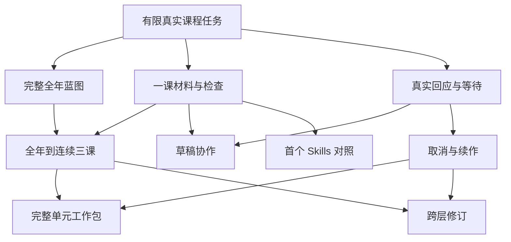

# 实现票的规模、依赖和交付边界复核

日期：2026-09-15。复核对象为最初 14 张实现票；原身份、内容指纹与依赖保存在 [复核前快照](ticket-baseline-20260915.json)。当前可执行内容见 [路线与任务](README.md)，教学目标及行为仍以 [规格](spec.md) 为准。此次没有运行模型、调用外部服务或实施产品代码。

## 结论

上一版的教学范围基本完整，但颗粒度不均：部分是一个可实现行为，部分已接近能力交付工作包。仅检查依赖无环不足以证明可以执行。主要问题是首票和材料票承担过多首次建设，观察与评价绑定、真实输入与生成能力混淆，以及部署包、实际部署和质量通过的完成口径不一致。

调整为 **22 个有稳定身份的工作项，其中 16 个具有可执行边界，6 个仍需前置实物出现后收口**。增加的是原来混在一起的交付边界，未新增教学功能、模型阶段或用户场景。原 14 个文件保留身份和历史，新增票顺延编号；因此编号不再保证拓扑顺序，明确依赖和本次排序才是执行依据。已有链接不因排程调整而失效。

不宜再把所有远端工作提前标为 `ready-for-agent`。完整单元、目标 IM 对照、实际部署、四能力正式对照、评阅后修订和跨版本升级，需要各自真实输入才能确定规模；先保留完整要求与明确的转就绪条件，不以虚假工期或无限大小的“普通票”掩盖未知。

## 如何判断规模

以一次独立开发上下文能否理解、实现、验证并说明一个完整行为为尺度，不按字数、checkbox 数或预想代码行数评分。当前没有生产代码和首条运行耗时，不能给出可靠天数或固定工期。

| 维度 | 具体判断 |
| --- | --- |
| 新增机制 | 是否同时首次建设知识、模型适配、存储、渲染、交互、评价等多个不同机制；框架已有并不代表本项目交接已经可用 |
| 状态与副作用 | 涉及几个必须共同成立的一致性边界，错误能否在该票自己的接口上被发现 |
| 教学不确定性 | 只是把已分析规则接入，还是必须依据真实材料决定课程范围、评价尺度或大量修订 |
| 验收输入 | 能否取得实际任务、原课、模型、服务或回应；真实人类与目标环境是外部条件，不是另一张代码票 |
| 可独立展示 | 完成后能否通过公开任务入口展示有用结果；纯数据库／Prompt／工具列表不足以作为教学切片 |
| 拆分代价 | 拆开是否迫使下游重写共享源、复制渲染器，或产生没有验证却可交付的学生材料 |

M 表示在已稳定交接上完成一个有限行为；L 表示有一个显著新机制或耦合的质量风险，须明确限制范围；XL 表示至少有多个独立交付或规模依赖未来内容，应拆分或作为待收口工作包。M/L 表示边界清楚但教学验证工作仍可能偏大。它们是风险判断，不是工时承诺。

不应再拆的例子：CFU 的构建与两道验证共同决定题目能否交付；适配各支持材料共同决定目标是否保持；跨层修订的影响分析、实际修改与重查共同决定修订是否有效。把这些拆成先输出、以后补质量，会违背既定路线。

## 原 14 票逐项分析

| 原票 | 原规模与主要问题 | 本次处理及保留的完整行为 |
| --- | --- | --- |
| 01 全年蓝图任务 | XL；从零接服务、真实 Gemini／原生循环、知识语义、持久内容，同时要求完整全年设计。失败后很难判断是运行未通还是全年质量失败 | [首条课程任务](issues/01-live-curriculum-task.md) 保留一个真实有限课段设计与最小内容／任务契约；[全年蓝图](issues/15-full-year-blueprint.md) 承担完整年级覆盖。都仍是输入到内容的垂直交付 |
| 02 真实回应恢复 | L；教学回应语义与事件提交相互耦合，有必要同票；系统性崩溃矩阵与原 05 重复 | [回应票](issues/02-human-decision-and-resume.md) 保留展示、真实原文、采纳事务与受控等待重启；[故障恢复](issues/18-crash-reconciliation.md) 承担自动核对和系统性故障验收。持久事务不能被延后删除 |
| 03 连续三课材料 | XL；单课内容／师生渲染、草稿交互、三课连续性是三项可独立验证的工作，并非三倍写作量 | 拆为 [一课直接生成](issues/03-continuous-lessons-and-materials.md)、[草稿审阅](issues/16-lesson-draft-review.md)、[全年到三课](issues/17-curriculum-lesson-handoff.md)。直接授权路径可先完成，最终创建流程仍包含草稿协作 |
| 04 观察与回归 | L；上传关联、发送故障与离线评价执行器可独立交付。云端服务不应成为教学评价的单点前置 | [观察票](issues/04-tracing-and-quality-regressions.md) 收敛为实际 trace 与故障解耦；回归／对照由 [创建对照](issues/11-skills-comparison.md) 先落地 |
| 05 取消触限与崩溃 | XL；主动生命周期操作与未知故障后的自动核对不同，原票又重复 02 的故障窗口 | [取消续作](issues/05-stop-cancel-and-recovery.md) 交付主动停止和迟到结果抑制；[故障恢复](issues/18-crash-reconciliation.md) 在其上检验持久业务动作的一致性 |
| 06 完整单元 | XL；不仅实现增量展开，还要求大量真实材料质量，现有三课尚不足以估计剩余错误与机制 | 保留 [完整单元工作包](issues/06-complete-linear-functions-unit.md)，改为 `needs-triage`。补停止／续作依赖；实际三课出现后固定范围和验收工作，必要时再按可独立审阅的范围拆分 |
| 07 跨层修订 | L；依赖影响、版本提交与重查不可拆成不闭合的三票，但验证范围可以限制 | [修订票](issues/07-scoped-curriculum-revision.md) 保留连续课时与父级蓝图上的一次结构修改及局部支持对照；依赖实际跨课关系和取消提交保护，不等完整单元或所有生产故障 |
| 08 教学适配 | L；看起来输出多，但共同目标、原题、支持及整套接受必须一起验证 | [适配票](issues/08-lesson-adaptation.md) 限一节实际课及本次支持／拓展，保留全套一致性；显式依赖材料和回应，任意核心题目变体不偷偷加入首版 |
| 09 教师备课 | M/L；主要未知是教师贡献及信息顺序，无需首次建设学生材料渲染 | [备课票](issues/09-teacher-preparation.md) 移除教案生成器依赖。首票的规范化实际内容读取＋回应机制已足够；外部真实原课可用，不凭空生成一课冒充来源 |
| 10 理解度检查 | L；双重验证是该能力的定义，不是可选增强。原依赖把全部三课当共享工具的包装 | [CFU 票](issues/10-check-for-understanding.md) 只依赖单课票实际提供的材料机制与回应；不依赖全年或三课。完整两道验证保留在同票，避免做一个无检查的中间产品 |
| 11 四项 Skills 对照 | XL；四种流程与资源，加上首次比较执行器建设，反馈被推到其他能力全部完成后 | [创建对照](issues/11-skills-comparison.md) 提前，只覆盖已有直接生成路径；[四能力对照](issues/19-four-capability-comparison.md) 汇总扩展，待实际质量与方差出现后收口 |
| 12 冻结、IM 比较、B | L 且完成条件含糊；“有评阅才生成 B，否则只有评阅包”让同一张票有两种完成标准 | [冻结及首轮评阅](issues/12-frozen-unit-comparison.md) 必须有实际首轮意见；[B 修订](issues/20-comparison-driven-revision.md) 在意见出现后执行。允许明示模型首轮，人工门槛仍独立 |
| 13 生产运行包 | XL；持久部署、动态权限、跨版本、备份与负载混在一起；原票还验收了无依赖的公共基线行为 | 分为 [实际部署恢复](issues/13-production-runtime-package.md)、[撤权与受众隔离](issues/21-access-revocation.md)、[旧任务升级](issues/22-waiting-task-upgrade.md)。公共基线条件采纳归修订；仅交付部署包不能关闭实际部署票 |
| 14 后端五能力接入 | M，前提是各能力已经从服务外测试；否则最后首次接入会成为大返工票 | [消费者汇总](issues/14-backend-integration.md) 保留五能力契约验收，移除完整单元内容与生产宿主依赖；服务外调用示例从首票持续维护。最终发布仍同时受内容和生产门槛约束 |

## 哪些依赖是真的

每条硬依赖必须说明“没有上游的什么结果，下游哪项验收无法成立”。不能仅因为同属课程、图形或质量领域就加边。

| 交接 | 上游实际提供 | 依赖性质与处理 |
| --- | --- | --- |
| 首条任务→全年、单课、回应、观察 | 真实模型／工具循环、任务身份、不可变内容引用／读取、检查记录与可信访问边界 | 真正的首次实现依赖；首票是高扇出接口风险，需要限制变化，不因高扇出把它扩大成通用平台 |
| 全年＋一课生成→连续三课 | 实际完整全年与单元 Context；可生成、渲染和检查一课的能力 | 真正的内容和行为依赖；不能用 mock 上层内容宣称交接成功 |
| 回应＋单课→草稿、适配、CFU | 真实待答／采纳机制；实际材料和检查引用 | 真依赖，但不需要全年或连续三课完成。适配、CFU 仍按自己的教学语义接入 |
| 回应→prep | 原始内容读取由首票提供，回应票提供真正等待和贡献保存 | 移除生成器边。读取真实原课与自行生成原课不是一回事；任意格式导入也不应成为隐藏依赖 |
| 单课→首个 Skills 对照 | 已实现的直接生成路径与原规则取用、真实材料 | 真依赖；LangSmith 不是执行所必需，四项全齐只阻塞汇总比较，不阻塞起步 |
| 连续三课＋主动停止→跨层修改 | 实际跨课关系；旧提交失效及串行继续机制 | 真依赖；完整单元、备份恢复及云端观察可后续复验，不阻塞有限修订 |
| 连续三课＋续作→完整单元 | 可用的课段交接；较长工作保存并继续 | 补齐原漏边。完整单元不是把三课复制若干次，还需据真实结果收口范围 |
| 取消／续作→自动故障恢复→持久部署 | 既定动作和停止语义；故障后核对行为；真实应用运行包 | 每级验收的新增边界清楚；不能把 dev 重启当持久部署验证 |
| 完整 A＋离线评价→匿名首轮 | 完整原创和质量／资源范围；独立评阅入口与结果契约 | 真依赖；不用创建 rubric 评价课程。单独的局部支持测试或云 trace 不决定能否开始比较 |
| 匿名首轮＋修订能力→B | 有来源的实际意见；版本化修改与重查 | 原来隐藏在一个票里的真依赖；没有意见不能拿“准备好了”代替 B |
| 五能力行为→消费者汇总 | 各入口的真实结果、交互和操作 | 真依赖；完整单元质量、目标生产环境是发布合取条件，不是消费者示例的编写前置 |

**基本保障从第一票开始。** 删除部署或撤权票的前置关系，不允许先实现一个无鉴权、无来源或允许坏引用交付的服务；后续票扩展的是验证面和动态情形。每项新能力也必须带自己的质量检查，不能把质量全部外包给后置对照。

**参考比较还有数据隔离依赖。** 提前做 Skills 对照不能间接提前读取目标 IM。完整原创 A 冻结前，只运行不会引入目标 IM 材料、且参考要求完整可复现的案例；确实需要目标 IM 的案例延期，不能弱化参考要求或把对照输出回灌原创。参考执行环境、原创建环境和评阅输入保持各自范围。

## 硬依赖不等于排程，也不等于发布

首个教学价值里程碑仍是 **全年蓝图→连续课时→实际材料**，同时取得必要 HITL、检查和恢复证据。首票先用有限课程任务验证真实执行，是工程边界收缩，不将全年课程设计改成后置目标。

图只展示主线和早期反馈，其他能力／运行分支以路线表和票内边为准。适配、prep、CFU 技术上能开始时，仍按主线价值与可用人手选择顺序；没有必要为了让所有分支“看起来并行”同时改同一运行内核。

共享部分容易产生协作冲突：首票的任务／内容契约、回应采纳事务、共同材料源和评价记录。先让提供方给出可运行的交接与行为测试，再让消费者复用；可以并行准备能力规则和用例，但不能把这种准备称为依赖已满足。此处没有授权或启动新的并行 agent。

发布是多条证据的合取：完整范围内容与修订、四能力比较和人工校准、受众／权限、实际持久部署和升级、观察故障隔离、消费者契约及目标学校使用条件。任一代码票完成都不能替代全部。真人回应、专家评阅、部署许可／宿主和后继版本分别是显式外部输入，不制造一张虚假的“环境已就绪”代码票。

## 本次修订的保守边界

- 没有用假定天数或模型调用上限给票定额；代码复杂度、模型等待、内容修订和专家等待分别记录。
- 没有为未来所有学段、格式、变体和迁移预先细拆。六个远端工作包在前置结果到达时收口，不能直接以 `needs-triage` 票开始无边界实施。
- 没有把三课／一课的通过扩大为完整单元，也没有把冻结原稿、模型初评或可部署包写成质量／生产通过。
- 原来的教学要求继续由原票或明确的新承接票负责。任务序号只是身份；基于验收前提求出的依赖图优先于数字顺序。

## 验证

复核前图有 14 个工作项、25 条直接依赖，最长依赖链含 5 项；这些数字不能说明工期或拆分质量。修订后检查本地链接、票身份唯一、依赖目标存在、无环、路线索引完整和转就绪条件，并核对需求转移与验证责任。票数变多或图更深只是边界显式化，不作为“更高效”的证据。

实际检查结果见 [依赖与文档校验记录](ticket-audit-validation.json)：22 项、38 条直接边、最长链含 6 项，无环、无传递冗余边。16 项边界明确、6 项有明确 Ready condition，当前只有首票处于无前置的就绪边界。本次检查证明文档与依赖结构一致，不证明开发工期或教学质量。
