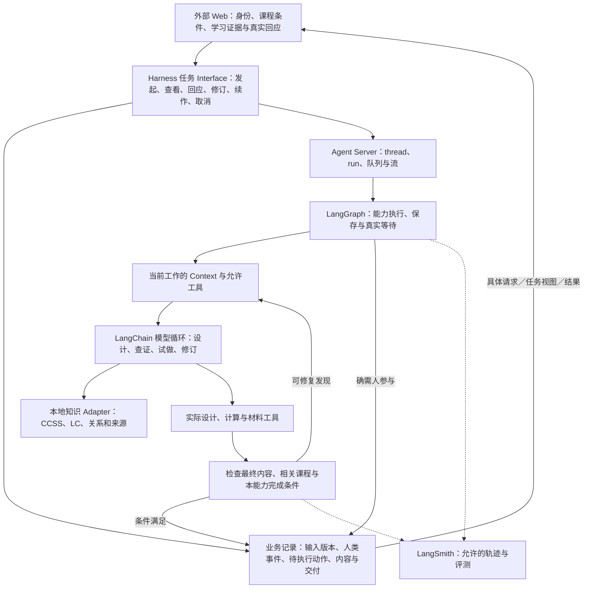

# 数学课程与教学设计 Harness：架构与可行性结论

日期：2026-09-15。权威采用记录：[总体架构决定](../issues/06-architecture-conclusion.md)。本页是规格交接入口，详细决定和证据沿下文读取；目标与协作原则仍由 [README](../../../README.md) 定义。

**采用数学优先、任务级调用、能力流程内模型循环的 Harness。** 以 LangChain／LangGraph／Agent Server 承载执行，用 LangSmith 观察和评价；本仓库重点实现实际 Context、课程与材料内容、各能力 HITL、检查修订及可靠交付。已有源码、官方研究与有限实验足以支持进入规格。尚未证明教学质量达到 Skills，也未取得生产部署保证。

## 为什么这套职责划分成立

**当前实施阶段调整（2026-09-15）：**先按 [文件化内容格式](../../math-harness-delivery/content-system-design.md) 完成教学内容闭环。采用 JSON 当前稿、Markdown／LaTeX 正文与独立图件；暂不上数据库、不做内容历史、不再参考外部 authoring。原完整存储、任务运行及恢复目标保留，但不再全部作为初始内容切片的前置；当前指纹不提供历史正文回取。采用记录见 [总体决定的补充](../issues/06-architecture-conclusion.md#2026-09-15用户收缩当前存储阶段)。

Skills 提供了有价值的教学工作规范，但没有替外部 Web 产品实现可信事件输入、长期任务、内容版本、隔离 Context、持久恢复和有依据的交付。新增课程体系设计还要维护全年目标、单元进程、实际课时与评测的双向联系。因此 Harness 是本产品目标所需的执行能力；它不意味着从零自建模型框架、通用任务服务、学习者建模或学校治理。

LLM 的主要工作仍是理解需求、数学推理、课程设计、任务创作、试做、比较和修订。程序保证真实数据与事件、可见范围、版本、运行预算和交付条件。强模型不能替代这些实际事实；程序也不能靠状态字段证明数学教学成立。不同能力按自己的教学流程和参与目的执行，不压成统一批准流水线。

上游 Skills 的完整流程与参考继续作为既有四项能力的设计起点和比较基线。没有证据证明另一套机制整体更好，因此不删除它们；独立课程结构和条件性取用已有明确理由。IM 的具体课程用于原创冻结后的内容对照，本地 CCSS／LC／学习联系用于设计依据，三者作用保持清楚。

## 采用的运行结构

图表达责任，不规定每框一个节点、服务或模型。首版单任务串行推进，有关课时可在同任务内调用各自能力；不建按 Grade／Unit／Lesson 自治的 Agent 群。一个持续教学任务对应一个 Server thread，暂停后的续作可跨多个 run；教学状态由业务事实和实际运行共同形成。

采用“持久接收原话→解释并采纳动作→可靠调度续作”。调用方可以查询每段事实；保存成功后不因服务故障让教师重答。业务待执行记录负责与 Server 调度交接，队列仍复用 Server；外部文件、事件和 checkpoint 不会自动组成事务，需稳定操作身份、核对已有结果和条件提交。

首版对取消先阻止旧动作产生当前交付，再请求停止在途执行。新事件改意保留原话和对象，不与重复投递混淆。跨任务对同一课程的候选各自保留，唯一权威采用记录以预期基线做原子比较；最终学校采用和发布由外部系统完成。

详见 [调用约定与实际示例](main-execution-design.md#调用方需要知道什么)、[运行专项](langgraph-agent-server-research.md)和[持久探针的限制](cfu-durable-prototype-results.md)。

## 教学内容如何可靠形成

| 核心选择 | 实现要求和依据 |
| --- | --- |
| 全年与单元分别设计、实际版本交接 | 年级完整 CCSS 目标与学校条件→目标分配和 Narrative→关键任务试做→单元课段、实际课时／材料／评测→全范围回查。下层发现带实际对象回修上层，代表任务不能代替完整单元。见 [课程能力决定](../issues/12-curriculum-design.md) |
| Context 是运行资源 | 装配本能力实际规则、当前课程与题面、相关图依据、学习条件、已采纳决定和检查发现；资源与来源有版本，恢复回取精确内容。产品模型不自动取得开发对话和研究文件。见 [Context 设计](context-and-llm-design.md) |
| 保留模型自主工作 | 默认在有界循环内使用模型推理与工具，必要时修复、换任务或回修进程。只有真实参与、信息隔离、保存及交付需要程序边界；更多控制须有增益证据。见 [执行决定](../issues/03-execution-structure.md) |
| 知识消费保持语义 | 本地 browse 的适用查询子集，固定 CCSS，保留 LC、方向、来源和完整范围。支持联系不变成固定课程顺序，外部学习者事实不从 KG 或模型常识伪造。见 [知识使用约定](../../../docs/references/knowledge-consumption-contract.md) |
| 五项能力自己的 HITL | 课程授权外取舍、所选草稿路径、适配整套接受、prep 教师亲做和 CFU 焦点分别处理。已有有效决定直接用，省去重复问题；有意义的贡献不被批准按钮替代。见 [人类参与决定](../issues/07-hitl-protocol.md) |
| 先存实际内容，再形成材料并检查 | 共享题面、师生分面及可修订源；计算、原样学生材料、解释和最终渲染分别检查。发现可返回模型，误报可核实，失败保留。见 [模型、知识与产物实现选择](model-knowledge-artifact-design.md) |
| 完成始终带范围和证据 | 蓝图、三课、完整单元、正常协作与短时备课分别声明；运行成功、材料可读、检查通过、人类接受和外部发布各有条件。见 [验证路线](validation-and-release-route.md) |

学生独立读题不能从教师答案、整个 thread 历史或缓存拿到额外信息；学生页本身的泄题内容仍要原样检查。CFU 的验证资源开放时点保留自身目的，不推广为其他能力的统一限制。

数学是首个学科。既有学科与数学内部差异研究按需引用；不能用八年级函数任务证明低年级几何、口述／操作任务或其他学科已覆盖。差异较大的规则和材料实现保持独立，不预抽取跨学科统一教学法。

## 技术选用及部署条件

当前主模型为已实测的 Gemini，经 LangChain Adapter 接入；原生 `create_agent` 与 LangGraph 的必要持久边界作为实施起点。Claude、OpenAI 和开放权重模型已有接入路径的条件性评估，实际模型、工具和质量分开验证；首版不做自动多模型路由，也不将现有两份分离探针当成已合并系统。[模型取舍及官方依据](model-knowledge-artifact-design.md#模型调用及三类接入)

生产运行方向为 Agent Server，优先沿自有 Web 后端部署环境评估 Standalone；官方要求的许可、PostgreSQL、Redis 和持续运行条件必须在生产环境搭建前核实。当前仅验证 dev，未据此确定生产镜像、容量、SLA 或许可资格。若目标环境不满足条件，回到本决定明确调整部署方式，不能临时把开发进程作为生产替代。[官方研究与条件](langgraph-agent-server-research.md#并发部署与版本)

业务记录可与运行状态共用数据库基础设施，保持独立应用表；实际材料需要可回读的持久存储、版本和清单，不能只保留 worker 临时路径。可配置的资源上限、累计消耗、行为版本和旧规则恢复路径要实际执行；默认同步保存重要工作作为正确性起点，后续用性能证据决定是否调整。预算优化后置，遵循 [先质量、记录消耗、再逐项优化](validation-and-release-route.md#质量与消耗的推进顺序)；不以未经校准的调用额度限制必要教学工作，也不把成本专项设为首版前置。

LangSmith 用于观察和评测，已有用户 Key 配置，真实平台接入未测。先用合成样本核对服务和关联，再按外部产品的数据范围发送；业务恢复不依赖 trace。模型／工具耗时与教师等待时间分开，成本以实际可取得的使用量为据。更新部署前核对已有等待任务能否按原行为继续，删除节点或改变中断顺序不能只靠记录版本号解决。[LangSmith 研究](langsmith-observability-evaluation-research.md)

## 进入规格后的实施顺序

1. **贯通课程与课时的最小真实切片。** 采用实际全年蓝图向线性函数连续课时交接；将 Gemini、原生循环、具体运行资源、本地知识、材料／检查和一次有教学目的的真实等待放到同一服务中。先补目前两个探针未合并的缺口，不从独立 CFU 小应用重新定义全仓库范围。
2. **扩大到完整单元并完成跨层修订。** 覆盖约定目标、课段、全部实际课时／材料与评测；修复原实验中的表征、时间和无依据效果声明。作用于单班的支持变化另有对象范围。全单元通过相应检查后才作完整范围声明。
3. **完成其余教学能力的独立流程。** 适配、prep、CFU 复用运行承载，各自装配规则、HITL 与检查；按真实流程验收。课程与课时能力先行，不要求完成整年全部材料后才可推进其他能力。
4. **对照与生产接入沿相应门槛推进。** 原创全单元冻结后比较 IM，四项既有能力按固定 Skills 条件比较；服务的许可／持久化／恢复／权限在产品接入前通过。观察和回归评测随切片建设，不等产品做完再补。

这四项是交付顺序，不是固定 sprint。2026-09-15 已交接为 [五项能力的实施规格](../../math-harness-delivery/spec.md) 和 [有依赖的实现票](../../math-harness-delivery/README.md)，实际实施尚未开始。各能力、资源、调用、提交、检查和验收按规格落实；本页概要和候选示例不替代详细原流程或正式接口。

## 本轮收敛范围

Wayfinder 的架构问题已形成采用结论，必要的有限验证及未通过项均有证据入口。没有合作学校试用、完整单元质量、Skills 非劣比较、IM 匿名比较或生产恢复的通过记录；这些是明确的实施和验收工作，不再作为含糊“继续研究”的理由。

新增控制、资源截减或路线变化仍按 README 检查：它保障什么教学工作，现有简单机制哪里不足，有何实际证据及代价。当前采用的是有依据的实施起点，不能宣传为已被证明最优或优于 Skills。
