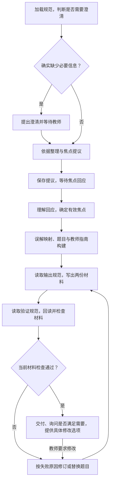

# 上游理解度检查的执行参考

状态：完整保留的理解度检查流程与早期候选分析，是当前设计和效果比较的重要起点；未实现或运行。下文的固定题量、焦点等待和双 HTML 等属于该参考实现；本项目采用决定另行记录，改动需要说明机制并验证教学效果。

当前前提由 [能力范围与推进路线](harness-scope-and-priority.md) 规定，本地知识已可用；历史远程连接假设和待批准的原文字面冲突已撤回。
范围仅为 `k12-check-for-understanding`，上游基线 `281eb8d41fe2837d911541c9bbb870b58add804c`。其他 Skill 分别设计。

本稿是单项深入分析，不定义整个 Harness 的职责，也不决定首项实现顺序。完整职责、四项比较与首项建议见 [四项 Skills 的完整实现需求与首项建议](harness-scope-and-priority.md)。

## 要保留的能力

这项 Skill 根据数学主题或标准，形成 1–3 道有诊断意义的题，以及解释学生回应、给出具体后续教学动作的教师指南。题量、焦点、错误推理与后续教学的关联共同构成能力；生成题目和答案本身不足以满足要求。[主规范][skill]、[数学指导][math]

Harness 按执行需要向所选大语言模型提供上游 SKILL、参考资源、教学上下文和工具结果，并组织模型调用与行动循环。模型据此理解标准、选择检测焦点、设计题目、分析学生可能的推理；Harness 同时承担资源读取、上下文与工作状态、工具执行、HITL、材料产出、检查修订及执行记录。不能因移植而丢掉参考文件里的教学细节。

给定的 Learner Model 相关上下文用于本次焦点建议与题目设计，仍须遵循所选标准、年级范围与教师决定。本 Skill 不采集学习过程证据，不构建或更新 Learner Model。

## 一条具体执行路径

以下是设计走查，教师回应和题目内容均为假设，未执行模型或模拟真实教师确认。

调用方提交“三年级，用数轴检查学生对分数的理解”，附课程范围及已有学习上下文。

1. 加载 SKILL 与 `math.md`。模型判断信息是否足够；只有答案会改变题目时才提出最多一个澄清问题。信息足够则进入依据整理。
2. KG 可用时执行规定检索，整理标准、所有学习组件、前后学习进阶与误解资料。提出一个适合 1–3 题的焦点及理由，例如“在数轴上表示分数”。
3. 将这个提议交给教师并暂停，保存原提议、约束及依据。此时没有题目、学生材料或教师指南。
4. 假设教师回应“先检查单位分数”。采用这个明确改向，重述新焦点及理由；上游不要求再增加一次批准。
5. 无论确认还是改向，模型都先按有效焦点优先选择 3–5 个相关错误模式，区分前置基础与本年级概念混淆；相关检索结果不足 3 个时可用自身知识补足，但不得标为检索得到的记录。再建立“错误模式 → 题干必须包含的特征”映射，设计题目与回应解释。读取 `output.md`，写出学生版与教师版两份 HTML。
6. 确认两份文件已实际存在后，读取 `verification.md`，回读文件并执行其检查。假设一题有两个可辩答案，则修订、重写两份文件、检查变更及受影响内容；仍失败则替换该题。
7. 当前两份文件通过所需检查后，交付并询问是否满足教师需要，同时提出至多两个具体修改选项。若教师要求修改，沿本 Skill 的修订路径继续，重写两份文件后再次询问。

步骤依据：[主规范 S0–S7][skill]、[误解映射与题型要求][math]、[检索次序][kg]、[文件与检查][output]、[verification][verify]。第 4 步在同一标准内改向；若改变标准，重新整理相应依据是候选实现策略，需要另列验证案例。

## 候选执行结构

以下名称只用于讨论本 Skill。每个模型阶段内部可以包含推理与工具调用循环；并非强制把每条 Markdown 指令变成一个节点。

对这项 Skill，可以考虑三种实现方式：

| 方式 | 对本 Skill 的影响 |
| --- | --- |
| 单个 Agent 按规范自由执行 | 最接近原宿主使用方式，但仍需给资源访问、教师等待、文件验证和交付设置程序约束；仅依赖提示词不提供这些运行保证 |
| 将全部教学条款逐条编成流程代码 | 顺序容易表达，但教学条款散落在代码中，上游变化时容易遗漏或偏离；模型的教学判断仍不可省略 |
| 在必要位置设置执行约束，阶段内部仍按原规范使用模型与工具 | 本稿建议的候选：程序明确焦点等待、产物写出、事后验证与交付的先后关系；教学构建继续由原资源指导模型完成 |

选择第三种的理由是：当前最清楚的程序职责来自本 Skill 的硬性顺序要求。其余教学规则先完整保留在模型可使用的规范中，再用本 Skill 的评测验证，而不是提前逐条重写成程序。

图示主路径中的“确定有效焦点”只处理确认或明确改向；含糊回应不能自动当作确认，详见下方 HITL 表。最终节点划分需结合 [LangGraph 运行机制研究][runtime-ticket] 与原型结果。

### 哪些交给模型，哪些由程序保证

| 阶段 | 模型承担的教学判断 | 程序承担的执行约束 |
| --- | --- | --- |
| 信息与依据 | 年级／标准判断、是否需澄清、理解全部候选组件、选择焦点并说明理由 | 加载学科规范；提供连接状态和真实工具结果；记录检索；没有教师焦点回应不进入造题阶段 |
| 教师回应 | 理解自然语言的确认或改向，重述有效焦点 | 将回应关联到实际等待的请求；保存真实输入；不把模型生成的文字登记为教师回应 |
| 构建 | 错误模式与题干映射、数值与表征选择、诊断题设计、回应解释和下一步教学 | 保留此阶段需要的规范与资源；允许必要计算工具；记录焦点和材料的对应关系 |
| 文件产出 | 编写学生题目与教师解释、图形及相应文字描述 | 从同一题目内容生成两份材料；写入并回读真实文件；核对文本和选项顺序一致；保持学生版和教师版各自内容范围 |
| 教学检查 | 逐选项寻找可辩答案；检验指定错误推理能否到达该选项；判断修订 | 两份文件存在后才开放完整验证资源；提供实际文件；执行必要计算；将检查结果关联到被检查的材料版本 |
| 交付与修订 | 用教师语言呈现结果，提出具体修改选项并处理修改要求 | 当前版本通过所需检查才对外提供；修订后旧检查不自动适用于新内容 |

“有一次检索记录”只能证明工具被调用，不能证明模型正确使用了依据；“检查通过”也须有逐题结论与必要计算依据，不能只有模型给出的一个布尔值。教学质量仍由本 Skill 的评分规则与评测案例判断。[评分规则][rubric]

程序阻止的是提前进入造题阶段。焦点提议中的自然语言是否夹带题目、理由是否合理，仍需按本 Skill 检查；不能将“未调用造题节点”写成模型文本绝不越界的保证。

## 这项 Skill 的 HITL

| 实际交互 | 接受什么 | 如何继续 |
| --- | --- | --- |
| 必要信息澄清 | 对影响题目的年级、标准或学科问题的真实回答 | 根据答案整理依据；不能把“一次澄清”扩大为问卷 |
| 焦点提议 | 明确确认，或明确选择另一焦点／多个焦点 | 确认则沿原焦点；改向则采用选择并重述后继续 |
| 焦点回应不明确 | 例如“看情况吧”，尚无法确定教师是否接受提议 | 候选策略：保留原提议、只澄清这次焦点决定，不造题；这不是重新索取年级等事实信息 |
| 交付后的修改 | 针对已交付材料的具体要求 | 按要求修改，重写两份材料，检查变更及受影响内容，再交付并询问修改 |

焦点提议尚无回应时，保存等待状态并结束本次后台计算；教师以后再回应时继续。这不要求某个进程或模型会话一直占用资源。官方文档支持以持久化 checkpointer、相同 `thread_id` 和 `Command(resume=...)` 承载该行为；具体版本和存储后端仍需原型验证。[运行机制研究][runtime]

调用方最初附带的主题偏好可用于形成提议，但当前主路径仍保留上游 S3 的焦点提议与教师回应。能否使用外部已发生的同一次焦点确认，属于单独的接口适配问题，不能因普通上下文充足就跳过 S3。

重复或迟到的提交需要能识别它针对哪个请求；这一检查由运行机制承担。回应是否改变教学焦点由本 Skill 判断。上游未规定取消与等待超时的详细行为；后端需提供操作上的中止能力，但不能记录为教师确认或本 Skill 已达成教学目标。

## 保留执行能力需要的资源安排

### LangGraph 研究对实现的约束

官方资料核查给出了以下候选实现依据，详细出处与保证范围见 [研究报告][runtime]：

- **先保存提议，再单独等待。** `interrupt` 恢复会从所在节点入口重跑，因此生成提议的模型调用应在之前完成并保存；等待节点读取那份提议，避免教师回应后重新选焦点。
- **保存生成结果，再尝试写文件。** 已完成的 task 结果可以在恢复时复用，未完成的操作仍可能重跑。两份文件需要可重复执行而不产生混乱的写入与恢复核对，不能仅凭 checkpoint 假定写入只发生一次。
- **用当前材料清单进入验证。** 清单关联同一修订的两份文件与内容摘要。验证前确认实存与内容一致，再开放完整验证资源；交付时核对当前版本已有相应检查结果。
- **区分教学内容和图的运行记录。** 持久化 checkpointer 保存图状态；文件可用性、资源访问与旧运行的规范／代码兼容由 Harness 处理。`durability="sync"` 可作为原型起点，但不提供文件与 checkpoint 的联合事务。

这是本 Skill 的实现候选，尚未选定具体存储后端或锁定依赖版本。

### 规范与上下文

按上游阶段提供资源：开始加载 SKILL 与数学指导；KG 可用时加载检索指导；写材料前加载输出规范；两份文件写出后才加载完整验证规范。SKILL 本身含验证阶段的说明，保留该说明；“延迟加载”指完整的 `verification.md`，不是删改主规范。

需要按阶段约束可读取的资源，而不只是让模型自觉忽略提前可见的文件。不要把所有参考文件在起始提示中一次性展开。既有对话也需区分教师交流和内部工作记录，防止后台工具输出进入教师可见消息。这些是保持上游顺序与呈现要求的候选做法。[S0、S5、S6 和教师语言约束][skill]

阶段之间应保存足以继续工作的教学内容与简明结论，包含标准、约束、检索资料、确认焦点、错误映射、题目和修订理由。不能因为换一次模型调用就丢掉这些内容；也不需要采集模型不可见的内部思维链。

### 工具与文件

KG 可用性按本 Skill 需要的标准、全部学习组件、双向进阶和误解能力判断，不能从一个连接器图标或标准工具推定全链可用。可用时必须实际执行规定检索；未连接时使用上游的标准知识分支。部分工具缺失、权限不足和请求失败分别记录，不能伪装成未连接或成功空结果。文件写入／读取及必要计算能力也由后端提供；工具形态可以适配，上游要求的工作仍须完成。

两份 HTML 复用相同题目内容和图形，分别装配学生材料及教师说明。文件内容可按版本保存在内部产物空间，教师只取得当前通过检查的版本；内部存储方式与对外文件名分开处理。这样保留上游“两份文件先写出，再检查，教师首次看到的是修正后版本”的行为，同时能关联检查与实际内容。[输出规范][output]、[验证规范][verify]

**图形的文字说明同样是学生材料。** 上游 Figures 要求 `<title>` 与 `<desc>` 按年级语言说明实际图示，同时保留题目要求学生完成的数学工作。即使未直接写出答案，提前说出所问的数量、位置、身份或比较结果也可能泄题；描述不得增添图中不存在的比较信息。因此检查不能只看 SVG 是否带有无障碍属性，还要判断仅凭说明作答时是否仍需完成原任务。[输出规范 Figures][output] L35–57。

产物空间由后端始终提供是本候选方案的运行前提，因此正常调用不进入“没有 `$OUTPUT_DIR` 时内联输出”的宿主退路。若未来要支持这条退路，需单独定义其文件检查方式，不把未经文件回读的文本冒充通过 S6。

### 验证与执行记录

单选题的 Gate A 检查可辩答案唯一性；Gate B 检查实际数值下的错误推理是否能到达指定选项。主观题的 Gate B 检查教师指南列出的回答类型是否能由该题产生。按题型和规则的适用条件执行，不给主观题强加“唯一选项”。[verification][verify]、[rubric R6][rubric]

多选采用明确的工作解释：逐选项判断题干支持的真／假，完整正确答案集合必须唯一且明确，题面须说明多选。不能要求只有一个正确选项；也不能只验证答案表里列出的选项，忽略其他实际成立的选项。错误选项继续做 Gate B。这一解释保留多选能力，但改变了 Gate A 字面上的单个选项条件，故原始规则与多选适配分别记录，见 [契约工作版](execution-contract-draft.md#来源差异的工作解释)。

验证规范还要求：有子代理能力时，给另一位读题者只看学生材料，独立作答并报告所有可辩选项。后端可将这一能力实现为一次隔离上下文的模型调用；该调用不含答案、教师指南或构建记录。它不能替代需要教师指南的 Gate B，也不能替代整体验证。

Gate A 的逐选项理由按上游要求写入内部临时检查文件；Gate B 的实际数值计算与对应结论也保留为检查证据。它们是可观察的检查产物，不进入交付给教师的两份材料。[verification][verify]

执行记录保存规范版本、上下文引用、工具结果引用、焦点提议与真实回应、材料版本、逐题检查结论和修订关系。来源、教师确认标记与内部检查过程按本 Skill 规定不写进师生材料；外部系统接收执行记录后进行追溯。[呈现要求][output]

## 最小验证案例

以下是尚未执行的验收场景；固定回应仅用于测试，不代表真实教师参与。

| 场景 | 要观察的证据与结果 |
| --- | --- |
| 信息充分、教师尚未回应焦点 | 提议已保存并返回；没有造题调用、产物或虚构的确认记录 |
| 教师在原标准内明确改向 | 保存原话；生成内容使用新焦点；没有额外的强制批准轮次 |
| 教师明确选择多个组件 | 保留其选择并重述理由，仍在一至三题中形成连贯检测；不机械强制“一组件一题”或增加一次批准 |
| 暂停后关闭进程，再恢复 | 恢复同一请求和提议；依据／提议不被无意重新生成；继续到预期步骤 |
| KG 工具未连接 | 走上游无连接分支；仍提出焦点并等待；教师指南有规定的通用依据脚注 |
| KG 已连接但调用报错 | 错误被记录和处理，不能伪装已检索，也不能静默当作“无连接” |
| 只有标准和组件工具、缺少误解或进阶能力 | 记录具体缺项及执行条件，不把部分调用成功计为完整 KG 路径；显式切换路径的机制留给依赖设计 |
| 学习组件返回空 | 从标准的子部分选择焦点，按参考规范说明缺少组件结果，仍给出理由并等待教师确认 |
| 写出第一份文件后失败 | 没有交付，也未开始依赖两份文件的验证；重试能形成一致的一对文件 |
| 构建阶段尝试读取验证文件 | 资源访问被阻止；两份文件存在后，验证阶段可读取完整资源 |
| 单选题出现两个可辩答案 | Gate A 判失败；修订后重新检查；首次交付不包含失败版本 |
| 多选题有两个明确正确选项 | 正确集合与完整题意一致可通过多选适配，不因正确选项多于一个被一律判失败 |
| 多选答案表漏掉一个实际成立的选项 | 例如题目问哪些等于二分之一，列有 2/4、3/6、4/8，却只将前两个记为正确；检查完整集合时失败并修复两份材料 |
| 某错误推理算不出该干扰项 | Gate B 判失败；修正题目或解释并检查受影响内容 |
| 修改已验证题干 | 新材料关联新的检查结果；旧通过记录不被直接复用 |
| 隔离读题调用 | 输入只有学生材料与作答任务，没有答案和教师指南 |
| 产物空间不可用 | 返回执行故障，不交付未经两份实物回读的内联文字 |
| 教师在等待或生成中明确取消 | 停止相关工作；未产生的材料不标成功，取消不记为焦点确认或教学完成 |

流程与恢复案例可用固定模型／工具返回验证；教学诊断能力必须另用真实模型和本 Skill 的 rubric 评测。前者通过不能证明后者达标。

## 尚需验证或解释的部分

- **运行验证**：等待、恢复、重放与外部文件副作用的官方语义已在 [研究报告][runtime] 中核查；实际版本下的恢复与文件一致性仍需 [最小原型][prototype-ticket] 检验。
- **多选题**：上游允许多选，但 Gate A 与部分 rubric 使用唯一可辩答案的表达。候选解释是验证每个选项并比较完整正确答案集合，且每个干扰选项仍有可复算的错误推理；应作为有记录的多选适配规则单独评测。不能把多选能力悄悄删除。
- **修订仍不通过**：上游规定替换题目。替换后持续失败时，运行预算耗尽应返回可说明的执行失败，不能交付失败材料；预算与重试参数尚未决定。
- **能力比较**：需以相同上下文、焦点回应、KG 条件和上游版本比较基准执行与 Harness 执行，分别检查过程与材料。具体模型、样本与接受标准由能力验证议题决定。

[skill]: ../../../k12-teacher-skills/plugin/skills/k12-check-for-understanding/SKILL.md
[math]: ../../../k12-teacher-skills/plugin/skills/k12-check-for-understanding/references/math.md
[kg]: ../../../k12-teacher-skills/plugin/skills/k12-check-for-understanding/references/learning-commons-kg.md
[output]: ../../../k12-teacher-skills/plugin/skills/k12-check-for-understanding/references/output.md
[verify]: ../../../k12-teacher-skills/plugin/skills/k12-check-for-understanding/references/verification.md
[rubric]: ../../../k12-teacher-skills/evals/k12-check-for-understanding/rubrics/math.csv
[runtime-ticket]: ../issues/08-cfu-runtime-research.md
[runtime]: cfu-runtime-research.md
[prototype-ticket]: ../issues/09-cfu-runtime-prototype.md
