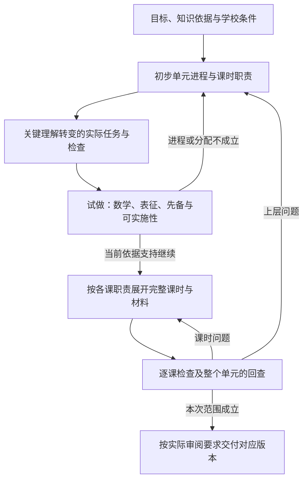

# 数学课程体系设计：IM 参考研究与 Harness 能力候选

研究日期：2026-09-14。依据用户新增目标及 IM 官方免费课程页面。本文记录一手资料观察和设计建议，未运行课程生成、课堂试用或 A/B 评测。

## 目标与前提

用户要求本项目具备**独立设计数学课程体系**的能力。它超出原有四项 Skills 的覆盖范围，需要成为 Harness 的新增核心能力。教案创建可以据此得到课时任务与上下文；课程体系设计本身不能被缩成连续调用教案创建，或生成 Grade / Unit / Section / Lesson 目录。

本项目要能说明：为什么选择这些数学目标，如何拆解与排序，学生通过哪些表征与任务形成理解，如何判断已达到目标，以及变化如何影响后续教学。本阶段明确支持 Grade / Unit / Section / Lesson 四层的设计职责；各层如何组织内容、单元顺序、课时数量和课堂环节不照搬 IM。

Learning Commons 数据已由外部项目本地化，按可用前提设计。本能力消费本地知识与关系、课程材料、教学约束及外部 Learner Model；不研究本地化方法，也不建设学习者模型。实际实体与关系语义见 [本地 Learning Commons 图的教学设计用法](learning-commons-integration.md)，该报告已只读核验真实数据。

## 官方资料中，各层说明承担什么工作

本次沿同一条链核查 **IM v.360 Grade 6 → Unit 4 Dividing Fractions → Section C → Lesson 10**。同时读取课程层的评测说明。这里是 IM 的设计实例，不是本项目必须复制的教学方案。

| 层级与实际栏目 | 官方页面中的具体设计工作 | 对新增能力的启发（本项目推论） |
| --- | --- | --- |
| 年级：Course Guide → Scope and Sequence；其中有 Narrative、Pacing Guide、Dependency Diagram | 说明为何从几何开始，再进入比率等主题；课程依赖箭头表示后续单元依靠前面内容，倒置可能损害数学或教学连贯性。例如 6.2 的比率情境支撑 6.6 的方程表达。[年级范围、顺序与依赖](https://accessim.org/6-8/grade-6/course-guide/scope-and-sequence?a=teacher) | 年级设计要同时交付范围、顺序理由和依赖；目录编号不足以表达依赖，也不能把所有先后顺序都解释为数学必然。 |
| 单元：Unit Narrative | 分数除法承接 3–5 年级的乘除关系、等组与分数；从除法含义推进到算法，再用于测量问题，并说明其对后续小数运算与方程的作用。[Unit 4](https://accessim.org/6-8/grade-6/unit-4?a=teacher&lang=en) | 单元设计须有进入条件、核心理解转变、迁移去向；不能只列标准与练习类型。 |
| 单元内课段：Section Goals、Section Narrative | Section C 把前面分数除法的推理整合为一般算法：先研究单位分数，再研究非单位分数，最后扩展与应用。该课段的目标包含概括方法与求商。[Unit 4 的 Section C](https://accessim.org/6-8/grade-6/unit-4?a=teacher&lang=en) | 课段要解释数个课时共同完成的理解转变，明确每一步为何出现、哪些案例帮助概括。不是把相邻课时机械分组。 |
| 课时：Preparation → Lesson Narrative、Learning Goals、Standards Alignment | Lesson 10 用条形图回顾五年级理解，推进到非单位分数除法；其标准说明区分 Building On 与 Addressing，学习目标包含解释和评价推理。[Lesson 10 准备页](https://accessim.org/6-8/grade-6/unit-4/section-c/lesson-10/preparation?a=teacher) | 单元意图应转成可执行的课时任务、表征与学习证据；“关联某标准”不等于本课必须教完它的所有内容。 |
| 活动：Activity Narrative、Student Task Statement、Activity Synthesis、Lesson Synthesis | Lesson 10 的活动把图示与算式联系起来，教师关注学生何时能从图中概括；总结讨论图示的作用与局限。课堂目标落实为学生实际要完成、解释的任务。[Lesson 10 教学页](https://accessim.org/6-8/grade-6/unit-4/section-c/lesson-10?a=teacher) | 上层 narrative 的主张必须在具体学生任务中兑现。写了“发展推理”而学生页只有机械计算，不构成完成。 |
| 跨层：Course Guide → Assessment Guidance | 说明课前诊断、课时 Cool-down、课段 Checkpoint、单元评测各自的用途；依据可观察的数学表现调整后续教学，形成性结果可引导继续、局部强调或暂停补充。[评测说明](https://accessim.org/6-8/grade-6/course-guide/assessment-guidance?a=teacher) | 课程设计要提前安排证据与后续响应。评测不仅是最后附一套题，也不能由教师确认替代内容与推理检查。 |

这些页面中，Narrative 是解释课程设计的文字，不等于另一份目录。不是每层都只有一个同名栏目：年级材料通过 Course Guide 的范围顺序、依赖和节奏组织说明；目标、标准、评测与活动任务也分别承载必要信息。表中事实只覆盖所读实例，不宣称所有学段均采用完全相同结构。

**研究推论：**值得借鉴的是“目标与先修依据 → 学习进程 → 表征和任务 → 学习证据 → 后续响应”的可解释联系。某个 IM 单元的具体分组、数量、命名和例题位置只是一种实现。可靠的独立体系需要自己建立并检验这些联系。

## IM 在本项目中的使用策略

用户已允许自主取舍 IM 的使用方式。本轮工作路线见 [能力范围与推进路线](harness-scope-and-priority.md#当前采用的-im-参考方式)；以下说明可用方式及研究建议，不表示已运行内容对照。

| 可用方式 | 设计时输入 | 适合验证的问题 |
| --- | --- | --- |
| 独立设计，不采用 IM 结构 | 目标标准、本地知识图谱、学校约束、本项目设计原则；不将 IM 单元树作为生成模板 | 能否独立建立合理范围、依赖、学习进程和材料？ |
| 参考设计思路 | 使用经解释的设计原则，例如表征支撑概括、先修与目标区分、证据驱动调整；不强制 IM 的单元顺序与课堂环节 | 借鉴的原则是否在原创内容中发挥作用，而不是留下形式标签？ |
| 完成后做内容对照 | 先固定自有版本，再选取目标与教学条件相当的 IM 内容，比较差距后提出修改 | 哪些目标覆盖、衔接、任务与评测质量可以改进？ |

**建议先采用独立结构，借鉴可解释的设计原则，再用 IM 做完成后的离线内容对照。**这样可以学习成熟课程的设计工作，同时保持自有课程目标、分组和路径的独立性。参考原则时记录其来源和本项目采用的理由；若某个具体 IM 任务在生成前已作为范例输入，应如实记录，不能把后续对照称为“未接触参考内容的独立比较”。

IM 专属课堂动作、固定时长或材料组织不自动成为本项目产品规则。对上游质量要求，应逐条判断它保障什么数学能力、适用于哪类目标，然后保留、改写或替换。去掉 IM 的实现形式，不代表去掉学生推理、数学正确性、目标对齐与先修适切性这些需由本项目负责的质量要求。

离线 A/B 内容对照需要相同目标范围、教学时间、可用材料和学习者条件，分开比较数学正确性、学习进程、任务质量、评测及可实施性；保存初稿和每次修订理由。内容评分改善只能证明在该评测下的改进，不能推断学生学习效果提升。本文未执行此类对照。

## 新增能力需要执行的工作

以下流程为数学课程体系设计候选，不向其他学科推广；既有 Skills 的 HITL 用于研究教学目的，各项能力按本项目需要分别取舍。它描述教学设计工作，尚未规定 LangGraph 节点或 Agent Server 部署结构。

### 1. 确定本次设计范围和成功条件

读取调用方指定的年级或课程范围、目标标准、课时日历、资源与学校约束，以及适用学习者证据。区分设计整年课程、一个单元，还是修改既有课段。缺少会改变设计的条件时发出有针对性的输入请求；无需重新确认调用方已明确提供的信息。

先形成可检查的设计任务：哪些目标要在本次达到，哪些只提供先修支持，哪些属于后续发展，以及哪些范围本次不承担。年级边界和日历是约束，不能代替数学依赖分析。

### 2. 从本地知识关系建立目标与依赖依据

围绕目标知识获取实际前置、后续及其他有用关系，记录节点、关系类型、方向、来源和选择理由。把“知识图谱提供的关系”与“本次课程设计选择的先后、复习或支架安排”分开保存；不能因为文本相似、同一年级或出现在邻近节点就直接认定为必修先修。

知识依赖约束课程安排，但图谱遍历本身不完成教学设计。还需判断本次任务实际调用哪些知识，学习者已具备哪些条件，未具备的部分如何支持，以及某项后续联系在本课中是否有教学必要。模型推导出的补充联系应标明推断，不能写成图谱原生事实。

例如设计 K–2 几何内容时，应从具体几何目标及其依赖选择观察、比较、组合、表达等任务；是否需要数量运算要由目标与实际依赖证明，不能仅凭低年级标签加上加减故事题。[本地实测](learning-commons-integration.md#k2-几何的本地实测) 已分别核验 1.G.A.1 的图形属性进阶与 2.G.A.2 的数组联系，支持按具体目标判断。

### 3. 设计课程布局与关键学习进程

在目标与依赖依据上形成自有单元或课段安排。需要取舍时比较具体方案，如某条表征路线需要更多课时但降低理解跨度；顺序有充分约束且无实际取舍时，不强制生成多个方案。

每个重要安排应解释：学生由什么理解走向什么理解，为什么此时推进，哪里安排巩固与迁移，哪些内容可以灵活移动，哪些依赖必须保持。课程叙述应描述这些决策，并与目标和依赖相互指向。

### 4. 将上层意图落实为单元、课段与证据设计

为单元明确关键理解、进入条件、完成证据；为课段明确共同完成的理解转变、表征发展、任务推进和复习机会。依目标选择适用数域、问题结构、表示方式和推理要求，并解释覆盖与暂缓的理由。范围可在一个单元内分布，不要求每课塞入全部范围。

同步设计诊断、形成性检查、综合任务和阶段评测的用途：预期看见什么学生表现，不同表现会触发什么后续设计调整。评测应允许区分未理解、表征困难、计算失误等相关情况；不能把名称完整的评测清单当成有效证据设计。

### 5. 生成能交给教案创建的课时设计依据

每个课时至少提供目标、在进程中的作用、必要输入与先修、任务应达成的数学工作、可接受表征、预期证据，以及需要保持的上下文。教案创建据此生成真实任务、教师引导和学生材料，并反馈可实施性或数学问题。

已有四项能力分别接入它们所需的内容：差异化适配使用实际课时及其不可丢失的数学目标；备课使用实际任务、解法与预期学生思考；理解度检查使用目标、课堂情境及所需证据。课程体系设计不预设四项能力一定串行调用。

### 6. 对内容和跨层一致性检查、修复

逐项验证数学内容，再检查课程叙述中的承诺是否在任务、材料和评测中兑现。发现实现困难时允许返回上层调整范围或进程，而不是只改教案措辞。修订完成后重新检查受影响的依赖、覆盖、表征与证据关系。

只有年级/单元蓝图时，完成状态应明确为蓝图完成或可供审阅；不能标为全部课程材料可用。需要交付可教学单元时，必须包含实际课时与材料，并通过该交付范围的检查。

## 课程与课时的双向交接

以下把前述工作展开为能力交接分析；采用范围见 [本票决定](../issues/12-curriculum-design.md#resolution课程设计的能力约定与双向交接2026-09-14)。它规定需要保住的教学信息，不固定 API 字段、提示词、图节点或模型数量。

课程层不能只传“给一年级生成一节几何课”，也不应提前写死每一句教师话语。交接同时说明**必须保持的内容、允许设计的空间和发现问题后的回报方式**。明确的上层决定约束下层；尚待课时试做检验的假设仍标为假设，不伪装成已验证事实。

| 交给课时设计的依据 | 必须保持什么 | 下层可以作什么设计 |
| --- | --- | --- |
| 本次范围及课程位置 | 年级、单元／课段／本课的版本；本课承担的目标、作为基础使用和为后续准备的角色 | 在范围内设计课堂环节与任务组合；独立课时请求不编造整年课程，缺少的上层安排明确为未知 |
| 目标与知识依据 | 实际标准／LC 内容和标识、采用的关系及方向、来源版本、选用理由；图事实与设计推断分开 | 增补有依据的任务所需知识，提出调整；不能把查询到的全部邻居自动列为本课目标 |
| 进程和 Narrative | 本课前学生预期能做什么、本课带来什么理解变化、后续在哪些任务中会使用它 | 选择能实现该变化的例子、问题顺序与表征；前期没有学习证据时，进入条件只是待诊断的课程假设 |
| 数学工作与设计承诺 | 已选定的关键任务、核心表征、必要思考和不可省的学习机会；未选定任务时传递其需满足的要求 | 创作其余实际任务、试做、比较候选、设计支架；已审阅任务不能仅凭主题重新生成并悄悄替换 |
| 学习证据与用途 | 要观察的表现、诊断／形成性／阶段达标等用途、目标与证据对应；计划中的表现不冒充真实学生结果 | 设计实际检查题和回应判据；如果原任务无法区分相关理解，提出可复核反例和修订 |
| 学校与学习者条件 | 有来源的课时预算、器材、班级／个体支持、阅读与表达条件及适用范围 | 调整指导语、支架、材料和活动安排；不能以“个性化”为名暗降目标或写回所有人的课程基线 |
| 人类决定与交付要求 | 决定的对象、版本、内容、授权范围；本次交蓝图、草稿还是可用教学材料 | 沿已有授权执行并提供具体可审阅内容；草稿审阅不自动覆盖未经授权的实质改变 |

下层返回实际课时内容、任务与解法、材料及其版本、目标—任务—证据对应、已做的检查和未决问题。发现问题时必须带回具体对象和反例：例如“这题只要求命名，不能兑现按属性解释的目标”，而不是仅报“质量较低”。

| 下层发现的问题 | 修订责任与返回位置 |
| --- | --- |
| 数值、答案、措辞或材料表达错误，保持原目标和进程即可修复 | 在课时／材料内修复并重查关联内容；不重写上层课程 |
| 本课无法承担已分配目标，或所需知识在本进程中没有学习机会／明确已学依据 | 返回课段／单元，带回失败任务、依赖和可行调整；不能偷偷删除目标后交付 |
| 目标、课时、资源等要求无法同时满足，且调整超出本次授权 | 呈现有真实任务支撑的方案及代价，请课程负责人或教师决定；保留当前可用版本 |
| 只有特定学习者需要支持 | 形成适用对象明确的调整，并检查目标是否仍成立；若发现普遍的课程问题，另提课程基线修订 |

### 先试做关键任务，再展开整个单元

四层设计职责不等于必须一次从上到下生成完毕。候选流程在形成初步学习进程后，优先将最影响可行性的理解转变落实成代表任务和学习检查，实际求解并检查表征、所需先备和工作量；据此回修单元和课段，再扩展其余课时。已具体到课时的工作仍沿用 [数学教案详细流程](lesson-creation-execution-design.md) 中的知识依据、真实任务、草稿延续、材料和修订机制。

代表任务的通过只支持继续展开，不能代表整个单元通过。最终仍检查全部承诺目标及实际材料。该循环是新增课程能力的候选执行方法，不宣称上游已经包含它，也不把图中每格固定为一次模型调用；失败后的预算和停止规则由执行结构票确定。

### 与四项既有能力分别衔接

| 能力 | 从课程／课时中取得什么 | 保留的独立教学工作与边界 |
| --- | --- | --- |
| 课时与材料设计 | 上述课时依据，以及已有真实草稿与决定（若有） | 生成并求解真实任务，延续草稿内容，组织同源材料、检查和修订。新课所需的支持可在创建时完成，不必先创建再自动调用适配。依据：[原 Skill 的路由、构建与输出](../../../k12-teacher-skills/plugin/skills/k12-lesson-plan-creation/SKILL.md) |
| 教学适配 | 实际原课和学生材料、必须保持的目标与核心任务、适用学习证据及课时条件 | 分析原任务怎样改变支持、入口和拓展，并说明重分组的证据；不能只有单元摘要或学生标签。原 Skill 的共同任务、草稿及满意条件分别保留为参考。依据：[适配详细流程](execution-contract-draft.md#已有课时的差异化教学适配) |
| 教师备课 | 实际原题、解法／表征、原课自有阶段及已有支持的位置、教师的真实尝试和已讨论内容 | 模型先试做，教师亲做与讨论有自己的呈现顺序；便签吸收真实贡献。发现课程问题可提出修订发现，不在备课中自动重排或改写课程。不能用“材料已审批”代替教师的教学理解工作。依据：[备课详细流程](execution-contract-draft.md#备课) |
| 理解度检查 | 本次目标、已知课程位置、候选组件及其约束与衔接、已选择的检查焦点及真实决定、预期要区分的表现 | 确定焦点、建立错误与题目条件的联系、生成后读取实际产物验证；隔离读题不能先获得答案。可按主题／标准独立启动，不强制先有完整教案；课程已批准不等于本次焦点已由教师选择，也不强制一组件一题。依据：[CFU 详细流程](cfu-execution-design.md) |

这些能力可以按教学任务分别调用；课程体系设计不要求一次运行依次完成四项。共用同一份课时内容和来源版本，不代表共用交互步骤、输出数量或结束条件。原规范中的全标准覆盖、固定分组和满意条件是否采用，分别在各能力执行及评测决定中说明；本表没有借交接之名统一它们。

已有一项由本项目课程分配原则确定的差异需要明确保留：上游 [数学适配 R2](../../../k12-teacher-skills/plugin/skills/k12-lesson-differentiation/references/math.md) 要各层保留原标准全部要素，本项目按所声明课程范围分配覆盖。因此交接须同时给出完整标准、本课承担的目标／难点及其余目标的承载位置；适配不能降低本课目标，也不能擅自补教全部标准。对照时分别报告原条款和本项目的目标保持检查，不能把改变覆盖单位写成逐字复刻。原 Skill 允许改数字与共享题面保持一致之间的冲突，仍保留在 [数学适配的 KG 与明确解释](execution-contract-draft.md#数学适配的-kg-与明确解释)，本票不据此选定所有变体行为。

## 各层怎样承担可检查的设计责任

以下为本项目候选约定。Narrative 与目标、任务、证据关联一起形成，不在材料完成后另写一篇无法核对的说明。

四层承担目标组织责任，不表示全部教学内容都必须装进这棵树。实际活动、累计练习、评测、资源和跨课引用还需保留自己的用途。新增资料的来源核查见 [IM 方法论补强](im-design-methodology-transfer.md) 与 [知识研究补核](learning-commons-integration.md#新参考带来的补核与固化2026-09-14)；不据来源网页结构固定本项目的数据模型。

| 层级 | 必须作出的设计决定 | 下层落实后回查什么 |
| --- | --- | --- |
| Grade | 选定范围的目标完整性、年内时间分配、单元衔接及前后年级的连接 | 单元是否实际承载已承诺的目标；课时总量是否可行；跨单元复习与后续调用能否找到依据 |
| Unit | 核心理解、进入条件、关键学习进程、迁移及结束证据 | 课段是否共同实现这一进程；评测是否检验核心目标；主要进程是否依靠本单元未安排且未声明已学的知识 |
| Section | 若干课时共同完成的理解转变、表征发展、关键案例与检查位置 | 相邻课时是否有实际联系；选择的案例是否足以支持概括；必要的支架是否有承载位置 |
| Lesson | 本课的教学目标与课程角色、学生数学工作、引导和可观察证据 | 实际题目、图形、解法与学生材料是否兑现目标；本课的输出是否满足后续任务的实际需要 |

标准覆盖与学习质量分开检查。目标关联到一个课时，只说明有一条设计声明；还需读取实际任务和证据，判断学生是否有机会学会、解释和应用。诊断允许检查尚未掌握的内容；阶段达标评测则要核对相应学习机会或明确的已学前提，不能把两者混为“未教先测”。

### 新方法论资料补充的设计检查

以下据 [IM 方法论转用报告](im-design-methodology-transfer.md) 进入当前设计分析，具体执行方式和验收仍由对应决策收敛：

- **活动目的与学生工作。** 说明活动是在引入概念、建立表征、概括方法、练习还是应用，核对实际教学动作是否完成其目的；这些用途不必成为封闭枚举，更不意味着每类活动固定一种流程。
- **表征语义及前后使用。** 保存单位整体、图中对象和符号对应、已引入的含义及后续复用。变更表征时检查实际数学含义和学习跨度，不只检查图形类型。
- **跨时间学习机会。** 区分初学、练习、回访和迁移，检查删课后原本依赖后续机会的教学建议是否还成立。生成安排不证明学生已完成作答或形成长期保持。
- **证据形式适用性。** 按目标和学段使用书写、口述、操作或跨课时观察；IM K／Grade 1 的观察清单、centers 和小学响应规则已有与中学不同的实例。详细差异集中见 [数学内部差异](im-design-methodology-transfer.md#数学内部差异补查的反例与采用范围)，不强制所有数学课采用同一退出题或分档。
- **教师准备。** 用实际材料能否让教师定位目标、亲做任务、理解一次取舍并备齐资源来检查可实施性；材料清单、模型意见和教师实际准备证据分别报告。

### 从真实几何依据推演一次设计与修订

以下是用于检验候选流程的纸面案例，不是已生成或验收的完整单元，也不决定首个实现主题。图事实来自 [本地几何实测](learning-commons-integration.md#k2-几何的本地实测)，课程分组与任务是本项目的设计推断。

1. **目标与边界。** 在一年级几何设计中分配 1.G.A.1；读取其四个支持 LC，并使用 K.G.A.2 → K.G.B.4 → 1.G.A.1 → 2.G.A.1 的进阶解释前后连接。后续目标提供设计方向，不因此变成本课必须教完的内容。暂不采用 IM 的 Unit 7 位置或课时编号。
2. **形成学习进程。** 候选进程为辨认与比较属性、用定义属性说明判断、依据属性构造与检验图形。课段如何划分由实际任务跨度和课时条件决定。这是待验证的教学选择，不称为图中已经提供的完整顺序。
3. **把 Narrative 落到任务。** 例如某课承担三角形属性判断：让学生比较大小、颜色和朝向不同的闭合三边图形，以及开口或带曲线的对照图形；说明分类依据，再画出一个三角形并核对判断。只看学生是否把图形叫对名字，不足以证明其能用属性解释。完整目标中的其他形状与构造任务应在相应课时分配，不能由这个例子冒充全部标准覆盖。
4. **安排证据与后续响应。** 如果学生能数边却受朝向干扰，先用旋转前后的同一图形帮助比较不变量，再回到属性判断；如果判断正确但说不清理由，调整表达支持与证据方式。两种支持都保留当前数学目标，不无条件加入加减故事题。触发依据来自真实学习证据时应关联来源；此处只列候选分支，不虚构学生表现。
5. **检查一次跨层改动。** 假设课程负责人要求压缩一个课时，先查它是否唯一承担构造、比较或解释的学习机会。可以在邻课保留必要任务，或呈现必须缩减目标的代价；不能只删目录，再让 Narrative 和终结评测继续声称已完整覆盖。若取舍超出已有授权，提交具体方案供人决定；决定后更新受影响的课时、评测和检查。

这个案例将图关系、设计选择、学生任务和修订后果连在一起。它应成为后续贯通验证的判别方式，而不是新增一套所有数学主题都必须服从的课堂模板。

## 产物及追溯候选

| 产物 | 必须能回答的问题 |
| --- | --- |
| 课程设计任务与约束 | 本次生成或修订什么范围，受哪些学校条件约束，谁提供了这些条件？ |
| 数学目标与依赖依据 | 每个目标来自哪里，依赖方向是什么，为什么本次采用这些关系，哪些是设计推断？ |
| 自有课程布局及设计说明 | 为什么这样组织，哪些先后是依赖约束，哪些是教学选择，替代方案为何未采用？ |
| 单元与课段设计 | 学生理解怎样推进，表征、问题结构与语言如何发展，复习与迁移放在哪里？ |
| 课时设计依据及实际教学材料 | 每课为上层目标贡献什么，学生真正要做什么，任务、答案与教师引导是否一致？ |
| 目标—机会—证据对应记录 | 每项目标在哪里学习、练习、表达和被检查；阶段达标评测是否有学习机会或已学前提，是否出现有目标无任务？ |
| 质量与修订记录 | 哪些规则适用，检查依据是什么，哪些内容修改或需要复审？ |
| 可选的 IM 内容对照报告 | 比较条件是否相当，差距与修改理由是什么，参考内容何时进入设计过程？ |

产物需要稳定版本及关联，便于外部系统追溯。它们不必全部是独立文件；展现形式由后续接口设计决定。教师可读的 narrative 与机器可检查的关联应指向同一设计版本，避免叙述更新但任务沿用旧版。

## HITL、修订与影响分析

课程体系设计面向课程负责人或教师的真实取舍，参与者角色由调用方提供。建议将审阅集中在能影响整体课程的决策和可教学结果上，不要求每个内部模型步骤获得确认。

| 情况 | 候选人类参与方式 | Harness 必须交付的可审阅信息 |
| --- | --- | --- |
| 目标、课时或资源条件互相冲突 | 请求补充或选择实际可执行的范围 | 冲突、影响的目标、可行调整及代价 |
| 首次形成课程/单元主方案，存在重要设计取舍 | 审阅范围、顺序与取舍；已有明确授权策略时按策略执行并记录 | 设计理由、依赖依据、节奏、覆盖与未解决问题 |
| 形成所请求范围的教学内容 | 按调用方审阅要求检查学校适用性与设计意图 | 实际材料、检查结论、目标证据对应与修改入口 |
| 修改目标、先修条件或核心进程 | 返回受影响的设计审阅位置；不重复确认无关内容 | 变更前后差异、受影响的后续课时、材料与评测及重查结果 |

教师确认不替代数学验算、知识关系证据或内容质量检查。审阅结果应关联到具体版本；旧版通过不意味着改稿自动通过。由外部系统承担最终发布与学校使用治理。

影响分析至少要区分以下情况：

- **移动或删除课时**：检查它承担的先修建立、目标教学、练习与评测机会是否在别处有适当承接；不把时间顺序表的每一条相邻关系当成必需依赖。
- **更改数域、问题结构或表征**：检查可用解法、推理跨度、前置知识与后续任务；不能只更新题目数字。
- **改变核心目标或单元边界**：重查上下游衔接、标准覆盖和评测范围，再定位需要重生成的内容。
- **仅改版式或文字表述**：检查是否改变数学含义、读题负担和可观察证据；未改变教学内容的部分可保留原有检查，不重生成整个课程。
- **Learner Model 或学习证据更新**：生成具有明确适用范围的调整版本；班级/个体支持变化不应悄悄改写所有使用者的课程基线。

## 数学可靠性的验收候选

课程设计的验证对象包含实际数学工作，不能仅测章节数、标题和 JSON 字段。

1. **依据真实且适用**：所引用知识、标准与关系可定位；来源事实与设计推断分开；任务的先修与后续联系有明确用途。
2. **数学正确**：题目、解法、图形、数量关系、单位与答案一致；检验变式和边界情形。计算工具可以检验数值，不能独自证明表征和教学解释正确。
3. **目标得到兑现**：每个目标有学习与证据机会；学生材料要求的工作确实能显示该理解。对不能靠写算式呈现的空间或几何理解，采用适当表现形式。
4. **进程可解释**：先修未建立时有合理支持；表征和任务跨度有理由；复习、抽象化与迁移服务于目标，避免一套数域或故事题规则覆盖所有数学内容。
5. **上下层一致**：叙述、课段、课时、学生页和评测对同一目标与范围作出一致承诺；缺课或重排后可检测断裂。
6. **学校可实施**：课时预算、材料、教师操作与学生工作量相容；审阅意见有对应改动；输出说明其已验证范围。
7. **修订可追溯**：变更能找到受影响的内容与检查；未受影响部分可以复用；保留不同版本、依据与审阅结论。

第一轮验证可以选择一个数学单元，同时交代其年级位置、进入条件与后续去向，再形成真实课段、课时与评测。这样既能检验课程设计能力，又无需先生成整套 K–12 材料。**本次 Grade 6 分数除法只是一手研究实例，不构成首个实现年级或主题的决定。**

原四项 Skills 的参考对照仍可用于发现遗失的能力；本项目验收应另有覆盖新增课程设计和自有数学规则的标准。独立设计允许有证据的改进与不同组织方式，不能以符合 IM 的结构和固定数值作为唯一达标条件。

### 交接与修订的纸面反例审查

以下是对设计规则的静态审查，未调用模型、生成材料或运行状态机。沿用前文 1.G.A.1 的局部几何案例；它不代表完整标准或全年几何覆盖，也不确定首个实施主题。

| 注入的具体变化或缺陷 | 根据交接约定应作出的判断 | 实现阶段还需取得的证据 |
| --- | --- | --- |
| 本课目标要求用属性解释，但学生任务只有“圈出三角形” | 目标—题目有链接仍不足；缺少解释所需的学生工作，须补充适当表达机会与判据 | 模型／人工读取实际题面和作答形式，能发现“链接齐全、思考缺失”的反例 |
| 删除唯一安排依据属性构造图形的课时，Narrative 和阶段评测仍声称该目标得到教学 | 查出受影响目标与评测；在其他课承接并核对容量，或提出超出授权的范围取舍 | 修改前后目标分配、实际任务和时间比较；不能只检测课号是否存在 |
| 将构造移到另一课，但该课原有任务已占满可用时间 | 目标覆盖恢复不等于课程可教；回查任务、转换与教师准备负担，不能仅移动关联 | 完整任务和材料下的工作量判断；分钟相加正确只能证明算术一致 |
| 将学生“自己画并检验三角形”改成描一遍给定轮廓 | 可能仍有图形材料，却减少了构造和检验的数学工作；回查核心任务、证据及原审阅的适用性 | 原任务／改稿的认知要求比较，不能仅依据输出格式不变认定等价 |
| 新证据表明某些学生受图形朝向干扰 | 针对这些学习者加入旋转比较等有依据支持，保留目标；不把假设困难写成所有人的事实 | 输入证据、适用对象、支持前后差异与目标保持的检查 |
| 对旧草稿的“同意”在新任务版本生成后到达 | 记录其原对象，不能替新任务形成批准；是否仍有效须检查实际改动和授权范围 | 运行中的对象／版本校验和真实回应记录；本次未验证暂停恢复 |
| 仅增大学生作图区，数学内容和任务不变 | 保留未受影响的教学依据，重新检查布局、图形呈现与关联产物；不重新设计单元 | 实际渲染产物的可用性；本次未渲染 |
| 单元设计通过后直接把全部材料发给 CFU 盲答者 | 教师答案与学生题面有不同用途；盲答 Context 不能带入答案或提示性内部标签 | 实际调用的可见输入及读题结果，不能靠“请忽略答案”的提示证明隔离 |

这些反例确认了候选规则需要同时观察内容、关系、版本和授权，无法仅靠课程树完整或统一“完成”字段判断。实现是否能稳定发现它们，留给 [执行流程和状态](../issues/03-execution-structure.md)、[人类参与和恢复](../issues/07-hitl-protocol.md) 及 [质量验证](../issues/05-capability-validation.md)；本次不报告通过率。

## 当前证据与后续设计边界

本次完成官方页面阅读、能力分析及上述纸面设计推演，并结合另一报告中的实际本地只读查询。未读取 IM 每个年级、单元或评测正文，未证明本地数据包含上述全部课程材料，也未运行模型或验证生成质量。实际数据语义集中记录在本地图用法报告中，后续按需引用。

新增能力已纳入 README。能力层约定及其采用边界记录在 [课程体系设计如何形成可教、可检验的学习进程](../issues/12-curriculum-design.md)；本文保留来源分析、交接细节与静态反例。下一步由执行结构票明确阶段 Context、模型行动、状态与修订机制，相关接口、HITL 语义和验证分别进入对应票。完整 Agent 运行时、持久化、服务部署和运维仍按既定顺序在实现前强化，不应代替当前课程与教学流程分析。
