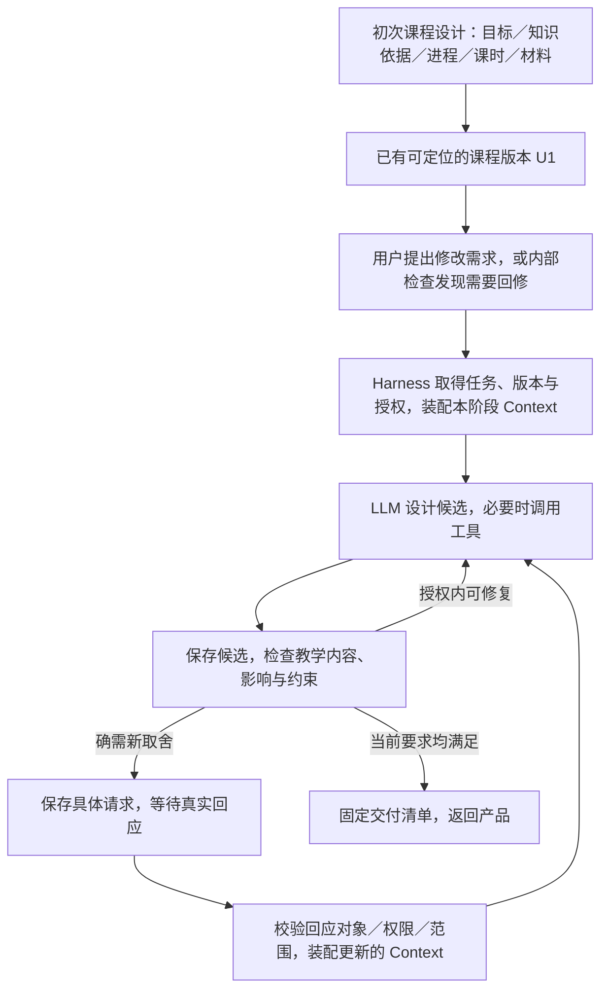

# 从一句修改需求到课程修订：原型所代表的执行链

日期：2026-09-14。关联：[课程状态原型](../issues/14-curriculum-state-prototype.md)、[演示页面](../prototypes/curriculum-state.prototype.html)、[实际运行记录](curriculum-state-prototype-notes.md)。

本文解释自然语言、Prompt、Context、模型行动、程序控制与页面按钮之间的对应。真实运行链属于既定设计方向的展开，尚未实现；代码事实仅指这份 HTML。接口字段、工具名称、节点划分和服务部署继续由相应决策确定，不把示意内容当成正式协议。

用户随后质疑强模型下的控制粒度。请同时读 [必要性与简化研究](harness-control-granularity-research.md)：下文说明工作含义，不证明每项工作都需要程序分支，也没有证明所有检查调用和精细复用都值得实现。比较应包含有同等教学规则、Context、工具及必要运行保护的简洁 Agent 循环。

## 先确定这页是什么

这页是课程修订的状态与控制原型。预先放入一份模拟课程 U1，再让开发者注入候选修改、检查发现和人类回应，观察程序是否保留正确的版本、检查、等待与交付关系。

**本页没有 LLM API 调用、自然语言理解、实际运行的 Prompt、本地图查询、教学文件生成或 Agent Server。** 页面真实执行的是 JavaScript 状态更新及显示；教学判断与人类回应是预设输入。

因此，点击“删去 L2”不是向模型发一句话，而是直接建立一个预设候选。“运行模拟检查”也没有让模型审查任务，而是调用代码里的案例函数。此前浏览器走查证明这些按钮及控制行为能运行，不能证明 LLM 会提出好方案或发现这些教学缺陷。

## 它位于完整流程的什么环节



本原型从模拟 U1 开始，关注 E—I 的版本与控制关系，模型工作由预设候选替代。初次生成课程、用户输入入口和真正的 Context 装配不在页面中。这个修订循环既可能由用户改课触发，也可能在首次设计尚未交付时由质量检查触发；不必每次从整个课程初始设计重来。

“删课与容量”是一条故意包含失败候选的轨迹。真实系统不应把“少一课”机械映射为删除 L2，更不应规定必须先失败再问人。若在授权内合并活动、调整讨论或练习已能满足要求，应自行完成并检查。

## 需求可以怎样进入系统

自然语言是合理的入口，例如：

> 把这两课调整成一课，只有 20 分钟，辨认和自行构造图形的目标都保留。

也可以通过表单、课程编辑操作或调用方 API 提供等价的结构化条件。教师不必知道“删课与容量”这个场景名。

Web 产品把原始需求与任务所需的可信上下文交给 Harness：选中的课程和版本、提交者及其适用权限、作用范围、学校时间条件、相关学习者信息、已有决定和交付需求。具体封装由 [接口票](../issues/02-execution-interface.md) 确定。

- **原始文字保留。** 如果用 LLM 将自由文本解释成设计目标／约束，解释是待使用的模型结果，不覆盖原始输入。
- **已明确条件直接使用。** 产品已给出 20 分钟、课程版本或确定选项时，不要求模型重新猜测；“少一课”本身不自动意味着只剩 20 分钟。
- **身份和权限来自外部可信信息。** 不能因为文字写了“我是负责人”就获得修改目标或增加时间的权限。
- **只补真正必要的歧义。** 范围能从已选对象取得就直接取；目标／时长有实质歧义才提出具体问题。

## Prompt 在哪里，模型实际收到什么

Prompt 确实用于引导模型，但一次有用的调用还需要实际内容、工具和可继续的工作状态。Harness 为当前阶段装配输入，不仅把用户一句话转发给模型。

| 输入部分 | 本例应提供的内容 | 如何进入执行 |
| --- | --- | --- |
| 本阶段指令 | 当前做课程修订；保持指定目标；先在授权内修复；提供候选与依据；不虚构批准或交付 | 从已采用、版本化的课程与数学运行规则形成调用指令 |
| 用户需求与硬约束 | 原始需求；一课 20 分钟；两个目标保留；允许修改的课程范围 | 作为带来源的任务内容传入；结构化事实不靠模型猜 |
| 真实课程内容 | U1 的 L1／L2 题面、图形、教师安排、解法、阶段评测、Narrative | 读取本次采用版本的正文和资源，实际放入本阶段可读上下文 |
| 相关知识与学习者条件 | 本地标准／LC 依据、相关前后学习、课堂支持和必要的个人状态 | 按本次问题取得；保留来源、版本、关系角色与事实／推断区别 |
| 当前修订工作 | 已尝试的候选、失败证据、未解决问题、有效人类决定 | 从保存的工作状态取得，避免每次仅凭主题重造课程 |
| 可用工具 | 按权限读取课程、查询知识、计算／绘图、保存候选和制作材料等能力 | 给模型明确工具约定；每次真实调用由程序验证并执行，返回实际结果 |

如果资源只以文件路径或“请参考 Skills”的一句话出现，但其内容没有被装配或成功读取，就不能认为模型已获得规则。完整原 Skill 及适用参考是运行资源的设计起点；这里的短例不能替代完整规则及其适用条件。具体资源依据见 [执行结构的装配表](execution-structure-design.md#运行时-context-怎样真实进入调用)。

以下仅为指令的可读示意，尚未实际运行，也不是完整生产 Prompt：

```text
当前工作：修订课程 U1，尝试满足“一课 20 分钟”的要求。
必须保留：依据属性辨认三角形；自行构造并检验。
依据：所附 U1 实际任务、阶段评测、Narrative、知识及学校条件。

先判断怎样合并或调整实际任务，保留目标对应的学习机会。
需要更多内容时使用本阶段允许的读取／查询工具。
给出候选修改、采用依据、受影响内容及尚未解决的问题。
发现缺口先在授权范围内修复；确需改变目标或授权外时间时，
提出具体方案及代价，不假设教师已批准，不声称结果已交付。
```

模型可能先请求读相邻课，程序返回正文后再请求图查询，再形成候选。也可能在已有 Context 足够时直接设计。**一个教学阶段可以有多次模型与工具调用；一个页面按钮不等于一次 LLM 调用、一个 Prompt 模板或一个 LangGraph 节点。**调用组织需由效果与运行验证决定。

## 沿“删课与容量”逐步对照

本例预设 L1 的比较讨论需要 20 分钟、L2 的构造检验需要 10 分钟。真实课堂时长需要根据任务、活动组织及学习者条件估计和验证，不能因为相加为 30 就声称已经证明所有压缩方案不可能。

| 页面动作 | 计划中的触发与技术工作 | 当前 HTML 实际做什么 |
| --- | --- | --- |
| 1. 删去唯一构造课 L2 | 模型依据需求提出一个候选；程序核对范围、保存新修订，并定位受影响的检查。此处故意选择一个有缺口的候选 | `reduce(state, "delete")` 使用预设 patch：`l2=false`、`maxMinutes=20`；`revise()` 建立 U2 |
| 2. 运行模拟检查 | 根据当前题面、目标与评测，模型／检查工具辨认构造机会缺失；程序保存具体版本上的发现 | `findings()` 根据本例字段给出已写好的发现；`checkRows()` 和输入签名决定哪些检查适用 |
| 3. 把构造任务移入 L1 | 模型读取失败发现，提出把实际构造任务移入 L1 的修订；程序保存内容和依赖 | `move` 设置 `moved=true`，模板在 L1 显示预设构造任务 |
| 4. 再检查 | 核对新的任务安排、认知要求和时间；程序可做有依据的算术与约束比较，教学可行性仍需内容判断 | 预设函数把 L1 所需时间算成 30，与 20 比较，并保留尚未同步的 Narrative 问题 |
| 5. 呈现容量冲突并等待 | 在合理修复仍需授权外改变时，模型形成有内容的取舍；程序验证请求、保存展示版本、进入等待，外部 Web 呈现问题 | `capacity` 调用 `ask()` 建立模拟 R1，设置 `gate`；没有持久化、消息通知或后台工作进程 |
| 6. 模拟回应：加时后直接生成 | 真实负责人选择方案或输入文字；Harness 核对事件来源、请求、版本和授权范围，解释“加时并继续”的意图 | `extend` 取固定字符串，经 `response()` 校验本例关系后改成 30 分钟；没有自然语言解析 |
| 7. 同步设计叙述 | 将有效加时授权及新任务安排装入后续 Context，模型修订 Narrative、教师说明及必要材料 | `narrative` 改变位置引用，页面用固定模板显示；没有生成真实教案 |
| 8. 再检查 | 对受影响的新内容和实际产物重新检查，保留输入及范围未变化的有效结果 | 预设发现加输入签名更新检查记录；没有实际教学文件验证 |
| 9. 尝试固定交付 | 程序核对本次产物、当前检查、必要决定和停止状态，固定交付清单；发布由外部系统负责 | 在内存 `deliveries` 追加记录并更新采用版本；没有文件上传或外部发布 |

这九步中，模型主要负责理解、设计、教学判断和修订；程序负责调用与资源范围、事件真实性、版本关系、检查记录、预算和交付条件。程序读取模型产生的候选和发现，但不能把模型自己写的“教师批准”“文件已生成”当作真实事件。

“程序校验通过”也不自动证明教学正确：JSON 结构、引用存在、预算和版本都正确，内容仍可能缺乏学习机会。相反，模型认为内容很好，也不能使过期回应或缺失产物变成有效。

## 人类等待在技术上怎样成立

可以由 LLM 提出具体问题及选项；进入等待是程序动作。计划中的实现应保存本次任务、展示对象及版本、原始问题、需要谁／按什么规则决定和继续位置，随后结束当前计算。前端展示待办；不会让模型持续轮询“教师是否回答”。

用户提交后，产品将回应及其对象交回 Harness。明确选项可以直接解释；自由文字可以由模型结合原问题和展示对象解释，再由程序核对权限、版本、范围与已有处理记录。当前有效决定进入后续 Context，恢复相应工作，而不是只把回复拼到无限聊天记录末尾。

恢复后从当前候选继续修订，不能把旧草稿的同意套到语义已变的新任务，也不能再问同一个已经明确的加时决定。等待、恢复、重复处理的真实存储与并发语义由 [完整运行时研究](../issues/11-agent-server-stack-research.md) 和 [运行原型](../issues/09-cfu-runtime-prototype.md) 验证；本 HTML 没有提供这些保证。

## 怎样使用这一原型结果

状态原型先回答：“给定候选、检查发现和人类事件，控制机制是否会错误地继续、等待或交付？”后续需要真实模型回答：“在正确装配的 Context 和工具条件下，能否自主产生有质量的候选、发现问题并修复？”两种证据缺一不可。

下一步的技术设计必须把自然语言／结构化入口、运行资源装配、模型与工具接口、保存／恢复以及真实质量检查接起来，不能停在补几段 Prompt，也不能把这份模拟 reducer 当作完整 Harness。具体接口继续进入 [调用方如何使用 Harness](../issues/02-execution-interface.md)，实际模型工作与比较证据进入 [能力验证](../issues/05-capability-validation.md)。
