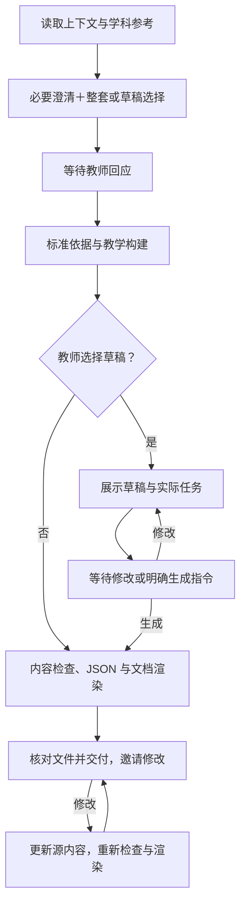
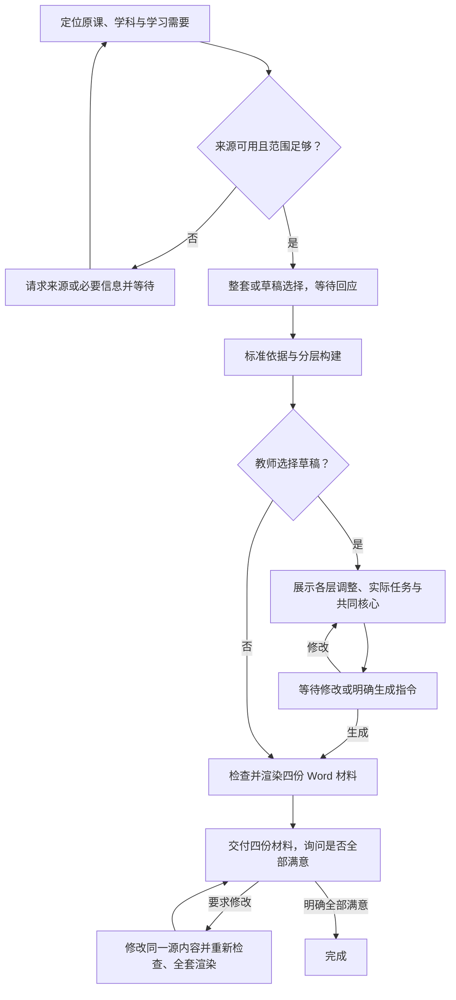
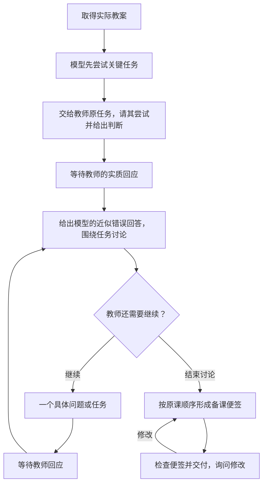
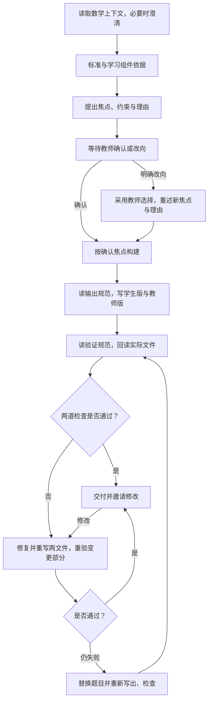

# 上游四项 Skills 的执行与 HITL 参考

状态：完整保留的上游流程与早期候选分析，是当前设计和效果比较的重要起点；尚未成为本项目能力契约。当前产品规则见 [能力范围与推进路线](harness-scope-and-priority.md)。
来源基线：`281eb8d41fe2837d911541c9bbb870b58add804c`。详细出处见 [源码盘点](skill-capabilities.md)。

本文保留四项上游 Skill 的工作内容、流程和早期适配解释，用于判断哪些教学能力值得采用。下文“必须”、固定数量、等待、Word 产物与完成条件均限于所分析的上游实现，不自动约束独立课程体系。

当前新增课程体系设计、本地 KG 用法及自主质量基线已取代逐条移植前提；数据不可获取的旧假设、待批准的字面冲突与材料缺口审阅不再进入本项目决策。没有运行过此移植方案。

## 设计依据

一个技能的执行能力同时包含教学过程、产出与检查。仅保留最终文字，无法证明焦点经过教师确认；仅保证流程顺序，也无法证明题目有诊断价值。

因此，能力契约先确定三个问题：哪些教学动作必须发生，哪些信息或决定来自人类，以及交付前需要什么证据。已有上下文可以满足事实性信息需求；真实教师决定需要保留其对象与原始回应，不能由默认值、Learner Model 或模型预测代替。

## 四项技能的关键差异

| 技能 | 前置输入 | 生成前的人类参与 | 生成后的检查与交互 | 交付和结束 |
| --- | --- | --- | --- | --- |
| 教案创建 | 学科、主题与必要年级等；其余使用学科默认 | 必要澄清＋整套／草稿选择；选择草稿后等修改或明确生成指令 | 检查教学内容与师生材料一致性，渲染并核对文件；交付后邀请修改 | 源码未以“教师确认满意”定义强制完成条件 |
| 已有课时的差异化教学适配 | 原课或规范允许的课题信息、层级与学习需要 | 必要来源／范围澄清＋整套／草稿选择；有多个课程候选时须选课；草稿需放行 | 检查各层目标与支架、共同内容及四份材料；修订后重渲染 | 四份 Word 材料均交付后，仍需教师确认全部满意才完成 |
| 备课 | 实际教案 | 教师亲做关键任务并给出判断，模型的近似错误回答随后出现 | 短轮讨论与事实纠错；便签需体现任务和教师贡献；交付后询问修改 | 教师可结束讨论；正文与 rubric 对例外路径的描述需对齐 |
| 理解度检查 | 数学主题／标准及足够年级信息 | 必要时最多一问；必须先提出焦点并停住，等教师确认或改向 | 两份文件写出后，回读并检验答案与错误推理；交付后邀请修改 | 验证通过后可交付；未要求先收到“满意”回复 |

依据：[教案 S1／S4／S5](../../../k12-teacher-skills/plugin/skills/k12-lesson-plan-creation/SKILL.md)，[分层 S1／S4／S5c／S6](../../../k12-teacher-skills/plugin/skills/k12-lesson-differentiation/SKILL.md)，[备课正文](../../../k12-teacher-skills/plugin/skills/k12-lesson-prep/SKILL.md)，[CFU S1–S7](../../../k12-teacher-skills/plugin/skills/k12-check-for-understanding/SKILL.md)。

## 教案创建

数学主路径、教师回应和学科适配的详细候选见 [教案创建 Skill 的执行方案](lesson-creation-execution-design.md)。

- 信息已足够时，原规范仍要求给出整套／草稿选择。整套默认值作用于收到回应后的分支选择，不能解释成无回应时自动执行。
- 草稿也必须经过标准依据与教学构建；草稿路径省去的是当时的文件渲染。
- 教师只要求修改草稿时，更新并再次展示，等待明确生成指令。若同一回复包含精确修改和“改好直接生成”，需区别于只有修改的回应，候选解释见详细方案；不能笼统增加第二次批准。修改影响教学主题或标准时，受影响的依据也需更新。
- 上图没有把交付后的沉默当作教师满意，也未人为增加一个原规范没有定义的满意终态。
- 依据：[SKILL.md L75–98、125–165、169–263](../../../k12-teacher-skills/plugin/skills/k12-lesson-plan-creation/SKILL.md)。

## 已有课时的差异化教学适配

- 来源有多种合法路径：已有对话、上传、URL、命名课程检索，以及规范允许的主题信息路径。上图的“可用”不表示每次都必须上传原课。
- 已提供来源或层级信息时应使用它们；读取失败时不得假装已读。首次必要问题尽量与草稿选择合并为一轮，上图只分开表达教学含义。
- 命名课程返回多个候选时，选课是独立的人类决定，不应由模型任意代选。
- 本 Skill 在四份文件交付后等待教师确认全部满意；按它自己的规定实现这一等待和结束路径，不将此条件推广到其他 Skill。
- 依据：[SKILL.md L81–109、114–134、153–191、241–267](../../../k12-teacher-skills/plugin/skills/k12-lesson-differentiation/SKILL.md)。

### 数学适配必须实际完成的教学工作

| 环节 | 可观察契约 |
| --- | --- |
| 来源和范围 | 直接使用已给定原课；命名课时取得实际内容后再围绕它适配。没有完整原课时，保留规范允许的年级＋主题＋标准路径，但不能称其为对某篇未读原课的忠实适配。新建整课仍按 creation 路由 |
| 上下文使用 | 使用已经给定的学习需要、语言支持、IEP 目标和 accommodations；无数据时说明使用默认画像。数学未知州不强制增加州问题；有州信号则采用相应框架。不推断具体家庭语言，不据此擅自定向翻译；保留教师明确指定翻译语言的需求 |
| 原标准与共同任务 | 三层都遇到同一标准的全部要素与最难情形，保留原任务的情境和认知挑战；Below 不能只做无趣的程序练习，At／Above 才有真实情境 |
| Below 的进入方式 | 命名具体先备标准／概念，将具体操作与视觉表征接到本年级任务；支架不泄露答案，不用关键词猜运算，不将开放表达改成选择题来绕过困难 |
| At 与 Above | At 从表征进入抽象；Above 增加概括、结构联系、评价或真实的前向概念，须说明比 At 多了什么思考，不只是加量或放大数字 |
| 支架渐退 | Below 第一题嵌入支架最多两项、第二题最多一项、第三题起无嵌入支架，退出题最多一项；页首支持与教师按需支持另计。学生材料不宣布支架被移除 |
| 分组和观察 | 根据本课证据说明分组理由，并允许形成性检查后调整；每层有错误模式、教师提示与转入小组支持的信号。没有学生数据不能伪装成已诊断结果 |
| 真实学生任务 | 三份学生页均印出提前完成活动、形成性检查及开放反思提示；教师计划明确这些实际任务，不能只写“观察学生”或只在计划中描述活动 |
| 课堂资源实际可用 | 每项被引用资源必须是材料包中的实际内容、教室已有设备，或注明具体标题、来源与访问途径的资源；任务依赖的图形须出现在使用它的学生页上，或把任务改为只依赖已提供内容。不能只在课程摘要中列出“卡片／图示”就视为可教学 |
| 材料和修订 | 单一源生成教师计划及 Group A／B／C 三份 Word；数学教师计划至多三页、每份学生页至多两页。双向核对计划、题面、支架、标准与退出分类；共享内容改变后扫清全部旧叙述并全套重渲染 |

来源：[数学 R1–R8 及输出映射][df-math] L44–197、201–207、248–271、314–320；[主规范][df-skill] L62–109、225–267；[输出规则][df-output] L25–68、194–226。这些是数学适配自身的要求，不用于约束教案创建或备课。

### 数学适配的 KG 与明确解释

| 情形 | 本轮工作解释与证据要求 |
| --- | --- |
| 真实标准与双向进阶 | 连接时在草稿前解析标准，分别取得后向先备与前向标准；两方向不可互相替代。上传原课不免除标准依据步骤 |
| components 一处列入批次、一处称可选 | 工具支持时按批次调用，取至多五项核对三层覆盖；缺少这项能力时明确标记该可选路径未执行，不伪造返回结果。保留原文差异 |
| 已知州但无可用先备进阶 | 保留州目标标准，优先真实州进阶；缺失时按数学 R3 使用已标明的 CCSS proxy 或概念级先备。只改变先备依据，不把本课目标偷换成 CCSS；原始 KG “仅州未知可回退”限制与该适配分别评判 |
| IM 来源 | 教师明示或原课中可核验的 IM 标识作为采用课程特有结构的依据；只有术语推断时保留为待核实线索，用于检索候选，不记成教师已确认。与 creation 可直接按信号识别的规则分别处理 |
| 命名 IM 课时 | 仅在 IM 已确定且按标题／位置定位时查课程材料，多个候选先让教师选；已经取得上传或链接原课时跳过此材料检索，不省略标准、进阶与误解查询 |
| Below 可改数字但共享输出要求原文一致 | 默认保持同一数字与题面，通过支架和独立拓展块完成适配，能同时满足两处要求。教师明确要求只改单层核心数字时，作为尚未支持的变体指出冲突，不静默生成分叉；它保留在后续能力覆盖中，不宣称已实现所有可选变体 |
| 误解空结果、未连接或请求失败 | 成功空结果可以从知识补三个并标明来源；未连接用本 Skill 的规定页脚；部分能力或报错分别记录，不能冒充前两种情形。具体失败恢复策略由依赖与执行机制决定 |

来源：[数学 R3／R6][df-math] L61–78、144–154；[KG 指导][df-kg] L22–53；[主规范课程限制][df-skill] L48–49；[输出共同题面规则][df-output] L194–226。工作解释不是对矛盾原文的无条件通过声明。

### 数学适配的判别案例

以下均为待执行情境：给定一节含分数运算难例的原课，Below 仍必须遇到该难例，改变为整数题应被认定为缩减标准；只增加 Below 支架时，四份文件保持同一核心题面且支架按题渐退；教师仅说“B 组可以”时不得结束四份满意等待；教师明确全部满意才结束。另以“州标准已知、进阶返回空”和“课程只返回目录、正文不可取”分别检查先备适配与真实原课要求，不让一个成功查询掩盖另一项缺失。

## 备课

- 这里的人类参与本身就是教学目标的一部分；“已收到 Learner Model”不能证明教师已亲做任务。
- 图示为正文的正常主路径。拒答、教师要求模型先给示例、短时备课等例外按下表分别处理，不把“等待教师实质贡献”写成无法退出的循环。
- 输入教案缺失时先获取实际材料；不能用模型猜出的课程填补。正文没有规定所有停止情形都必须进入同一个终态。
- 依据：[SKILL.md L17](../../../k12-teacher-skills/plugin/skills/k12-lesson-prep/SKILL.md)，[rubric L12–17](../../../k12-teacher-skills/evals/k12-lesson-prep/rubrics/internalization.csv)。

### 数学备课的实际工作与产物

| 环节 | 可观察契约 |
| --- | --- |
| 取得原课 | 已有课直接使用，上传／链接先读；只给课程位置且能够检索时先检索，无法取得则一句话请求粘贴或链接。仅有主题不允许模型另造一课来完成 prep |
| 模型先做任务 | 按原课意图实际尝试关键题，用原有表征或方法发现具体难点；原课采用线段图时，不用成人代数捷径替代。保存足以核查的任务、结果及简明难点依据，不索取隐藏思维链 |
| 教师贡献 | 将关键任务原样交给教师，请其亲做并提出自己的 near-miss，指出近似正确的回答错在哪里；随后才呈现模型的错误例子与发现。仅正确解题不替代 near-miss，模型先给错例让教师判断也不是正常主路径；真实教师预测或处理决定进入便签，并保留关联 |
| 难点归因 | 指出本任务中特定数学关系、先备知识、措辞或负荷为何造成困难；模型不能借 Learner Model 扩写学生群体会怎样的判断。教师自己的预测可以如实归属给教师，不能变成模型验证过的事实 |
| 保留原课 | 讨论如何教好原有设计，不跳过、重排、替换或追加教学内容；若需要改课，说明这已是另一 Skill 的任务，不在 prep 中悄悄执行 |
| 术语与纠错 | 术语、符号和单位按它们实际出现的课时位置解释；教师数学事实错误须明确纠正，便签不沿用错误。概念难点不能全被“粗心”或“算错”替代 |
| 数学 KG 条件 | 有适用 KG 能力时，查询误解资料并判断是否适用于实际任务；有适用结果则至少一个难点可追溯到它，无结果则留查询与适用性判断。没有依据声称具备查询能力时不能标记完成该连接条件 |
| 对话节奏 | 每轮短小，问题可用一句话或一道短题回答；第一次交流后明确可以随时结束；继续只提出一个具体方向，不套用 creation 的三至四个修改选项 |
| 便签 | 正常实质备课生成教师专用 `prep_note.md`，200–300 词，按原课阶段顺序用原阶段名作粗体标题；把难点、术语、既有支持和教师贡献放回对应教学位置；写后询问修改 |

来源：[备课主规范][prep-skill] L17；[备课 rubric][prep-rubric] P1／P1b／P2／P3、R1–R4、O1–O2、M1–M6。该 Skill 当前没有学科参考文件可供加载；rubric 对不存在的 reference 的提及不能靠借用其他 Skill 的数学规范补齐。

### 教师停止、拒答与短时请求

| 实际情形 | 本轮工作解释 | 验收边界 |
| --- | --- | --- |
| 教师给出实质判断后结束 | 用已经发生的备课内容形成简短便签，不继续追问；写后保留修改邀请 | 教师贡献进入便签，正常主路径可完整验收 |
| 教师明确拒绝尝试但要求继续 | 按 M2／M6 尊重明确拒答，可提供基于原课的帮助；不虚构其预测或处理决定，不持续逼问 | 没有任何实质贡献时，M5 不通过；如实说明这是参与不足的输出，不能宣布完整协作备课达标 |
| 教师明确要求模型先给 near-miss | 使用 M6 明列例外；保存这次请求，模型随后呈现自己的任务分析 | 不等同于模型可以在正常主路径抢答；后续是否有教师贡献仍按 M5 单独判定 |
| 教师先问实际任务中概念或方法为什么成立 | M2 的 content-explanation 分支允许先回答所问内容，再提出自己的问题；优先沿原任务方法解释 | 不是所有内容问题都属于单事实查询；先答不自动豁免 M6 的 near-miss 顺序，不能提前揭示整套错误分析 |
| 教师明确只有三分钟 | 按 rubric 的短时例外提供针对原课的单轮重点，允许无便签；不花掉时限展开完整问答 | 原 rubric 对 M5／M6 的例外没有完整衔接，保留原判定与适配说明，不记成正常协作备课全通过 |
| 单个事实查询 | 按 SKILL 的任务边界处理为范围外请求，由调用方按系统能力处置 | 不扩成 prep 的新强制能力，也不用 rubric 的合法无便签表述改写技能路由 |
| 尚无可用原课 | 请求实际材料并等待；取得后再尝试关键任务 | 缺少原课不是教学完成，也不自动结束仍可继续的任务 |
| 明确取消，或教师结束且尚无有价值的备课内容 | 停止相应执行，保留实际已有记录；不生成空洞便签来凑完成 | 操作已停止与教学目标已完成分别记录；已有实质内容并正常结束讨论时，仍按上面的正常路径形成便签 |

反例：外部 Learner Model 写“学生混淆等号”，不等于教师已经回答关键任务。给定原课要求用图示解释等量关系时，模型不能先给一段“该群体会失败”的诊断再让教师点同意，也不能通过把一份自动便签交付出去就标记 M5 通过。这些是待执行案例，没有真实教师或学生参与证据。

HITL 复核补记（2026-09-14）：上表补回原 rubric M2 的内容解释分支。三分钟路径必须来自教师需求，模型预算不足不能自行冒充；M6 的不能作答例外不免除 M1 的真实原课要求。当前产品的完整回应与恢复语义见 [HITL 设计](hitl-design.md)。

## 理解度检查

- 提出焦点后必须结束当前生成阶段等待回应，不能同轮继续造题。
- 教师明确改向后，源码要求采用其选择并重述，不要求增加第二次确认。回应含糊时怎么澄清属于 HITL 协议设计。
- 验证对象是已经写出的学生版和教师版；不能仅检查模型生成前的计划或中间文本。
- 修订后应检查变更及受其影响的内容；原文没有要求无差别重验每一道未改题。
- 多选按唯一完整答案集合的工作解释检查；后端始终提供实际产物空间。对应来源差异与验证边界见下节，上图不代替题型和产物检查。
- 依据：[SKILL.md L43–141](../../../k12-teacher-skills/plugin/skills/k12-check-for-understanding/SKILL.md)，[verification.md L3–10、18–85](../../../k12-teacher-skills/plugin/skills/k12-check-for-understanding/references/verification.md)。

## HITL 按各 Skill 的流程实现

上面四条流程分别定义自己的输入请求、可接受回应、后续分支和结束条件。按各流程逐一细化即可，不需要先归纳一套共同的交互类型。

保存暂停位置、传递输入请求、关联真实回应并继续执行，是可讨论复用的运行能力。由哪个 Skill 在何处使用、回应意味着什么、是否进入完成路径，仍按该 Skill 的规定执行。具体对接机制由后续 HITL 票讨论。

## 来源差异的工作解释

| 情形 | 当前证据 | 建议如何进入契约讨论 |
| --- | --- | --- |
| 教案可兼容要求 | 三个误解、Discuss 单独至少十分钟、两条 Design notes 能同时满足相关来源 | 直接落实，不作为新的用户选择；数学主题适用和命名课程冲突见 [教案详细解释](lesson-creation-execution-design.md#源码差异与候选解释) |
| 数学适配共同任务与改写 | output 要共同核心原文一致，数学参考另允许 Below 保结构改数字 | 当前采用相同数字和共享题面，改变外围支架；单层改数字变体不默认为已支持，见上文 |
| 备课例外 | M2／M6 允许拒答等情况，M5 仍要求教师实质贡献 | 尊重教师停止或拒答，分别记录正常完成、参与不足与短时例外，保留原始评分，不虚构贡献 |
| CFU 多选 | math 允许多选，Gate A 用恰好一个可辩选项表达 | 推荐按题型解释：单选仅一个可辩选项，多选完整正确答案集合唯一；逐选项检验依据，错误选项仍做 Gate B，不删除多选能力 |
| CFU 无输出目录 | output 允许内联，主流程却要求写文件再回读 | 后端始终提供内部产物空间；空间不可用是执行故障，不以内联文本冒充两份文件的验证结果 |

原始定位均见 [源码盘点的“上游不一致须留证据”](skill-capabilities.md)。以上解释是建议，不代表用户已接受，也不是已验证的教学结果。

## 怎样用于当前设计

参考本稿中的实际教学工作、教师参与目的、跨文件一致性和修订失效问题，再按独立课程体系的目标取舍。原 Skill 的固定问法、四份 Word 或满意结束条件都不是默认产品约束。

新增课程能力及其与课时、适配、备课和检查的关系，见 [当前能力范围](harness-scope-and-priority.md) 与 [课程体系设计研究](curriculum-design-capability.md)。原来源冲突保留为理解参考实现的记录，不再要求用户逐项批准。

[df-skill]: ../../../k12-teacher-skills/plugin/skills/k12-lesson-differentiation/SKILL.md
[df-math]: ../../../k12-teacher-skills/plugin/skills/k12-lesson-differentiation/references/math.md
[df-kg]: ../../../k12-teacher-skills/plugin/skills/k12-lesson-differentiation/references/learning-commons-kg.md
[df-output]: ../../../k12-teacher-skills/plugin/skills/k12-lesson-differentiation/references/output.md
[prep-skill]: ../../../k12-teacher-skills/plugin/skills/k12-lesson-prep/SKILL.md
[prep-rubric]: ../../../k12-teacher-skills/evals/k12-lesson-prep/rubrics/internalization.csv
