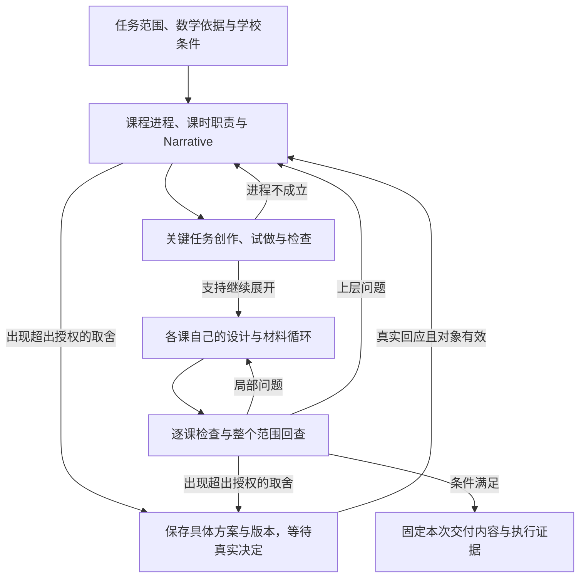

# 课程与教学设计的执行结构、状态与修订

**当前实施读取说明（2026-09-16）：**本文保留当时的详细分析、候选与实验条件；当前全年阶段、参考使用时点、文件化和原生运行要求已进入 [规格正文](../../math-harness-delivery/spec.md)及 [全年工作流](../../math-harness-delivery/curriculum-progression-workflow-design.md)。先读其中教学问题与选择理由，再用本文核对细节；旧原创隔离、三课优先和生产时点不作为当前全年工作的要求。

日期：2026-09-14。所属决定：[执行流程和状态如何设计](../issues/03-execution-structure.md)。本文是执行结构的设计分析与原型依据；采用结论在该票记录。未运行模型、状态原型、渲染或故障实验，不声明教学质量或生产可靠性已经达标。

目标、路线及职责遵守 [README](../../../README.md)；四层能力与双向交接承接 [课程能力决定](../issues/12-curriculum-design.md)。上游固定于 `281eb8d41fe2837d911541c9bbb870b58add804c`，详细流程继续完整保留。本文不取代各 Skill 及其参考文件。

人类回应、已有授权、版本适用及各能力结束的后续采用结论见 [HITL 决定](../issues/07-hitl-protocol.md) 与 [详细语义](hitl-design.md)。本文中交给 HITL 继续确定的部分按该决定读取，不从概要推断统一批准规则。

## 先比较执行方式

本项目要同时保留三种工作：模型根据数学内容选择行动，程序执行可以核验的边界，以及真实参与者作出教学决定。课程结构不直接等于执行图，执行图也不能代替模型实际完成的教学工作。

| 候选 | 如何组织 | 对当前任务的利弊与判别案例 |
| --- | --- | --- |
| 一个长程 Agent 自由完成所有工作 | 一份长历史包含课程设计、材料、工具和审阅；模型决定下一步 | 跨课内容增长、盲答隔离、教师等待和修订失效仍需另外处理。这种写法不能代表所有简单 Agent 方案；“删课后漏改评测”目前是假设反例，未测得发生率 |
| **具备必要运行承载的单 Agent 循环** | 同样取得完整适用教学规则、按需 Context、工具、版本化工作内容与真实事件保护；模型依规范选择设计、检查和回修行动 | 应纳入比较的简洁基线。教学步骤可以由指令指导，不逐步编为程序节点；仍保留必须的信息隔离、真实参与和交付证据。当前没有实验能排除它已经足够 |
| 把每条教学规则编为固定流程节点 | 对每个条款排定调用和状态，全部能力按细分步骤执行 | 易观察固定顺序，但规则改动散落在流程代码中，遇到不同学科、活动目的和教师例外会不断分支；节点完成仍不能证明教学判断正确 |
| **各能力自己的流程，阶段内保留有界的模型与工具行动循环** | 程序控制跨阶段所需事实；模型在当前能力与任务允许的范围内查依据、创作、试做、提出修订；实际内容持续保存 | 建议采用。能保留原 Skill 的工作方法，并补上课程跨层回修。代价是需要明确内容依赖、Context 装配和检查责任；不能把这些职责推给通用 Agent 或框架 |

“各能力自己的流程、阶段内有界循环”是本轮结构选择建议，不是“已证明比 Skills 更好”。原 Skills 本来就依赖模型与工具完成教学工作；我们保留这些工作并使其在 Web 后端可控制、可恢复。需要比较的关键变量是阶段边界、Context 分解、检查条件和修订方法，不预设多 Agent 或多个模型优于单模型。

**控制粒度补查（2026-09-14）：**用户指出强模型条件下细分场景可能过度设计。原表漏掉了上述有完整运行支持的简洁基线，不能由“无限聊天”与“每条规则一个节点”两端反推当前候选最优。场景、教学规则和程序分支是不同层次；详细反例保留为评测材料，不自动产生分类器、专用 Prompt、图节点或状态字段。具体审查与比较方法见 [控制粒度研究](harness-control-granularity-research.md)。当前不再据模拟案例扩展生产控制，实际粒度仍待模型与运行证据收敛。

**划分边界的依据：**下一步需要不同的可见信息／工具权限、必须等待真实事件、已完成的昂贵工作值得单独保存、或输出必须形成一致的可检查版本时，设置执行边界。一个数学教学阶段可以跨多次调用；一次调用也可完成相互紧密的几个教学动作。避免按 Markdown 标题或 Grade／Unit／Section／Lesson 各创建一个自治 Agent。

LangChain／LangGraph 是既定实现方向。后续可将这些边界映射到图节点、子图或可恢复工作单元；这里不锁定 API、节点数或存储后端。已有 [CFU 局部框架研究](cfu-runtime-research.md) 支持提出候选，完整运行时与 Agent Server 专项仍在流程分析后、实现前开展。

## 课程到课时的具体执行链路

下表是新增课程能力自己的工作顺序；不是要求适配、备课、CFU 都通过的通用流水线。独立课时请求可从已明确的课时范围启动，适配与备课按需使用真实原课。

| 工作位置 | 模型与工具实际完成什么 | 必须保存及允许继续的条件 |
| --- | --- | --- |
| 确定本次范围 | 使用外部已给的任务、目标、学校条件、相关 Learner Model 状态及真实决定；区分蓝图、可教学单元、整年等范围 | 固定本次采用的输入与来源版本、允许的修改、交付要求。影响目标的必要信息缺失才请求补充；默认与已观察事实分开 |
| 建立数学依据 | 解析框架／标准，读取实际 LC 与有关进阶，按关系方向追查基础和后续；选择本次确实需要的依据 | 目标原文、实体与路径、查询结果、选用理由。图边与设计依赖分开；零结果不是工具失败，也不是允许编造依据 |
| 提出进程并比较关键取舍 | 形成单元、课段与课时职责；解释理解转变、表征的含义及使用顺序、学习机会和证据安排 | Narrative 与目标—机会—证据对应、实际依赖及进入条件。仅对会改变方案的取舍比较候选，不要求每课固定生成多个版本 |
| 试做关键任务 | 为最影响进程可行性的理解转变设计实际题面、表征及检查，实际求解；检查学生承担的思考、先备、支持和资源负担 | 题面、解法、图示／操作要求、可检查的发现。局部问题修题，进程问题回修课段／单元；只通过代表任务不足以交付单元 |
| 展开课时 | 从当前课时交接及实际任务出发，沿教案创建的构建、草稿与修订机制补齐任务、引导、学生材料和证据条件 | 保留已审阅的实际内容；不得只传主题重新造课。相互独立的课时可以后续并行探索，有实际依赖的课先固定其交接再展开下游 |
| 形成并检查材料 | 同一内容来源组织教师／学生材料及实际资源；求解、核对共享题面、渲染并检查实际载体 | 保存内容版本、各受众产物和检查。若本次仅请求蓝图，材料未生成如实声明；可教学单元则必须取得其所需实物 |
| 回查整个请求范围 | 逐一检查承诺的目标、学习机会、实际任务、评测及学校条件；回取相关课时，核对表征、先备、时间和跨课练习 | 对缺口给具体反例。分块检查需留覆盖记录，不能随机抽几课代替整个范围；发现局部问题回课时，结构问题回上层 |
| 交付或形成有依据的停止结果 | 核对当前范围、产物、检查与所需人类决定；固定交付清单 | 只对本次范围声明完成。保留未满足事项与修订入口，交付材料不自动代表外部批准发布 |

图省略了取消、故障、预算停止及各 Skill 自有的草稿／焦点／备课互动分支，详见后文。它没有要求每次上层回修都重新询问；回修仍在授权内且不使已有决定失效时继续。

## 阶段内模型怎样行动

每次行动循环围绕一个具体工作问题，例如“这个表征能否让学生解释分数单位”，而不是一句“完善教案”。

1. **装配当前依据。** 取得适用教学规则、当前目标与内容、相关前后课实际任务、已有发现和授权；程序核对版本与可见范围。
2. **模型选择下一项有用工作。** 可请求补充读取、查图、计算／绘图、提出内容修改或检查。给出要解决的问题和简要依据；不要求保存隐藏思维链。
3. **工具实际执行。** 执行端核对范围、版本和允许动作，返回真实结果。提示中列出工具名或模型声称执行过，不计为调用证据。
4. **保存结果并判断。** 模型解释结果、更新内容或形成具体发现；程序检查引用、必要记录、预算和阶段转移条件。教学含义仍需有内容依据的判断。
5. **继续、交接、回修或停止。** 缺信息且可查则先查，局部失败先针对性修复，结构失败返回上层；没有可说明的新进展时不能无限重复生成。

模型可以提出“请教师决定”“这些目标可能冲突”“建议交付”，但不能自己创建人类确认、工具成功记录或最终交付事实。程序能保证事件和版本关系，不能仅凭字段齐全确认数学或教学质量。

试做与检查按工作区分：设计者先解题以检验意图；必要时另装配实际学生材料进行独立读题；解释验证再读取答案与错误映射。不同调用不天然独立，是否使用不同模型待质量比较；计算器验算也不能替代图形含义和认知要求检查。

## 运行时 Context 怎样真实进入调用

详细阶段内容承接 [Context 分析](context-and-llm-design.md)，知识身份遵守 [知识使用约定](../../../docs/references/knowledge-consumption-contract.md)。本节补充装配机制，不新增一套与已有资料相互竞争的提示词。

| 装配部分 | 做法及可核查记录 |
| --- | --- |
| 能力与教学规则 | 形成版本化的运行资源：本能力流程、适用数学规则、输出／检查要求及已采用的改动。每条重要改动关联原文件、原目的、采用决定与比较案例。尚未采用的旧条款留作参考，不与当前要求混入同一指令层 |
| 当前设计事实 | 直接取得当前目标、Narrative、实际题面、解法、材料与未决发现；区分原始输入、设计假设、模拟回应及真实学习证据 |
| 跨层与知识依据 | 先按当前问题检索；用于判断先备、表征或覆盖的内容须回取原文与实际任务。只有标题／摘要时不能宣称检查了内容 |
| 学习者条件 | 引用共用模型定义以及外部提供的相关个人状态、证据、时间与支持条件；不同因素按各自语义使用，未知保持未知 |
| 可见范围与工具 | 同时限制模型消息、可读取资源、检索返回、缓存和工具执行端；不得通过通用文件读取或整个历史绕回教师答案与受限分析 |
| 装配记录 | 每次调用能定位工作目的、资源／内容版本、实际读取范围、被采用的输入及调用配置。摘要只帮助定位，不能冒充原文已进入调用或模型已理解 |

容量不足时，先划分当前工作与分段读取，再按对象保存有来源的局部结论；全单元回查汇总各段覆盖及跨段联系。模型仍缺必需内容时返回具体缺项，不静默截断。恢复时从已保存内容继续，不能只靠对话摘要重建任务。

第一份运行规则不宜由模型把全部 Skills 自动总结成短提示。应从固定原资源逐项形成采用清单，保留必要的细节和反例；已确定的课程分配、独立 IM 路线与数学适用性修改明确覆盖相应原条款。以实际装配记录检查规则确实可读，再以内容和过程评测判断是否有效。

各工作位置的具体资源依据如下。表中“形成运行规则”是实施要交付的工作，当前仓库的研究文档不等于已经构建并加载了产品提示资源。

| 工作位置 | 具体资源依据与时点 |
| --- | --- |
| 课程进程与跨层回查 | 从 [四层职责与双向交接](curriculum-design-capability.md)、本报告及 [知识使用约定](../../../docs/references/knowledge-consumption-contract.md) 中形成已采用的课程规则；装配当前范围的实际目标、任务和依赖 |
| 数学课时设计 | 以 [creation 主规范](../../../k12-teacher-skills/plugin/skills/k12-lesson-plan-creation/SKILL.md) 与 [math](../../../k12-teacher-skills/plugin/skills/k12-lesson-plan-creation/references/math.md) 为完整教学起点，在澄清前具备适用规则；知识查询以 [KG 参考](../../../k12-teacher-skills/plugin/skills/k12-lesson-plan-creation/references/learning-commons-kg.md) 解释原目的，并采用本项目本地图语义、范围分配和 IM 输入时点的改动 |
| 课时材料制作与检查 | 制作前加载 [creation output](../../../k12-teacher-skills/plugin/skills/k12-lesson-plan-creation/references/output.md) 中本次载体适用的内容组织和检查规则；构建阶段已可验算，不照搬 CFU 延迟验证资源的顺序 |
| 数学适配 | 独立读取 [适配主规范](../../../k12-teacher-skills/plugin/skills/k12-lesson-differentiation/SKILL.md)、其 [math](../../../k12-teacher-skills/plugin/skills/k12-lesson-differentiation/references/math.md)、[KG](../../../k12-teacher-skills/plugin/skills/k12-lesson-differentiation/references/learning-commons-kg.md)；制作前读其 [output](../../../k12-teacher-skills/plugin/skills/k12-lesson-differentiation/references/output.md)。不借用 creation 的整套规则代替 |
| 教师备课 | 使用 [prep 主规范](../../../k12-teacher-skills/plugin/skills/k12-lesson-prep/SKILL.md) 与包含关键行为和例外的 [prep rubric](../../../k12-teacher-skills/evals/k12-lesson-prep/rubrics/internalization.csv)；此 Skill 没有 math／output 参考，不能补加载别项的教学流程冒充原规范 |
| CFU 依据、焦点与构建 | [CFU 主规范](../../../k12-teacher-skills/plugin/skills/k12-check-for-understanding/SKILL.md)、[math](../../../k12-teacher-skills/plugin/skills/k12-check-for-understanding/references/math.md)、适用 [KG](../../../k12-teacher-skills/plugin/skills/k12-check-for-understanding/references/learning-commons-kg.md)；写材料前加载 [output](../../../k12-teacher-skills/plugin/skills/k12-check-for-understanding/references/output.md) |
| CFU 实物验证 | 当前材料完整可读后才开放完整 [verification](../../../k12-teacher-skills/plugin/skills/k12-check-for-understanding/references/verification.md)。隔离读题只取得学生材料；能看答案的解释验证另装配，分别保留结果 |

共享题面只能减少一种不一致：教师脚本、讨论问题、材料数量、观察说明与后续建议仍可能含有自由叙述中的旧内容。修订必须同时核对“计划所说的任务在学生材料中存在”和“学生材料中的任务有相应教师指导”，不能把同源引用正确当作全部语义同步。

**原创与参考比较：**原创设计阶段可读经采用的设计原则及相关标准／LC，按本次用途限制检索结果中的具体 IM 任务。固定原创 A 后才对可比参考 R 做内容对照，修订为 B；提前看过具体参考时如实记录，不宣称隔离条件成立。该约束不保证预训练中未接触参考。

**隔离读题：**提供准备交付给学生的原样材料快照及作答任务，包括学生可见的全部图形文字说明、标签和提示；排除学生材料之外的答案、教师指南、错误映射、内部命名、生成历史或带答案的工具缓存。若学生材料本身含泄题说明，应对该版本报告问题、修订后重查，不能先删掉问题内容再将原版记为通过。生成者原有的解法记录可以保留在其他工作范围内。教师备课中，模型内部试做同样不等于应立即向教师揭示分析。

## 需要保存的状态与证据

以下是执行语义，不是最终 API 字段、数据库 schema 或所有 Skill 的统一状态机。共用运行承载不统一教学完成条件。

| 要分别记录的内容 | 必须能回答的问题 |
| --- | --- |
| 本次运行与工作位置 | 正在做什么、是否可继续计算、在等哪个真实事件、因何停止、从何处恢复？ |
| 设计对象及版本 | 当前采用哪版课程、课时、题目、表征与材料；哪些是课程基线，哪些只适用于班级或个人？ |
| 依据与依赖 | 哪些目标、知识路径、实际任务、表征意义、练习机会和条件支撑这个结果？组成关系之外还有什么依赖？ |
| 检查与发现 | 谁或什么工具针对哪版内容、什么规则和范围做了检查；已通过、未通过、未检查还是因变更待重查？ |
| 人类参与 | 实际发出了什么请求、展示了哪版内容；谁回应了什么、适用何范围；教师亲做、内容批准与课堂事件分别是什么？ |
| 操作与预算 | 哪次调用／渲染已取得结果、哪次结果不确定；剩余调用／费用／时间预算；重试和修订已经尝试了什么？ |
| 交付清单 | 哪些实际产物组成这一版结果，所需检查与决定是否对应；是否仅为草稿或部分成果？ |

这些状态可以同时成立，例如：某单元的已有课时检查通过，但新增课时尚缺；当前计算已停止等待范围取舍，已有材料仍可审阅。不能用一个 `done` 覆盖这些事实。

采用不可变的内容修订和明确的“本次采用版本”作为候选。新修订不抹掉旧内容、检查与决定；新结果只有通过对应条件后才成为当前交付。内部编辑草稿可以变化，但被检查、展示或交付的快照必须可定位。数据库事务、并发提交和 Agent Server 状态映射由后续技术专项验证。

## 修订怎样定位影响并收敛

1. 保存变更请求、来源、目标对象及当前版本；说明这是课程基线改动还是特定学习者的适配。
2. 模型提出实际内容差异和可能影响，程序沿已记录的使用／依赖关系找到候选受影响范围。删除关系时先保留旧关系以发现依赖它的内容。
3. **依赖遍历给出待检查范围，不自动给出教学结论。** 新题可能引入原来没有记录的先备或改变表征意义；还需读取新旧内容及相邻实际任务进行语义检查，补充发现的依赖。未知范围不能默认无影响。
4. 在授权内执行修改；超出授权时先提供具体方案、目标代价、时间／资源影响，再发人类请求。修复数学错误不能以已有审阅为由不做，实质改动的审阅适用性另行核对。
5. 形成新版本，重查受影响的数学内容、材料、Narrative、目标机会与后续建议。未受影响内容可复用；检查复用须说明其输入、规则与适用范围仍成立。
6. 汇总已修复及尚未解决发现；只有本次范围所需条件都成立才交付。无法在预算内闭合时留下可继续工作的停止结果。

| 变更 | 需要回查的实际内容 | 不应自动发生的事 |
| --- | --- | --- |
| 删除或移动课时 | 该课的目标、先备建立、练习／回访、材料复用及评测建议；实际时序和工作量 | 只移动目录关联就宣布目标已兑现；把所有相邻课都当强制依赖 |
| 改题中数值、单位整体或表征 | 数学结果、错误路径、说明与观察、后续任务对该表征的使用 | 因题号和图形类型不变继续沿用全部检查 |
| 仅增大作图区 | 实际输出的空间、分页、图形可见性和材料配套；核对确实未改数学语义 | 重建整个单元，或把新文件当成已通过旧版式检查 |
| 更新个人学习状态 | 本次采用的相关证据、支持及其目标保持；必要时生成有对象范围的适配 | 统一改写课程基线、虚构新诊断，或自动撤掉外部指定的持续支持 |
| 新来源／规则版本到达 | 本次是否采用及其影响；保留原版本以继续或明确迁移 | 运行中静默换入新规范后复用旧检查 |

**循环收敛看发现是否消除，不能只看模型自评分提高。** 同一问题重复出现时保留失败证据，换具体任务／表征／设计假设或回到上层；替换后重新检查，不能通过删目标或放松指标“解决”。若没有新方案或没有足够预算，停止并列出可选的下一步。次数与费用上限属于运行配置，由原型和质量评测决定，不在此拍定统一三次。

### 一次删课修订怎样经过这些状态

沿用已有几何纸面案例；以下课时、版本和回应均为假设，既不是实际教师决定，也不是完整单元或已跑原型。

| 事件 | 保存与改变的内容 | 允许继续到哪里 |
| --- | --- | --- |
| 当前单元 U1 中，L2 唯一安排“依据属性自行构造并检验图形”，阶段评测仍要求它 | U1、L2、评测与 Narrative 的对应关系；原检查仅对 U1 有效 | 原版本保持可回取 |
| 收到“压缩一课时”的请求，要求目标保持 | 创建修订工作，保存请求及 U1；拟删除 L2，列出构造目标、评测及后续引用为受影响对象 | 可以分析并提出具体调整，不能把请求解释为允许删目标 |
| 模型把构造任务移到 L1，但实际任务检查发现 L1 时间已满 | 保存新任务安排和具体容量发现；候选 U2 的完整性未成立 | 在授权内比较重新分配任务、材料与时间；若仍无法兼容，提交带代价的范围取舍 |
| 需要课程负责人决定是否增加时间，已发请求 R1 | 保存展示的候选及其版本、两个可行方案和未满足条件 | 等待真实 R1 回应；不保持模型循环，不把旧 U1 的同意用到 R1 |
| 对 R1 的真实选择到达，明确采用保留目标且增加时间的方案 | 记录实际回应，按其授权形成 U3；重查受影响课时、评测、Narrative 和时间 | 无须为已明确的同一次取舍再询问；未变化内容按适用性复用 |
| U3 检查通过，或修订过程中预算耗尽 | 前者固定 U3 的产物及检查；后者保存当前候选、发现和未完成项 | 前者可交付本次范围；后者以未完成原因结束当前计算，不能退回 U1 后宣称新要求已满足 |

若到达的是 R1 所展示内容已被实质改写后的迟到回应，保留它的原对象并重新判断适用性；不能仅凭文本包含“同意”触发下一步。精确的回应关联、并发与重复处理由 HITL／接口及运行原型确定。

## 各能力保留自己的交互和结束方式

| 能力 | 本轮保留的执行起点 | 真正需要等待什么 | 本轮不能抹平的差异 |
| --- | --- | --- | --- |
| 课程体系设计 | 进程提议—关键任务试做—展开—跨层回查 | 超出已有授权的目标／日历／资源取舍；调用方明确要求的主方案或结果审阅 | 关键任务通过只是展开依据；可教学单元需要整个范围的实际内容和检查 |
| 课时与材料设计 | 按学科依据构建，草稿成为正式材料的内容来源，同源生成并检查 | 尚未明确的交付路径；选择草稿后等修改或放行。已有本次有效选择直接使用 | “只修改”与“按这些修改直接生成”不同；交付后邀请修改不必等待满意才结束本轮 |
| 教学适配 | 取得实际原课，识别要保留的数学工作，依据学习需要调整支持与拓展，再检查全套材料 | 不能确定的原课／范围；所选草稿路径。上游还有全套满意等待，候选保留其独立位置 | 此等待不推广到其他能力；具体产品采用条件由 HITL 票确定。原课忠实适配与仅按主题新建不能混记 |
| 教师备课 | 模型先亲做，教师看到原任务并提出自己的 near-miss，之后展开短轮讨论和便签 | 正常协作路径中的教师实际尝试与判断；其结果进入便签 | 教师明确要求先示范、拒答、短时或结束时分别处理；不得靠强制等待制造贡献，也不自动重写原课 |
| 理解度检查 | 标准／组件依据—焦点—错误映射—题目—实际产物—验证与修订 | 尚未取得的焦点选择；已有针对本次有效焦点的真实决定可作为输入，由 HITL 票明确验收 | 明确改向不自动再批一次；隔离读题与可看答案的解释验证分开；满意不是交付前提 |

来源与原条款分别见 [四项详细流程](execution-contract-draft.md)、[数学教案](lesson-creation-execution-design.md)、[CFU](cfu-execution-design.md)；本表不把原固定文件数量、问法或排版全部锁定为产品规则。数学内部差异按 [方法论研究](im-design-methodology-transfer.md#数学内部差异补查的反例与采用范围) 和 [学科差异](lesson-creation-subject-flows.md) 读取，不将口述／操作任务强制变成统一书面退出题。

**两种检查目的不能合并。** 教案创建原规范要求主要误解不能靠错误策略答对退出题；CFU 原规范则要求至少一题揭示“答对但推理有误或理解不完整”。前者见 [creation 数学 Exit ticket guidance](../../../k12-teacher-skills/plugin/skills/k12-lesson-plan-creation/references/math.md)，后者见 [CFU 数学 Item design](../../../k12-teacher-skills/plugin/skills/k12-check-for-understanding/references/math.md)。本项目按本次证据目的检查，不能给所有题套用“错法必错答案”。

人类请求必须关联具体对象、版本和需要决定的问题。等待开始前先保存已展示内容；恢复核对同一请求及有效版本，再使用真实回应继续。计划中的同伴互动、教师预判和模拟学生作品不触发真实事件。超时、沉默或预算耗尽都不是批准。

## 故障、预算与结束

先区分停止计算的原因，再声明教学完成到什么程度；以下不是对五项能力统一的教学终态命名。

| 情形 | 执行行为 | 对外可以如实说明什么 |
| --- | --- | --- |
| 等待真实回应 | 保存内容、请求及继续位置，释放计算；回应到达后按具体能力处理 | 正在等什么决定／贡献，已有何种可审阅内容 |
| 可恢复工具故障 | 按故障类别在预算内重试；复用已保存模型内容，不因渲染失败重造一课 | 哪一步未完成、哪些成果已保存；不能将报错当成功空结果 |
| 调用结果不确定 | 先核对已保存结果和操作身份；重复执行可能仍产生费用或副作用 | 操作尚未确认，不声称外部行为恰好执行一次 |
| 数学／教学检查失败 | 用具体发现修复或替换，必要时回上层；失败内容可作内部草稿，但不得标为已检验可教学结果 | 缺陷、影响范围、已尝试的修复和可继续位置 |
| 预算或期限不足 | 停止启动无把握完成的昂贵工作；预算在运行与阶段层累积，重试／恢复不能自动清零；保留收尾余量 | 已完成范围、未完成项及原因、继续所需条件；部分材料不能冒充整个单元完成 |
| 用户取消或教师按能力结束 | 停止相应工作，核对在途结果；保留已有版本。实质备课后结束可形成已有内容的便签，明确取消则不强行追加工作 | 停止事实与已完成的教学工作分别报告；不伪造满意或贡献 |
| 所需条件满足 | 将当前产物与检查、有效决定一并固定返回 | 本次范围已完成；发布和实际课堂效果由外部后续流程处理 |

启动一个工作单元前检查剩余预算及最大允许调用；结束后记录实际消耗。供应商是否能严格限制计费、运行中能否立即取消，由模型接入及服务专项核查；规划不能承诺绝无预算超额。等待人类不保持 LLM 循环，后续恢复保留累计消耗，追加预算必须来自有效配置或授权。

原 Skill 对失败后产物、教师提前结束、例外协作及修订有自己的规定。未成功取得本次所需载体时，不能悄悄用另一载体宣布完整交付；若用户改变交付要求，作为明确的范围变更处理。

## 本轮静态反例走查与原型问题

下列是纸面审查结果：候选结构已有对应处理位置，不是运行通过记录。失败发现作为给定输入时可以检验控制逻辑；模型能否从真实材料发现问题需要另一类证据。

| 反例 | 对应处理及待取得的证据 |
| --- | --- |
| 删掉唯一构造图形的课，再把目标链接到已排满的邻课 | 沿旧依赖找到目标、评测与 Narrative；检查邻课实际容量，不能只修链接。模型判断可教性的能力另评 |
| 把“自行构造并检验三角形”改成描轮廓，标为版式修改 | 内容对比应推翻变更标签，重查认知要求和目标证据；单靠调用方标签或哈希变化范围不足 |
| 单元代表任务通过，其余课时未形成 | 可以继续展开或交蓝图，不能通过可教学单元的完成检查 |
| 草稿 v1 的同意晚于 v2 到达 | 保留回应的原对象，不能直接批准 v2；是否可延用需检查决定范围和实际变化 |
| 相同回应到达两次，第一次已触发生成 | 识别已有处理结果，不再启动第二轮生成；精确协议由 HITL 与接口票定义 |
| 学生版已写出而教师版失败，随后重启 | 从已保存内容恢复产物，成套完成前不得进入依赖全套材料的验证或交付；实际副作用窗口需框架原型 |
| 盲答调用通过读取工具拿到答案或缓存历史 | 工具执行端和 Context 装配都须限制；只把教师文件移出提示不构成隔离 |
| 题面未泄题，但学生版图形说明提前指出所问位置 | 检查原样材料中的说明，报告该版本缺陷并修订；不能仅向检查者隐藏这段说明后让原版通过 |
| CFU 接受答案正确但解释暴露误解的题，通用检查器判失败 | 回到该能力的证据目的与题型，不能采用 creation 的错法判据覆盖 CFU |
| 教师没有尝试但明确要求先示范 | 按 prep 例外提供帮助，记录未发生的贡献；不能记为正常亲做已完成 |
| 个体证据只更新阅读支持，课程基线及无关课被重生成 | 限定采用对象与相关状态，保留目标及无关内容，核对持续支持条件 |
| 同一质量问题反复出现直至预算耗尽 | 保留失败与尝试，停止；不能降低门槛或增加隐蔽调用继续消耗 |
| 修改学生页空间，旧数学检查仍适用但旧分页检查不适用 | 分别记录检查作用范围，重查实际载体；不重生成整个课程，也不把旧检查直接改成新版本的通过 |

本轮建议新增一个**课程修订与 Context 的有界原型**：用小型课程片段、真实数学题面和显式模拟的检查／教师事件，展示跨层修改、检查失效、状态保持和预算停止；先检验状态表达与影响范围，不把程序脚本生成的失败报告当作模型发现能力。它不锁定首个实施主题。

已有 [CFU 运行原型](../issues/09-cfu-runtime-prototype.md) 继续验证锁定版本下的暂停、重启及双产物故障窗口。两种原型回答不同问题；前者不代替持久化实验，后者不代替课程或模型质量评价。

真实模型的分段 Context 与修订效果，由 [质量验证](../issues/05-capability-validation.md) 在同一任务、输入、资源和预算条件下比较，观察：关键内容是否遗失、发现是否准确、修改是否闭合、未受影响内容是否保留，以及实际教学质量。范围、样本及判据先确定，不用模型自评或少量成功案例宣称超过 Skills。

## 交接到后续决定

- [人类参与与恢复](../issues/07-hitl-protocol.md)：将上面的等待位置细化为每项能力自己的请求、回应、旧版适用性、改意和退出行为；确定上游满意等待等机制的产品采用条件。
- [调用接口](../issues/02-execution-interface.md)：映射范围、版本、能力特有进度、请求、停止结果及交付，不用一个 `done` 丢失区别。
- [模型与工具](../issues/04-runtime-adapters.md)：运行规则资源、阶段读取、工具执行端校验、数学与产物检查、预算和调用证据。
- [质量与可靠性](../issues/05-capability-validation.md)：重要流程差异和上述反例进入可比评测；数学单元及原 Skills 分别判定。
- [完整运行时专项](../issues/11-agent-server-stack-research.md)：核查候选边界的持久化、并发、取消、行为版本与 Agent Server 映射；不默认重新自建已有服务能力。

本轮没有安装运行依赖、编写生产执行器或改变原 Skills。结构选择可据原型结果修正，节点数、模型组合和替代效果均保持待验证。
