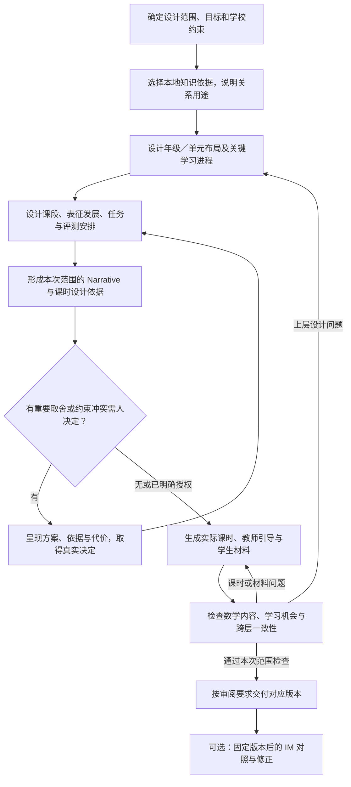

# 独立课程与教学设计 Harness：能力范围与推进路线

状态：候选架构分析与设计论证，尚未实现生成器或运行教学评测。已确定的项目目标、实施路线、原则和职责边界统一以 [README](../../../README.md) 为准；本文保存如何落实这些目标的分析，不构成第二份项目约定。

## 本项目要形成什么能力

目标是独立、强大且可靠的数学课程与教学设计能力。上游四项 Skills 是当前首选的教学执行设计起点和质量比较基线；目标是在可比任务上达到并争取超过其水平。新增课程体系不限制于四项原能力，具体课堂形式和宿主操作是否采用另行判断。

**课程体系设计是新增的核心能力。** Harness 必须能从数学目标和关系依据形成 Grade／Unit／Section／Lesson 的组织、学习进程、任务与证据安排，并解释这些选择。只有目录、课时清单或若干独立教案，均不构成这项能力。

Web 产品、身份权限、学习证据、Learner Model 和教学约束作为外部提供的前提；Learning Commons 本地化已由外部项目完成。本仓库负责使用这些前提完成教学设计；不建设数据本地化、学习者模型或学校治理平台。

## 当前采用的 IM 参考方式

用户明确允许自主取舍 IM 的使用方式。本轮采用的工作路线是：**先独立设计，再做有依据的 IM 内容对照与修正。**

- 生成自有课程主方案时，以选定标准、Learning Components、适用学习进阶、学校约束和本项目质量要求为依据，不将对应 IM 单元树、课堂阶段名或课时数作为模板。
- 可以采用有教学理由的原则，例如通过表征支持概括、明确知识衔接、让任务产生可观察证据；采用理由由本项目说明，不能以“IM 这样做”代替。
- 固定原创版本后，再读目标与范围可比的 IM Narrative、依赖图、实际任务与评测，对照覆盖、进程、任务与证据，决定是否修正。参考课的出版者依赖不自动成为自有课程依赖。
- 保留原创版本 A、参考对象 R 和修订版本 B；记录差距、所用证据、采纳或拒绝建议的理由。比较条件不等价时先说明差异，不把总分直接当结论。

这种分开组织输入的方式便于判断改进来自何处；它不保证模型预训练中从未见过 IM。对照只证明在给定评价条件下的内容差异，不证明学生学习效果。

参考研究见 [数学课程体系设计](curriculum-design-capability.md)，其中同一 Grade 6 → Unit 4 → Section C → Lesson 10 的官方材料展示了各层 Narrative 的不同工作。该链是研究样本，不是本项目被固定的教学结构或首个年级。

## 本地知识图谱怎样参与设计

已实际只读检查本地数据，见 [本地 Learning Commons 图的教学设计用法](learning-commons-integration.md)。数据获取不再是当前规划问题；重点是使用实体、关系与来源的正确语义。

| 设计工作 | 使用的依据 | 必须保留的区别 |
| --- | --- | --- |
| 确定本次目标 | 选定框架的标准及其支持 LC | 州标准与 CCSS 的部分重合不等于目标完全相同 |
| 识别学习基础和后续发展 | buildsTowards 的入向与出向关系，及任务实际调用的知识 | 学习支持关系不是全部必须先通过的严格先修 |
| 研究概念联系 | relatesTo 及具体数学理由 | 有联系不等于要合并进本课或形成必修顺序 |
| 比较来源课程 | hasPart、hasDependency、hasEducationalAlignment | 组成、课程依赖和目标对齐各有不同含义，IM 的依赖属于其设计 |
| 形成自有教学进程 | 图中依据＋本次任务、学习者和学校约束＋设计判断 | 原始图边与本项目推导或取舍分别记录 |

例如，1.G.A.1 的四个 LC 支持图形属性识别、区分和构造。适合的课时应围绕这些数学工作设计，而不是因属于 K–2 就加入加减故事题。另一方面，2.G.A.2 的数组和长方形任务可以与运算目标有实际联系，不能反过来禁止所有几何与运算整合。

## 从课程体系到课时的执行主线

图中是数学设计工作，不是已选定的 LangGraph 节点。每个阶段可能包含多次模型推理、图查询、计算和修订；上层设计与下层试做应往返。不能把教师每次回应都解释为重做全部设计，也不能只保存“该阶段完成”的布尔值。

课程覆盖应按合适层级检查：年级和单元负责各自约定的完整目标范围；单课承担其在学习进程中的目标与证据。**不再要求每课无条件覆盖其关联标准的全部结构情形。** 必须区分本课教授、作为基础使用和为后续准备的内容，并检查完整课程范围是否最终兑现。

## 五类能力各自承担什么

| 能力 | 必须完成的实际工作 | 与其他能力的关系 |
| --- | --- | --- |
| 课程体系设计 | 目标分配、进程与课段组织、各层 Narrative、学习机会与评测、设计取舍及影响分析 | 提供课时位置与设计依据，并接收下游可教性和质量反馈 |
| 课时与材料设计 | 将本课目标转成真实数学任务、解法、表征、教师引导、学生材料和学习检查 | 接收课程上下文；也能处理范围明确的独立课时请求 |
| 教学适配 | 根据学习证据改变支持、任务入口和拓展，保留应达到的数学目标 | 使用实际课时及其课程职责；不默默修改所有学习者的课程基线 |
| 教师备课 | 围绕真实课时和任务形成理解，讨论难点、方法与应对 | 教师参与有教学意义，不能全部缩成一次批准；是否采用某个上游固定问法需另判断 |
| 理解度检查 | 设计能区分目标理解及相关困难的任务，分析可能表现与后续教学 | 使用本次目标、课程位置与证据目的；不机械固定题量或所有题型采用同一检查 |

既有四项的源码盘点和详细流程分析完整保留，作为教学工作、Context 与 LLM 使用方法的首选参考。原规则不自动构成产品约束；每个重要改动说明原步骤的目的、替代机制及验证证据。在没有更好效果的证据前，不能用泛化流程替代这些已有分析。

## Context 与 LLM 是当前执行设计的核心

从具体任务反推模型需要知道什么、何时读取什么、应完成什么判断和工具工作、怎样检查与修订。上下文涵盖各层课程及 Narrative、教学规则、本地图依据、实际任务、相关学习证据、学校约束、真实人类决定与当前版本；按阶段和用途装配，并保留可回取的来源。

生成、教师亲做任务、隔离读题和回应解释需要不同的可见信息。模型调用之间应延续已形成的设计内容，不能只接一个主题重新生成。外部产品提供有权限的输入并承载交互；Harness 返回真实待答请求、产物及检查和执行证据。详细起点见 [Context 与 LLM 使用方法](context-and-llm-design.md)，随当前流程分析推进；Agent Server 部署细节仍按原时点强化。

## 可靠性要落在什么地方

- **知识使用**：每个采用的目标和联系有具体来源与用途；图关系、设计推断和个体学习事实分别保存。关系为空不等于没有学习基础，也不允许补造来源记录。
- **数学和教学工作**：实际试做题目、核对解法、图形、数量与单位，检查学生需要完成的思考。目标写得完整而任务只要求机械操作不能通过。
- **跨层一致性**：Narrative 中承诺的理解转变，在课段、课时、任务与评测中有可定位的学习机会。诊断与阶段达标评测分别处理；后者检查学习机会或已学前提。检测关键目标无任务、下游使用了未安排建立的基础等问题，并判断是否有明确的外部已学前提。
- **修订与恢复**：保存设计版本、依据、真实人类决定、产物和对应检查。目标、表征或顺序变化时沿实际设计关系分析影响；版式变化不重建课程，旧审批不能覆盖改变了数学内容的新版本。
- **交付范围**：蓝图可审阅、单元可教学、整年材料完成分别声明。返回实际产物和已完成的检查，不把文件存在、模型自报或人类满意当成全部质量证明。

学校约束需要进入内容设计：教学日历、课堂资源、教师准备负担、学生工作量和适用支持。外部系统负责最终发布与治理，Harness 提供其需要的检查和追溯依据。

## 接下来的规划与首个贯通验证

[课程体系设计如何形成可教、可检验的学习进程](../issues/12-curriculum-design.md) 已收敛能力层约定，详细分析保留 [课程与课时的双向交接](curriculum-design-capability.md#课程与课时的双向交接) 及静态反例。[执行流程和状态](../issues/03-execution-structure.md) 与 [人类参与与恢复](../issues/07-hitl-protocol.md) 已进一步收敛各能力自己的流程、Context、修订、回应和停止边界，详见 [执行结构](execution-structure-design.md) 与 [HITL 设计](hitl-design.md)。后续接口及原型可据此展开；结构和交互语义基线不等于运行机制已验证。

首个贯通验证建议选一个数学单元，同时说明它在年级课程中的位置、进入条件和后续去向，展开真实课段、课时、材料及评测，并验证一次跨层改动。这样能检验新增核心能力，无需先生成整套 K–12 内容。具体年级／主题以本地目标与验证需求选择，当前研究样本不自动决定它。

LangChain／LangGraph／Agent Server 仍在技术方向内；完整运行时、会话、任务执行、存储和部署运维按既定安排在实现前集中强化。已有局部 LangGraph 研究是参考，不替代这一步，也不应重新中断当前课程设计分析。

本轮已核对本地数据和官方课程说明，尚未实现课程或材料生成、模型 A/B 对照或课堂验证。
