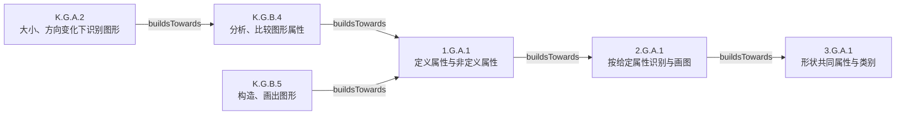

# 本地 Learning Commons 图的教学设计用法

本地 SQLite 核查日期：2026-09-14；当前会话插件与本地 Studio HTTP API 实测补充日期：2026-09-15。本文依据用户指定的[已有研究目录](/Users/libo/Mathematics/k12-learning/research/learning-commons/README.md)、其明确指向的本地 SQLite、本地服务及 Learning Commons 官方关系定义，替换此前以远程接口可用性为中心的报告。

**前提：Learning Commons 数据的本地化已由其他项目完成。** 本项目消费既有数据，研究如何用它设计可靠的数学课程与教学。下载、认证和数据本地化建设不属于本报告。末尾按用户要求附当前会话插件与本地 API 的只读实测，不将远程服务改为项目的必要依赖。上游 Skills 和 IM 是可取舍的设计参考，不规定我们自己的课程结构。

已固化的消费要求见 [教学 Harness 的知识使用约定](../../../docs/references/knowledge-consumption-contract.md)；本文保留来源、事实、SQL 与设计推断。固定查阅文件及本轮有限查询的证据见 [reference-baseline.json](../../../docs/references/reference-baseline.json)。约定与某次快照的计数分别维护。

## 结论与设计方向

本地 KG 可以同时支撑两个层次：用标准、学习组件和学习进阶设计自己的课程目标与连续性；用已有课程层级、依赖和标准对齐研究一套课程怎样组织这些目标。后者是供比较和解释的出版者方案，不能直接变成我们课程的唯一顺序。

课程体系设计应当成为独立能力：生成 Grade／Unit／Section／Lesson 的目标分配、安排理由、前后连接、任务与评价证据，再把已确定的课时位置和目标交给备课等能力。图提供可追溯的依据；如何组织成可教、可学、可实施的课程，仍须由 Harness 的设计、检查与人类审阅共同完成。

此前把“K–2”直接映射为“必须有加减故事题”，绕过了本次目标及其图关系。正确的入口是目标标准与其支持组件：形状属性课应形成几何观察、分类、构造和论证任务；确有几何与数的联系时，按具体目标和关系采用。下文给出了两类实际数据例子。

## 已检查的证据

| 来源 | 本次实际做了什么 | 证据边界 |
| --- | --- | --- |
| [关系拓扑](/Users/libo/Mathematics/k12-learning/research/learning-commons/04-relationship-topology.md)、[机器可读关系表](/Users/libo/Mathematics/k12-learning/research/learning-commons/schema/relationships.yaml) | 读取方向、端点与语义说明，并对照官方定义 | 原研究基于 v1.11.0；不能作为未来版本的固定全集 |
| [实体 schema](/Users/libo/Mathematics/k12-learning/research/learning-commons/03-entity-schema.md)、[LC 覆盖研究](/Users/libo/Mathematics/k12-learning/research/learning-commons/16-ccss-learning-component-coverage.md) | 读取课程字段与州／CCSS 覆盖结论 | 覆盖统计沿用已有研究，本次没有重做全库统计 |
| [本地数据库](/Users/libo/Mathematics/k12-learning/learning-data/sqlite/lc-v1.11.0.db) | 以 `mode=ro` 打开，并设置 `PRAGMA query_only=ON`；读取 schema、快照和有限几何关系样本 | 实际执行了只读 SQL；没有写库，也没有生成课程或运行教学评测 |

数据库 `snapshot` 返回 `namespace=lc`、`version=v1.11.0`、`loadedAt=2026-08-19T02:21:52+00:00`。导入记录的节点 SHA-256 为 `ffc142f72450c9692a9e547207cba3e0cd4012eb00c1d1be6aaced165c4139c5`，关系 SHA-256 为 `74389d5e438e7a7f23e1128539827533ae08acacc73c9f3e4c81cc07a8916b21`。这两个值是快照元数据，并非本次重算的文件摘要。

## 关系怎样进入教学设计

| 图中方向 | 能支持的设计工作 | 不应混成的含义 |
| --- | --- | --- |
| `LearningComponent → supports → Standard` | 将宽泛目标拆为可教、可观察的技能与概念；核对任务实际覆盖什么 | LC 不是现成的课程顺序；标准之间的进阶也不是 LC 之间的直接边 |
| `Standard → buildsTowards → Standard` | 追踪本目标的基础与后续学习，提出诊断、支架或扩展候选 | 表示学习成功的支持关系，不是必须全部先通过的严格先修门槛 |
| `Standard → relatesTo → Standard` | 找概念或技能联系，为整合与复习提出候选 | 不表达前后顺序，不应转换成必修依赖 |
| `Standard → hasChild → Standard item` | 确定标准树归属，区分领域、分组与具体标准 | 标准层级不等于课程层级 |
| `Course / Grouping → hasPart → Grouping / Lesson` | 读取课程结构；在研究出版者设计时恢复课程、单元、节和课时位置 | 层级只说明组成，不能单靠层级推定教学先修 |
| `Curriculum element → hasDependency → prerequisite element` | 理解该出版者明确记录的课程依赖 | 方向与 `buildsTowards` 相反；不自动约束我们自己的课程 |
| `Curriculum element → hasEducationalAlignment → Standard` | 比较某课是在利用既有能力、教授目标还是准备后续学习 | 对齐边不是课堂任务正文，也不是已验证的教学效果 |
| `State standard → hasStandardAlignment → CCSS standard` | 使用共享 LC 比较内容重合，辅助跨框架查找 | 内容重合不是完全等价，更不是学习进阶 |

LC 与 `supports` 的解释见[官方学习组件定义](https://docs.learningcommons.org/knowledge-graph/schema-reference/learning-components)；两类标准间关系的区分见[官方学习进阶定义](https://docs.learningcommons.org/knowledge-graph/schema-reference/learning-progressions)。课程的组成、依赖与对齐见[官方课程 schema](https://docs.learningcommons.org/knowledge-graph/schema-reference/curriculum)，跨框架含义及方向见[本地关系拓扑核查](/Users/libo/Mathematics/k12-learning/research/learning-commons/04-relationship-topology.md)。

实现建议：查询结果保留节点、边、方向、来源和路径，而不压缩成一个无区分的“相关知识列表”。对学习进阶寻找基础时查入边，寻找后续时查出边；课程依赖寻找前提则查出边。跨多跳得到的联系标明推导路径，不能冒充来源中已有的直接边。

## K–2 几何的本地实测

### 1. 从具体目标与学习组件出发

本次先从名为 `Common Core State Standards for Math` 的框架沿 `hasChild` 验证目标归属，没有仅凭 `Multi-State` 判断 CCSS。框架节点为 `6becf2d7-2232-5ead-983f-9f0a4de24ab7`。

以 `1.G.A.1` 为目标，标准节点为 `c14e392d-1c27-5aca-9bef-259a8403dd60`，CASE UUID 为 `6b9bd535-d7cc-11e8-824f-0242ac160002`。从入向 `supports` 查得四个 LC：

| LC 标识 | 内容概括 |
| --- | --- |
| `205ba874-5f75-5b0d-b984-8668f1c267d9` | 依据定义属性构造形状 |
| `a8e2fb9e-5a1f-54fb-b72c-d4d4d36fb577` | 区分定义属性与非定义属性 |
| `baa38680-9f6c-5684-993d-9c5a79813e04` | 用定义属性识别三角形、正方形、长方形、梯形等平面图形 |
| `eb8d0c94-fd12-5927-a25b-8b1917b1a59f` | 识别形状的定义属性 |

这是几何目标。候选任务可以要求学生判断旋转后的图形、区分颜色与边数的作用、画出符合属性的图形并说明理由。上述任务是本报告的设计推断，不是从 KG 取出的现成课文；它们没有需要加减故事题的依据。

### 2. 标准进阶与相关关系是两种证据

实测存在下列 `buildsTowards` 路径，关系作者均为 Student Achievement Partners：



可复核的边包括：`K.G.B.4 → 1.G.A.1` 的 `0c954266-41e6-549f-abdf-083059ab0b77`，以及 `1.G.A.1 → 2.G.A.1` 的 `2a026d80-a5e2-5ab1-8bc1-fa8c78a53e5b`。此外，`K.G.A.2` 与 `K.G.A.1`、`K.G.A.3` 各有实存双向 `relatesTo` 记录。本次样本存在双向边，不代表所有相关关系都可假定已存双边。

据此，若 Learner Model 提示学生受图形朝向干扰，可回到识别与比较的具体基础，再设计连接本课定义属性的支架。不能因为走到某个邻居，就把其整条标准的全部内容加入本课；选用仍需说明它支持当前任务的哪一步。后续年级的节点可以帮助解释长期目标，也不意味着本课必须提前教授它。

### 3. 已有课程给出了另一条可比较的实现

反查 `1.G.A.1` 的课程对齐，得到 `Some Triangles, All Triangles`，课时节点为 `im:f531379f-97fb-5d09-8d36-acc631ff3955`。沿 `hasPart` 反向追溯得到：

```text
Grade 1
└── Unit 7: Geometry and Time
    └── Section A: Flat and Solid Shapes
        └── Lesson 5: Some Triangles, All Triangles
```

该课对 `1.G.A.1` 的记录为 `alignmentType=teaches`、`curriculumAlignmentType=addressing`。活动名包括 `Triangles and Not Triangles` 和 `Draw Triangles`；本次查到的是结构和活动元数据，不是活动正文。

Section A 还以 `hasDependency` 指向 `Exploring Shapes in Our Environment`；后者是这套参考课程记录的前提。它与上面的标准进阶可以互相参照，不能直接作为我们新课程必须沿用的章节顺序。

同一数据库的 Grade 1 课程概述将加减问题类型主要放在聚焦加减的单元中，同时单列几何形状推理。课程层面同时覆盖多个内容领域，不等于每一课必须包含全部领域。

### 4. 不应反过来禁止数学领域之间的联系

另一个实测目标 `2.G.A.2` 有两个 LC：把长方形分成同样大小的方格行列，以及数出方格总数。其后续边指向 `2.G.A.3` 和 `3.MD.C.6`。

参考课 `Arrays and Rectangles`（`im:53920074-37e5-55ae-9ce9-e45e915ccca6`）同时对齐 `2.G.A.2`、`2.OA.C.3`、`2.OA.C.4`。这里几何、数组与运算的联系有具体课时和标准依据。正确的规则因此是“按本次目标及证据选择联系”，而不是“所有几何课都补运算”或“几何课一律不能涉及运算”。同一课与标准之间还可能有多条不同角色的对齐记录，查询时应保留角色，不把它们合成一个布尔值。

以上实例全部来自本次对指定 SQLite 的只读查询；并非模型回忆或工具名称推测。

## 对课程体系设计能力的含义

以下是据上述证据提出的 Harness 设计建议，不是 KG 已经替本项目完成的功能。

1. **先确定自己的课程目标。** 按选定标准框架和年段构建目标集合，读取 LC 细分内容与适用学习进阶。明确目标是安排到哪个单元、哪一节、哪些课时，以及分别需要什么证据。
2. **形成候选课程结构与 Narrative。** 为 Grade／Unit／Section／Lesson 分别写出为何这样安排、承接什么、发展什么、怎样通过任务和评价看见进展。先修支持、阶段目标、回顾与后续迁移分别说明；不把图邻居罗列当作课程叙事。
3. **将自己的课程与来源课程分开记录。** 我们生成的课程有自己的标识、版本、结构和安排理由；KG 中 IM 的层级、依赖和对齐保留来源身份，可用于设计参考或后续比较。即使选择相同的单元安排，也需要本课程的理由和检查。
4. **给课时执行提供明确位置。** 下游备课能力接收本课目标、前后衔接、已教与将教内容、材料约束以及 Learner Model 中与本任务有关的证据，避免每次从一个孤立标准重新猜课程背景。
5. **检查课程与课时的相互一致性。** 课程目标是否有承载课时和评价证据；后续任务是否依赖未安排学习的能力；课时是否偏离本阶段目标；修订一个单元是否影响后续课时。图关系产生待检查的依据，最终判断结合任务内容与明确的设计选择。
6. **给教师／课程设计者审阅有内容的方案。** 审阅对象应是目标、安排理由、代表任务、评价依据和设计取舍；人类确认记录具体版本。结构或目标变化后，重新检查受到影响的课时与内容。

本次 SQLite schema 中 `Course` 有 `description`，`LessonGrouping` 与 `Lesson` 没有对应的 Narrative 正文字段。因此，现有骨架和对齐足以支持结构研究，但不能被称为已读取 IM 各级完整 Narrative。对这些设计叙事的参考研究需使用其实际正文；这是教学设计依据的研究，不是本报告重新引入数据本地化任务。

## 数据语义与质量检查

“数据已本地可访问”是确定前提；“每个目标都有同样丰富的关系”“图自动保证设计正确”则不是。已有 [LC 覆盖研究](/Users/libo/Mathematics/k12-learning/research/learning-commons/16-ccss-learning-component-coverage.md) 显示，在 v1.11.0 中数学共有 4,551 个 LC，其中 CCSSM 使用 1,797 个，另有 2,754 个由州标准使用而未连接到 CCSSM。不能把 CCSS 当作数学 LC 的完整全集，也不能把 crosswalk 的部分重合视为全部目标等价。

Harness 应区分以下情况，并在执行记录中说明，而不是退回远程“工具未连接”的叙事：

- 目标与图中节点已匹配，查询到可用关系；保存采用哪些证据以及为什么采用。
- 节点存在而某类关系为空；这是该快照的关系事实，不代表学生没有前置需求，也不自动触发编造图边。
- 图中存在候选联系但不适合本课；保留未选理由，避免机械地扩大教学范围。
- 设计者或模型提出新的联系；标记为本项目推导／待审阅的依据，与原始 KG 关系分开。
- 课程结构修改后，原先采用的路径或阶段假设不再成立；重新检查受影响的设计，而不只替换材料中的课号。

原研究的[未物化关系说明](/Users/libo/Mathematics/k12-learning/research/learning-commons/15-unmaterialized-relationships.md) 也提醒：schema 中定义一个关系，不等于某个快照已有实例。本项目按外部数据服务实际提供的版本和能力消费；不把其他项目的数据建设列为本仓库工作，也不把模型生成的误概念或策略伪装成来源中已有记录。

## 新参考带来的补核与固化（2026-09-14）

本轮阅读用户指定的 [IM 来源范围与完整性研究](/Users/libo/Mathematics/k12-learning/.scratch/im-v360-content-import/research/01-source-scope-rights-and-completeness.md) 和 [LC／AccessIM 结构及格式漂移初测](/Users/libo/Mathematics/k12-learning/.scratch/im-v360-content-import/research/02-lc-structure-and-accessim-schema-drift-audit.md)，并补读 LC 的血缘、关系、未物化和 LC 覆盖报告。关键关系与对象定义已回到当前官方 schema 复核。

### 对本项目新增的具体事实

| 已核查内容 | 本轮取得的证据 | 对本项目的含义 |
| --- | --- | --- |
| 标准代码和框架版本 | 官方要求以框架消歧并核对 current 状态；只有州与学科不足以选择当前标准。既有 `1.G.A.1` 样本的图内 ID 与 CASE UUID 确实不同 | 目标解析必须保留采用的框架及身份，不能只靠代码或覆盖图内 ID。[官方标准 schema](https://docs.learningcommons.org/knowledge-graph/schema-reference/standards) |
| 非树课程关系 | 本轮只读 SQL：从 18 个 Course 沿 `hasPart` 遍历，仍有 59 个 Activity 在树外，其中 58 个经任一方向的 `hasReference` 连到树内；与旧初测数量相符 | 课程 Context 按需取得引用关系，不能只沿四层树取内容。旧报告称这些为 Modeling Prompt；本轮验证的是数量、身份与连接，没有逐个核对其全文 |
| 对齐角色原值 | 本轮查询得到 `assess/practicing` 112 条、`teaches/addressing` 33,179 条、`teaches/building_on` 8,995 条、`teaches/building_toward` 10,521 条 | 保留原始值和本次解释，不能把文档示例中的 `assesses` 拼写或少数角色写死为唯一枚举；数量只属于这份快照 |
| 逻辑字段和规范化投影 | 当前 SQLite 的 `StandardsFramework` 物理表没有 `isCurrent` 列，`snapshot.zeroInfoFields` 则保存 `isCurrent=true`；同一元数据还保存被提取的常量字段 | 消费方按外部投影约定理解字段，不直接照搬官方 JSON schema 写 SQL，也不将缺列解释为来源信息不存在；本项目不重做投影 |
| 共同模型与个体实例 | 官方 LC／LVN 对象是学段与学科的研究 profile，包含相关因素及策略；例如 Math 3–6 | 可以作为共同建模基础，由外部系统关联学生并承载个人状态；研究因素存在不证明该学生已表现出相应困难。个体实例是本项目的建模解释，不声称官方已提供状态更新算法。[官方教学实践 schema](https://docs.learningcommons.org/knowledge-graph/schema-reference/instructional-practices)、[Digital Promise 模型说明](https://lvp.digitalpromiseglobal.org/model) |
| 课程语言与跨来源匹配 | 本地 18 个 Course 均为 `en-US`。旧导入报告还比较了全国版／California、西语与不同页面类型，并只验证了有限共享出版者编号 | 共享编号可作带证据的映射依据，不能据同名或目录数量一致宣布 LC 与全部 IM 正文等价。本轮未重跑完整 AccessIM 对比 |

全部新增 SQL、结果与 snapshot 元数据已写入 [证据基线](../../../docs/references/reference-baseline.json)，连接采用 `mode=ro` 和 `query_only`。未重新计算原始 JSONL 摘要，未导入或修改外部数据。

### 导入研究中值得迁移的设计经验

**完整性分开看。** 目录、组成与引用、实际正文／图形／附件、版本身份分别检查。这对 Harness 的直接意义是：模型声称“基于某原课”时必须确实取得相应内容；资源清单不能代替实际材料，目录覆盖也不能证明教学内容充分。

**四层设计职责不是封闭的对象树。** Activity、Practice、Assessment、资源和跨课引用各有用途。教师／学生／家庭受众，以及网页、讲义等载体是另外的维度；按任务保留差异，不把来源中的所有内容拼成同一段检索文本。课程设计可使用自己的组织，不能因来源使用某页面形状就固定本项目对象模型。

**变化要知道影响什么。** 外部研究区分课程内容／结构变化与来源网页格式变化。本项目消费外部已提供的版本与变化信息，回查采用的目标、路径、材料和决定；网页解析、格式指纹算法及数据发布仍归外部导入项目，不进入本 Harness 的构建任务。

外部研究关于全部禁止 Generation 输入、仅允许人工复核及特定首批课题的规定，是其所在项目的产品决定。本仓库使用 README 的原创 A、参考 R、修订 B 路线；不能把那些限制或选题直接照搬，也不能把“允许查看来源”推导成任意对象可以给任意受众或模型使用。使用范围随来源和本次任务明确记录，本轮不作材料再利用的法律判断。

### 固化的层次与证据边界

- 稳定身份、关系方向、框架选择、来源与推断、版本延续和对象使用范围，进入 [知识使用约定](../../../docs/references/knowledge-consumption-contract.md)，供 Context、依赖与评测任务必读。
- 共同研究模型、个体实例及 LC 的概念关系进入 [领域词汇](../../../CONTEXT.md)。
- 八份已读外部研究文件的内容摘要、当前数据投影元数据和七项查询观察进入 [证据基线](../../../docs/references/reference-baseline.json)。清单用于定位和变更检测，未复制完整外部资料。
- `15/18` 文档模型、`8/10` 公共物化类型、具体计数、物理列、查询示例及网页格式均保留版本条件，不升级为永久运行时全集。当前官方旧 `graph-reference` 地址已重定向到 `schema-reference`；本轮引用指向复核后的地址，旧报告仍按其当时证据阅读。

IM 的教学方法、学段差异和执行含义另见 [IM 方法论研究对教学 Harness 的补强](im-design-methodology-transfer.md)；该报告不替代本文的数据语义或原 Skills 流程。

## 可复核查询

下列查询适用于本次检查的 SQLite schema。连接必须使用只读模式；示例标准标识来自上文实际查询。

```python
import sqlite3
from pathlib import Path

path = Path('/Users/libo/Mathematics/k12-learning/learning-data/sqlite/lc-v1.11.0.db')
connection = sqlite3.connect(path.as_uri() + '?mode=ro', uri=True)
connection.execute('PRAGMA query_only=ON')
```

```sql
-- 标准的组成学习组件：沿 supports 入边。
SELECT lc.identifier, lc.description
FROM rel_supports r
JOIN node_LearningComponent lc ON lc.identifier = r.sourceIdentifier
WHERE r.targetIdentifier = 'c14e392d-1c27-5aca-9bef-259a8403dd60';

-- 本目标的学习基础：沿 buildsTowards 入边，不倒置储存方向。
SELECT r.identifier, s.statementCode, r.author
FROM rel_buildsTowards r
JOIN node_StandardsFrameworkItem s ON s.identifier = r.sourceIdentifier
WHERE r.targetIdentifier = 'c14e392d-1c27-5aca-9bef-259a8403dd60';

-- 来源课时与目标的对齐角色。
SELECT l.identifier, l.name, r.alignmentType, r.curriculumAlignmentType
FROM rel_hasEducationalAlignment r
JOIN node_Lesson l ON l.identifier = r.sourceIdentifier
WHERE r.targetIdentifier = 'c14e392d-1c27-5aca-9bef-259a8403dd60';

-- 限深恢复某来源课时的课程祖先；仍需按节点类型读取名称。
WITH RECURSIVE ancestors(identifier, depth) AS (
  SELECT 'im:f531379f-97fb-5d09-8d36-acc631ff3955', 0
  UNION ALL
  SELECT p.sourceIdentifier, a.depth + 1
  FROM rel_hasPart p JOIN ancestors a ON p.targetIdentifier = a.identifier
  WHERE a.depth < 4
)
SELECT * FROM ancestors ORDER BY depth;
```

## 原报告的处理

此前的 MCP／REST 工具清单、账户与材料访问前提只属于当时的接口文档研究，不再支配本项目架构。本报告撤下以它们为核心的下一步和降级建议；后续接口设计应围绕本地图的实体、关系与证据用途展开。

**验证状态：** 已读已有研究、核对官方核心关系语义、实际只读查询本地快照。尚未实现课程生成、Narrative 生成、规则引擎、教学材料或学习效果评测；本文的设计建议需要在后续执行方案与验证中落实。

## 当前会话 Learning Commons 插件实测（2026-09-15）

用户要求测试当前对话中的插件是否可以直接使用。在实际可调用工具清单中找到 Learning Commons 的三类工具，依次执行四次只读调用，全部返回 `isError: false`。没有调用 IM 课程或材料查询。

针对“是否顺带取出 IM”的追问：本次返回只有标准正文与身份、LC 描述与身份、前后向标准及匹配信息，没有 IM 单元、课时、活动、Narrative 或课程正文。当前三类工具的公开返回结构也不含课程材料，进阶工具说明来源为 SAP Coherence Map。这能支持“此次没有顺带返回 IM 课程内容”，不能延伸为所有 LC 描述历史上绝无 IM 参考；响应没有给出逐条派生来源。其他环境若另行提供课程查询工具，需按那次实际工具及结果判断。

| 实际工具 | 输入 | 实际结果 |
| --- | --- | --- |
| `learning_commons_find_standard_statement` | `code=8.F.4`，`academicSubject=Mathematics`，`jurisdiction=Multi-State` | 1 个标准；主代码 `8.F.B.4`、别名 `8.F.4`、八年级、完整标准正文及 CASE UUID |
| `learning_commons_find_learning_components_from_standard` | 上一步实际返回的 CASE UUID | 11 个 LC，分别带描述及稳定标识，涉及变化率、初始值、不同表征和线性建模 |
| `learning_commons_find_standards_progression_from_standard` | 同一 UUID，`direction=backward` | 2 个标准：`7.RP.A.2`、`8.F.A.3` |
| `learning_commons_find_standards_progression_from_standard` | 同一 UUID，`direction=forward` | 8 个标准：`HSF-LE.A.1`、`HSA-CED.A.2`、`HSF-BF.A.2`、`HSF-LE.A.2`、`HSF-LE.B.5`、`HSF-IF.B.6`、`HSS-ID.C.7`、`HSF-BF.A.1.a` |

本次 CASE UUID 为 `6b9ef36a-d7cc-11e8-824f-0242ac160002`，未以本地图内部 ID 代替。后续调用按工具要求回传最近结果的 `session_id`；它仅用于插件分析，不是课程身份或 Harness 任务身份。

进阶工具说明其依据为 SAP Coherence Map。本次前后向结果均为 `matchType=exact`、`alignmentScore=1`；这表示输入与所用标准的匹配，不表示先修必然性、学生掌握概率或教学设计正确率。返回的 `learningComponents=[]` 属于该工具 exact 路径的响应形式，不等于这些标准没有 LC。

**结论与边界：** 当前对话可直接使用这三类插件工具辅助规划及数据核查。此次没有测试产品后端接入，也没有对比插件数据与本地 v1.11.0 的版本一致性；本次响应未给数据快照版本或 LC 逐条来源链，不能仅以连通成功认定整个返回集符合隔离原创实验的全部来源要求。现有本地数据消费路线不变，不据此恢复已关闭的远程开通工作。

## 本地 Studio HTTP API 实测（2026-09-15）

用户提供 `http://127.0.0.1:8000` 与外部 `apps/studio-server` 路径。本轮读取源码及契约，并执行限定标准／学习组件的一组 GET 请求；没有修改外部项目、读取 IM 课程材料或调用 Gemini。该服务的一跳查询使用 PostgreSQL，局部图使用 Neo4j；不是此前 SQLite 查询路径的别名。

### 文档与生成来源

- [Swagger UI](http://127.0.0.1:8000/api/docs)：HTTP 200，返回 Swagger 页面。
- [在线 OpenAPI](http://127.0.0.1:8000/api/openapi.json)：HTTP 200，69 个路径，解析后的 JSON 与 [本地契约文件](/Users/libo/Mathematics/k12-learning/apps/studio-server/contract/openapi.json) 完全一致。
- [Python 导出入口](/Users/libo/Mathematics/k12-learning/apps/studio-server/src/studio_server/contract.py)：调用 `build_api_app().openapi()`，从 FastAPI 路由及数据模型生成文档，再确定性序列化；导出不读取知识数据。Python 代码为权威，JSON 为生成产物。
- [同步及漂移检查脚本](/Users/libo/Mathematics/k12-learning/scripts/check_contract_drift.py)：外部项目根目录的 `pnpm run sync:contract` 更新 OpenAPI 和 TypeScript 客户端。本轮只读检查脚本，没有执行同步或完整契约测试。

本次契约文件 SHA-256 为 `94e75a78a619069bf2d604b459d2c975d464682dc3d4698a8479608c35c9d3d5`。在线契约一致不表示所有业务接口都已通过测试。

### 实际知识查询

`GET /api/health` 返回 `status=ok`、服务版本 `0.1.0`、快照 `lc/v1.11.0`、`schemaVersion=2`、`cleaningVersion=v2`；图能力为 `available`。健康报告中的图状态来自启动探测，不保证此后每次查询成功。快照摘要：

```text
nodesSha256: ffc142f72450c9692a9e547207cba3e0cd4012eb00c1d1be6aaced165c4139c5
relationshipsSha256: 74389d5e438e7a7f23e1128539827533ae08acacc73c9f3e4c81cc07a8916b21
```

以下知识请求均携带 `sourceSnapshot=lc/v1.11.0`。先搜索标准代码，再依据返回的框架路径选定 **Common Core State Standards for Math**，最后读取标准详情核对 `jurisdiction=Multi-State` 和 CASE 身份：

| 请求（共同前缀 `/api/browse`） | 本次结果 |
| --- | --- |
| `/search?q=8.F.B.4&kind=StandardsFrameworkItem&limit=100` | 31 条命中，`hasMore=false`；包含多个州，不能取第一条作为 CCSS |
| `/nodes/StandardsFrameworkItem/{standard}` | CCSS 标准正文、代码 `8.F.B.4`、别名 `8.F.4`、CASE UUID 及 attribution |
| `/standards/items/{standard}/learning-components` | 11 个组件，带稳定身份、定义、作者、原文与中文投影；`lcVersionId=lc/v1.11.0` |
| `/nodes/StandardsFrameworkItem/{standard}/relationships?type=buildsTowards&direction=incoming&endpointKind=StandardsFrameworkItem&limit=100` | 2 条入边：`7.RP.A.2`、`8.F.A.3`；无下一页 |
| 同一关系路径，`direction=outgoing` | 8 条出边，标准代码集合与上节插件样本相同；无下一页 |

这里 `{standard}` 是本地 canonical identifier `0ff0d447-960a-5116-9fde-5989f4fc88fc`；其框架 ID 是 `6becf2d7-2232-5ead-983f-9f0a4de24ab7`，CASE UUID 是 `6b9ef36a-d7cc-11e8-824f-0242ac160002`。本 API 路径使用前者，插件使用后者。尝试以 CASE UUID 调用通用搜索得到空集；节点详情仍有这个字段，因此不能把该空结果解释为标准不存在，也不能假定搜索覆盖所有字段。

进阶边逐条提供 edge identity、方向、发布者 **Student Achievement Partners**、`provenance=source_fact` 和 attribution。另取一个组件 `5f3a9252-5252-54ed-9c00-f4c910b3b9a4` 的节点详情，确认作者及 attribution 指向 **Achievement Network**。本地 API 能提供比此次插件响应更明确的来源记录；这不等于已经追溯全部组件的历史派生链。进阶边仍按知识使用约定解释为学习支持联系。

### 对两类任务 Context 的用途

用户在本次核查后明确：项目自始至终只使用 CCSS。以上跨州搜索只是验证通用 API 的行为，不代表产品需要框架选择。后续固定 CCSS Mathematics 框架身份，通用搜索结果及进阶标准端点均按该身份限定；不引入州标准适配或向教师询问框架。

整体课程方案可从框架目录及 `/frameworks/{identifier}/grade-levels/{grade}/items` 按框架、年级读取标准。契约中该端点按 `parent` 展开直接子项并分页，不能把首层或第一页当全年完整目标；本轮未遍历全年标准。单元设计所需的标准正文、LC 和入／出向进阶已在上述样本读通，可以继续用于输入范围讨论。

运行时只需把任务需要的查询包装成少量工具，不把 69 个产品路径全部交给模型。使用原文 `value` 时保留中文 `projection` 的机器翻译／审阅身份；不将翻译当原始标准。关系接口即使筛选了 `edges`，仍返回不随筛选变化的全部关系分组统计 `groups`，因此给原创模型的 Context 应只保留允许的标准／LC 内容、所需关系和来源，不能原样灌入面向浏览器的整个响应。此次没有读取课程端点或返回的 IM 课程正文。

这确认了本地服务可承担当前所需的知识读取样本，并提供版本与来源依据；两类任务的完整输入包、Harness 工具接入与模型生成仍未执行。后续优先复用现有 HTTP 能力，只有明确缺口出现时再讨论外部接口补充。

## browse、插件与教学评价资源的边界（2026-09-15）

用户追问本地是否只用 `browse`，以及教学要求与评价方法是否已存在于 LC。本轮重新读取运行中的 OpenAPI、当前会话插件工具声明、上游 Skills 评测说明，以及 LC 和 Digital Promise 官方页面。以下区分已有资源与实际可调用接口，不将“某接口未开放”写成“LC 没有这种知识”。

**本地知识读取先使用 `browse` 的适用子集即可。** 当前 tag 下有 23 个操作，涵盖标准、组件、关系、路径及来源记录；此前 CCSS 样本已读通。无需接入外部 Studio 的 authoring、generation 或 localization 才能读取这些知识。`browse` 也包含课程读取，故原创实验仍限定为 CCSS 标准、相关 LC 与允许关系；tag 本身不保证 IM 隔离。健康检查是服务诊断，不是教学知识工具。

运行契约的 `SourceNodeKind` 只有 `Activity`、`Assessment`、`Course`、`LearningComponent`、`Lesson`、`LessonGrouping`、`StandardsFramework`、`StandardsFrameworkItem`。当前不能通过该类型参数读取 `Strategy`、`Factor`、`LearnerModel`。外部 [公共快照审计](/Users/libo/Mathematics/k12-learning/research/learning-commons/08-public-materialization-audit.md) 也记录 v1.11.0 bulk 未物化这三类对象；这一版本观察不代表 LC 完整资料体系或外部项目其他数据集的全集。

**当前会话 Learning Commons 插件同样没有这三类对象的读取能力。** 实际开放工具及返回结构如下；本轮检查工具清单和声明，没有为了证明缺少工具而重复调用无关查询：

| 工具 | 能取得什么 |
| --- | --- |
| `find_standard_statement` | 标准正文、代码、CASE 身份、学段学科及子标准 |
| `find_learning_components_from_standard` | 给定标准对应的学习组件身份与描述 |
| `find_standards_progression_from_standard` | SAP 数学进阶中的前／后向标准、匹配信息；部分匹配时附组件 |

进阶工具说明中含 SAP 的使用建议，但没有策略／因素查询参数，也不返回 LVN 策略、因素或其研究引用。此结论限于当前已安装并向本会话开放的插件，不能由它推断 LC 所有服务都没有相关能力。

### 已有教学与评价依据应优先复用

| 资源 | 已确认内容 | 对本项目的作用与边界 |
| --- | --- | --- |
| 本地 CCSS、LC、SAP 进阶 | 目标要求、细分概念／技能、有方向的学习联系 | 直接支撑目标、任务及学习证据设计；图对齐本身不证明生成材料已满足要求 |
| LC／LVN 教学实践模型 | 官方 schema 定义 `LearnerModel`、`Factor`、`Strategy`，后两者可带 `citations` 与内容；Digital Promise 提供策略研究及应用说明 | 可复用适用的研究与教学支持；当前本地 browse 和插件未暴露，未在本轮接入或启动数据本地化。依据：[LC 定义](https://docs.learningcommons.org/knowledge-graph/schema-reference/instructional-practices)、[Digital Promise 研究流程](https://lvp.digitalpromiseglobal.org/model) |
| 已有 Skills 与公开 rubric | [本地上游评测说明](../../../k12-teacher-skills/evals/README.md) 明示由 LC 与 Anthropic 联合开发；已有课时、适配、备课、理解度检查的规范与逐项通过条件 | 教学工作规范和产物质量评价已有重要起点，应逐项判断复用与调整，不能默认从零重写。官方也明确支持复用、改编与效果比较：[Agent Skills](https://learningcommons.org/agent-skills/) |
| Learning Commons Evaluators | 独立于 KG 的教育内容评分产品；官方说明按研究支持的 rubric 对生成文本评分并解释 | 纳入可复用候选；本轮未调用服务，尚未核查具体可用项对数学单元和跨层一致性的覆盖，也不将其作为必需的新依赖。依据：[Evaluators 介绍](https://learningcommons.org/evaluators/)、[工作方式](https://learningcommons.org/resources/inside-evaluators/) |

因此，“补齐教学要求、生成前确定评价”应落实为**盘点既有依据、选择适用条款、明确实际检查办法，只补经核查未覆盖的部分**。既要设计用于了解学生理解的评价任务，也要验证 Harness 所生成课程与材料的质量，二者的证据对象不同。`Assessment` 课程实体不能直接等同于生成质量评测器。

本项目仍需决定一次运行的具体范围、如何装配和使用适用依据、检查实际产物的什么内容、怎样解释失败，以及何时修订或需要真实人类回应。是否已有可直接采用的完整课程体系 rubric 仍待核查；不能以单课 rubric 或某项 Evaluator 的存在，宣称整个独立课程体系的质量已经得到保障。

### LVN 是什么，怎样公开读取（2026-09-15 补查）

LVN 全称 **Learner Variability Navigator**，是 Digital Promise 的 Learner Variability Project（LVP）提供的研究与教学资源工具。它按学科和发展阶段组织学习因素、因素之间的联系、支持这些因素的教学策略、应用说明和研究引用。它提供共同研究依据；个体学生状态仍须由真实证据建立，沿用本项目已有共同结构／个体实例的约定。来源：[官方研究过程](https://lvp.digitalpromiseglobal.org/model)。

公开访问存在两个需要分别记录的事实：

1. **官方确实提供 API 服务。** [Services for EdTech Developers](https://lvp.digitalpromiseglobal.org/professional-learning/services-for-edtech-developers/) 明示 Learner Variability API，可将研究因素和策略集成到其他产品。该页提供联系入口，本轮未找到其公开完整接口规范、鉴权、版本或服务承诺，未联系提供方或开通服务。
2. **网站 JSON 路由现时可匿名读取。** 按外部 [已有 LVN 协议研究](/Users/libo/Mathematics/k12-learning/research/learning-commons/14-lvn-upstream-schema-and-protocol.md) 的实际样本重新 GET，以下五个地址均返回 HTTP 200；请求没有 API key、登录 Cookie 或身份凭证。这证明本次公开读取可行，不证明这些路由就是上项合作 API，或具有版本兼容承诺。

| 接口／样本 | 本次核对 |
| --- | --- |
| `/json/module/{modelId}`，样本 `math-3-6` | JSON；包含模型介绍、`factorCategories`、`strategies` 等字段 |
| `/json/strategyList/{modelId}`，样本 `math-3-6` | JSON 数组；模型的策略列表 |
| `/json/factor/{factorId}`，样本 `self-regulation-math-3-6` | JSON；身份对应 Self-regulation，含说明、`measures`、`factorInteractions`、`strategies` |
| `/json/strategy/{strategyId}`，样本 `goal-setting-monitoring-math-3-6` | JSON；身份对应 Goal Setting & Monitoring，含说明、`tools`、`resources`、`strategyFamily` |
| `/page/references-{sourceEntityId}`，样本 `references-self-regulation-math-3-6` | HTML 参考文献页面，不是 JSON |

共同主机为 `https://lvp.digitalpromiseglobal.org`。这组样本只验证 Math 3–6 路径，不据此把该学段内容直接用于八年级。节点 ID 与 LC canonical ID 分属不同来源，不能按名字直接互换。网站在官方研究过程页声明默认 CC BY-NC 4.0（另有标注除外）；匿名可读与具体产品使用授权分别记录，本轮没有作授权判断。

本轮未保存完整数据、建设本地化或接入 Harness，也未读取 IM 课程或调用生成模型。该发现说明有现成上游入口可供后续知识消费核查，不将数据本地化改成本仓库任务。
