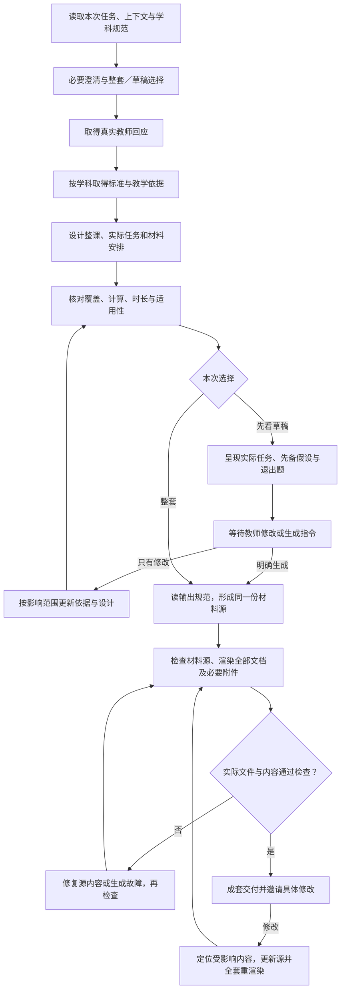

# 上游数学教案创建的执行参考

状态：完整保留的数学教案流程与早期候选分析，是当前设计和效果比较的重要起点；未运行该方案。当前独立课程设计以 [能力范围与推进路线](harness-scope-and-priority.md) 为准，本文不自动构成项目约束。

源码基线：`281eb8d41fe2837d911541c9bbb870b58add804c`。下文教学动作、固定数量、每课覆盖全部标准情形、宿主输出及早期适配均描述原实现，不自动成为本项目要求。IM 结构可取舍；本项目按课程层级分配目标，用真实图关系与任务判断知识联系。

本地 KG 已由外部提供。有关几何目标与实际进阶、课程层级的证据见 [本地图用法](learning-commons-integration.md)；新增 Grade／Unit／Section／Lesson 设计见 [课程体系设计研究](curriculum-design-capability.md)。原两项确认已撤回，本稿不保留待用户批准的前置条件。

## 设计思路

教案创建的核心工作是将教学任务、可用依据和学习需要转成一节可教的课。Harness 既要组织模型完成教学设计，也要保留教师参与、实际工具执行和材料检查。**一份被教师看过的草稿，应成为后续正式材料的内容依据**；放行后的工作围绕这份内容补齐、组织和检查，不能无声地重新生成另一节课。

先确定教学要求及数据流，再选择执行图结构。下图表示本 Skill 的教学执行关系，不是已选定的 LangGraph 节点；整个 Agent 运行时与 Agent Server 专项仍留到实现前。

图中的“明确生成”主分支指放行已呈现草稿；同一回应既修改又要求立即生成时的解释见 HITL 表。知识依据阶段的无连接、空结果和受限能力分支见下文，不能合并成“检索失败就自由生成”。

## 输入怎样进入教学设计

上游由与教师的对话提供信息；Web 后端则需要读取本次任务及外部提供的相关上下文。后端输入替代对话中的事实信息，不自动替代教师选择。[主规范 S0–S1][skill]、[数学 Clarify][math]

| 输入 | 模型要作的判断 | 需要保留的执行依据 |
| --- | --- | --- |
| 请求与历史对话 | 是新建教案还是适配实际原课；学科、主题、目标年级与课型 | 任务来源及选中 Skill；新课要求差异化材料仍由本 Skill 完成 |
| 州／标准／课程信息 | 应使用哪个框架，目标标准的范围；是否有 IM 等课程信号 | 已给定、从上下文识别或使用默认值分别记录；不能凭检索结果把教师变成 IM 使用者 |
| 课时与课堂资源 | 各阶段能安排多少任务；依赖材料是否能实际取得 | 本次时长、已给定资源限制、需要交付的材料清单 |
| Learner Model 相关上下文 | 哪些学习需要与本课有关；影响指令语言、表征、支架、观察点和练习安排 | 引用输入的证据或上下文条目，并简述采用方式；不扩展为未给定的学生诊断 |
| 教师已有选择或回应 | 选择针对哪次任务／哪版草稿，是否包括明确生成指令 | 原始回应、所针对的任务或草稿版本；后台默认值不记作教师确认 |
| 可用依赖与约束 | 本次具备哪些实际 KG 查询、文件读取、计算、文档生成能力 | 能力清单与运行条件；模型提示里出现工具名不等于工具可用 |

**个性化须能落到具体改变。** 例如输入指明“能计算商，但常混淆除法算式中未知数的位置；阅读长指令困难”，候选设计应增加辨认未知量意义的任务、缩短指令并安排相应观察点。不能仅在首页写“已个性化”，也不能据此删除目标标准中的难点。输入未给定的个体学习事实保持未知；学习者模型由外部建设。[输出 Reading level][output]、[shared R1／O3／O5][shared-r]

## 第一轮交互与教学构建的起点

上游先读取主规范，再识别学科并读取匹配参考；按学科优先级最多问两个缺失信息问题，将整套／草稿选择作为独立一问并在同一轮提出。其余按学科默认。只有回复后仍不清楚教什么，才有第二轮澄清。[主规范 L38–84][skill]

数学先识别州与课程信号。缺失信息的顺序是年级、主题、课程、州；默认 45–60 分钟、通用学习支持、CCSS，已识别州框架时覆盖标准默认。给定课时直接使用；使用时长范围默认时，生成前需选定一个具体总时长供阶段相加核对。[数学 L5–12][math]

**上游的整套默认发生在收到回复之后。** 选择草稿或明确要看草稿，进入草稿路径；其余有效回复进入整套路径。没有回复不能当成已选择整套。路径确定后，以一两句教师语言说明接下来做什么；可用进度工具存在时还需呈现教学步骤进度，避免展示内部脚本或协议。[主规范 L22–34、125–144][skill]

**宿主交互参考：** 上游在对话中索取真实教师选择；本项目按具体能力的教学目的设计交互，允许直接使用可追溯的本次真实决定，不为复刻对话重复提问。具体接口见当前架构议题。

学科确实不明时，候选先在必要问题中澄清学科，确定后立即加载对应参考，再进入学科澄清或构建。主规范同时要求“先读匹配参考”和“学科不明在 S1 提问”，没有完整规定这一调度，应显式记录解释，不能任意按数学生成。这不自动授予额外两问或任意增加轮次；仍需核对提问预算、草稿选择同轮提出和第二轮条件。

## 数学 KG：查询怎样改变教案

完整连接路径先执行全部规定检索，再进入教学构建；草稿也一样。查询结果原文进入内部记录，模型工作摘要只保留本次设计需要的信息，不在教师聊天中另发 KG 结果综述。[KG L8–45][kg]

| 次序 | 上游操作与取得的内容 | 对教案的实际影响 |
| --- | --- | --- |
| 先确定标准 | 按代码或关键词查询，带已知学科与州；选择适合年级和任务的标准／子标准，保存原文、代码及 CASE UUID | 确定整课范围与标准说明；不能仅靠主题名称自拟一个标准标识 |
| 标准后并行：前置 | 后向进阶，取主要前置标准 | 形成先备要求及其与本课的关系；不把前置标准当成本课较低难度替代目标 |
| 标准后并行：组件 | 查询组件，取至多五个相关子技能 | 转为可观察 SWBAT 与观察表条目；再与实际任务核对，不机械粘贴后就算完成 |
| 标准后并行：误解 | 取三个最相关错误表现和教学动作；成功但无结果时，上游允许从已有知识提出三个 | 决定任务如何区分错误理解、教师看什么、如何应对；补写内容不登记为 KG 证据 |
| 标准后并行：定位课时 | 查询 IM 课时并优先匹配年级、再选最相关课时 | 取得后续材料查询所需的真实课时标识 |
| 课时后取材料 | 同次请求 lesson 与 activity，提取活动顺序、题型／未知数位置、讨论动作 | 为原创课的结构和任务设计提供参考，不复制原课程正文或故事情境 |
| 构建时选实践标准 | 从已有知识选择二至三个 SMP，上游不要求此处调用 KG | 将数学实践落实到课堂任务与讨论，而非只列名称 |

数学即使没有 IM 课程信号，完整连接路径仍规定查询 IM 课时。但进入教学生成的工作摘要及对外内容须去除 IM 专属名称、活动标题和术语。原始来源及查询标识可保留在受控执行记录中以供外部追溯，不能回流成教师或学生材料；这是对“清理工作笔记”与后台追溯职责的适配。[KG 数学末尾][kg]、[主规范原创内容要求][skill]

### 数据前提的适用边界

原上游包含未连接、标准未命中及误解空结果的宿主退路，可查原 [主规范][skill] 和 [KG 参考][kg]。本项目已采用外部提供的本地数据，因此早期“远程材料不可取得后增加草稿批准”的方案已撤回，不作为当前执行路径。

当前应检查目标匹配、关系语义及实际设计用途，区分来源中的图边与设计推断；详见 [本地图用法](learning-commons-integration.md)。原规范的每课全部情形、固定阶段和输出格式仅供评估取舍。

## 教学构建：模型具体要完成什么

以下顺序是帮助执行和检查的候选组织；可以由多次模型／工具行动逐步完成，不要求一次调用吐出整课，也不预设每行一个图节点。教学决策的简要结果及依据可保存，无需存储模型隐藏思维链。

| 教学工作 | 必须得到的具体结果 | 如何发现没有完成 |
| --- | --- | --- |
| 确定目标和先备 | Big Idea、可观察 SWBAT、前置标准代码与短意译，以及本课如何建立其上 | 只有“理解乘除法”等笼统目标；以模糊先备技能替代数学规定的前置标准；来源不足却伪造代码 |
| 枚举范围和难点 | 结构情形、数的类型及数值范围；基线到最难情形分别由必做题／退出题承担，并在各题 teacher facet 命名、汇成覆盖表 | 只在教师说明里提到难点；遗漏基线；关键情形只在选做拓展出现；标准要求 100 以内却只给个位数 |
| 设计学生真实任务 | 引入任务、必做题、表征／支架；至少一项不能只靠记忆或套步骤完成的解释／论证／比较任务；学生页本身另须有推理或选择提示；至少一项有意设计的兴趣／好奇／认知挑战；内部实际求解用于核验 | 只有活动名称；用简单自评替代真正推理；推理提示只写在教师讨论中；把普通应用题自动当成兴趣触发；支持泄露答案；未经求解就宣称正确 |
| 设计误解与观察 | 三个困难各含具体学生表现、为何发生、教师动作；至少三个可观察行为及意义、应对；多解任务明确接受合法多解 | 只有“学生可能混淆”；缺错误成因；观察表只写阶段名称；把有效另一种解法判错 |
| 设计退出题 | 新题，针对最难情形，能使持有主要误解的学生暴露错误；三个分拣桶均有明确标准 | 换数字重复普通题却没测难点；主要错误策略仍能答对；分拣标准重叠或空泛 |
| 安排教学过程 | Launch → Explore → Discuss → Synthesize → Exit Ticket；Discuss 至少十分钟，具名学生互谈动作与具体话题；所有阶段包含转换时间 | 教师独讲冒充学生讨论；题量与时间不相称；总时长不符；总结首次引入未探究的新概念 |
| 组织可用材料 | 实际使用的学生页、观察表、教案及必要附件；器材和外部来源可取得 | “发卡片”却没卡片；给无法取得的材料占位；多发没用到的附件 |
| 写适配说明 | 最后两条 Design notes 写应保留的要素及理由，含核心表征；基础材料至少两项实际表征／访问支持；给定学习需要落实到支持位置 | 只有“符合 UDL”；学生材料与给定阅读负担或课堂资源冲突；教师只看到空泛的课程优点 |

数学年段和课程分支还需保留：非 IM 的 K–2 先让学生尝试，按下文明确的题型适用解释覆盖未知位置及情境；3–5 使用适合的阵列／面积表征；6–8 使用比例表、双数轴等；9–12 在 Synthesize 正式化此前已经探究的符号。实际选用的表征必须适合本题，不把示例表征当作每课都必须齐备的清单。[数学 L24–93][math]

IM 分支实际采用 KG 的 MLR 建议；缺少建议时，Explore 用 MLR 2、Discuss 用 MLR 7、需要讨论支持处用 MLR 8。二至三个 SMP 按原文命名；三个到五个关键词附简明定义。非 IM 按自身分支保留规定的教学动作与普通讨论方式，不继承 IM 的 MLR 默认安排。课程识别依据来自教师信息与任务上下文，不由 KG 命中某课来反推。[数学 L35–47、76–83][math]

输出的完整细则继续以 [数学材料映射][math] 和 [输出规范][output] 为准，特别包括至少一项注册在 `shared` 的实际视觉支架、学生可作业的表征与教师示范表的区分、仅在教师指定语言时印翻译、适用写作任务的句式支持、同文档同一共享 key 不重复拉取。上述约束进入材料检查，不能用本稿的摘要代替原参考。

**质量检查从构建期开始。** 模型先核对覆盖、工作量、误解与退出题，并实际解题；正式输出阶段再按完整输出规范检查材料。后端可用计算工具复算数值和等式，但数值正确不证明题目测到了目标理解。内部求解用于核验，不等于上游规定另交一份逐题完整解答包；KG 摘要只抽取错误行为与教师动作，也不免除构建时补齐错误成因的要求。这里没有 CFU 那种“两文件之后才读取验证参考”的专门规定，不能移植它的 Gate A／B。[数学 L49–93、105–107][math]、[输出 L33–108][output]、[shared P4b][shared-r]

如果目标范围、教师时长与必须覆盖的内容无法同时满足，候选应具体说明冲突并请求调整范围或时长，不默默删除必做情形或伪造可教性。数学至少十分钟 Discuss 与极短课时尤其需要这个异常分支；它不是一般缺信息时可以无故增加的澄清轮次。

## 本 Skill 的 HITL 与修订

| 教师事件 | 候选行为 | 继续执行的依据 |
| --- | --- | --- |
| 首轮还没有回应 | 保持待答，不进入教学构建 | 未作出的选择不能由系统默认补成真实回应 |
| 首轮选草稿 | 完成规定的知识依据和教学设计，展示草稿；暂不渲染正式材料 | 选择是交付方式，不能减少教学工作 |
| 首轮有效回应但没选草稿 | 信息足够后走整套；仍需检查再交付 | 上游规定的整套默认 |
| 草稿后只提修改 | 更新受影响设计，重新呈现草稿，继续等待 | 修改本身不等于生成指令 |
| 明确认可当前草稿并要求生成 | 从这版草稿形成材料源，完成检查和渲染 | 真实放行关联当前内容版本 |
| 同一回应含修改并明确要求“改好直接生成” | 候选采用精确、可执行的修改，同轮重呈更新后的草稿并继续生成，无需再等一次批准；指向不清或改变范围造成冲突则澄清 | 上游要求改后重呈现，也要求 go-ahead 当轮生成；此复合情形需显式解释，不能自动增加第二次批准或忽略修改 |
| 对旧草稿迟到回复／同一提交重复到达 | 核对所指版本；重复提交不触发另一套生成；旧版本不能自动覆盖当前设计 | 请求与内容版本关联属于后端机制，具体接口后续确定 |
| 交付后要求修改 | 修改同一材料源中的相关内容，做一致性检查，所有主文档重渲染，再交付并邀请修改 | 单改 Word 或只更新一份文件违背本 Skill 规定 |
| 教师说满意或停止 | 记录真实回应；停止后不继续生成 | 交付及修改邀请已可结束本轮；本 Skill 没有 differentiation 的“四份满意才完成”要求 |

草稿必须含：年级／主题／标准代码与短意译、一至三句概要、各阶段名称与分钟、实际学生任务、先备假设和退出题。名称与正式材料一致；教师应能据此判断覆盖与适用性。[主规范 L146–165][skill]

HITL 复核澄清（2026-09-14）：上文“明确生成”判断的是请求及回应的完整语义，不要求教师同时说出“认可”和“生成”两个固定词。如果当前唯一问题已明确是批准草稿并制作材料，清楚的“可以”即可放行。当前产品的已有决定复用、复合修改及版本适用规则见 [HITL 设计](hitl-design.md#课时与材料设计)；原详细路径仍完整保留。

草稿到文件不是机械复制聊天全文：需要补齐教案脚本、观察表与材料排版等内容。候选约束是保持已审阅的目标、实际任务、时序和关键支持；若为了纠错必须实质更换任务或改变范围，且超出教师已明确授权的修改，回到草稿说明变化并取得相应指令。普通措辞、版式和答案修复不一律制造新的批准轮次；上述“修改＋生成”指令覆盖的改动也无需重复批准。

| 改动 | 必须回查的内容 |
| --- | --- |
| 标准／年级／主题 | 标准解析与依据适用性、全套任务、课型、认知要求和学科参考；旧 UUID 相关结果不能自动沿用 |
| 课程信号改变 | 对应课程分支、教学顺序与术语、相关课时依据；不能只替换课程名 |
| 学习需要／阅读负担／课堂器材 | 支架、指令、观察点和材料可用性；目标标准不随支持需求自动降低 |
| 课时变化 | 每阶段工作量、转换时间、Discuss 下限、总时长及任务覆盖；不能只改页眉分钟 |
| 题目数字／情境 | 题面、答案、错误例子、教师脚本、观察说明、退出分拣；所有引用旧内容的 prose 均须清理 |
| 增大作答空间／观察表加列 | 修改相应文档 sections，核查分页与可写空间；不无故改写所有题目，也不分叉共享题面 |

## 阶段之间必须延续的教学内容

以下是数学教案创建对执行状态的要求，供后续选择具体执行图与存储方式使用；它不是四项 Skill 的统一状态表，也未固定字段名或 LangGraph 节点。阶段内模型仍需按完整规范使用工具、阅读依据和完成教学判断，不能只传递“已完成”标记。

| 走到的位置 | 后续执行必须能取得的内容 | 继续或恢复时必须守住的关系 |
| --- | --- | --- |
| 已理解任务、准备澄清 | 原请求、已给定上下文及其来源、识别的学科／年段／主题／课程、默认值、待答事实和整套／草稿选项 | 不能在恢复时换一组默认值或重复询问已经回答的事实；后台更新 Learner Model 不自动覆盖本次已采用的输入 |
| 等待首次回应 | 实际发出的本轮问题、对应任务、原始教师回应（到达后）及所选路径 | 只有明确关联本次任务的真实回应才能解除等待；未答事实按允许默认处理，未发生的回应不能由默认补出 |
| 已取得教学依据 | 每项工具的实际返回／错误、标准及真实标识、选中前置／组件／误解／课时材料、适用理由和数据缺口 | 保留真实调用与模型补充的不同身份；标准或课程改变后，旧的选择理由和依赖结果必须重新判断适用性 |
| 已完成教学设计 | 目标、结构情形到题目的映射、实际题目与求解核验、主要误解与退出题检验、课堂时序、支架和材料安排 | 后续材料生成使用这些具体内容，不能只接到一个主题再次自由造课；发现范围或可教性冲突时保留冲突对象 |
| 已展示草稿、等待放行 | 教师实际看见的草稿内容、其依据版本、原始修改／放行及对应对象 | 放行针对实际草稿；旧稿回复不能覆盖新稿。精确修改＋生成指令按允许范围继续，范围改变则回查相应依据 |
| 已写材料源或生成部分文件 | 当前 `lesson.json`、源版本、生成参数、已经生成的文件与未完成项 | 同一轮交付不能混用不同源版本；渲染失败可以重用有效源内容，不因重试无声重做已审阅教学设计 |
| 已检查、准备交付 | 检查所针对的源和真实文件、具体问题与修复、当前整套清单、必要附件及教师可见说明 | 旧文件的通过结论不授权新文件交付；修改后保留能证明仍适用的内容核验，重新执行受影响检查及本 Skill 要求的全套重渲染 |

例如教师只要求增加演算空间，保留标准、题目与有效的数值核验，更新版式并检查重新生成的整套材料；教师改变题目数字时，相关答案、错误示例、退出题诊断和旧叙述一并失效。若调用方在教师放行后送入新的学习需要，先识别它对支持和已审阅内容的影响，不能在同一交付版本里无声替换上下文。是否需要再询问教师由实质变化及已有授权决定，不按“每次状态变化都审批”处理。

运行暂停、故障与材料完成的结果分别返回给调用方。等待教师时计算可结束，但教学任务仍待回应；交付后邀请修改可结束本轮计算，不据此伪造教师满意。具体存储事务、重试预算与恢复接口仍在后续技术设计中确定。

## 材料源、检查与成套交付

输出前完整读取 `references/output.md`；由 `lesson.json` 的 `shared` 保存跨文档内容，`documents[]` 编排受众和章节。题面、退出题、观察要点、数据集等跨页内容使用同一个引用；teacher／student facet 控制各自可见内容。生成阶段按提供的规范和命令使用渲染器，不让执行模型阅读其源码、另写普通文档布局或直接编辑生成文件。[主规范 L174–205][skill]、[输出 L117–159][output]

架构研究可以静态核查渲染实现以判断依赖和限制；这与运行时模型被要求遵循的资源使用规则不同。[源码盘点](skill-capabilities.md) 已记录渲染成功不等于引用完整或内容达标，因此候选在渲染前校验必要文档、标识、引用和内容，在渲染后核对实物。

至少有教案与观察模板。学生实际持有打印页时必须有学生材料；纯口头例外要在教案与交付说明中写清。观察模板不能只有空表，需带可观察行为、预期困难、填写空间和明确退出分拣标准。普通主文档每项都应有 DOCX 与内部 HTML；卡片精确裁切、海报等形态确有必要时，按上游补充产物规则生成适合的附件，内容仍取自同一材料源并列入 Materials。[输出 L140–152、215–222][output]

| 检查层次 | 候选执行办法 | 应留下的证据 |
| --- | --- | --- |
| 来源与引用 | 验证当前依据标识、`shared` 引用存在、必要文档完整且受众正确 | 当前内容版本、源引用及缺口；未经获取的 KG 信息不冒充来源 |
| 数值与解答 | 实际求解全部答案、例子及量化链，必要时用计算工具；检查与任务问法对应 | 对应题目／版本的结果及错误；不能用模型一句“都正确”替代 |
| 教学与一致性 | 按数学和输出要求核对标准情形、难点、支持、三桶分拣、师生任务双向对应、时间与材料 | 具体检查对象、发现的问题和修复关系；保持可判定教学依据 |
| 文件与版式 | 执行上游命令后列目录核对全部 DOCX／HTML；实际回读材料，按必要方式检查分页、表格、作答空间及黑白可读性 | 文件清单及检查所针对的版本；具体预览／解析工具在实现前选定 |
| 交付前一致性 | 交付清单必须对应通过检查的修订；补充附件不能遗漏 | 交付版本与检查记录的关联，避免旧文件混入新包 |

生成故障先区分材料源错误与依赖／渲染故障，修复后重试；不能在失败后直接把 HTML 或聊天文本作为完整 Word 交付。有限恢复后仍失败，向调用方返回已发生的事实和可恢复位置，教师可见说明使用教学语言。重试次数、存储和任务恢复细节由后续技术设计定案。[主规范 L207–224][skill]

教师一次收到本轮全部 Word 文档及必要补充材料；后台内部工作文件留供修订，普通交付消息不出现 JSON、HTML、脚本或内部文件名。上游“最后附教案以显示在最上面”取决于聊天界面；Web 适配应确保教案容易找到、全套属于同一次交付，不必复制消息堆叠机制。

每个输出轮以一条收尾消息保留上游顺序：有适用的课堂器材可打印替代时先提出具体补充选项；随后询问对全部产物是否满意或需修改；再给三至四个贴合本课的修改方向。已经由本课写出的卡片、材料正文等必须随包交付，不能当成下次才提供的可选项。[主规范 L226–243][skill]

## 数学主路径的静态推演

**假设输入：** 三年级，45 分钟，新建“乘除法算式中的未知数”课；无 IM 信号；纸笔与白板可用。外部上下文提供两项需要：部分学习者会计算但混淆未知数角色、部分学习者需要短指令。教师回复“先看草稿”。本例不编造标准原文、UUID 或 KG 返回，实际运行必须先取得适用依据或进入规定知识退路；以下是验证执行设计的局部内容样例，不宣称已经覆盖某条正式标准。

在完整连接的假设下先执行本稿的数学查询链；资料不足时记录相应条件。教学设计先列未知因数、积、被除数、除数和商等候选结构情形，再用真实目标标准核对范围。下面六项可帮助检查“提出情形后是否真的写成必做题”：

| 情形样例 | 必做题样例 | 正确结果 |
| --- | --- | --- |
| 左侧因数未知 | `□ × 6 = 42` | 7 |
| 右侧因数未知 | `3 × □ = 24` | 8 |
| 积未知 | `7 × 8 = □` | 56 |
| 被除数未知 | `□ ÷ 6 = 8` | 48 |
| 除数未知 | `54 ÷ □ = 9` | 6 |
| 商未知 | `48 ÷ 6 = □` | 8 |

课堂可以先用一个“这两个空格表示同一个量吗”的比较任务引出问题，安排学生先尝试，再比较未知量在等组关系中的意义。学生页给空白“算式／未知量表示什么／检验”表，教师页保留观察和完整解答；短指令降低阅读负担，解释任务仍保留推理要求。具体阵列／等组表征在正式设计中需真正呈现，不能只留一句“配图”。

候选时间为 Launch 6、Explore 18、Discuss 11、Synthesize 5、Exit Ticket 5，共 45 分钟；阶段时间含发放、转组、收集。六道短题和比较任务是否可在十八分钟中完成仍需按任务形式判断，算术相加正确不是课堂节奏已验证。

**一个应该被构建检查发现的错误：** 假设主要误解是“除法算式出现空格，总把两个已知数相乘”。若退出题为 `□ ÷ 6 = 7`，错误策略也会给出正确的 42，无法揭示这项误解。候选可换为新的 `48 ÷ □ = 8` 并要求说明空格意义、代回检验；正确结果为 6，错误策略产生 384。它是否确为所选正式标准的最难情形还要另判，不能因能暴露一种误解就直接通过全部验收。

退出分拣需要区分三类可见响应，例如：正确求得 6、解释未知量并有效检验；已辨认未知量且建立正确关系但计算或说明不完整；响应显示把未知除数当被除数等概念混淆。正式规则还需明确无作答、只给答案等情况，避免桶重叠或漏分。

教师看到的草稿包含实际题目和退出题，而非“六道有梯度练习”的占位语。假设教师只说“把课堂延长到 50 分钟，讨论增加 5 分钟”，则更新为 6＋18＋16＋5＋5，重呈现草稿并等待生成指令。收到“按这版生成”后才组织正式材料，题目和时序保持这一版的内容。

若之后教师仅要求“学生页留更多演算空间”，改学生文档的作答区，核对分页并全套重渲染；不重新选择标准或创造新任务。若改为另一个标准，则回查知识依据和教学设计，旧答案与检查结论不沿用。

## 其他学科的查阅入口

ELA、科学与社会研究各自的输入、教学过程、知识依据、材料、检查及修订，集中见 [教案创建的学科分支与执行规则](lesson-creation-subject-flows.md)。这些分析用于后续分别设计对应学科，差异过大时可以采用独立流程；教案创建主规范仍按各自适用条件保留。数学方案不承担将它们统一的任务。

## 源码差异与候选解释

先判断要求能否同时满足。可兼容时合并落实；确有冲突则记录原要求、选用解释和对应评测条件，保留原始 rubric 的判定，不能改了规则仍声称原规则全过。下面的解释用于讨论，尚未成为已决契约。

下表保留此前跨文件核查结果，供学科分析引用，不是一套跨学科验收清单。当前只收敛对数学及其适用主规范有影响的条目；ELA、科学和社会研究的专属条目留待对应学科处理。

| 差异 | 源码证据 | 候选处理与仍需明确之处 |
| --- | --- | --- |
| 数量要求有松有紧 | math／社会研究可取二至三个困难；科学最多三个；shared P4a 至少三个。收尾主规范三至四个选项，shared M3 只要求至少两个 | 分别取三个困难、三至四个具体收尾选项，可同时满足。数学另按 P-M2 至少两个困难写出具体错误算式。[math L78][math]、[shared P4a／M3][shared-r]、[math P-M2][math-r] |
| Big Idea 与学科目标模板 | shared P3 要 Big Idea 与 SWBAT 分开；科学三维目标、社会研究目标模板未明确另列 Big Idea | 明列 Big Idea，并使可观察目标保持各学科结构，可兼容；不把一个探究问题直接当全部目标。[shared P3][shared-r]、[科学 L135][science]、[社会研究 L76–80][social] |
| 原文标准与简写 | shared P1／O8 强调标准复述一致；output 和 shared P10 要目标原文只出现一次、先备用代码＋短意译；数学 KG 要提取先备原文 | 真实原文保留在依据中，正式文件按经济性规则展示一次目标原文、其余代码＋短意译；评分时须区分标准全文引用和允许的短指代。[输出 L27–29][output]、[KG L37][kg]、[shared P1／P10][shared-r] |
| 草稿修改与同轮生成 | 主规范 L164 要改后重呈现，L165 又要求收到 go-ahead 当轮生成 | 区分“仅修改”和“精确修改＋明确生成”；后者候选同轮重呈更新稿并生成，不能把任何修改都写成强制再批一次。[主规范 L159–165][skill] |
| Design notes 数量 | math 要二至三项，shared O7 要一至二项 | 取两项，包含核心表征及应保留的理由；可同时满足，不留作新的产品问题。[数学 L80–83][math]、[shared O7][shared-r] |
| K–2 非运算主题与未知量要求 | math L44 对 K–2 直接要求 start-unknown／change-unknown，仅四种情境明确限定加减故事题 | 本轮推荐按实际目标适用：加减故事题保留原要求；几何、测量等按本标准自身的结构情形设计，不额外塞入不相关运算题。原文字面条件与这一解释分别记录，不能把合理收窄说成源码明示。[数学 L44、49–72][math] |
| 社会研究多个必填项同时缺失 | 主规范最多两问，额外轮次受限；社会研究在生成前要年级段、主题、州 | 候选第一轮紧凑收集相关信息，不能默填州；如何计算组合问题及仍缺信息时的澄清例外需明确。[主规范 L77–84][skill]、[社会研究 L17–25][social] |
| ELA 纯口语例外与学生页验收 | 参考允许某些 K–2 课没有学生页，却又说视觉支架放学生页；shared O15 允许口语例外，R4／O6 未相应标注条件 | 按具体任务判断是否确为口语例外，明确无学生页时支架放置与评分适用范围；不能给不存在的工作纸项目直接记通过。[ELA L39–43、200–205][ela]、[shared R4／O6／O15][shared-r] |
| K–2 ELA 先说或先写 | 参考 L93–100 允许口头文本讨论；R-E1 对全部 comprehension 要每轮先个人书写 | 候选优先保留年段教学分支，另记录 R-E1 的年龄适用解释；不能为满足通用评分而默改低年级教学过程。[ELA][ela]、[ELA R-E1][ela-r] |
| 科学低年级与写作／修订要求 | K–2 绘图口述和模型表达；R-S1 无年级条件要求 CER 写作，P-S5 要基于证据修订模型 | 需分别明确表达形式与“修订”的可见证据；口述不冒充书写，一次最终绘图也不自动证明模型修订。[科学 L63–74][science]、[科学 P-S5／R-S1][science-r] |
| 科学非 OSE 语言与年段模板 | 非 OSE 分支禁止 driving-question framing；年段段落却要求张贴或联系 driving question | 必须由课程分支约束年段模板；独立现象探究可保留普通教学问题，不能只换标签就宣称已消除课程框架差异。[科学 L50–51、65、82、100、118][science] |
| 科学默认时长不兼容 | 默认 45–60 分钟；6–8 原列阶段合计 60–75 分钟；9–12 已标时部分至少六十分钟且未含最后检查 | 不照抄所有阶段再填四十五分钟。保留过程要求并明确调整时长／范围或解释阶段时间的适用性；实际工作量另验。[科学 L21、100–105、118–123][science] |
| 社会研究引导题范围 | 参考可用 source 或 contextualize；P-SS4 要 sourcing、contextualization、corroboration／argument 三类 | 可通过二至三个复合问题覆盖三类；检查真实要求，不能只看题量。[社会研究 L96–100][social]、[社会研究 P-SS4][social-r] |
| 科学新现象迁移与收尾不得引新内容 | 科学 3–5 用新小现象作退出题；shared O12 禁止 closing 首次出现新概念／情形／表示 | 候选区分新情境中迁移已学机制与首次教授新概念；评分需说明 closing 的范围，不能禁止规范要求的迁移任务。[科学 L87、149][science]、[shared O12][shared-r] |
| 未支持课程的行为 | 主规范 L63–68 要走未命名课程路径；数学 P-M1 却要求匹配任何已命名课程模型 | 本轮推荐按主规范生成通用原创课，说明未承诺该课程模型的忠实实现；保留 P-M1 的原始判定及不适配原因。若教师任务必须忠实采用指定课程而缺少依据，则请求材料或改变任务，不假装已实现该课程。[主规范][skill]、[数学 P-M1][math-r] |

ELA 文本复杂度、问题深度、拼读与论证条目还带特定条件，科学定量条目也有条件。执行评测时按原条件判断是否适用。当前 rubric 没有完整覆盖草稿选择和等待，因此还必须补过程案例；仅 shared 与学科分数达标不证明 HITL 保真。[ELA rubric][ela-r]、[科学 rubric][science-r]、[shared rubric][shared-r]

## 待验证的代表性行为

以下是验收候选，没有执行结果。上游评分与新增适配案例应分别记录，不能让结构检查代替教学质量比较。

数学内容至少用下列不同情境验证规则适用性；每例须先确定实际标准及完整范围，再生成原执行基准与 Harness 产出。本次没有验证任何具体标准代码。

| 数学情境 | 必须看见的能力 | 应当被拒绝的反例 |
| --- | --- | --- |
| 非 IM 的 K–2 加减故事题 | 目标适用的情境类型和未知位置；先尝试后示范；最难未知位置退出题；真实视觉材料 | 把 start-unknown 只写在教师说明中，或只在选做题出现 |
| 非 IM 的 K–2 几何识别／构造 | 按实际标准覆盖形状及关键属性，采用与本题相符的操作／图示和回答空间 | 为满足故事题措辞硬加不相关加减题；改了规则却记原字面要求通过 |
| 3–5 小数乘法 | 保留基线和积小于两个因数等适用难点，检查数值与表征，以及主要误解在退出题上的真实表现 | 全用大于 1 的因数，错误地强化“乘法总使数变大” |
| 6–8 比例关系 | 依据实际目标包含比例及非比例等情形，任务中的表／图／算式互相一致 | 所有关系都过原点，却声称检测到线性与比例的区别 |
| 非 IM 的 9–12 数学建模 | 明确数量、假设与模型解释，学生先探究再正式化符号，支持不替学生作核心建模决定 | 开场给完整套用公式，综合阶段首次引入未探究的模型或符号 |

上述内容案例再配学习需要和依赖条件；IM 另按其专属课程要求建立对照，不继承表中非 IM 专属约束。所有课程仍检查适用标准的结构与数域覆盖。由风险选择需要组合验证的情境；模型质量样本量与不退步的统计判据由能力验证议题确定。

| 案例 | 应观察到什么 |
| --- | --- |
| 信息完整但没有教师选择 | 仍提供整套／草稿选择并等待；无回应不进入构建 |
| 已有本次教师表单选择 | 按最终确定的 Web 适配规则处理；不能用系统默认冒充教师选择 |
| 草稿路径且完整 KG 可用 | 所有本学科规定调用发生在草稿之前，真实结果进入设计 |
| 标准查询返回错误年级 | 使用剩余检索预算；三次后按规定处理，无伪造 UUID |
| 只有标准接口或材料受限 | 记录部分覆盖及实际采用路径，不标记完整 KG；原创替代有相应审阅与评分条件 |
| 教师修改草稿或复合生成指令 | 依据回应语义更新正确版本，既不丢修改也不捏造放行 |
| 退出题恰好允许主要错误策略答对 | 构建检查发现问题并修正，不能仅凭答案算对交付 |
| 某必需结构情形只存在于教师说明 | 覆盖检查失败；把它落实为必做题或退出题 |
| 个性化输入只改变阅读需求 | 指令和支架有据改变，目标标准与难点保留；无依据的学生标签不增加 |
| 缺少共享引用／部分文件生成失败 | 不交付不完整包；修复源或故障后再核查真实材料 |
| 更换数值或情境 | 所有受影响题面、解答、错误例子、脚本和观察说明同步；实际文件无旧内容 |
| 重复回应或后台恢复 | 不重复采纳同一个教师决定；交付内容与当前检查版本一致；运行原型需验证 |
| 纯口头课／必要裁切卡片 | 按各自条件省略学生页或交付补充附件；不能硬编码永远三份文档 |
| 教师未回复满意 | 已完成交付与修改邀请可以结束当前计算，不能记作满意或套用 differentiation 终态 |

上述案例用于审视上游实现的行为与局限。当前独立课程的检查在适当层级判断目标覆盖、知识联系、数学任务和证据，不把本稿的原规则当作未经取舍的验收清单；课程与教学的实际执行和质量仍须后续验证。

## 来源

- [主规范][skill]：S0–S5、原创内容、教师可见语言、输出与修订。
- [数学参考][math]：澄清、课程／年段、结构情形、任务与退出题、材料映射。
- [知识图谱调用参考][kg]：标准解析与每学科真实查询顺序。
- [输出规范][output]：全部材料约束、JSON 映射与补充产物。
- [shared 评分规则][shared-r]、[数学评分规则][math-r]：教学、严谨性、材料及交互验收事实来源。
- [规划材料索引](index.md)：相关研究、决策归属与验证边界。

[skill]: ../../../k12-teacher-skills/plugin/skills/k12-lesson-plan-creation/SKILL.md
[math]: ../../../k12-teacher-skills/plugin/skills/k12-lesson-plan-creation/references/math.md
[kg]: ../../../k12-teacher-skills/plugin/skills/k12-lesson-plan-creation/references/learning-commons-kg.md
[output]: ../../../k12-teacher-skills/plugin/skills/k12-lesson-plan-creation/references/output.md
[shared-r]: ../../../k12-teacher-skills/evals/k12-lesson-plan-creation/rubrics/shared.csv
[math-r]: ../../../k12-teacher-skills/evals/k12-lesson-plan-creation/rubrics/math.csv
[ela]: ../../../k12-teacher-skills/plugin/skills/k12-lesson-plan-creation/references/ela.md
[science]: ../../../k12-teacher-skills/plugin/skills/k12-lesson-plan-creation/references/science.md
[social]: ../../../k12-teacher-skills/plugin/skills/k12-lesson-plan-creation/references/social_studies.md
[ela-r]: ../../../k12-teacher-skills/evals/k12-lesson-plan-creation/rubrics/ela.csv
[science-r]: ../../../k12-teacher-skills/evals/k12-lesson-plan-creation/rubrics/science.csv
[social-r]: ../../../k12-teacher-skills/evals/k12-lesson-plan-creation/rubrics/social_studies.csv
