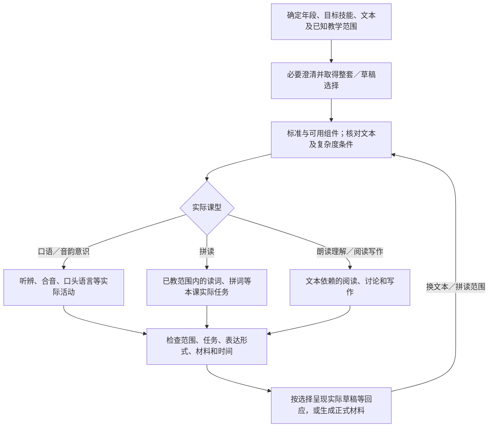
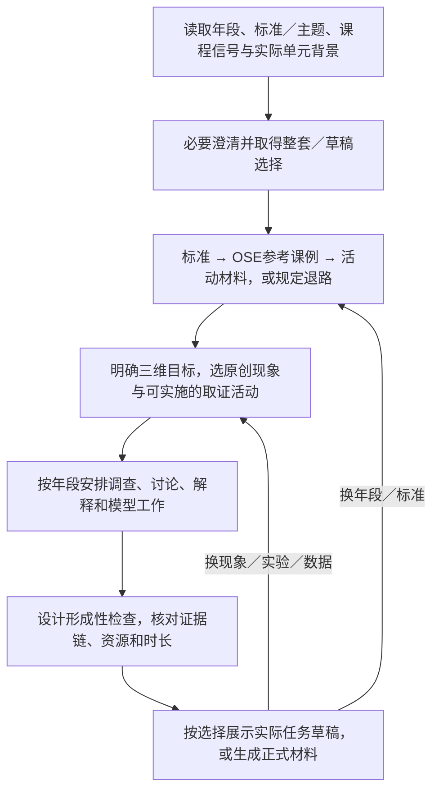
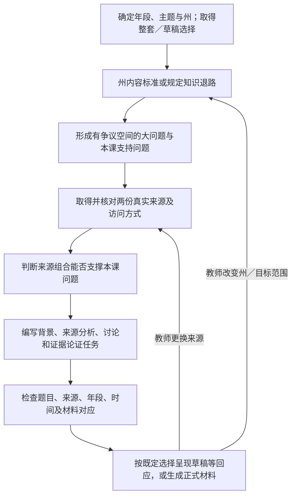

# 上游教案创建的学科差异参考

**定位：重要流程参考。** 保留上游做法、教学目的及早期候选分析，作为当前设计和效果比较的起点；下文不自动构成本项目约束。尚未证明有更好效果的替代机制，不能仅因课程体系独立就舍弃这些流程。

日期：2026-09-14。状态：固定上游的学科差异参考，供独立课程设计取舍；原规范不自动成为产品要求。当前范围见 [课程体系与教学能力的范围和质量基线是什么](../issues/01-capability-contract.md)。本报告未运行 Harness、真实 KG、模型对照或材料渲染；以下案例为静态推演。

上游基线：`281eb8d41fe2837d911541c9bbb870b58add804c`。本稿集中记录 ELA、科学和社会研究各自的教学过程，供相关设计按需引用；数学的详细分析见 [数学主路径与适配边界](lesson-creation-execution-design.md)。教案创建主规范规定的草稿选择、生成、成套交付和修订要求，仍须在各自适用条件下保留。

**本文是学科差异的查阅资料，不是多学科共用流程的设计。** 用户已确定先实现数学；其他学科后续分别推进。差异过大时分别设计流程、知识依赖、材料与检查，不为共同结构削弱学科要求，也不让某学科的专属规则影响另一学科。把分析放在同一文件不表示应放进同一实现；本稿尚未确定运行图或接口。

**数学内部也按适用条件分别处理。** 后续 IM 官方补查记录了 K／Grade 1 的观察证据、centers、K–5 与中学不同的后续响应，以及高中工具选择的差异，集中见 [数学内部差异：补查的反例与采用范围](im-design-methodology-transfer.md#数学内部差异补查的反例与采用范围)。它补充本稿的读取路由，不替换固定上游数学规范；对上游固定退出题或支架规则的改变仍需明确理由和比较判据。

## 怎样保留差异

**学科差异应进入资源使用、教学行动和验收条件。** 只替换提示中的学科名或输出章节名，无法保留执行能力。以下是本稿建议用于讨论与后续实现的处理方式。

| 需要确定的条件 | 为什么影响执行 | 候选处理 |
| --- | --- | --- |
| Skill 与任务意图 | 新建课、适配原课、共同备课和造诊断题的目的与完成条件不同 | 先确定 Skill；本稿所有分支只属于教案创建 |
| 学科 | 主体资源不同：数学标准结构，ELA 文本／拼读范围，科学现象与调查证据，社会研究来源组合 | 加载该学科完整参考，并按该学科调用 KG、构建和检查 |
| 年段与课型 | K–2 ELA 的拼读与朗读理解不同；科学各年段的取证、解释与表达要求不同 | 同时辨认年段和课型；已有标准或上下文能确定时直接使用，不凭年级名猜全部任务 |
| 课程信号与单元位置 | IM／OSE 信号会影响术语和教学结构；单元位置决定能否引用已有课堂历史 | 区分已给定、可由上下文识别、未知；KG 命中某课程不能反推教师已经使用它 |
| 输入资源与可用依赖 | 同一学科中，真实文本、图像展示、已授拼读范围、实际调查数据等条件不同 | 保存所用版本及访问方式；缺口触发该学科的具体补足或异常路径 |
| 外部学习需要 | 阅读支持、表达形式和先备差异可以改变任务支持，但未必改变教学目标 | 说明每项相关输入如何改变本次设计；不能把所有学科都处理成降低阅读难度或降低标准 |

这些条件帮助核对一次执行的**适用依据**：本次用了哪份规范、哪些学科／年段／课型分支、哪些资料和约束、采用了什么冲突解释。上表是分析提示，不规定各学科必须采用同一数据结构或通用规则引擎；具体记录形式由各自需要决定。模型继续读取实际教学规范，而非只看到被压缩的流程节点名称。

Skill 执行顺序由运行流程承载，例如完成知识依据后才展示草稿。生成教案中的课堂顺序则进入内容设计和检查，例如科学课让学生先调查、再解释；它不表示 Harness 在后台替学生开展调查。具体文本问题、调查设计、来源配对理由等仍需模型完成教学判断并接受对应检查。是否复用存储、文件生成和回应传递能力，随后按真实重复需求确定。

### 规则冲突怎样处理

1. **先判断是否适用。** `K-2-phonics`、`comprehension`、`Gr8+-argument-writing` 等是不同条件；未知课型不能直接当“不适用”。
2. **能同时满足的要求一起满足。** 例如预期困难取三个，既满足可选二至三个或最多三个的学科规范，也满足 shared rubric 的至少三个。
3. **特定分支改变动作时，写清具体解释。** 低年级口头表达与无年龄条件的“先写”要求冲突，不能通过机械取更严格者抹去口头课型。
4. **解释后的验收保持透明。** 保留上游原始条目与判定，另记所采用解释的判定；通过适配规则不宣称原始规则全部通过。
5. **实际课堂条件不能兼容时，处理具体冲突。** 例如六十分钟的必需活动不能放入四十五分钟，不靠修改页眉“解决”。规范冲突若需要改变教师给定任务，才就该变化请求对应决定，不用让教师替工程人员解释评分 CSV；缺失必要事实的澄清仍按本 Skill 主流程进行，不受这条限制。

已发现的跨文件差异及行号集中在 [源码差异与候选解释](lesson-creation-execution-design.md#源码差异与候选解释)。本稿在具体学科路径中说明这些差异怎样影响运行，不预设一条“主规范永远压过参考”或“rubric 永远最严格”的统一优先级。

## ELA：按文本、年段与实际读写任务构建

### 从请求到可审阅草稿

这条路径依据 [ELA L7–176][ela]、[ELA KG 分支][kg] 及教案创建 [主规范][skill]。ELA 的若干课堂弧线被上游称为 typical arc、scale to request；候选保留其教学关系和明确不可省略的动作，不把每个示例阶段名称固定成运行节点。

| 步骤 | 上游要求及模型工作 | 候选执行证据／异常处理 |
| --- | --- | --- |
| 读取任务 | 州信号更新框架；识别年段、目标标准、主题／文本；K–2 从标准和实际任务判断课型 | RF 是初步路由线索，纯口语听辨与文字解码仍需区分；不能把所有 RF 任务做成印刷拼读 |
| 澄清并选路径 | 优先缺失年级、主题／文本、不能从标准推断的 K–2 课型、州；遵守最多两问、同轮草稿选择 | 不额外设置普遍的选文批准或标准确认步骤；教师未指定文本时允许建议合适文本并标 `[suggested]` |
| 取得标准依据 | 连接时先查 ELA 标准，再取至多五个可用组件用于目标；按已有文本信息核对复杂度 | 没有数学的前置进阶、误解、课程材料调用链。无组件时不能伪造组件记录 |
| 确定文本与副本方式 | 根据年级、标准选文本；明确教师如何将其给学生；URL 仅在确认可访问后使用 | 文本存在、模型取得了可用内容、教师可取得副本是不同条件。只知道标题不能证明问题和引文正确 |
| 确定拼读范围 | 词表仅用目标模式和已教字素；使用连贯练习文本时，其内容也受已教模式与已知高频词约束，逐词核对 | 读取外部给定教学范围；年级不能证明某字素已经教过。范围不足时记录并补足必要信息，不能自报可解码检查已通过 |
| 构建本课 | Big Idea、可观察目标、先备；具体词任务或文本问题；词汇、三个预期困难；每个学生工作阶段至少三个观察点 | 观察点跟随读词、阅读、排序、写作等真实动作，不能只给全课三个泛化观察点 |
| 草稿前检查 | 任务确实依赖目标文本／拼读范围；支持不泄露答案；末尾检查与课型相符；材料和时间可用 | 选草稿也先完成以上工作。缺资源时可以提出候选与缺口，但不能把内容未知的占位教案标成可用整套 |

ELA L17 提及 KG lesson-materials call，但该学科的 KG 清单只规定标准与学习组件。候选将选文与正文读取单独处理，不凭这句话虚构文本检索工具已接入。教师未给文本也不必一律等待上传：上游允许建议文本；真正阻碍验证的是任务所依赖的内容尚未可靠获得。

### 年段与课型决定学生实际做什么

| 分支 | 教学工作与顺序约束 | 末尾检查和材料要求 |
| --- | --- | --- |
| K–2 纯口语／音韵意识 | 听辨、口头合音等活动按实际技能选择标准；不能在写着“纯口语听辨”的范围下布置文字解码 | 口语回应；只有符合整课纯口语／教师主导例外时可省学生文档，需说明理由，必要卡片仍要实际提供 |
| K–2 单模式／类别拼读 | 单模式导入通常三十至四十分钟，复习前置音 → 模式教学 → 指导／独立练习；完整类别请求不能擅自缩成一个模式 | 大字词网格；读三至四个模式词并含对比词，另有拼词／听写；听写答案不印给学生。词表及实际采用的文本须能按已教范围解码，不强制另加连贯文本 |
| K–2 完整识字时段 | 仅教师明确要求整个时段才采用，通常六十至八十分钟；口语音韵意识、字素映射、解码／拼写、连贯练习、复杂文本朗读、词汇讨论、共同写作 | 读词与拼词检查；各活动需要的学生面不同，不能把全部活动做成同一种工作纸 |
| K–2 朗读理解 | 简短拼读复习；教师朗读并停顿提问；口头文本讨论；两个目标词和共同写作。文本理解不靠把所有任务改成独立写作实现 | 口头或短书面理解检查；“讨论前先写”无年龄条件 rubric 与此分支冲突，按明确解释验收 |
| 3–5 理解 | 同一复杂文本重读、按目的标注、每轮讨论前独立书写、词汇用于写作、依据文本的意见／论证任务 | 至少一个讨论问题超过事实提取；退出题要求推断／写法分析和文本证据。通过支持进入原文，不自动换成更易文本 |
| 6–8 分析与写作 | 私人开场写作 → 按视角精读、比较标注 → 先写后讨论 → 词汇／写法 → 有主张、证据和推理的写作；配对文本是可用时的选项 | 理解课至少两个可争辩分析问题；可回看开场写作；八年级论证题面明确要求反主张 |
| 9–12 分析与论证 | 争议问题、私人书写、精读、基于具体文本的学生讨论、写法效果和意图、持续写作；保留难段与全文难度 | 分析 how／why，论证包含反主张；回看最初论证及证据变化。不能以摘要代替原文，或预先把解释全部讲透 |

来源：[ELA L55–160、174–176][ela]、[ELA rubric][ela-r]。其中八年级以上论证写作条件优先落实到实际学生题面；教师备注中写“可考虑反方”不能证明该题要求已满足。独立纯写作或纯语言知识请求虽在 KG 的 W／L 代码范围内，详细参考主要提供读写结合弧线；其专门流程仍需从相应任务进一步解释，不能据此宣称所有 ELA 子类型已完全覆盖。

### 文本、支架与材料检查

候选区分三种内容：作为分析对象的文本、教师的教学说明、原创学生问题。上游不允许复制 KG 课程中的教学题文，不等于禁止按 ELA 来源规则提供文本本身。正文给出来源文字随包或教师提供副本的不同路径；映射又对 teacher-supplied 文本明确不重印，教师提供的可重印文本同时命中规则时需记录解释，不擅自消除该条件。[ELA L19–25、189–192][ela]

至少交付教案和观察模板；3–12 读写课有学生材料，重现锚定文本时另有来源包。学生页面复用实际问题，作答区与写作量匹配；听写词、教师答案和观察说明保持教师可见。K–2 及多语言学习者的整句写作任务配置针对性句架，不能预填题目要推理的内容。[ELA L180–220][ela]、[输出 L63–79][output]

外部输入“阅读长指令困难”优先影响任务说明、词汇帮助、重复阅读与表达支持。它不能自动授权把高年段的目标文本改成简单摘要，因为原文复杂度本身可能就是教学目标。仅在教师明确改变任务目标时才重新判断范围；翻译也只采用教师已指定语言。

检查应能回答：文本复杂度的数值是实际取得还是标明的建议估计；引用、段落／行号及问题是否对应真实文本；问题是否要求实际阅读和证据；拼读词是否逐个满足已教范围；讨论前书写规则在本课是否适用；观察点是否覆盖每个实际工作阶段；退出任务的读／写子项是否完整；来源、工作纸、空白空间和教师说明是否相互对应。通用的“一题退出检查”不能抹掉拼读分支的读词数量与拼词任务，候选以含相应子项的一次检查组织。[ELA rubric][ela-r]、[shared rubric][shared-r]

### 修订与静态情境

换文本后重查来源、副本方式、复杂度、词汇、引文位置、问题、证据要求、观察点与退出题；改已教拼读范围后重查词网格、连贯文本、高频词、对比词、听写和复习；改年段／课型后重选读写方式与材料集合；只改作答空间时保留题目内容并全套重渲染。旧文本问题不能在新文本上继续使用原检查结论。

**静态情境一：** 一年级、三十五分钟、单模式拼读、先看草稿，外部没给已教字素范围。先保留单模式规模，不扩成完整识字时段；缺范围影响词表和对比词的可验证性。候选在必要输入中补足或明确暂未核验，不能根据年级把全部字素当作已教，也不能用教师放行掩盖这项证据缺口。

**静态情境二：** 八年级、指定文章的论证写作、直接生成，但只有文章标题。没有正文时，不能编造引文、段落或 Lexile 来通过检查。可获取内容或提出可靠替代来源，按本课选择和实质变更处理；实际任务仍要有文本证据、分析讨论及反主张。来源不足本身不成为给所有 ELA 任务新增一轮批准的理由。

## 科学：先取证，再形成或修订解释

### 从请求到可审阅草稿

这条路径依据 [科学参考][science] L7–175、[科学 KG 分支][kg] 和教案创建 [主规范][skill]。上游知识查询发生在草稿之前；课堂中的“调查先于解释”则描述生成教案中学生将怎样学习，两种顺序都要检查。Harness 此时创建教案，不是在后台替真实学生完成课堂调查。

| 步骤 | 上游要求及模型工作 | 候选执行证据／异常处理 |
| --- | --- | --- |
| 辨认上下文 | 州信号更新标准框架；NGSS 是默认。确定年段、主题／标准、现象和有帮助的单元位置 | 未给定单元位置时独立成课，按概念说明联系；不把参考课例位置写成学生实际历史 |
| 识别课程分支 | OSE 名称、特有术语或其他使用信号可触发上游 `OSE-confirmed`；无信号则走未确认分支 | 这是一条课程识别规则，未必发生了教师确认动作；保存识别依据，不新增通用批准，也不以 KG 命中替代课程信号 |
| 取得科学依据 | 标准 → 年级优先的 OSE 课例 → activity；取现象、问题、位置、实践与跨学科概念、活动结构；不查科学组件／学习进阶 | 标准三次未找到时记录部分覆盖；无真实 UUID 不伪造后续调用。没有额外数学误解查询链 |
| 创作本课 | 课程有信号时仍设计一节与 OSE 原课不同的原创课；无信号时将其作为内部设计参考 | 取证活动与三维目标相符，不复制或轻微改写原课；教师看到的是本课的真实教学安排 |
| 安排取证与解释 | 分开科学与工程实践、学科核心概念、跨学科概念三个目标；教案须安排学生使用相关概念和证据 | 三个标签不证明三维学习。逐一关联教案中的学生任务、证据、讨论／模型工作和观察项 |
| 形成可审阅内容 | 写出学生观察什么、怎样取得／分析证据、解释什么以及末尾如何检查；每个调查阶段至少三个具体观察点 | 不用“开展探究”占位，不把未执行的未来实验结果登记为学生已观察到的事实 |

未连接 KG 时，[科学 Standards grounding][science] 转回主规范 S2；主 S2 已给通用无连接说明，KG 文件开头也要求未连接时跳过该文件。因此候选采用这条直接路径，不额外读取 KG 文件中的科学专属无连接脚注。该专属脚注会提及 OSE，与未确认课程禁名存在跨文件不一致，但不必将它误变成每次无连接运行的必经步骤。

### 年段决定取证、解释与表达的过程

| 年段 | 必须保留的教学关系 | 形成性检查与材料 |
| --- | --- | --- |
| K–2 | 近身、可直接观察的现象 → 动手观察／分类／测量等 → 用观察展开讨论 → 画出解释机制的模型。教师不抢先揭示解释；遥远现象视频不能成为主要引子 | 绘图或口述。记录页应支持绘图与简单标签；口语与 CER 写作、初始模型与修订要求的冲突要单独解释 |
| 3–5 | 现象 → 调查／数据或文本分析 → 机制讨论 → 引用调查证据的观点—证据—推理写作 → 模型更新 | 用一个新的小现象迁移已学机制；新情境不等于新教一个概念 |
| 6–8 | 先写初始解释 → 定量调查／数据分析 → 用具体数据论证 → 解释 → 模型修订；八年级处理替代解释及反驳 | 对照初始与修订解释，指出改变想法的证据；没有开场记录就不能假装完成前后对照 |
| 9–12 | 初始机制解释 → 学生主导调查／真实数据分析／模拟或模型比较 → 定量论证 → 持续解释或正式模型 → 科学与社会联系 | 回看初始解释；要求模型边界、数据局限和替代解释。科学与社会联系不能被当成可随意删去的装饰 |

来源：[科学 L61–128、147–149][science]。OSE 的课程语言要与年段规则共同判断：未确认时使用通用探究语言，不套用 OSE 单元驱动问题和共识模型框架；已确认分支也不能用成人书面模板抹去 K–2 口述／绘图要求。课程信号与实际单元背景是独立条件：教师给出单元位置时仍保留该联系，未知时才独立成课。涉及冲突的适配需在规则记录及评分中显式说明。

**时间先做可行性检查。** 原列阶段合计 K–2 为 38–55 分钟、3–5 为 48–65、6–8 为 60–75；9–12 已标时部分至少六十分钟，尚未包括最后检查。固定四十五分钟时，部分分支不能原样采用。候选先尝试减少非必需工作量并核对完整教学动作；若仍不兼容，具体提出范围／时长调整，不按比例把调查、讨论、模型修订都压成不可能完成的几分钟。将原区间视作可调整建议本身也须记录为解释。

### 材料、检查与资源替换

一份材料源注册现象、调查／解释任务、共享数据或图表、退出题与观察点。观察模板的各观察点标明所属维度；至少有教案和观察模板，实际需要打印记录、绘图或写作时交付学生材料及必要数据页。教师如何呈现现象、学生实际看到什么、哪些数据用于后续解释要对应。[科学 L154–175][science]、[输出规范][output]

候选检查针对教案设计依次回答：现象是否适合本年段观察或调查；所安排活动能否产生支持目标解释的证据；教案是否安排学生亲自实施所声明的实践、使用跨学科概念、绘制机制模型并有依据地修订；定量链、单位和派生结论是否正确；词汇是否安排在阶段里教学；资源、时间和记录空间是否可用。它们是设计检查，不能证明真实课堂已经发生这些学习行为。科学的“解释正确”也不能只用数学式数值复算证明。[科学 rubric][science-r]

若因设备不足把学生设计／实施实验改成阅读现成数据，**科学实践目标可能已经改变**。候选必须重新核对三维目标、证据取得方式、任务、观察项与评分；原有标准经核对后可能保留，但旧版“调查任务符合实践目标”的设计检查结论不能继承。提供模拟数据时要明确其身份，不能冒充将来课堂或真实实验的观察记录。

### 修订与静态情境

换现象后重评目标关联、预期想法、证据与机制解释；换数据后重算结论、图表和单位并重查论证；换年段／标准后重查教学结构和 KG 匹配；换单元位置后重写已有知识／模型假设；仅改阅读支持或绘图空间时，通常保留已经适用的标准和证据来源，修改实际文档并全套重渲染。

**静态情境一：** 二年级、四十五分钟、未给课程信号、现场观察光与影、先看草稿。即使检索到 OSE 课例，也保持未确认课程分支。教师把现场观察换成远处现象视频时，原来符合 K–2 的主要引子条件失效，需要重新处理取证活动；只替换链接不够。

**静态情境二：** 七年级、固定四十五分钟、设备不足改读数据表。时长和实践目标各有一个需要处理的变化。候选先检查完整年段流程是否装得下，再判断本课究竟让学生实践了什么；不能把原实验教案的目标与验证结论一并复制给数据表版本。这些例子没有执行实验或调用模型验收。

## 社会研究：用来源证据回答一节课的问题

### 从请求到可审阅草稿

这条路径引用 [社会研究参考][social] L15–104 和 [KG 社会研究分支][kg]。图中来源取得与检查是使教学工作落到真实材料的候选组织，不是上游规定的一组图节点。

| 步骤 | 上游要求及模型工作 | 候选执行证据／异常处理 |
| --- | --- | --- |
| 明确输入 | 年段、主题／时代、州为必要信息；大问题和具体 focus skill 可由模型拟定；不额外追问课程背景或跨学科整合 | 保留实际输入；州未知不能用 Multi-State 或 C3 代填。三项全缺时需协调主规范两问限制，不能静默编州 |
| 确定内容标准 | KG 查询带 `Social Studies` 与州；未命中按检索预算和州标准知识退路处理；C3 用于探究设计 | 记录州、原文／代码和取得条件。C3 指标不登记成州标准 |
| 界定本课问题 | 大问题须可争论、可用历史证据回答；支持问题缩到一节课能调查的范围 | 保存本课要回答什么及范围理由，不能把整个单元的三至五个支持问题都做成本课 |
| 形成来源对 | 两份真实、高质量、可定位的来源，写清作者／日期／收藏机构等资料；有网页搜索能力时按上游先确认 | 分别记录来源内容和访问条件；配对有张力或互补。只给两个名字但没有可分析的内容，不能证明任务成立 |
| 构建背景与分析 | 简短背景置于实际教学阶段，不能提前给出支持问题的全部答案；二至三个分析问题具体指向 Source A／B／两者 | 核对 sourcing、contextualization、corroboration／argument 均有实际动作；背景不是第三篇替代性答案文本 |
| 构建学生论证 | 讨论后用来源证据回答支持问题；退出任务按年段和剩余分钟控制篇幅 | 判断是否必须看来源才能答；不能把摘要或无证据个人意见当作论证 |
| 完成草稿 | 按教案创建主规范呈现实际分析问题、来源安排、阶段分钟、先备假设与退出任务 | 草稿已依据来源设计。尚未取得的来源不伪装为已读，替换来源后重新检查相关问题 |

社会研究 KG 负责标准依据，不提供一条可直接套用的数学课程／材料查询链。真实来源的获取、读取和可用性核查是另一项执行依赖。上游允许指向可定位的外部材料；候选需确保教师的实际教学安排能使用该来源，无法取得时记录缺口并寻找可用替代，不用模型编造“原文”补齐。

### 年段改变学生怎样工作

| 年段 | 来源、背景与分析 | 退出任务及学生材料 |
| --- | --- | --- |
| K–2 | 朗读或讨论背景；照片、图像、实物、口述史等；先口头讨论再书写；词汇最多四个并用视觉／动作解释 | 绘图加一至两句口述／书写，或教师记录回应；保留学生材料，但页面可承载绘图与证据观察，不强制高年级长篇书写 |
| 3–5 | 较易进入的真实来源加词汇支持；分析问题书面回答；背景短、词汇预先互动 | 一段观点—证据—推理回应；具体阅读和写作量适配课时 |
| 6–8 | 更复杂来源，独立基本来源判断；书面分析、学科词汇 | 一至两段有证据的短回应，可要求观点加两处证据 |
| 9–12 | 复杂原始／二手来源，独立判断来源、情境化与相互印证；考虑反向证据 | 有证据和推理、承认复杂性的观点；任务仍在本课剩余时间内完成 |

来源：[社会研究 L109–139][social]。K–2 口述路径与 L168 的“始终有书面分析”理由存在张力；候选保留明确的学生材料要求，同时采用低年段表达形式，不能把“有文件”直接等同于“必须独立写段落”。

### 材料清单与检查

教案、学生材料、观察模板必须存在。来源文字可随包提供时，按实际来源规则使用共享的 source cards；原文、改编摘录和模型自写文本的身份分别保留。未随包复制的照片、漫画等，在教师材料与使用阶段写清展示对象及取得方式。不能让学生页出现“见 Source Packet”而包内没有该来源。[社会研究 L84–95、141–194][social]

“已注册来源时另发来源包”与学生页示例再次内嵌来源并不完全一致。候选依据实际教学使用选择清楚的呈现：有来源包时学生页准确指向 A／B；确需在学生页同步显示时复用同一来源内容；只用外部展示材料时不创建空来源包或虚假的摘录引用。这些布局选择应保持来源可用、任务对应，并通过现有输出检查，不预设每课固定四个文件。

检查分为来源身份／内容、教学证据关系和实际材料三部分：两来源能定位并真正用于分析；问题同时覆盖来源判断、情境化与相互印证／论证；学生结论必须依赖所给来源；师生题面和 Source A／B 标记一致；背景未泄露最终论证；观察表使用具体思考证据；时间、作答空间与年段匹配。[社会研究 rubric][social-r]、[输出规范][output]

### 修订与静态情境

若教师更换 Source B，候选回到来源核查，重新判断两来源关系、分析问题可答性、背景中的事实、退出任务和评价示例；只替换标题会留下针对旧内容的问题。州改变时回查标准与任务范围；年段改变时重新选来源复杂度、表达形式、词汇与工作量；仅加大作答空间时保留内容并全套重渲染。

**静态情境一：** 三年级与一年级收到相同主题和可用的两份社区历史资料。三年级可用短文字来源与一段证据回应；一年级优先可观察的图像／实物及教师支持的口头分析、绘图回应。不是把三年级段落简单缩短就完成一年级适配。此处未选择具体历史资料，也未核查其适用性。

**静态情境二：** 草稿的问题要求比较两份来源的不同观点，教师把 B 换成只有日期、没有观点的新材料。执行应发现原比较问题失去依据，重新选择配对或修改支持问题，而非让模型写一段“可能的观点”冒充 B 的内容。这种实质改变按本 Skill 的草稿修改与放行规则处理。

## 不同学科的修订应回到哪里

| 教师改动 | 数学 | ELA | 科学 | 社会研究 |
| --- | --- | --- | --- | --- |
| 替换核心材料 | 题型／数据变更后复算并核对结构情形 | 换文本后重做复杂度、问题、证据与写作关系 | 换现象／数据后重做调查能否提供解释证据的判断 | 换来源后重做配对、题目可答性和证据论证 |
| 改年段 | 重新检查标准、数域、表征与任务结构 | 重新选择课型／读写方式、文本与支持 | 重新选择取证、表达、论证和模型要求 | 重新选择来源形态、背景、分析与回应篇幅 |
| 改学习支持 | 调整表征与指令，保留难点 | 区分降低指令阅读负担与改变目标文本／拼读范围 | 支持记录与表达，保留学生取证和解释 | 支持来源阅读与证据组织，保留来源判断 |
| 改课堂时间 | 保留结构覆盖与 Discuss 下限，检查题量 | 保留对应课型的关键读写动作，检查文本和写作量 | 检查调查、讨论、解释、修订是否真实装得下 | 缩小本课支持问题或来源片段，保留两来源实质分析 |
| 只改打印空间 | 改相应文档布局并全套渲染 | 同左，核对句子支架与作答空间 | 同左，核对调查记录及模型绘制空间 | 同左，核对来源、证据整理和回应空间 |

这张表用于定位依赖失效，不定义四学科共用的教学状态机。每次修订保存实际改变及对应检查版本；“都能更新 JSON”不能证明教学内容已正确更新。

## 按分支验证，怎样避免遗漏和串用

后续评测使用 shared rubric 加本学科 rubric，按原有条件跳过确实不适用的条目；缺少判断条件的输入时先标记未知。存在冲突时保留原条目结果、解释与适配结果，不能将失败改名为“不适用”来提高分数。以下为尚未执行的案例要求。

| 案例 | 应有的可观察差异 |
| --- | --- |
| 同年级 K–2 纯口语活动与文字拼读 | 标准、学生动作、是否需要文字材料及退出任务不同；不因都属于 ELA 而共用同一工作纸结构 |
| 单模式拼读与完整识字时段 | 课时与活动范围按请求变化；完整时段只在对应意图下出现 |
| 低阅读负担输入用于数学与 ELA 理解 | 都提供适当支持，但 ELA 不自动替换承担目标难度的原文；数学不自动删除难结构情形 |
| 科学二年级与七年级 | 现象选择、数据／记录、论证表达及模型工作随年段变化；不能只改变材料措辞 |
| 科学 OSE 信号缺失且检索命中 OSE | 仍按原课程信号执行，来源查询不伪造教师确认；无实际单元位置时不编造上一课 |
| 科学实验换为现成数据 | 重新核对科学实践目标与证据链，不沿用旧版调查任务的设计检查结论 |
| 社会研究州未知或仅有 C3 指标 | 不发明州、不给 C3 内容标准身份；按必要输入和规定退路处理 |
| 社会研究换 Source B | 配对理由、比较问题、支持问题与退出证据重新检查；旧问题不可直接判通过 |
| 只使用外部展示来源 | 材料与阶段标明实际使用方式，不生成空来源包或不存在的学生引用 |
| 学科／年段在草稿后发生改变 | 重新读取适用参考并核对依据、过程、产物和检查；原草稿批准不自动覆盖未授权的新任务 |
| 分支间规则泄漏 | 科学不发数学组件／进阶查询；ELA 不强制双来源；社会研究不套数学最难算式；教案创建不引入 CFU 焦点批准或 differentiation 的四份满意终态 |

程序可以核对所调用工具、实际读到的资源、文件和回应版本；教学判断还需实际内容评测。分支案例应覆盖代表性差异及高风险组合，不要求把所有年级、文本和课程做无意义的全组合。新增明确支持的子类型时，再为其补流程和验收依据。

当前三学科已有从输入到草稿、材料、检查和修订的候选路径；源码冲突、纯写作／语言等未详述子类型、真实知识接入和运行质量仍有待处理。学科流程描述完成不等于整个教案创建 Skill 已验证，更不等于四项 Skills 的能力契约已全部解决。

## 来源

[skill]: ../../../k12-teacher-skills/plugin/skills/k12-lesson-plan-creation/SKILL.md
[math]: ../../../k12-teacher-skills/plugin/skills/k12-lesson-plan-creation/references/math.md
[ela]: ../../../k12-teacher-skills/plugin/skills/k12-lesson-plan-creation/references/ela.md
[science]: ../../../k12-teacher-skills/plugin/skills/k12-lesson-plan-creation/references/science.md
[social]: ../../../k12-teacher-skills/plugin/skills/k12-lesson-plan-creation/references/social_studies.md
[kg]: ../../../k12-teacher-skills/plugin/skills/k12-lesson-plan-creation/references/learning-commons-kg.md
[output]: ../../../k12-teacher-skills/plugin/skills/k12-lesson-plan-creation/references/output.md
[shared-r]: ../../../k12-teacher-skills/evals/k12-lesson-plan-creation/rubrics/shared.csv
[ela-r]: ../../../k12-teacher-skills/evals/k12-lesson-plan-creation/rubrics/ela.csv
[science-r]: ../../../k12-teacher-skills/evals/k12-lesson-plan-creation/rubrics/science.csv
[social-r]: ../../../k12-teacher-skills/evals/k12-lesson-plan-creation/rubrics/social_studies.csv

主要依据为教案创建的 [主规范][skill]、[数学][math]、[ELA][ela]、[科学][science]、[社会研究][social]、[KG][kg]、[输出规范][output] 与 [shared][shared-r] 及各学科 rubric。源码条文、本文候选解释和未来运行证据分别保留。
