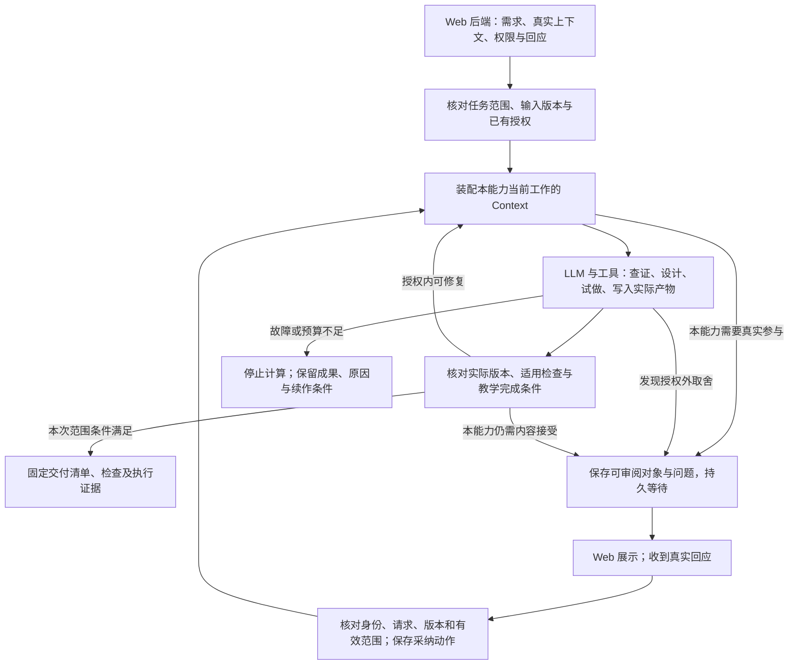

# 教学 Harness 的主执行链、调用与运行承载

日期：2026-09-15。关联[调用接口](../issues/02-execution-interface.md)与[运行架构研究](../issues/11-agent-server-stack-research.md)。本文将既定教学语义和有限实验收敛成执行设计。调用语义的采用范围见关联决定；操作名及示例字段用于规格交接，尚非发布的 API。模型／工具的具体实现继续由对应票收敛，不改变各项能力的完成条件。

依据：[README](../../../README.md)、[执行结构决定](../issues/03-execution-structure.md)、[人类参与决定](../issues/07-hitl-protocol.md)、[Context 详细设计](context-and-llm-design.md)、[课程与课时的双向交接](curriculum-design-capability.md)。各能力的完整原流程继续按[索引](index.md#按任务读取)读取，本文不替代它们。总体交接见 [架构结论](architecture-conclusion.md)，模型／知识／产物细节见 [实现选择](model-knowledge-artifact-design.md)，交付门槛见 [验证路线](validation-and-release-route.md)。

## 设计理由与执行形态

采用**能力自己的教学流程＋有界模型／工具循环＋可持久恢复的少量控制位置**。LLM 负责理解需求、设计、查证、试做和修订；程序负责真实输入、资源可见范围、产物版本、必要执行条件及恢复。场景清单用于检查设计，不成为教师菜单，也不逐条变成图节点。

选择依据有两部分：原 Skills 已说明各教学动作为什么存在；实际 Gemini 实验显示简洁循环能完成蓝图到三课的生成及针对性修订，但会出现未保存成果就耗尽预算、错误自报检查完成、图形与跨课时间问题。这支持保留循环、补齐实际内容和执行证据的控制，尚不支持为每项缺陷增加专门 Agent 或固定分支。[具体运行与局限](../experiments/grade8-linear-functions/runtime-notes.md)、[质量裁定](../experiments/grade8-linear-functions/quality-review.md)



图表示执行责任而非固定节点数量。一个课时调用不先跑全年设计，prep 不先生成一套新课；在任何安全停止位置均可处理取消。HITL 回来后可以修改、继续、收束或取消，按该能力解释；不是所有回应都触发生成。

## 调用方需要知道什么

教师以自然语言提出教学需求，Web 后端补充它已经拥有的课程、条件和身份。Harness 自行读取可取得的信息、解释意图并组织教学工作。教师不需要选择图节点，调用方也不需要拼完整 Prompt 或管理 `Command(resume=...)`。

比较三个放置 Interface 的位置：

| 选择 | 调用方必须额外承担什么 | 本项目取舍 |
| --- | --- | --- |
| 直接暴露聊天消息／Agent Server runs | 识别哪个消息是真实待答，关联展示版本，辨别运行成功与教学交付，处理重复恢复 | 这些复杂性会散落到每个产品调用处，不能作为教学能力的完整 Interface |
| 按能力阶段、课程层级和场景暴露操作 | 调用方理解内部教学流程及状态转换，随规则变化修改 Web 编排 | 与克制设计、各能力独立演进相冲突 |
| **任务级 Interface，内部使用现成运行服务** | 提供真实需求、输入引用和事件，读取请求及有范围的结果 | 采用；隐藏教学执行与恢复复杂性，保留调用方确实需要的语义 |

下面六项是语义操作，**不是六个独立服务或教师按钮**。HTTP 路径、SDK 语言、分页和传输 Schema 在规格阶段落实。查看与订阅是同一个任务视图的两种取得方式。

| 操作 | 调用方提供 | Harness 承担和返回 |
| --- | --- | --- |
| 发起 `start` | 原始需求；已知能力与交付范围；实际课程／课时及条件引用；已有决定；调用事件身份 | 保存任务与输入版本，返回稳定任务引用和回执，再调度执行。缺少真实原课时先取得或提出具体请求，不另造一课冒充输入 |
| 查看／订阅 `view` | 任务引用、可信访问身份；可选待查事件身份或上次视图版本 | 返回一致的任务视图、回执、当前待答、部分成果、检查和停止原因。重新连接先取持久视图，再接后续变化 |
| 回应 `reply` | 请求身份与展示快照；真实原文／选项／附件引用；事件身份 | 保存原始回应，按该能力解释、核验并采纳动作；返回接收和处理事实。回应已保存不等于已采纳，更不等于后续生成成功 |
| 修订 `revise` | 哪个实际版本、什么修改、作用对象与范围；事件身份 | 返回修订工作引用和父版本。等待中的明确修改可随 `reply` 提交；已结束任务的修订新建任务，保留父产物关系 |
| 续作 `continue` | 已停止任务及停止记录；继续原因；必要的新预算授权或已补齐依赖 | 继续原目标和已保存动作，预算累计。不能绕过待答、降低质量要求，或自动重开取消任务 |
| 取消 `cancel` | 任务引用、真实取消事件及事件身份 | 先阻止新工作和迟到结果进入当前交付，再请求停止在途运行；返回取消已记录及在途工作是否已结束，保留历史 |

`continue` 补齐前版五项操作未说明的预算停止出口。它是可信后端的续作入口；普通暂时故障在原授权和预算内由 Harness 自动重试，不让教师点“恢复”。改变目标、材料或作用范围走修订；取消后明确重做走新任务并引用旧成果，不把取消当可自动恢复的错误。

每项写操作以调用方生成的稳定事件身份去重；同一逻辑调用网络重送复用该身份，新的意图使用新身份。去重至少包含租户和操作所属范围：`start` 在返回任务身份之前也必须可重试。外部身份从受信任调用链取得，不能采信正文自称的角色；事件身份本身不赋予权限。

### 输入从哪里来，哪些内容不让教师填

| 信息 | 谁提供／取得 | 如何使用 |
| --- | --- | --- |
| 教学需求与实际决定 | 真实参与者；Web 保留原文、来源和对象 | 模型可解释为工作理解，不把自己的解释写回成原话；只追问会影响执行的歧义 |
| 能力与交付范围 | 产品已知则直接给；否则 Harness 结合需求判断 | 记录全年蓝图、完整单元、单课材料、正常协作或明确的只生成范围。范围未清且会改变结果才询问，不给所有请求增加问卷 |
| 课程、学习证据、Learner Model 与学校条件 | 外部给实际内容或经授权可读的版本引用 | Harness 取得当前工作所需内容，保存采用快照。未知个人状态仍未知；设计假设与学校事实分开 |
| CCSS、知识与教学规则 | Harness 配置和本地知识工具 | 固定 CCSS，按能力装配适用资源，记录实际版本。调用方不用指定图节点、查询路径或逐条 rubric |
| 模型、工具、预算、数据发送范围 | 可信运行配置 | 与教学正文分开；模型不能扩大可读资源、支出或决定权限。凭据不进入教学 Context |

只有引用的输入在消费前须能解析到明确版本和实际内容；不能把可变的“latest”带到后续恢复再读取成另一份课。引用暂时读取失败是依赖故障，有效任务可保留待续；原本未提供必要信息则按能力提出待答。对话历史只提供相关内容和真实输入，不能整段灌入教师答案隔离或学生独立读题调用。

### 返回的事实怎样组织

任务视图返回一个带版本的业务快照；内部可关联 Server thread／run 和 LangSmith trace 供运维定位，调用方的正确使用不依赖这些框架身份。首版同一任务串行执行，不引入并行课程子任务协议。

| 可取得的内容 | 对调用方的承诺 |
| --- | --- |
| 本次范围与采用输入 | 能辨别本任务要完成什么、依据哪个课程／条件版本，以及结果作用于课程基线还是指定班级／个人 |
| 当前工作和停止原因 | 用可读说明表达已排队、计算中、等待、停止或结束；同时返回机器可识别原因。不可直接转发最后一个节点的 `phase` 或 Server run 状态 |
| 待答请求 | 稳定请求身份、实际问题、足够判断的内容／版本、可选回应建议及所需主体；被新请求替代时能知道原对象已失效 |
| 调用回执与采纳动作 | 对指定事件能查到是否持久收到、解释／处理到哪一步、是否采纳及其范围、后续是否已调度或已结束 |
| 内容与检查 | 草稿、当前候选和已交付清单分别可定位；检查指向实际内容、规则版本及覆盖范围，区分未查、失败和变更后待重查 |
| 人类参与与本次完成情况 | 保留哪些决定／贡献确实发生、尚缺什么；按能力判定本次约定是否满足，不用一个统一 `approved` 或 `done` 代替 |
| 使用依据与消耗 | 可回取 Context 清单、知识来源、内容修订、检查与人类事件；报告累计消耗及不确定项，trace 链接是补充 |

教师默认看到当前教学工作、需要其回答的事和可看的材料；完整检查与技术诊断按需展开。`view` 是读取，不因刷新页面启动模型、延长预算或采纳候选。订阅消息用于及时通知，过期或乱序时重新取得业务快照；不要求永久重放每个 token。

草稿可审阅、材料检查通过、协作完成和外部发布分别成立。例如适配材料已全部生成并通过检查时，可以查看材料，但正常协作仍等待整套接受。只交全年蓝图的任务可以完成其范围，不能把其他未生成单元标作已可教学。明确短时备课可以按该范围结束，同时如实保留正常协作未发生的参与事实。

### 回应保存、语义采纳与续作的交接

持久探针直接验证了“已保存动作 → 进程退出 → 新进程续作”。生产自然语言入口还需要处理模型解释本身失败的窗口，因此将事实再分清一层：

1. **持久接收。** 核对可信来源和可访问对象，保存原始回应、原请求／快照及事件身份，返回稳定回执。此时不声称教师的条件已被理解或同意生效。存储失败不能返回“已保存”；响应丢失则用同一事件重送或查询。
2. **解释并采纳。** 在本能力规则和实际展示内容下解释原文、限制及影响；结构化选项也不能丢掉随附文字。核对当前有效范围及外部决定规则后，条件式提交一次采纳动作。模型解释失败在原预算内重试；解释尚未采纳时不推进生成。需澄清时只保留尚缺的问题，已收到的事实不丢弃。
3. **调度与执行。** 用已保存动作关联下一次运行。采纳与“后续待执行”的记录在业务事务内提交；由 Harness 的恢复交接读取该记录，使用 Agent Server 已有运行队列。调度失败、响应丢失或进程退出由该交接核对并补送，不能只在原 HTTP 请求内尝试一次。

这项交接可用现有业务表中的待执行记录实现，不新增通用消息队列平台。启动调用超时后先检查关联 run／动作记录，不盲目再发一次生成；进入执行时再核对动作是否已消费、是否取消或被替代。具体数据库与 Server 调度适配由模型／工具及实现规格落实，现有 dev 探针**尚未验证**这条生产自动交接。

已采纳动作在下游重试时直接使用；不重解读相同原文产生新选择。多次投递返回原回执及最新处理进度，不伪造一次新回应。**程序只保证真实事件、对象和提交条件；“同意，但不要改变函数情境”是否被模型正确理解，仍需真实语言样本评价。**

### 用一条具体调用读懂 Interface

以下是文档示例，所有身份和后续教学结果均为假设；不冒充已上线 Schema 或真实课程验收。教师原话可由 Web 直接传入；可信调用身份、配置和输入解析由后端负责。

```json
{
  "operation": "start",
  "event_id": "web-start-example-1",
  "request": "为这节八年级课设计一个理解度检查，先给我看检测焦点。",
  "capability": "check_for_understanding",
  "context_refs": [{"object_id": "lesson-example-7", "revision": "r3"}]
}
```

`start` 返回任务引用和已保存回执。Harness 取得该课、CCSS 和相关依据，给出具体焦点并保存请求；Web 显示其教学内容。内部关联 thread 由 Harness 管理，不让产品为一次暂停另造任务。

```json
{
  "task_id": "task-example-1",
  "view_revision": 4,
  "work": {"status": "waiting", "summary": "等待选择这次检查要观察的理解。"},
  "pending_request": {
    "request_id": "focus-example-1",
    "snapshot_id": "display-example-1",
    "prompt": "检查根据两组对应值求变化率、解释单位，并区分 Δy/Δx 与 y/x；用来判断学生是否理解两个量的变化。也可以提出另一个焦点。"
  },
  "result": {"delivery_manifest": null}
}
```

```json
{
  "operation": "reply",
  "task_id": "task-example-1",
  "event_id": "web-reply-example-1",
  "request_id": "focus-example-1",
  "snapshot_id": "display-example-1",
  "text": "采用上述变化率焦点"
}
```

回应尚在解释时，回执可以是 `receipt=saved, handling=pending`；采纳成功但创建 run 暂时失败时，则是 `handling=adopted, continuation=pending`。两者都应向教师说明已经收到，无需重答。后续取得并检查实际师生材料后，才返回具体交付清单。若本次只完成文件完整性检查，质量结果必须保留未评价，不能像探针的固定题一样被宣布为已验证教学内容。

同样的承载用于备课，但 `pending_request` 是原任务及教师自己的尝试／near-miss；只有一句“同意”不会被当作完成了任务。适配的请求则可引用当前完整材料包并保留局部接受。这些差别来自能力流程，不增加 `reply_prep`、`reply_differentiation` 等运行入口。

### 修订怎样连接课程层级和个体范围

全年蓝图 A 交给单元设计时，传 A 的实际版本、单元身份、目标职责、Narrative、约束及已有材料；不重新让调用方拼出一个孤立主题。单元设计可以在内部调用课时能力，使用同一任务的范围和预算，不要求 Web 按每课编排。发现上层缺口时带实际失败对象回查，在已有授权内修订；外部没有提供改变全年目标的授权时才提出具体取舍。

| 真实意图 | 调用／关联 | 结果与限制 |
| --- | --- | --- |
| 压缩单元课时，但保留目标 | `revise` 指向实际单元及上层版本，附原话 | 读取实际任务、依赖和时间，形成跨层差异及重查；不能仅改目录就完成 |
| 为某班增加阅读支持 | 新适配任务引用课程基线与该班相关证据，作用范围为该班 | 新产物保留父版本及作用对象，不改写公共课程或其他班材料 |
| 生成中改成另一方案 | 同任务的新修订事件保留原父版本与新意图 | 先使旧动作不能成为当前交付，再在旧 run 停稳后继续；不在同一任务并行写入 |
| 两个任务同时修改同一课程 | 各自保存候选，结果携带预期基线和实际新版本 | 不按完成先后覆盖共享基线；采纳处须原子核对预期版本，冲突返回当前版本及两个候选 |

**本任务工作版本与外部采用／发布版本分别管理。** Harness 对自己的当前工作和交付记录做条件式提交。共享课程采用记录只有一个权威写入方：由外部产品持有时，它在采纳 Harness 结果时原子比较 `expected_base_revision`；Harness 返回这个前置条件，不能靠生成前查询一次保证最终不冲突。发布仍由外部负责。此约定不另造一套审批平台，也不将检查通过当作已被学校采用。

检查、展示和交付后的内容用不可变引用定位；文件地址只是访问入口，链接失效后可重新取得同一版本。请求快照、课程修订、材料字节指纹和检查规则版本各有用途，不共用一个含义不明的版本号。跨版本复用决定须说明仍适用的对象与理由；首版优先较大范围重查，暂不建设通用细粒度检查缓存引擎。

### 失败时调用方怎样处理

| 返回事实 | 调用方／Harness 后续行为 |
| --- | --- |
| 回应或启动结果未知 | 以原事件身份查询或重送；不能生成新身份当作普通重试 |
| 相同事件身份携带不同正文 | 返回冲突，不覆盖原记录；实际改意用新事件 |
| 回应指向被替代请求 | 保留原始对象及未采纳原因；核对可复用范围或返回当前具体取舍，不用旧同意放行新内容 |
| 原请求已处理，又收到不同有效事件 | 依内容和外部决定规则处理新意图／冲突；不能因为请求已答就把它误删为重复 |
| 模型／工具暂时失败 | 在任务剩余预算内恢复已保存工作；连续失败则返回停止位置、已有产物及续作条件，不要求人重答 |
| 数学或教学检查失败 | 将可定位发现交回模型修复，并检查新版本；未通过结果保留可读草稿身份，不悄悄降低完成要求 |
| 预算耗尽 | 保存累计消耗、停止记录、部分成果和未完成条件；有有效预算更新后 `continue`，不是新开 run 自动清零 |
| 取消与在途结果竞速 | 取消先在业务提交条件生效；在途结果可留历史但不得成为当前交付。`cancel` 的成功回执不承诺供应商即时停算或费用为零 |
| 运行规则与旧等待不兼容 | 保留请求和已答记录，返回需要兼容恢复的技术原因；由维护者处理版本，不能叫教师重新生成一次批准 |
| 观察服务不可用 | 记录可观察性缺口；任务与必要业务证据照常按其条件推进，trace 不充当材料／人类事件的唯一副本 |

错误类别供后端采取正确动作，教师看到的是当前教学工作的实际影响。权限不足和不存在的引用按外部访问约定处理，不泄露其他学校任务；多方决定权不清是可信配置缺项，由调用方补齐，不能让模型按角色名称猜测。

### 本轮静态核对与实现验收交接

本轮逐项对照既有决定、四项原 Skill 的关键输入／HITL 条款、课程双向交接与持久探针，核对以下判别情况。它们是 **Interface 的静态审查**，并非新增运行测试或教学质量证据。

| 判别情况 | 当前设计的答案 | 后续证据所在 |
| --- | --- | --- |
| 请求完整单元，只产生连续三课 | 返回部分成果与未完成范围；不改变原请求 | 质量与课程贯通验证 |
| 先审草稿，然后“只改题目”和“改好直接生成” | 同一回应入口保留不同动作和授权，均延续真实草稿 | 自然语言与课时流程验证 |
| 适配仅接受一组；prep 尚无教师尝试 | 各自保留未完成条件，不转成通用批准 | 对应能力的真实交互验证 |
| 已有本次有效 CFU 焦点；采纳后进程退出 | 不制造重复问答；按已有动作续作 | 有限 CFU 探针已支持，生产自动交接待实现 |
| 回应已保存，解释模型失败 | 有回执、未采纳；保留原文恢复解释，不推进生成 | 新增到后续接口验收，当前探针未测 |
| 启动超时重送；恢复 run 创建超时 | 稳定事件回执、动作与 run 核对，避免盲目重调 | 生产调度适配验收，当前探针未测 |
| 全年版本改变；单班支持更新 | 核对相关依赖／采用条件，个体变化不覆盖基线 | 跨层修订与并发验收 |
| 教师停止讨论；明确取消全部工作 | 前者按能力收束，后者不追加模型生成 | prep 与停止行为验收 |

本票可据已有授权和证据收敛调用语义。它不需要再先实现一套 HTTP 服务来证明这些区分值得保留；正式字段、事务适配、自然语言质量和生产恢复分别进入后续工作。共享模块是否足够深，验收时看调用方能否仅用上述 Interface 完成真实任务，而不再自己解释 graph state、拼教学规则、去重恢复或判断每项 Skill 的结束。

## Context、模型行动与实际版本交接

起始输入保留原始需求以及简明解释：要产出什么、哪些条件必须保持、哪些可自主设计、已有内容和决定是什么。模型的解释是候选工作理解，不能改写真实事实。

| 当前工作 | 必须实际取得的内容 | 交接结果 |
| --- | --- | --- |
| 全年方案 | 完整年级 CCSS 内容与实践要求、日历容量、适用教学规范、必要前后联系与实际条件 | 目标分配、进程与 Narrative、时间、关键任务试做及未验证假设；目录本身不足 |
| 单元与课时 | 采用的上层目标与 Narrative、进入／结束要求、已存在的关键题面及材料、相邻课的实际依赖、允许调整范围 | 真实任务、表征、解法、师生材料、评测与目标对应；发现结构缺口带具体依据回修上层 |
| 适配、prep、CFU | 各自流程要求的原课／学习焦点、相关学习条件与证据、有效人类输入及该阶段规则 | 各自的材料、备课贡献／便签或检查任务，不复用课程设计的整套交付路径 |
| 检查与修订 | 当前实际文件与版本、适用判据、定位明确的发现；需要时读取上下层和旧版 | 可复核检查记录、实际修改、影响范围和未解决项；报告声称检查不算工具执行 |

教学规则从固定上游详细资源及本项目已采用变更形成版本化运行材料，不能只把研究摘要拼成 Prompt。知识按[消费约定](../../../docs/references/knowledge-consumption-contract.md)使用真实实体和关系；模型可用内置知识创作、推理，不要求每个步骤都检索。

模型提出下一步行动；工具验证范围后查询、计算、保存或检查。写入、展示和检查各指向可定位快照。独立读题只读实际学生材料，教师答案和设计历史不能通过 thread 历史、缓存或宽泛工具回流；CFU 的完整验证资源仍按其自身流程在实物齐备后开放。原创实验继续限制 IM 具体课程输入，LangSmith 评测资料也不能越过这条界限。

恢复装配“已保存工作＋当前适用规则版本＋已采纳动作＋剩余预算”。已被检查或展示的内容不能靠模型从聊天摘要重新生成。容量不足先划分工作、按需读取；当前不为节省 token 另开全面优化实验。

## HITL 究竟介入哪里

位置已在[五项能力的详细设计](hitl-design.md)及关联决定中确定为语义基线。下面仅将它们放入主链，保留完整例外的原链接。

| 能力 | 正常需要人的位置与目的 | 已有有效输入／不同请求怎样处理 |
| --- | --- | --- |
| 课程体系设计 | 必要信息无法取得、目标／课时／资源需要授权外取舍，或本次明确要求先审方案时；先展示具体设计与代价 | 在授权内设计和修复直接继续；没有逐层批准要求。不能把“压缩但保留目标”解释为允许删目标 |
| 课时与材料设计 | 选了先看草稿的路径：展示实际任务、先备、时间与学习检查后，等待修改或生成指令 | 已要求完整教学包可直接展开；“只改草稿”重呈，“按这些改动直接生成”在范围内继续。依据[原 creation](../../../k12-teacher-skills/plugin/skills/k12-lesson-plan-creation/SKILL.md) |
| 教学适配 | 正常协作中，收到对当前整套实际材料的有效接受才结束；意见进入对应修订 | 局部接受按有效范围保留；明确只生成供外部后审时按该范围交接，不能将超时写成满意。保留[原 differentiation](../../../k12-teacher-skills/plugin/skills/k12-lesson-differentiation/SKILL.md)的教学目的，固定四份 Word 不成为项目固定数量 |
| 教师备课 | 模型先试做原课任务，正常路径让教师亲做并提出 near-miss 的分析，再揭示模型分析、讨论及形成便签 | 已有实质贡献直接用；明确先示范、拒答、短时与结束按[prep 及例外](hitl-design.md#教师备课)处理，不能由模型伪造教师贡献 |
| 理解度检查 | 提出能辨别理解的焦点及理由，正常路径等教师选择或改向后构建 | 已有本次明确焦点或有边界委托可直接使用；宽泛主题不等于焦点决定，明确改向不再重复确认。依据[原 CFU](../../../k12-teacher-skills/plugin/skills/k12-check-for-understanding/SKILL.md) |

落实时分开两类控制：流程已确定需要参与的地方，程序检查是否具备有效回应，缺少就等待；模型发现新的必要澄清或授权外取舍，可以提出待答请求。不能把全部 HITL 都寄托在模型是否主动调用 `request_human`，也不对每次工具调用统一审批。

等待前固定实际展示对象、问题、影响范围与请求身份。Web 后端显示可读内容并送回真实回应；Harness 先验证来源、对象和去重，再解释条件和影响，保存采纳动作后恢复。回应不明确时只问仍影响执行的部分；工具故障不能让教师重答已经保存的问题。

**实际证据分开记录：**[审计](../experiments/grade8-linear-functions/hitl-coverage-audit.json)中 9 次真实 Gemini 执行都未发人类请求，原代码也没有回应／恢复入口。后续 [持久运行探针](cfu-durable-prototype-results.md) 已取得一次真实原型焦点选择、跨进程恢复与重送证据；其模型输出固定，不证明其他能力的交互或真实模型对话质量。用户对项目规划的“继续”不能被登记为某份课程材料的教师接受。

## 运行状态与教学结果怎样分开

一次教学任务可以跨越多次后台运行与真实人类等待。调用方始终能分别取得：运行是否计算／等待／停止；当前候选及采用版本；逐项检查与未解决问题；人类请求、回应及接受范围；本次实际交付清单。后台运行成功只说明本次计算正常结束。

运行探针进一步说明：回应已保存但恢复尚未启动时，调用方应能取得“已采纳、后续待恢复”，而非要求人重答。等待时图的最后一个 `phase` 可能仍为 `proposed`，接口必须结合实际 interrupt、业务请求及取消状态形成可读进度，不能直接转发单一内部字段。请求快照、产物指纹与检查版本也须保持不同含义。

具体落盘建议：应用保存版本化教学产物、依赖、检查、人类事件与交付事实；图状态保存继续工作所需引用和执行状态。首版可共用数据库基础设施，不需要为每类记录建设独立服务，但不要直接修改框架内部 checkpoint 表来承载业务事务。文件写完再记录引用之前失败时，须能核对和复用实际结果；checkpoint 不能保证外部文件和业务记录自动原子提交。

数学检查发现交给模型核实并修复，允许以证据反驳误报；再检查实际新版本。必要检查未执行应显示未检查，不能采信“我检查过了”。没有新进展或资源用完，保存部分成果、未通过项与续作条件；12／24 次实验上限不变成生产固定次数。按 [质量与消耗的推进顺序](validation-and-release-route.md#质量与消耗的推进顺序)，当前优先高质量完成任务并记录消耗，有进展的修订在授权及明确资源限制内继续，预算优化后置。人类满意不能覆盖数学错误，质量评分不能代替真实人类决定。

## 运行技术的职责映射

以完整专项的[LangGraph／Agent Server 研究](langgraph-agent-server-research.md)和[LangSmith 研究](langsmith-observability-evaluation-research.md)为框架事实依据；下表是本项目候选用法。

| 层 | 本项目用法 | 仍由 Harness／外部落实的部分 |
| --- | --- | --- |
| LangChain | 使用模型、消息和工具集成，当前优先 Gemini；复用适合的循环能力 | 具体教学规则、Context 的实际内容与可见范围、不同模型能力实测 |
| LangGraph | 组织能力自己的执行、持久状态、条件分支与 `interrupt`／恢复；节点按可靠保存、可见范围和等待的需要划分 | 教学目的、人类请求身份／决定有效性、产物提交、实际预算与检查；不要按每个课时或错误建立固定节点 |
| Agent Server | 复用 assistants／threads／runs、后台执行、流式结果、持久化和并发控制入口 | 外部身份的接入与资源隔离、课程版本冲突、内容交付规则；同一 thread 的并发策略不覆盖跨 thread 修改同一课程 |
| LangSmith | 关联执行轨迹、错误与消耗；用版本化案例比较质量和修订；组织专家标注及 judge 校准 | 产物和人类事件的权威记录、产品 HITL 恢复、数学检查的即时回修、最终内容发布；online evaluator 空闲触发不等于教学完成 |

实现选择采用 LangChain `create_agent` 与 middleware 承载工作段内的模型／工具循环和 Context 装配，再用 LangGraph 表达确需保存、切换可见范围和等待的位置；真实 Gemini 与这一原生承载的合并仍须在首个实现切片验证。已有研究 CLI 的手写循环不直接成为生产实现；也不预先套多层图。框架自带的工具审批适用于相应工具动作，但教师亲做、焦点选择和整套材料接受仍按教学语义设计。下一次切片以状态、资源范围和恢复是否满足要求来选择具体组合。[官方 Agent 配置](https://docs.langchain.com/oss/python/langchain/agents)、[官方工具 HITL middleware](https://docs.langchain.com/oss/python/langchain/human-in-the-loop)

`interrupt` 恢复会从所在节点开头重新执行。因此生成／发送请求与等待要安排可复用的保存位置，等待节点不重新生成审阅稿；接收事件、采纳动作与发起恢复之间仍需应用层可靠交接，失败后恢复同一动作。[LangGraph 官方中断说明](https://docs.langchain.com/oss/python/langgraph/interrupts)

候选映射为一个有明确范围的持续教学任务对应一个 Agent Server thread，计算启动和人类回应后恢复对应 runs；新课程分支或独立适配任务使用新 thread 并显式引用父产物。不能按同一个教师永久复用一个无限增长的聊天 thread。LangSmith 用关联身份串起观察 traces，但不成为另一套任务状态。

首版对同一任务保持串行写入；其他任务可独立执行，同一课程采用版本的提交仍需比较实际父版本。取消先禁止提升旧结果再终止在途工作；不以取消 run 或回滚 checkpoint 声称撤回外部副作用。部署、持久化拓扑及版本升级约束详见专项；生产选择需结合版本锁定与恢复探针，当前没有实际部署结论。

LangSmith 初期只接会帮助主线的观察与固定案例评测。记录模型／工具真实执行、Context 清单、产物和检查版本；真实师生信息按外部数据政策选择发送范围，原始内容仍按应用责任保存。现有实验未启用云端 tracing；接入方案不自动上传历史材料。Annotation queues 中的人工评分属于质量证据，不能触发教师确认后的恢复。[官方标注队列](https://docs.langchain.com/langsmith/annotation-queues)

## 下一项高价值验证及结束条件

以下切片现已按[运行原型票](../issues/09-cfu-runtime-prototype.md)完成有限验证，详见 [实际结果](cfu-durable-prototype-results.md)。一次真实原型回应、13 项固定事件探针、Agent Server dev 重启及 LangSmith SDK 本地发送各有记录；共享机制通过不代表其流程推广到其他能力。上述调用约定已吸收这些结果；后续转入模型、本地图查询与产物工具的具体职责，生产自动交接另按接口验收兑现。

| 证据缺口 | 有限验证 | 能据此决定什么 |
| --- | --- | --- |
| 等待点与真实输入未接通 | 保存可判断的焦点／草稿快照，停止并重启进程；通过调用入口收到真实人的回应，再继续对应工作 | 请求和版本是否稳定、已答事项是否重问。固定或模拟输入另标，只证明控制；真实自然语言解释需另外评价 |
| 回应与产物跨保存位置失败 | 同一事件重送、采纳后未启动 run、文件成功但状态未提交、旧版回应／取消后结果返回；记录每个副作用实际次数 | 事件去重、恢复与提交机制是否足够；不承诺模型供应商调用恰好一次 |
| 运行与观察容易混淆 | 关联 thread／run、请求事件、产物与检查；关闭或失去 tracing 后核对业务记录；允许发送的数据用实际 payload 验证 | 是否可定位问题且不依赖观察平台维持正确状态；无 LangSmith 服务时只记未验证，不假造云端证据 |

先锁定原型依赖及服务器版本，再限定场景、故障窗口与判据；达到这些机制判据就停止扩展。生产部署容量、完整学科质量和真人课堂效果分别保留后续验证。课程、草稿、适配和 prep 的不同交互还须进入各能力验证，不能用一次 CFU 恢复替代。

研究能确定框架责任，运行证据只支持实际测试的范围。调用语义与错误处理依据切片收敛，字段名和生产实现由正式规格落实；生产部署、完整教学检查及其他能力的真实交互仍待验证。既有教学未通过项继续保留，数学图形模块、样例精修和局部消耗优化仍按主线依赖后置。
