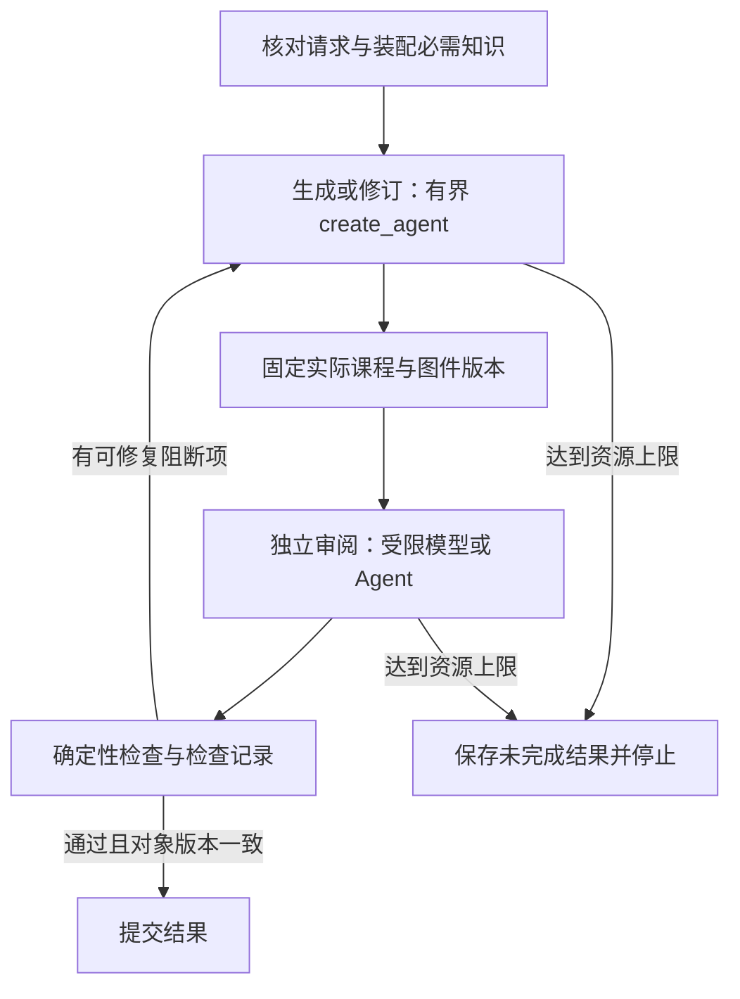

# ReAct Agent 与 LangGraph 工作流的职责边界

日期：2026-09-15。本文回应 ticket 01 实现后的架构核查：`create_agent` 与 LangGraph 是否重复、固定阶段如何编排、如何证明一次 Agent 执行的工具顺序。本文区分官方事实、当前代码事实和本项目改进建议；未更改实现或宣布新的采用决定，未发起模型调用、上传执行记录或运行恢复实验。

## 结论

`create_agent` 本身返回编译后的 LangGraph 图，能够直接注册给 Agent Server。为了使用服务而给它再包一层单节点图，没有框架上的必要。与此同时，官方明确支持把完整 Agent 放进更大的工作流：让程序安排已确定的阶段和条件，让模型在需要判断的阶段内自主选工具。这两种判断并不矛盾。[官方 Studio 配置](https://docs.langchain.com/oss/python/langchain/studio#4-create-a-langgraph-config-file)、[官方混合工作流说明](https://docs.langchain.com/oss/python/langchain/middleware/overview#use-middleware-inside-a-langgraph-workflow)

ticket 01 的具体缺口是：知识装配、生成、独立审阅、确定性检查、检查提交和修订条件已经由程序安排，却全部藏在一个外层节点和 Python `while` 中。外层图只表达任务开始和结束，未表达这些重要工作边界。采用 `create_agent` 没错；当前实现对已知编排与可检查执行证据的落实不足。后文给出建议，不能把建议图当成已实现图。

## 本次实际访问的依据

| 一手资料入口 | 本次取得的内容 | 适用边界 |
| --- | --- | --- |
| 已安装的 LangChain Docs MCP | 搜索官方文档，按文档虚拟文件路径读取 Agents、Middleware、Workflow、Subgraphs、Agent Server 等正文 | 公开文档；不包含私有支持结论或项目专属最佳实践 |
| 已安装的 LangChain API Reference MCP | `create_agent`、`ToolMessage`、旧 `langchain-classic.create_react_agent` 的签名、说明及 GitHub 源码链接 | API 参考站可能随发布更新，需要核对本项目锁定版本 |
| 官方网页及 GitHub 链接 | 工作流和 Agent 的定义、v1 迁移、恢复与部署的官方说明 | 未使用第三方博客替代框架事实 |
| 本地锁文件和已安装源码 | `uv.lock` 与 `.venv/lib/python3.13/site-packages/` | 用于确认当前版本实际包含哪些 API；静态源码不等于本项目故障测试通过 |

当前锁定：`langchain 1.4.0`、`langchain-core 1.6.3`、`langgraph 1.2.11`、`langgraph-api 0.14.1`、`langchain-google-genai 4.4.0`。本地 `langchain/agents/factory.py:840` 的返回类型为 `CompiledStateGraph`，末尾 `:1841` 执行 `graph.compile(...)`；`langgraph/prebuilt/tool_node.py:828` 的异步工具路径以 `asyncio.gather` 执行一批工具。[锁定版本](../../../uv.lock)、[官方 factory 源码](https://github.com/langchain-ai/langchain/blob/79cab2dc7f58be720cac43db3677b4c1fd971f91/libs/langchain_v1/langchain/agents/factory.py#L840)

官方文档示例也要核对签名：本次读取的子图页仍有把 `prompt=` 传给 `create_agent` 的示例，当前安装版本实际参数为 `system_prompt=`。本次只采用核实后的组合机制，不把示例逐字复制为已验证实现。[迁移参数说明](https://docs.langchain.com/oss/python/migrate/langchain-v1#static-prompt-rename)

## 官方事实：容易混淆的 Agent 概念与接口

| 名称 | 实际含义 |
| --- | --- |
| ReAct 模式 | 模型依据任务和已有工具结果，决定下一步行动，再取得结果继续推理；这是行动循环的概念，不是一套固定业务步骤 |
| `langgraph.prebuilt.create_react_agent` | 旧版 LangGraph 预构建 Agent；本地安装源码已标记弃用并引导迁移到 `langchain.agents.create_agent` |
| `langchain-classic.agents.react.create_react_agent` | 更早的文本提示与输出解析实现，使用 `agent_scratchpad` 等字段；官方明确提示其不适合作为当前生产首选 |
| `langchain.agents.create_agent` | 现代预构建模型／工具循环，支持结构化工具调用、middleware 和结构化输出，返回编译后的 LangGraph 图 |

来源：[v1 迁移指南](https://docs.langchain.com/oss/python/migrate/langchain-v1#migrate-to-create_agent)、[旧文本 ReAct API](https://reference.langchain.com/python/langchain-classic/langchain_classic/agents/react/agent/create_react_agent)、[当前 Agent API](https://reference.langchain.com/python/langchain/agents/factory/create_agent)。ticket 01 使用最后一项。

另需区分构造与执行：调用 `create_agent(...)` 是构造图；`agent.ainvoke(...)` 才执行一次任务。一次执行可以发生多次模型调用和多次工具调用。因此“用了几次 create_agent”不能代替“哪一次 Agent 执行，发生了哪些模型与工具调用”。[Agent API](https://reference.langchain.com/python/langchain/agents/factory/create_agent)

## 官方事实：什么时候用工作流，什么时候让模型选工具

官方把 workflow 定义为预先确定的代码路径，把 agent 定义为动态决定过程和工具使用的系统；LangGraph 可承载两者。节点可以是普通函数、一次模型调用或完整 Agent，因此“使用 LangGraph”不意味着每个步骤都要调用模型。[Workflows and agents](https://docs.langchain.com/oss/python/langgraph/workflows-agents)、[Custom workflow](https://docs.langchain.com/oss/python/langchain/multi-agent/custom-workflow)

| 问题 | 更合适的控制方式 | 本项目中的例子，属于应用判断 |
| --- | --- | --- |
| 这一步每次都必须做，并且输入输出已确定吗？ | 普通函数或显式工作流节点 | 核对请求、固定知识快照、装配必需知识、核对文件指纹 |
| 下一步必须等当前结果，且失败处理或可见信息不同吗？ | 有明确状态与边的阶段节点 | 已保存草稿之后，才能用独立上下文审阅该版本 |
| 要查什么、算什么或如何修题，需要根据当前内容决定吗？ | 有界 Agent 循环 | 生成时选择具体算式、绘图参数、补查哪些标准 |
| 只是单次输入产生一个结构化判断吗？ | 可先考虑一次结构化模型调用 | 不需要按需工具的分类或审阅；有工具往返需求时再使用 Agent |
| 结果失败后应回到哪里，何时准许交付？ | 程序条件边 | 检查阻断则修订；通过且版本一致才提交；预算耗尽则停止 |

从一次实际运行看到固定顺序，并不能证明下一次也该硬编码这一顺序。应固定的是业务必需的先后依赖；工具参数和有用的探索动作仍可动态决定。例如“先绘图，再检查该图与题面一致”是依赖关系，而“每次都计算同样 16 个表达式”只是某次运行轨迹。此段为基于官方区分的项目判断，非官方给本课程制定的流程。

### Middleware 的分工

官方 middleware 用于模型／工具调用周围的日志、提示调整、工具选择、重试、限额与提前停止；它在 `create_agent` 编译出的图内运行。官方建议在标准循环之外还存在确定性步骤、分流或并行时，把整个 Agent 嵌入更大 `StateGraph`。[Middleware overview](https://docs.langchain.com/oss/python/langchain/middleware/overview)

本项目建议：预算、工具参数错误反馈和调用关联可继续使用 middleware；“生成完毕→读取实际内容→独立审阅→提交检查→判断是否修订”的课程阶段应显式表达。没有必要为了展示步骤，把每个计算器调用、每条教学规则都变成一个业务节点。

## 官方事实：部署与恢复不能靠外层包装自动获得

### Agent Server

`create_agent` 的结果可直接作为 `langgraph.json` 的 `graphs` 目标。Agent Server 可以加载编译图，也支持需要逐次定制时使用工厂；官方优先推荐复用编译图。服务会注入其管理的 checkpointer 和 store，无须应用另配一套。[Studio 配置](https://docs.langchain.com/oss/python/langchain/studio#4-create-a-langgraph-config-file)、[Agent Server 图加载](https://docs.langchain.com/langsmith/agent-server#graph-loading-and-compilation)

因此，ticket 01 使用 Agent Server 不是保留单节点外壳的充分理由；保留外层图的理由应是实际工作流、边界和状态。本项目确实有这些工作，但尚未分别映射。

### 子图输入与状态隔离

父子图共享字段时，可直接 `add_node` 加入子图；状态结构不同时，可用一个包装节点映射输入输出。这是官方支持的模式，适合让生成和审阅分别保留自己的模型消息，父图只交换课程内容、版本和检查结果。[Subgraph communication](https://docs.langchain.com/oss/python/langgraph/use-subgraphs#define-subgraph-communication)

子图默认 `checkpointer=None` 会在一次调用内继承父图持久性，每次新调用从新状态开始；`True` 用于同线程跨次累积，`False` 才是关闭持久性。前提是父图有 checkpointer。不能仅凭当前 `create_agent` 没写 `checkpointer=` 就断言其内部完全没有 checkpoint。[Subgraph persistence](https://docs.langchain.com/oss/python/langgraph/use-subgraphs#subgraph-persistence)

### 节点边界与重放

checkpoint 在 super-step 边界形成，不会保存普通 Python 函数中任意一行的调用栈。恢复受影响节点会重新执行该节点函数；对于节点内调用子图的中断，父包装节点也从头开始。因此包在大节点内的普通网络读取、文件写入和局部变量，不能自动视为各自可恢复的业务阶段。[Graph API 的重执行](https://docs.langchain.com/oss/python/langgraph/graph-api#re-execution-and-idempotency)、[节点内子图的中断恢复](https://docs.langchain.com/oss/python/langgraph/interrupts#using-with-subgraphs-called-as-functions)

这不等于每个已经持久化的子图模型调用都必然重新计费：子图有自己的持久执行机制，实际是否复用结果还取决于调用方式、namespace 和恢复路径。节点前后的普通副作用仍需幂等设计，或拆到独立节点／可恢复 task。Functional API 的 task 结果可复用，但调用顺序也影响恢复匹配。[Functional API 的确定性](https://docs.langchain.com/oss/python/langgraph/functional-api#determinism)

官方把节点粒度视为恢复与可观察性的取舍：不同外部服务、失败策略、重要中间结果值得单独形成边界，细分过头也不是要求。[Thinking in LangGraph：节点粒度](https://docs.langchain.com/oss/python/langgraph/thinking-in-langgraph#advanced-considerations)

## 当前项目事实与已有设计的差距

已有 [模型、知识与产物实现选择](model-knowledge-artifact-design.md) 写的是“工作段内 `create_agent`；外层安排需要保存、等待和切换可见信息的位置”。已有 [执行结构分析](execution-structure-design.md#先比较执行方式) 也把不同可见信息、昂贵工作保存和一致的检查版本作为划分依据。故当前问题并非此前完全没考虑职责分工，而是首票实现没有把已有边界充分落实为图结构。

当前 [graph.py](../../../src/teaching_harness/graph.py:345) 构造 `author` 和 `reviewer`，随后在同一个 `while True` 中依次执行生成、内容回读、独立审阅、确定性检查和检查保存。外层 [图定义](../../../src/teaching_harness/graph.py:479) 只有 `START → curriculum_work → END`。重要中间结果主要保存在文件或函数局部变量中，外层状态无法直接表达“某版本生成完成，现在正在独立审阅”。

建议结构如下，仅表示需要解释和验证的职责，并未实施：

是否把保存／渲染各自分为节点、审阅是否保留 Agent、错误怎样重试，应依据实际副作用与失败边界定下来；不能仅按图好看就增加节点。现有工具内仍可保存中间草稿；独立的阶段提交负责确认送审的确切对象。

## 如何证明一次 Agent 执行的工具顺序与结果

框架层，`AIMessage.tool_calls` 描述模型提出的调用，`ToolMessage.tool_call_id` 将结果关联到对应请求。同一模型响应可以包含多个工具调用；本地 `ToolNode` 异步源码也支持并行，因此数组顺序、完成时间和依赖顺序应分别解释。[ToolMessage API](https://reference.langchain.com/python/langchain-core/langchain_core/messages/tool/ToolMessage)、[工具并行与状态更新](https://docs.langchain.com/oss/python/langchain/tools)

建议在维护者可见的执行记录中关联以下内容，公开教学进度流可以继续只暴露适用摘要：

- 原生 thread／run、业务阶段、一次 Agent 执行的身份，以及修订轮次。
- 一次模型调用的身份、它发出的每个 `tool_call_id`、工具名与实际参数。
- 工具开始／结束／错误、实际返回结果或结果文件引用、对应内容指纹。
- Agent 执行的结束输出，以及该输出是否满足下一阶段条件。

LangSmith 能记录 LangChain／LangGraph 的嵌套调用和输入输出，官方提供环境变量接入路径；这属于维护者观察能力，不要求向产品前端开放模型原始消息。[LangGraph tracing](https://docs.langchain.com/langsmith/trace-with-langgraph)

当前 ticket 01 共享的预算记录有 `model_started`／`model_finished` 和若干业务工具记录，但它不是完整的 Agent trace：缺少明确的 Agent 执行身份、阶段和工具调用关联字段，部分结果也未保存。仅有“25 次模型、23 次工具”无法回答某次生成 Agent 的每一轮输入输出。某次运行可以依据已有事件局部还原；缺失关联只能标为推断，不能事后补写成原始事实。实际 23 次业务工具的顺序、已知结果和缺失项已单列为 [真实工具调用序列复核](../../math-harness-delivery/evidence/01-live-curriculum/tool-sequence-review.md)，其中生成／审阅调用分界明确标为代码和事件顺序的推断。[当前记录代码](../../../src/teaching_harness/graph.py:101)

## 尚未实测的边界

- 本文完成的是官方资料与本地源码核查，没有验证建议图能否提升教学质量或降低消耗。
- 未实测拆分后的取消、故障恢复、重复保存、审阅版本一致性和累计预算；已有首票成功不能替代这些验收。
- 未开启 LangSmith、没有上传任务内容；已有本地日志无法追溯补齐当时未记录的全部参数、消息和关联身份。
- 官方当前文档不是当前锁定版本每个分支的运行证明；采用新 API 或改变子图持久方式时仍需针对实际版本验证。

这些边界不能作为继续隐藏已知阶段或继续缺少调用证据的理由。适当的后续工作是把已明确的业务阶段和真实执行关联具体化，再以有代表性的生成、修订与故障路径验证。
