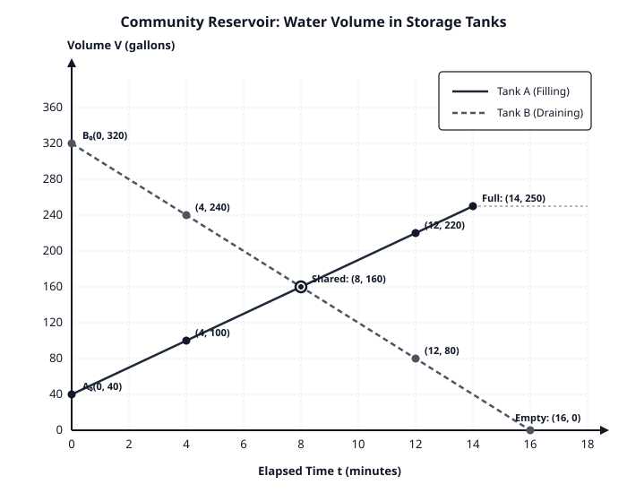
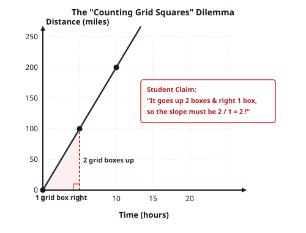
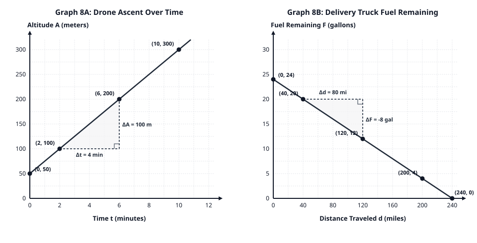
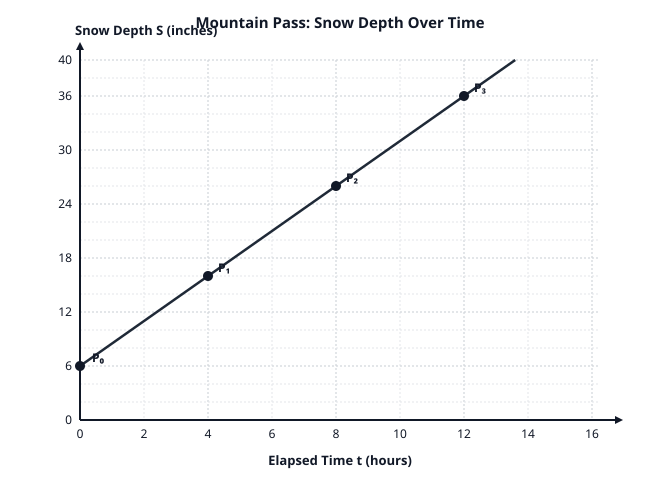

# Grade 8 Mathematics — Student Task Materials
## Unit 5: Linear Functions and Contextual Modeling
### Continuous Three-Lesson Sequence: Lessons 6, 7, and 8 (Repaired Candidate v1.2)

*Formatting & Layout Note: Rendered as standard Markdown with KaTeX-compatible mathematics. Blank response lines (`________`) and boxed workspace frames provide designated student writing areas. Materials are designed for black-and-white print or projection.*

---

# Lesson 6: Constructing Linear Functions from Irregular Tables

**Name:** ____________________________________ **Date:** ____________ **Class Period:** _________

---

### Visual Reference Scaffold: Two-Column Difference Bracket Template
*(Use this optional organizer to pair input changes $\Delta x$ with output changes $\Delta y$)*
```
    Input (x)       Output (y)
   +---------+     +---------+
   |   x₁    |     |   y₁    |
   +---------+     +---------+
        |               |
 [ Δx = x₂ - x₁ ] [ Δy = y₂ - y₁ ]  ===>  Rate of Change m = Δy / Δx
        ↓               ↓
   +---------+     +---------+
   |   x₂    |     |   y₂    |
   +---------+     +---------+
```

---

### Task ID: TASK-6.1 — Launch: Notice and Wonder with Two Tables

Examine Table 1 and Table 2 below. Both tables represent linear relationships.

| Table 1: Plan A | |
| :---: | :---: |
| **Input ($x$)** | **Output ($y$)** |
| 0 | 5 |
| 1 | 9 |
| 2 | 13 |
| 3 | 17 |

| Table 2: Plan B | |
| :---: | :---: |
| **Input ($x$)** | **Output ($y$)** |
| 2 | 11 |
| 5 | 23 |
| 8 | 35 |
| 14 | 59 |

1. **Calculate the Differences:**
   - In **Table 1**, how much does $x$ increase by between each consecutive row? $\Delta x =$ ________
   - In **Table 1**, how much does $y$ increase by between each consecutive row? $\Delta y =$ ________
   - What is the rate of change for Table 1? Rate = ________
   - What is the initial value ($y$ when $x = 0$) for Table 1? $b =$ ________
   - Write the equation for Table 1: $y =$ ________________________

2. **Examine Table 2:**
   - Look at the step from the first row $(2, 11)$ to the second row $(5, 23)$:  
     Change in $x$: $\Delta x = 5 - 2 =$ ________  
     Change in $y$: $\Delta y = 23 - 11 =$ ________  
   - Look at the step from the third row $(8, 35)$ to the fourth row $(14, 59)$:  
     Change in $x$: $\Delta x = 14 - 8 =$ ________  
     Change in $y$: $\Delta y = 59 - 35 =$ ________  
   - Jordan looks at Table 2 and says: *"The outputs jump by 12, and then by 24, so this table cannot be linear."*  
     Do you agree or disagree with Jordan? Explain why, using the ratio $\frac{\Delta y}{\Delta x}$.

```
[ Your Explanation:                                                          ]
[                                                                            ]
[                                                                            ]
```

---

### Task ID: TASK-6.2 — Core Activity: Determining Rate of Change and Extrapolating the Initial Value

1. **Calculate the Unit Rate of Change ($m$) for Table 2:**
   - Compute the rate of change $\frac{\Delta y}{\Delta x}$ for each of the three intervals in Table 2:
     - Interval 1 (from $x = 2$ to $x = 5$): $\frac{\Delta y}{\Delta x} = \frac{23 - 11}{5 - 2} =$ ________
     - Interval 2 (from $x = 5$ to $x = 8$): $\frac{\Delta y}{\Delta x} = \frac{35 - 23}{8 - 5} =$ ________
     - Interval 3 (from $x = 8$ to $x = 14$): $\frac{\Delta y}{\Delta x} = \frac{59 - 35}{14 - 8} =$ ________
   - Is the rate of change constant? What is the value of $m$? $m =$ ________

2. **Finding the Initial Value ($b$):**
   - Notice that $x = 0$ is **not** listed in Table 2.
   - Use the first point $(2, 11)$ and the constant rate $m$ to determine what $y$ would be when $x = 0$. Show your reasoning or calculation:

```
[ Space for Work / Calculation:                                              ]
[                                                                            ]
[                                                                            ]
```
   - Initial value: $b =$ ________
   - Write the complete linear function equation for Table 2: $y =$ ________________________

3. **Verification:**
   - Test your equation using the last point $(14, 59)$. Substitute $x = 14$ into your equation. Does it give $y = 59$? Show your work.

```
[ Verification Work:                                                         ]
[                                                                            ]
```

---

### Task ID: TASK-6.3 — Partner Practice: A Decreasing Relationship

The table below records the remaining volume of water $W$ (in gallons) in a small cooling tank after running for $t$ minutes.

| Elapsed Time $t$ (minutes) | Remaining Water $W$ (gallons) |
| :---: | :---: |
| 4 | 156 |
| 9 | 126 |
| 15 | 90 |
| 22 | 48 |

1. Compute the rate of change $\frac{\Delta W}{\Delta t}$ between $(4, 156)$ and $(9, 126)$. Include correct units.
   $$\text{Rate } = \text{________ gallons per minute}$$
2. Compute the rate of change $\frac{\Delta W}{\Delta t}$ between $(15, 90)$ and $(22, 48)$. Include correct units.
   $$\text{Rate } = \text{________ gallons per minute}$$
3. Why is the rate of change negative? What does the negative sign mean in this real-world context?
   
```
[ Explanation:                                                               ]
[                                                                            ]
```
4. Determine the initial water volume in the tank before the machine started ($t = 0$). Show your method:
   $$\text{Initial Volume } b = \text{________ gallons}$$
5. Write the equation relating $W$ and $t$: $W =$ ________________________
6. How many minutes will it take for the tank to be completely empty ($W = 0$)? Show your equation solving steps:

```
[ Equation Solving Steps:                                                    ]
[                                                                            ]
[ Emptying Time t = ________ minutes                                         ]
```

---

### Task ID: CFU-6 — Independent Check for Understanding (Exit Ticket 6)

A repair technician charges a fixed home-visit diagnostic fee plus a constant hourly labor rate. The table shows the total charge $C$ (dollars) for jobs taking $h$ hours:

| Labor Time $h$ (hours) | Total Charge $C$ (dollars) |
| :---: | :---: |
| 4 | $\$57$ |
| 9 | $\$102$ |
| 15 | $\$156$ |

1. Calculate the technician's hourly labor rate ($m = \frac{\Delta C}{\Delta h}$). Show your calculation:
   $$m = \text{________ dollars per hour}$$
2. Calculate the fixed home-visit fee ($b$). Show how you found it:
   $$b = \$\text{________}$$
3. Write the linear equation representing total cost $C$ in terms of hours $h$:
   $$C = \text{________________________}$$
4. If a repair job takes 8 hours, what will the total charge be?
   $$\text{Total Charge} = \$\text{________}$$

---

### Task ID: EXT-6 — Extension Task (Optional Challenge)

A linear table has the following entries, but two numbers were smudged and are unreadable:

| $x$ | 3 | 7 | 12 | **?** |
| :---: | :---: | :---: | :---: | :---: |
| $y$ | 19 | **?** | 64 | 89 |

1. Find the rate of change $m$ and the initial value $b$.  
   $m =$ ________ , $b =$ ________
2. Determine the two missing smudged values:  
   Value of $y$ when $x = 7$: ________  
   Value of $x$ when $y = 89$: ________

---

### Task ID: PRAC-6 — Selectable / Optional Practice Problems (Lesson 6)
*(Note: These problems are optional reinforcement for station practice, class review, or personal study; not required homework gates).*

1. A linear function contains the points $(5, 65)$ and $(15, 145)$.
   - Find the constant rate of change $m$: ________
   - Find the initial value $b$: ________
   - Write the function rule: $y =$ ________________________
   - Find the output when $x = 25$: $y =$ ________

2. A storage battery discharges power at a constant rate during continuous operation. At $t = 6$ hours of use, the remaining battery charge is $74\%$. At $t = 14$ hours of use, the remaining battery charge is $42\%$.
   - Find the hourly discharge rate in percentage points per hour (include negative sign and units): ________
   - What was the battery percentage at $t = 0$? $b =$ ________ $\%$
   - Write an equation for remaining charge $P$ in terms of hours $t$: $P =$ ________________________
   - At what hour will the battery be completely discharged ($P = 0\%$)? $t =$ ________ hours

---
\pagebreak
---

# Lesson 7: Contextual Modeling: Filling and Draining Systems

**Name:** ____________________________________ **Date:** ____________ **Class Period:** _________\

---

### Task ID: TASK-7.1 — Launch: Two Tanks, Two Stories

A community water authority manages two large storage reservoirs, Tank A and Tank B. Both tanks operate on steady, constant-rate pump systems:
- **Tank A** begins the morning with some water already stored and has water **pumped into it** at a constant rate.
- **Tank B** begins the morning full of water and is **drained** to supply community irrigation at a constant rate.

The coordinate graph below displays the water volume $V$ (in gallons) in each tank over time $t$ (in minutes).

*(Refer to Figure 7.1: `lesson7_reservoir_models.svg` printed below or projected on the front board)*



---

### Task ID: TASK-7.2 — Core Modeling Lab: Tank A and Tank B

Use the graph in Figure 7.1 and the marked coordinate points to answer the questions for each tank.

#### Part 1: Tank A (The Filling Tank — Solid Line)
1. **Identify the Initial Volume:**
   - Look at where Tank A's line crosses the vertical axis ($t = 0$).
   - Initial Volume $b_A =$ ________ gallons.
   - What does this value mean in terms of the physical reservoir?
   
```
[ Explanation:                                                               ]
[                                                                            ]
```

2. **Determine the Filling Rate (Slope $m_A$):**
   - Two marked points on Tank A's line are $(4, 100)$ and $(12, 220)$.
   - Compute elapsed time: $\Delta t = 12 - 4 =$ ________ minutes.
   - Compute volume increase: $\Delta V = 220 - 100 =$ ________ gallons.
   - Compute the rate of change:
     $$m_A = \frac{\Delta V}{\Delta t} = \text{________ gallons per minute}$$
   - Write a complete sentence interpreting what this rate means:

```
[ Interpretation:                                                            ]
[                                                                            ]
```

3. **Construct the Linear Function for Tank A:**
   - Write the equation modeling volume $V_A$ as a function of time $t$:
     $$V_A = \text{________________________}$$

#### Part 2: Tank B (The Draining Tank — Dashed Line)
4. **Identify the Initial Volume:**
   - Initial Volume $b_B =$ ________ gallons.
   - What does this value mean in terms of the physical reservoir?

5. **Determine the Draining Rate (Slope $m_B$):**
   - Two marked points on Tank B's line are $(4, 240)$ and $(12, 80)$.
   - Compute elapsed time: $\Delta t = 12 - 4 =$ ________ minutes.
   - Compute volume change: $\Delta V = 80 - 240 =$ ________ gallons.
   - Compute the rate of change:
     $$m_B = \frac{\Delta V}{\Delta t} = \text{________ gallons per minute}$$
   - Why is this rate negative? What does the negative sign indicate?

```
[ Explanation:                                                               ]
[                                                                            ]
```

6. **Construct the Linear Function for Tank B:**
   - Write the equation modeling volume $V_B$ as a function of time $t$:
     $$V_B = \text{________________________}$$

---

### Task ID: TASK-7.3 — Realistic Constraints and Intersection Analysis

1. **Maximum Capacity of Tank A:**
   - Tank A has a safety shut-off valve that triggers when the volume reaches its maximum capacity of **250 gallons**.
   - Use your equation for $V_A$ to determine at what exact minute $t$ the shut-off valve will trigger. Show your equation solving steps:

```
[ Work Space:                                                                ]
[                                                                            ]
[ Time to reach capacity t = ________ minutes                                ]
```
   - What happens to the graph of Tank A after that minute? Look at Figure 7.1 between $t = 14$ and $t = 18$. Describe what you see:

```
[ Observation:                                                               ]
[                                                                            ]
```

2. **Emptying of Tank B:**
   - Tank B cannot have negative water. At what minute $t$ is Tank B completely empty ($V_B = 0$)? Show your work:

```
[ Work Space:                                                                ]
[                                                                            ]
[ Time to empty t = ________ minutes                                         ]
```
   - State the practical domain (valid time interval) for Tank B's draining model: from $t = 0$ to $t =$ ________ minutes.

3. **The Shared Point (Point of Intersection):**
   - Locate the marked shared point where the two lines cross on the graph: $(8, 160)$.
   - What does the horizontal coordinate ($t = 8$) represent in this situation?
   - What does the vertical coordinate ($V = 160$) represent in this situation?
   - Verify that this point satisfies both equations you constructed in Task 7.2:
     - Check Tank A: Substitute $t = 8$ into your equation for $V_A$: ________________________
     - Check Tank B: Substitute $t = 8$ into your equation for $V_B$: ________________________

---

### Task ID: CFU-7 — Independent Check for Understanding (Exit Ticket 7)

A municipal filtration pool containing $450$ gallons of water is being drained through a drainage valve for cleaning.
- At time $t = 5$ minutes, the remaining water is $330$ gallons.
- At time $t = 12$ minutes, the remaining water is $162$ gallons.

1. Find the constant draining rate (rate of change) in gallons per minute. Include appropriate sign and units:
   $$\text{Rate of change } m = \text{________________________}$$
2. State the initial volume $b$ before draining started:
   $$b = \text{________ gallons}$$
3. Write an equation modeling remaining volume $V$ as a function of minutes $t$:
   $$V = \text{________________________}$$
4. At what exact minute will the pool be completely empty? Show your calculation:

```
[ Work Space:                                                                ]
[                                                                            ]
[ Emptying Time t = ________ minutes                                         ]
```

---

### Task ID: EXT-7 — Extension Task (Optional Challenge)

Suppose the operators wanted Tank A and Tank B to finish (Tank A reaching 250 gallons and Tank B reaching 0 gallons) at the **exact same minute**. 
- Tank A still starts at 40 gallons and reaches 250 gallons in 14 minutes.
- If Tank B starts at 320 gallons, what draining rate (in gallons per minute) should the operators set so Tank B empties in exactly 14 minutes? Show your work.

---

### Task ID: PRAC-7 — Selectable / Optional Practice Problems (Lesson 7)
*(Note: These problems are optional reinforcement for station practice, class review, or personal study; not required homework gates).*

1. A hot-air balloon is descending toward a landing field.
   - At $t = 3$ minutes into the descent, its altitude is $580$ meters.
   - At $t = 8$ minutes into the descent, its altitude is $380$ meters.
   - Assuming a constant rate of descent, determine the rate of change (meters per minute): ________
   - Determine the altitude of the balloon before the descent began ($t = 0$): ________ meters
   - Write an equation for altitude $A$ in terms of time $t$: $A =$ ________________________
   - How many total minutes will the descent take from start until touching the ground ($A = 0$)? $t =$ ________ minutes

2. An insulated thermal container holds soup at an initial temperature of $190^\circ\text{F}$. When placed in a refrigerator, the soup cools at a steady rate of $2.5^\circ\text{F}$ per minute for the first 40 minutes.
   - Write an equation modeling temperature $T$ after $m$ minutes: $T =$ ________________________
   - What is the temperature of the soup after 24 minutes? $T =$ ________ $^\circ\text{F}$
   - If the target serving temperature is $115^\circ\text{F}$, after how many minutes should the container be removed? $m =$ ________ minutes

---
\pagebreak
---

# Lesson 8: Constructing Linear Functions from Scaled Coordinate Graphs

**Name:** ____________________________________ **Date:** ____________ **Class Period:** _________

---

### Task ID: TASK-8.1 — Launch: The "Counting Squares" Trap

Examine the diagram below, which illustrates a common error when reading graphs.

*(Refer to Figure 8.0: `task8_1_trap_sketch.svg` printed below or projected on the front board)*



- A student looks at the line on the grid and claims: *"It goes up 2 grid squares and right 1 grid square, so the slope must be $\frac{2}{1} = 2$."*
- Then the student notices that each horizontal grid square represents **5 hours** and each vertical grid square represents **50 miles**.
- Why is counting grid boxes as 1 unit each dangerous when coordinate axes have non-unit scales? How should the student determine the true rate of change?

```
[ Your Explanation:                                                          ]
[                                                                            ]
[                                                                            ]
```

---

### Task ID: TASK-8.2 — Core Investigation: Reading Scaled Coordinate Graphs

Examine Figure 8.1, which displays two different real-world linear functions on scaled coordinate planes.

*(Refer to Figure 8.1: `lesson8_scaled_graphs.svg` printed below or projected on the front board)*



---

#### Part 1: Graph 8A — Drone Ascent Over Time
1. **Identify the Axes and Grid Scales:**
   - Horizontal axis ($x$): Quantity = ____________________ , Unit = ____________________
   - What does each single vertical grid line represent on the horizontal axis? ________ minute(s)
   - Vertical axis ($y$): Quantity = ____________________ , Unit = ____________________
   - What does each single horizontal grid line represent on the vertical axis? ________ meter(s)

2. **Identify the Initial Value ($b$):**
   - Coordinates of vertical intercept: $(0,$ ________$)$
   - Initial altitude at $t = 0$ minutes: $b =$ ________ meters
   - What does this value indicate about the drone when tracking began at $t = 0$? (Consider reference datum or initial launch height).

```
[ Explanation:                                                               ]
[                                                                            ]
```

3. **Determine Rate of Change using the Slope Triangle:**
   - Look at the shaded slope triangle between points $(2, 100)$ and $(6, 200)$:
     - Horizontal change $\Delta t$: from $t = 2$ to $t = 6 \implies \Delta t =$ ________ minutes
     - Vertical change $\Delta A$: from $A = 100$ to $A = 200 \implies \Delta A =$ ________ meters
   - Compute the true rate of change (climb speed):
     $$m = \frac{\Delta A}{\Delta t} = \text{________ meters per minute}$$
   - *Error Check:* If someone simply counted grid boxes for the triangle, they would count 4 grid boxes up and 4 grid boxes right and calculate $\frac{4}{4} = 1$. Explain why $1$ is incorrect and $25\text{ m/min}$ is correct.

4. **Construct the Equation:**
   - Write the linear function equation for altitude $A$ in terms of minutes $t$:
     $$A = \text{________________________}$$
   - Use your equation to find the altitude of the drone at $t = 11$ minutes:
     $$A(11) = \text{________ meters}$$

---

#### Part 2: Graph 8B — Delivery Truck Fuel Remaining
1. **Identify the Axes and Grid Scales:**
   - Horizontal axis: Quantity = ____________________ , Unit = ____________________
   - Each vertical grid line on the horizontal axis represents: ________ miles
   - Vertical axis: Quantity = ____________________ , Unit = ____________________
   - Each horizontal grid line on the vertical axis represents: ________ gallons

2. **Identify the Initial Value ($b$):**
   - Coordinates of vertical intercept: $(0,$ ________$)$
   - Initial fuel in tank: $b =$ ________ gallons

3. **Determine Rate of Change using the Slope Triangle:**
   - Look at the shaded slope triangle between points $(40, 20)$ and $(120, 12)$:
     - Horizontal distance change $\Delta d = 120 - 40 =$ ________ miles
     - Vertical fuel change $\Delta F = 12 - 20 =$ ________ gallons
   - Compute the rate of change:
     $$m = \frac{\Delta F}{\Delta d} = \text{________ gallons per mile}$$
   - Write this rate as a decimal: $m =$ ________ gallons/mile
   - What does this rate tell the truck driver about fuel consumption?

4. **Construct the Equation and Interpret Intercept:**
   - Write the linear function equation for fuel $F$ in terms of distance $d$:
     $$F = \text{________________________}$$
   - Look at the point where the line meets the horizontal axis: $(240, 0)$.  
     What does the point $(240, 0)$ mean for the delivery driver?

```
[ Meaning of (240, 0):                                                       ]
[                                                                            ]
```

---

### Task ID: CFU-8 — Independent Check for Understanding (Exit Ticket 8)

The coordinate graph in Figure 8.2 describes the depth of snow $S$ (in inches) accumulating on a mountain pass over time $t$ (in hours) during a winter storm. Four points along the line are marked ($P_0, P_1, P_2, P_3$).

*(Refer to Figure 8.2: `cfu8_snow_graph.svg` printed below or projected on the front board)*



1. **Read the Initial Value ($b$):**  
   Determine the coordinates of point $P_0$ on the vertical axis: $(0,$ ________$)$.  
   Initial snow depth: $b =$ ________ inches.

2. **Read Coordinates and Determine Snowfall Rate ($m$):**  
   Read the coordinate values of point $P_1$ and point $P_2$ from the grid axes:  
   $P_1 = ($ ________ , ________ $)$  
   $P_2 = ($ ________ , ________ $)$  
   Calculate the constant rate of snowfall ($m = \frac{\Delta S}{\Delta t}$). Show your work:

```
[ Work Space:                                                                ]
[                                                                            ]
[ Rate of Snowfall m = ________ inches per hour                              ]
```

3. **Construct the Function Equation:**  
   Write the linear function equation modeling snow depth $S$ after $t$ hours:  
   $$S = \text{________________________}$$

4. **Predict Depth:**  
   If the storm continues at this exact same rate, what will the snow depth be after $15$ hours?  
   $$\text{Depth after 15 hours} = \text{________ inches}$$

---

### Task ID: EXT-8 — Extension Task (Optional Challenge)

On Graph 8B (Delivery Truck Fuel), a driver wants to know the truck's fuel economy in **miles per gallon** (mpg) instead of **gallons per mile**.
1. How can you use the rate of change $-0.1\text{ gallons per mile}$ to determine how many miles the truck travels on $1$ full gallon of fuel?
2. If the driver adds an auxiliary 15-gallon tank (so total starting fuel is 39 gallons), sketch how the graph would change. Does the slope change? Does the intercept change?

---

### Task ID: PRAC-8 — Selectable / Optional Practice Problems (Lesson 8)
*(Note: These problems are optional reinforcement for station practice, class review, or personal study; not required homework gates).*

1. A production cost model for custom school t-shirts records the total cost $C$ (in dollars) based on the number of shirts printed $n$.
   - The vertical intercept is at $(0, 75)$, representing a base setup fee of $\$75$.
   - A recorded customer order shows that printing $20$ shirts costs $\$235$ (passing through $(20, 235)$).
   - Find the constant cost per printed shirt ($m = \frac{\Delta C}{\Delta n}$): $m =$ ________ dollars per shirt
   - Write the function equation: $C =$ ________________________
   - What is the total cost to print $80$ shirts? Total Cost = $\$\text{________}$

2. A hiker is walking down a canyon trail. A graph of elevation $E$ (feet above river) vs. walking time $t$ (minutes) passes through $(15, 720)$ and $(45, 360)$.
   - Find the hiker's rate of descent in feet per minute: $m =$ ________ feet per minute
   - Find the hiker's elevation at the trailhead ($t = 0$): $b =$ ________ feet
   - Write the equation for $E$ in terms of $t$: $E =$ ________________________
   - When will the hiker reach the canyon river ($E = 0$)? $t =$ ________ minutes
