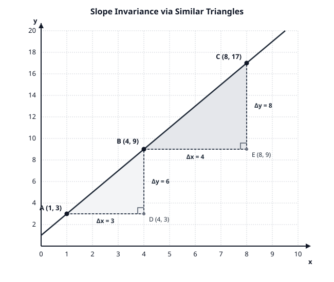
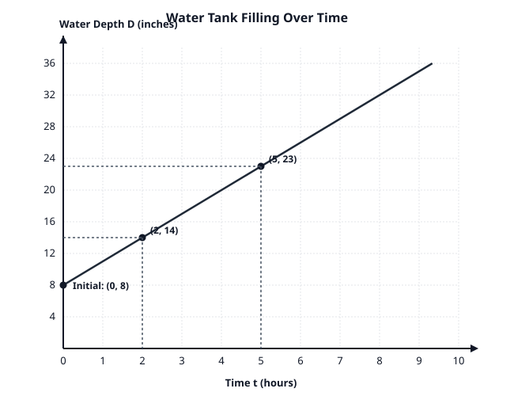

# Feasibility Probes: Student Tasks and Teacher Guides (Repaired)

**Document Context and Role:**  
This artifact documents the foundational mathematical feasibility probes and teacher evaluation guides developed during blueprint prototyping. In the operational Grade 8 curriculum, all live student-facing sheets and teacher guides reside in independent documents (e.g., `lesson6_7_8_student_materials.md` and `lesson6_7_8_teacher_guides.md`) to prevent inadvertent disclosure of solutions.

---

# Section I: Feasibility Probe Tasks (Student Investigation Formats)

## Task ID: PROBE-1 (Unit 2 / Unit 5 Bridge)
**Topic:** Slope Invariance via Similar Right Triangles  
**Standards:** 8.G.A.5, 8.EE.B.6  
**Name:** ____________________________________ **Date:** ____________ **Class:** _________

### Background and Diagram
The coordinate graph below displays a straight line passing through points $A(1, 3)$, $B(4, 9)$, and $C(8, 17)$. Two right triangles, $\triangle ABD$ and $\triangle BCE$, have been drawn using the line as their hypotenuse. 

*(Refer to Figure 1: `probe1_slope_triangles.svg` printed below or projected on the front board)*

---

### Questions

1. **Find the Dimensions of Triangle 1 ($\triangle ABD$):**
   - Horizontal leg $AD$: Change in $x$ ($\Delta x_1$) = ________ units
   - Vertical leg $DB$: Change in $y$ ($\Delta y_1$) = ________ units
   - Compute the vertical-to-horizontal ratio: $\frac{\Delta y_1}{\Delta x_1} =$ ________

2. **Find the Dimensions of Triangle 2 ($\triangle BCE$):**
   - Horizontal leg $BE$: Change in $x$ ($\Delta x_2$) = ________ units
   - Vertical leg $EC$: Change in $y$ ($\Delta y_2$) = ________ units
   - Compute the vertical-to-horizontal ratio: $\frac{\Delta y_2}{\Delta x_2} =$ ________

3. **Geometric Explanation:**
   - Explain why $\triangle ABD$ is similar to $\triangle BCE$ ($\triangle ABD \sim \triangle BCE$). Name the specific angle facts (transversals and parallel lines) that guarantee their angles are equal.
   - What does the similarity of these triangles prove about the ratio $\frac{\text{vertical change}}{\text{horizontal change}}$ between *any* two points on this line?

4. **Deriving the Equation of the Line:**
   - What is the $y$-value where the line crosses the vertical axis ($x = 0$)?
   - Using your constant slope ratio $m$ and the vertical intercept $b$, write the equation of the line in the form $y = mx + b$.
   - Verify your equation by substituting the coordinates of point $C(8, 17)$ into your equation. Show your work.

---
\pagebreak
---

## Task ID: PROBE-2 (Unit 5 Core Anchor)
**Topic:** Modeling Linear Relationships & Dismantling the $y/x$ Misconception  
**Standards:** 8.F.B.4, 8.F.B.5, MP2, MP4  
**Name:** ____________________________________ **Date:** ____________ **Class:** _________

### Context and Graph
A community garden uses a large rainwater storage tank. At the beginning of a community gardening session, water is pumped into the tank at a steady, constant rate. 
A student measures the depth of the water at two specific times:
- At time $t = 2$ hours, the water depth is $14$ inches.
- At time $t = 5$ hours, the water depth is $23$ inches.

*(Refer to Figure 2: `probe2_water_tank.svg` printed below or projected on the front board)*

---

### Questions

1. **Critiquing Student Thinking:**
   Marcus looks at the first measurement $(t = 2, D = 14)$ and says:
   *"The water depth is 14 inches at 2 hours, so the rate of filling is $\frac{14}{2} = 7$ inches per hour."*
   - Test Marcus's method on the second measurement $(t = 5, D = 23)$. What rate does his method give?
   - Does Marcus's method work for this situation? Explain why or why not.

2. **Determining the True Rate of Change:**
   - How many hours passed between the first and second measurement? ($\Delta t =$ ________ hours)
   - How many inches did the water depth increase during that time? ($\Delta D =$ ________ inches)
   - Calculate the true constant rate of change (unit rate) in inches per hour:  
     Rate of Change $m = \frac{\Delta D}{\Delta t} =$ ________________________ inches per hour
   - Write a complete sentence explaining what this number means in the context of the water tank.

3. **Finding the Initial Value ($b$):**
   - What was the water depth in the tank at time $t = 0$ hours (before pumping began)?
   - Show how you can calculate this initial depth using your rate of change and one of the points, or by working backward.
   - Initial Depth $b =$ ________ inches.

4. **Constructing the Function:**
   - Write an algebraic equation that models the water depth $D$ (in inches) as a linear function of time $t$ (in hours):  
     $D =$ ________________________
   - Use your function to predict the water depth after $8$ hours.

5. **Qualitative Analysis (8.F.B.5):**
   - The tank has a maximum depth of $36$ inches. Once it reaches 36 inches, an automatic shut-off valve closes instantly. 
   - Describe what the graph of water depth over time will look like after the shut-off valve closes. Is the function still increasing? What is the slope?

---
\pagebreak
---

## Task ID: PROBE-3 (Unit 5 to Unit 6 Transition)
**Topic:** From Linear Models to Simultaneous Systems  
**Standards:** 8.F.B.4, 8.EE.C.8.a, 8.EE.C.8.c  
**Name:** ____________________________________ **Date:** ____________ **Class:** _________

### Context
Two students, Elena and Jaden, are saving money from their summer jobs:
- **Elena** starts with $\$40$ in her savings account and deposits $\$15$ each week.
- **Jaden** starts with $\$100$ in his savings account and deposits $\$10$ each week.

### Questions

1. **Constructing the Functions:**
   - Let $w$ represent the number of weeks, and $S$ represent total savings in dollars.
   - Elena's savings function: $S_E =$ ________________________
   - Jaden's savings function: $S_J =$ ________________________

2. **Comparing Properties (8.F.A.2):**
   - Who is saving money at a faster rate? How do you know from the equations?
   - Who had more money at the start? How do you know from the equations?

3. **Finding the Break-Even Point (8.EE.C.8):**
   - Set up an equation to find the number of weeks $w$ when Elena and Jaden will have exactly the same amount of money saved:
     $$\text{[Elena's Savings]} = \text{[Jaden's Savings]}$$
   - Solve the equation for $w$. Show every algebraic step.
   - How many weeks will it take? $w =$ ________ weeks.
   - How much money will each student have at that time? Total Savings = ________ dollars.

4. **Graphical Interpretation:**
   - If Elena's and Jaden's functions are graphed on the same coordinate plane, what does the point $(12, 220)$ represent?

---

# Section II: Teacher Answer Keys and Evaluation Guides

## Teacher Guide: Task PROBE-1

### Mathematical Solutions
1. **Dimensions of $\triangle ABD$:**
   - $\Delta x_1 = 4 - 1 = 3$ units.
   - $\Delta y_1 = 9 - 3 = 6$ units.
   - Ratio: $\frac{\Delta y_1}{\Delta x_1} = \frac{6}{3} = 2$.
2. **Dimensions of $\triangle BCE$:**
   - $\Delta x_2 = 8 - 4 = 4$ units.
   - $\Delta y_2 = 17 - 9 = 8$ units.
   - Ratio: $\frac{\Delta y_2}{\Delta x_2} = \frac{8}{4} = 2$.
3. **Geometric Explanation:**
   - *Angle Equality:* Both triangles have a right angle ($\angle ADB = \angle BEC = 90^\circ$) because the legs are parallel to the perpendicular coordinate axes. The line acts as a transversal intersecting horizontal lines $y = 3$ and $y = 9$. Corresponding angles $\angle DAB$ and $\angle EBC$ are congruent.
   - *AA Similarity:* By Angle-Angle (AA) similarity criterion (8.G.A.5), $\triangle ABD \sim \triangle BCE$.
   - *Conclusion:* Corresponding side lengths of similar triangles are proportional: $\frac{DB}{AD} = \frac{EC}{BE} \implies \frac{6}{3} = \frac{8}{4} = 2$. Therefore, the ratio of vertical change to horizontal change is invariant between *any* two points on the line.
4. **Derivation of Equation:**
   - At $x = 0$, $y = 3 - 2(1) = 1$. The vertical intercept is $(0, 1)$, so $b = 1$.
   - Equation: $y = 2x + 1$.
   - Verification with $C(8, 17)$: Substitute $x = 8$: $y = 2(8) + 1 = 16 + 1 = 17$. The equation holds true.

### Diagnostic Matrix for Teacher Observation
| Student Response Pattern | Underlying Misconception | Targeted Instructional Intervention |
| :--- | :--- | :--- |
| Inverts ratio ($\frac{\Delta x}{\Delta y} = \frac{3}{6} = 0.5$) | Confusing horizontal and vertical change; thinking of $(x, y)$ coordinate order ($x$ first). | Re-anchor with "rise over run": vertical change on top because slope measures vertical steepness per horizontal step. |
| Counts grid intervals incorrectly | Misreading coordinate grid boundaries or subtracting in inconsistent direction ($x_2 - x_1$ vs. $x_1 - x_2$). | Require students to write coordinate pairs explicitly above calculations: $(x_1, y_1)$ and $(x_2, y_2)$. |
| Claims triangles are similar only because "they look the same" | Weak formal geometric justification; unaware of transversal and AA similarity criteria. | Revisit Unit 2 Lesson on parallel lines cut by transversals; physically highlight corresponding angles. |

---

## Teacher Guide: Task PROBE-2

### Mathematical Solutions
1. **Critiquing Marcus's Thinking:**
   - Second point rate: $\frac{23}{5} = 4.6$ inches per hour.
   - Marcus's method fails because $\frac{14}{2} = 7 \neq 4.6 = \frac{23}{5}$. In a relationship with a non-zero starting value ($b \neq 0$), dividing a single $y$-value by its $x$-value computes the slope of the secant line from the origin $(0, 0)$ to that point, NOT the rate of change of the line itself.
2. **True Rate of Change:**
   - Time elapsed: $\Delta t = 5 - 2 = 3$ hours.
   - Depth increase: $\Delta D = 23 - 14 = 9$ inches.
   - Rate of Change: $m = \frac{\Delta D}{\Delta t} = \frac{9\text{ inches}}{3\text{ hours}} = 3\text{ inches per hour}$.
   - *Contextual Sentence:* "The water depth in the tank increases by 3 inches for every additional hour of pumping."
3. **Finding Initial Value:**
   - At $t = 2$, depth is 14 inches. Pumping contributed $3\text{ in/hr} \times 2\text{ hr} = 6\text{ inches}$.
   - Initial depth: $b = 14 - 6 = 8\text{ inches}$ (or using $D = mt + b \implies 23 = 3(5) + b \implies b = 23 - 15 = 8$).
4. **Constructing the Function:**
   - Equation: $D = 3t + 8$.
   - Prediction at $t = 8$: $D = 3(8) + 8 = 24 + 8 = 32\text{ inches}$.
5. **Qualitative Analysis (8.F.B.5):**
   - When the shut-off valve closes at $D = 36$ inches ($3t + 8 = 36 \implies 3t = 28 \implies t = 9\frac{1}{3}$ hours), the depth stops increasing and remains constant at 36 inches.
   - The graph becomes a horizontal line segment ($m = 0$).

### Diagnostic Matrix for Teacher Observation
| Student Response Pattern | Underlying Misconception | Targeted Instructional Intervention |
| :--- | :--- | :--- |
| Computes $\frac{23 - 14}{5 - 2} = \frac{9}{3} = 3$, but writes $D = 3t + 14$ | Assumes the first recorded point is the "initial value" at $t=0$. | Point out that the first observation was recorded at $t=2$, not $t=0$. Direct student to extrapolate backward 2 hours on the graph. |
| Writes $D = 8t + 3$ | Swapping the roles of slope $m$ (rate) and vertical intercept $b$ (initial value). | Ask student: "If no time passes ($t = 0$), does your equation give 8 inches or 3 inches?" |
| Claims the rate cannot be found because numbers don't increase by 1 hour | Relies purely on unit table patterns; unable to compute difference quotients. | Scaffold with rate-of-change formula table: column for $\Delta t$, column for $\Delta D$, and quotient column $\frac{\Delta D}{\Delta t}$. |

---

## Teacher Guide: Task PROBE-3

### Mathematical Solutions
1. **Savings Functions:**
   - Elena: $S_E = 15w + 40$.
   - Jaden: $S_J = 10w + 100$.
2. **Comparing Properties:**
   - Elena is saving faster because her rate of change (slope) is $\$15$/week, compared to Jaden's $\$10$/week ($15 > 10$).
   - Jaden started with more money because his initial value ($y$-intercept) is $\$100$, compared to Elena's $\$40$ ($100 > 40$).
3. **Break-Even Point:**
   - Equating expressions: $15w + 40 = 10w + 100$.
   - Subtract $10w$ from both sides: $5w + 40 = 100$.
   - Subtract $40$ from both sides: $5w = 60$.
   - Divide by $5$: $w = 12$ weeks.
   - Calculate total savings: $S_E = 15(12) + 40 = 180 + 40 = \$220$. ($S_J = 10(12) + 100 = 120 + 100 = \$220$).
4. **Graphical Meaning:**
   - $(12, 220)$ is the point of intersection of the two lines. It represents the exact moment in time (Week 12) when both Elena and Jaden have identical savings balances ($\$220$).
